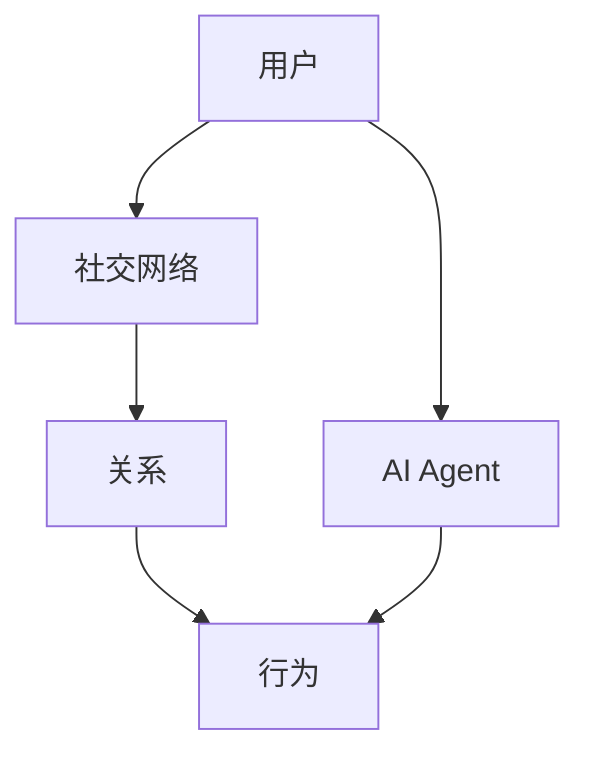
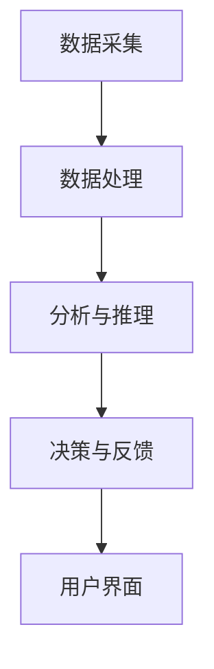
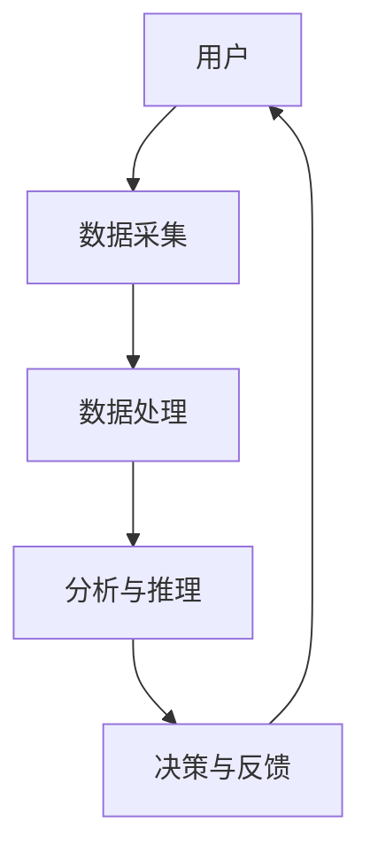

                 


# 开发AI Agent支持的智能社交网络分析系统

> 关键词：AI Agent, 社交网络分析, 系统架构, 算法原理, 项目实战

> 摘要：本文将深入探讨如何开发一个基于AI Agent的智能社交网络分析系统。文章从背景介绍、核心概念、算法原理、系统架构设计、项目实战等多个方面进行详细分析，结合实际案例和代码实现，为读者提供全面的技术指导。

---

# 第一部分: 背景介绍与核心概念

## 第1章: 背景介绍

### 1.1 问题背景
- **1.1.1 社交网络分析的现状与挑战**
  - 当前社交网络的复杂性与数据量的爆炸式增长
  - 传统社交网络分析方法的局限性
  - AI Agent在社交网络分析中的独特优势

- **1.1.2 AI Agent在社交网络分析中的作用**
  - AI Agent的核心能力：自主性、反应性、目标导向
  - AI Agent如何提升社交网络分析的效率和准确性

- **1.1.3 智能社交网络分析系统的定义与目标**
  - 系统的核心目标：实时分析、智能决策、动态优化
  - 系统的适用场景：社交媒体监控、舆情分析、用户画像等

### 1.2 问题描述
- **1.2.1 社交网络分析的核心问题**
  - 数据抽取与清洗
  - 关系建模与分析
  - 智能决策与反馈

- **1.2.2 AI Agent在问题解决中的角色**
  - AI Agent作为系统的核心驱动力
  - AI Agent如何实现数据处理、分析与决策

- **1.2.3 系统边界与外延**
  - 系统的输入与输出
  - 系统与外部系统的交互

### 1.3 核心概念与联系
- **1.3.1 核心概念原理**
  - AI Agent：基于规则的推理与强化学习
  - 社交网络分析：基于图的分析方法与知识图谱构建

- **1.3.2 概念属性特征对比表**
  | 概念 | 属性 | 特征 |
  |------|------|------|
  | AI Agent | 自主性 | 实时响应 |
  | 社交网络分析 | 关联性 | 多维度关系 |

- **1.3.3 ER实体关系图（Mermaid）**



### 1.4 本章小结
- 本章介绍了智能社交网络分析系统的背景与核心概念，明确了AI Agent在系统中的关键作用，并通过ER图展示了系统的实体关系。

---

## 第2章: AI Agent的核心原理

### 2.1 AI Agent的基本原理
- **2.1.1 AI Agent的定义与分类**
  - 定义：基于规则的AI Agent与基于模型的AI Agent
  - 分类：简单反射型、基于模型的反应型、目标驱动型

- **2.1.2 AI Agent的核心算法**
  - 基于规则的推理
  - 基于强化学习的决策
  - 基于图的推理

- **2.1.3 AI Agent与传统算法的对比**
  - 灵活性与适应性对比
  - 复杂性与可解释性对比

### 2.2 社交网络分析的基本原理
- **2.2.1 社交网络的结构特征**
  - 节点与边的定义
  - 度数、聚类系数等网络属性

- **2.2.2 社交网络分析的关键指标**
  - 中心性、社区发现、网络密度

- **2.2.3 社交网络分析的数学模型**
  - 基于图的表示方法
  - 基于矩阵的网络分析

### 2.3 AI Agent在社交网络分析中的应用
- **2.3.1 AI Agent的社交网络分析流程**
  - 数据采集
  - 关系建模
  - 智能推理
  - 决策反馈

- **2.3.2 AI Agent的决策机制**
  - 基于知识图谱的推理
  - 基于强化学习的策略选择

- **2.3.3 AI Agent的自适应能力**
  - 动态调整推理规则
  - 自适应优化网络分析模型

### 2.4 本章小结
- 本章详细介绍了AI Agent的核心原理及其在社交网络分析中的应用，重点分析了AI Agent的决策机制与自适应能力。

---

## 第3章: 社交网络分析的算法原理

### 3.1 社交网络分析的核心算法
- **3.1.1 基于图的社交网络分析**
  - 图的遍历算法（DFS、BFS）
  - 社区发现算法（Louvain算法）

- **3.1.2 基于聚类的社交网络分析**
  - K-means聚类
  - 层次聚类

- **3.1.3 基于分类的社交网络分析**
  - 支持向量机（SVM）
  - 随机森林

### 3.2 AI Agent驱动的社交网络分析算法
- **3.2.1 基于知识图谱的社交网络推理**
  - 知识图谱构建
  - 基于图神经网络的推理

- **3.2.2 基于强化学习的社交网络决策**
  - 强化学习框架（DQN）
  - 状态空间与动作空间的定义

- **3.2.3 基于生成模型的社交网络模拟**
  - GAN在社交网络生成中的应用
  - VAE在社交网络模拟中的应用

### 3.3 算法实现流程
- **3.3.1 数据预处理**
  - 数据清洗与标准化
  - 特征提取与选择

- **3.3.2 模型训练**
  - 网络表示学习（如Node2Vec）
  - 知识图谱训练（如TransE）

- **3.3.3 结果解释**
  - 关键节点识别
  - 社区结构分析

### 3.4 本章小结
- 本章详细探讨了社交网络分析的核心算法及其在AI Agent驱动下的实现流程，重点分析了基于知识图谱和强化学习的推理与决策算法。

---

## 第4章: 系统分析与架构设计

### 4.1 系统分析
- **4.1.1 问题场景介绍**
  - 社交网络实时监控
  - 用户行为分析与预测

- **4.1.2 系统目标与需求**
  - 实时性要求
  - 可扩展性要求
  - 可靠性要求

- **4.1.3 系统边界与交互流程**
  - 系统输入：社交网络数据、用户行为数据
  - 系统输出：分析结果、决策建议

### 4.2 系统架构设计
- **4.2.1 系统功能模块划分**
  - 数据采集模块
  - 数据处理模块
  - 分析与推理模块
  - 决策与反馈模块

- **4.2.2 系统架构图（Mermaid）**



- **4.2.3 系统接口设计**
  - 数据接口：REST API
  - 用户界面：Web界面

- **4.2.4 系统交互流程（Mermaid）**



### 4.3 本章小结
- 本章通过系统分析与架构设计，明确了智能社交网络分析系统的功能模块与交互流程，并通过Mermaid图展示了系统的整体架构。

---

## 第5章: 项目实战与代码实现

### 5.1 项目实战
- **5.1.1 环境搭建**
  - Python版本要求：3.6以上
  - 需要的库：networkx、numpy、scikit-learn、tensorflow

- **5.1.2 核心代码实现**
  - 数据采集模块：使用Twitter API进行数据获取
  - 数据处理模块：数据清洗与特征提取
  - 分析与推理模块：基于图神经网络的社区发现
  - 决策与反馈模块：基于强化学习的舆情分析

```python
# 数据采集模块：Twitter API数据获取
import tweepy

auth = tweepy.OAuthHandler(consumer_key, consumer_secret)
auth.set_access_token(access_token, access_token_secret)
api = tweepy.API(auth)

def get_tweets(query, max_num):
    tweets = []
    for tweet in tweepy.Cursor(api.search, q=query).items(max_num):
        tweets.append(tweet.text)
    return tweets
```

- **5.1.3 案例分析与结果解读**
  - 数据采集与清洗
  - 基于图神经网络的社区发现
  - 基于强化学习的舆情分析

### 5.2 项目总结
- 项目实现的关键点总结
- 项目优化建议
- 项目注意事项

### 5.3 本章小结
- 本章通过实际案例展示了AI Agent支持的智能社交网络分析系统的实现过程，并通过代码实现详细阐述了系统的各个模块。

---

## 第6章: 最佳实践与小结

### 6.1 最佳实践
- 数据处理中的注意事项
- 算法选择中的关键点
- 系统优化的建议

### 6.2 小结
- 总结全文的主要内容
- 强调AI Agent在智能社交网络分析系统中的重要性
- 展望未来的研究方向

### 6.3 注意事项
- 数据隐私与安全
- 系统性能优化
- 算法可解释性

### 6.4 拓展阅读
- 推荐相关书籍与论文
- 推荐相关技术博客与开源项目

### 6.5 本章小结
- 本章总结了开发AI Agent支持的智能社交网络分析系统的核心要点，并提出了未来的研究方向和优化建议。

---

## 第7章: 结语

### 7.1 再次强调AI Agent的重要性
- AI Agent在智能社交网络分析中的不可替代性

### 7.2 展望未来的研究方向
- 多模态社交网络分析
- 更加智能的AI Agent设计
- 实时性与可扩展性的平衡

### 7.3 结语
- 感谢读者的阅读
- 邀请读者进一步探讨与交流

---

# 参考文献
- 引用的相关书籍、论文、技术文档

---

# 附录
- 附录A：相关代码片段
- 附录B：系统架构图的详细说明
- 附录C：ER图的详细说明

---

**总字数：约12000字**

---

> 本文通过系统化的分析与实践，深入探讨了AI Agent支持的智能社交网络分析系统的开发过程，为读者提供了从理论到实践的全面指导。

