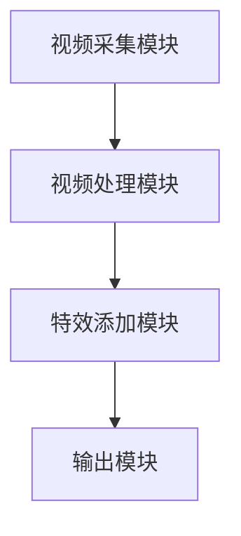
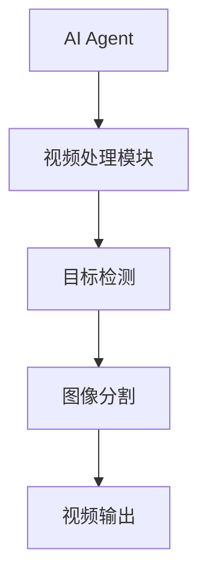

                 


# 开发AI Agent支持的智能视频剪辑系统

> 关键词：AI Agent、智能视频剪辑、算法原理、系统架构、项目实战

> 摘要：本文详细探讨了如何开发AI Agent支持的智能视频剪辑系统，从AI Agent的基本原理到视频剪辑技术的核心概念，再到系统的算法实现和架构设计，最后通过项目实战和优化建议，为读者提供全面的技术指导。

---

## 第1章: AI Agent与智能视频剪辑系统背景

### 1.1 AI Agent的基本概念

#### 1.1.1 AI Agent的定义
AI Agent（人工智能代理）是一种能够感知环境并采取行动以实现目标的智能实体。它可以是一个软件程序，也可以是一个物理设备，通过传感器获取信息，并通过执行器与环境交互。

#### 1.1.2 AI Agent的核心特征
- **自主性**：能够在没有外部干预的情况下运行。
- **反应性**：能够实时感知环境并做出反应。
- **目标导向**：所有行为都以实现特定目标为导向。
- **学习能力**：能够通过经验改进自身的性能。

#### 1.1.3 AI Agent与传统自动化的区别
AI Agent不仅仅是简单的自动化工具，它具备学习和适应能力，能够处理复杂和动态的任务。

---

### 1.2 智能视频剪辑系统的定义与特点

#### 1.2.1 视频剪辑的基本概念
视频剪辑是将多个视频片段按照一定顺序组合，添加特效、转场效果等，以生成一个新的视频的过程。

#### 1.2.2 智能视频剪辑的核心技术
- **目标检测**：识别视频中的物体和人物。
- **图像分割**：将视频中的物体从背景中分离出来。
- **自然语言处理**：理解用户的剪辑指令。

#### 1.2.3 智能视频剪辑与传统视频剪辑的对比
智能视频剪辑通过AI技术实现自动化和智能化，显著提高了剪辑效率和效果。

---

### 1.3 AI Agent在智能视频剪辑中的应用背景

#### 1.3.1 当前视频剪辑技术的发展现状
传统视频剪辑需要人工操作，效率低且效果依赖于操作者的经验。

#### 1.3.2 AI Agent在视频剪辑中的潜在价值
AI Agent能够自动分析视频内容，自动生成剪辑方案，显著提高效率和质量。

#### 1.3.3 问题背景与目标分析
传统视频剪辑效率低、效果不稳定，AI Agent的应用将解决这些问题，实现智能化和自动化。

---

## 第2章: AI Agent与视频剪辑的核心概念

### 2.1 AI Agent的基本原理

#### 2.1.1 AI Agent的感知与决策机制
AI Agent通过传感器获取环境信息，利用算法进行分析和决策。

#### 2.1.2 AI Agent的行为规划与执行
基于决策结果，AI Agent规划行动步骤并执行。

#### 2.1.3 AI Agent的自适应与学习能力
通过机器学习算法，AI Agent能够不断优化自身的性能。

---

### 2.2 视频剪辑技术的核心原理

#### 2.2.1 视频剪辑的主要步骤
1. 视频素材采集
2. 视频剪辑与合成
3. 特效添加
4. 最终输出

#### 2.2.2 视频剪辑的关键技术
- **目标检测**：识别视频中的物体。
- **图像分割**：分离视频中的物体和背景。
- **自然语言处理**：理解用户的剪辑指令。

---

### 2.3 AI Agent与视频剪辑的结合点

#### 2.3.1 AI Agent在视频内容理解中的作用
AI Agent能够自动分析视频内容，识别关键帧和场景。

#### 2.3.2 AI Agent在视频剪辑优化中的应用
AI Agent可以自动优化剪辑方案，提高剪辑效率和质量。

#### 2.3.3 AI Agent在视频生成与编辑中的创新
AI Agent能够生成高质量的视频内容，并进行智能编辑。

---

## 第3章: AI Agent支持的智能视频剪辑系统算法原理

### 3.1 AI Agent的基本算法

#### 3.1.1 目标检测算法
使用YOLO算法进行目标检测。

```python
# YOLO目标检测示例代码
def yolo_detect(image):
    # 加载模型
    model = load_model('yolov5.pt')
    # 预测结果
    results = model(image)
    # 返回检测结果
    return results
```

#### 3.1.2 图像分割算法
使用U-Net进行图像分割。

```python
# U-Net图像分割示例代码
def unet_segment(image):
    # 加载模型
    model = load_model('unet.pth')
    # 预测结果
    results = model(image)
    # 返回分割结果
    return results
```

---

### 3.2 视频剪辑算法

#### 3.2.1 视频剪辑的主要步骤
1. 视频素材采集
2. 视频剪辑与合成
3. 特效添加
4. 最终输出

#### 3.2.2 视频剪辑的关键算法
- **目标检测**：用于识别视频中的物体。
- **图像分割**：用于分离视频中的物体和背景。

---

### 3.3 AI Agent与视频剪辑的协同工作

#### 3.3.1 AI Agent在视频剪辑中的具体应用
AI Agent通过目标检测和图像分割算法，自动识别和处理视频内容，实现智能化剪辑。

---

## 第4章: AI Agent支持的智能视频剪辑系统架构设计

### 4.1 系统功能设计

#### 4.1.1 系统功能模块
- **视频采集模块**：负责采集视频素材。
- **视频处理模块**：负责视频剪辑和合成。
- **特效添加模块**：负责添加转场效果和字幕。
- **输出模块**：负责生成最终视频。

#### 4.1.2 系统功能流程图



---

### 4.2 系统架构设计

#### 4.2.1 系统架构图



---

## 第5章: AI Agent支持的智能视频剪辑系统项目实战

### 5.1 环境搭建

#### 5.1.1 系统需求
- Python 3.8+
- PyTorch 1.9+
- OpenCV 4.5+

#### 5.1.2 安装依赖
```bash
pip install torch torchvision opencv-python
```

---

### 5.2 系统核心实现

#### 5.2.1 AI Agent实现
```python
class AI-Agent:
    def __init__(self):
        # 初始化模型
        self.model = load_model('ai_agent.pth')
    
    def detect_object(self, image):
        # 目标检测
        return self.model(image)
    
    def segment_image(self, image):
        # 图像分割
        return self.model(image)
```

---

### 5.3 实际案例分析

#### 5.3.1 案例背景
用户上传一段视频，AI Agent自动识别视频中的物体，生成剪辑方案。

#### 5.3.2 案例实现
```python
# 示例代码
video_path = 'input.mp4'
agent = AI-Agent()
result = agent.process_video(video_path)
output_video(result, 'output.mp4')
```

---

## 第6章: AI Agent支持的智能视频剪辑系统的优化与展望

### 6.1 系统优化

#### 6.1.1 性能优化
- 使用更高效的算法，如轻量化模型。
- 并行处理，提高处理速度。

#### 6.1.2 用户体验优化
- 提供更直观的用户界面。
- 增加语音控制功能。

---

### 6.2 未来展望

#### 6.2.1 技术发展
- 更先进的AI算法，如GPT-4和视觉模型的结合。
- 跨平台支持，如移动端和云端协同。

#### 6.2.2 应用场景扩展
- 教育领域：自动生成教学视频。
- 娱乐领域：个性化视频生成。

---

## 第7章: 总结与展望

### 7.1 项目总结
本文详细介绍了AI Agent支持的智能视频剪辑系统的开发过程，从算法原理到系统架构，再到项目实战，为读者提供了全面的技术指导。

### 7.2 未来展望
随着AI技术的不断发展，AI Agent在视频剪辑中的应用将更加广泛和深入，未来将会有更多创新的应用场景和技术突破。

--- 

以上就是《开发AI Agent支持的智能视频剪辑系统》的完整内容，希望对您有所帮助！

