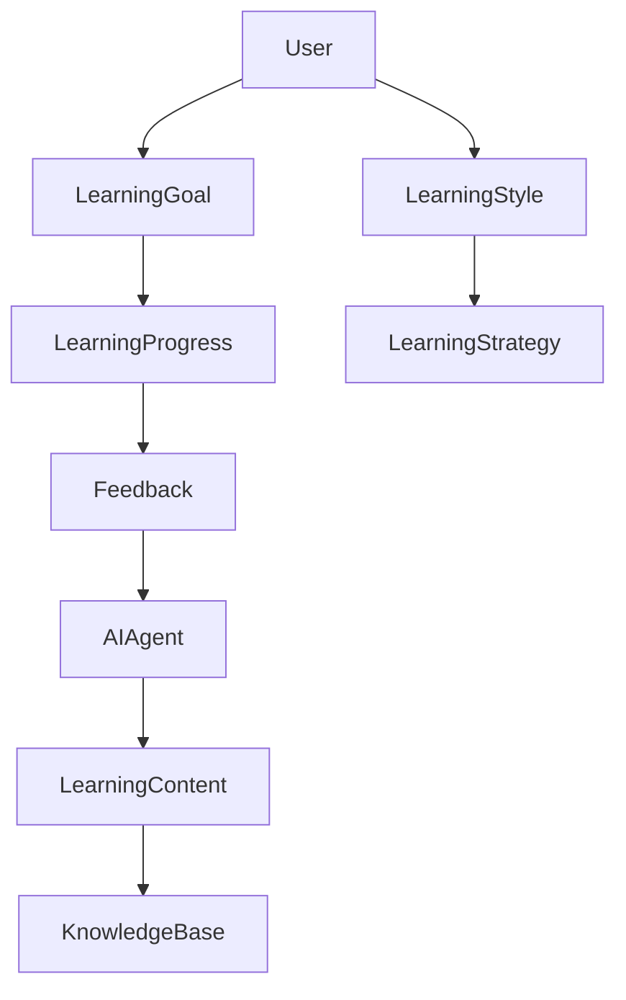

                 


# 开发AI Agent支持的智能语言学习系统

## 关键词：
AI Agent、智能语言学习系统、自然语言处理、机器学习、教育技术

## 摘要：
本文详细探讨了如何开发一个基于AI Agent的智能语言学习系统。首先介绍了AI Agent的基本概念和其在语言学习中的应用价值，接着分析了系统的数学模型和算法原理，包括自然语言处理和强化学习的应用。然后从系统架构设计、功能模块实现、项目实战等多个方面详细阐述了系统的构建过程，最后总结了开发经验和未来研究方向。

---

## 第一部分: AI Agent支持的智能语言学习系统背景介绍

### 第1章: AI Agent的基本概念与核心原理

#### 1.1 AI Agent的定义与分类
- **1.1.1 什么是AI Agent**
  AI Agent是一种智能体，能够感知环境、自主决策并执行任务，分为简单反射型、基于模型型、目标驱动型和实用驱动型。

- **1.1.2 AI Agent的分类**
  - 简单反射型：基于规则的反应式系统。
  - 基于模型型：使用内部模型表示状态和动作。
  - 目标驱动型：以实现特定目标为导向。
  - 实用驱动型：基于效用函数进行决策。

- **1.1.3 AI Agent的核心特征**
  - 智能性：能够理解并适应环境。
  - 主动性：无需外部干预自主执行任务。
  - 社交性：能够与人类或其他智能体交互。

#### 1.2 AI Agent的工作原理
- **1.2.1 感知与理解**
  - 通过传感器或API获取环境数据，如文本、语音等。
  - 使用NLP技术进行语义分析，提取关键信息。

- **1.2.2 决策与推理**
  - 基于知识库和推理引擎生成多个候选方案。
  - 使用启发式算法或强化学习选择最优动作。

- **1.2.3 执行与反馈**
  - 执行预选动作，调整策略。
  - 通过反馈机制优化行为。

### 第2章: 智能语言学习系统的现状与挑战

#### 2.1 传统语言学习方式的局限性
- **2.1.1 纯人工教学的不足**
  - 教学成本高，难以个性化。
- **2.1.2 线上学习平台的局限**
  - 缺乏实时互动，反馈延迟。
- **2.1.3 用户个性化需求未被充分满足**
  - 无法根据学习者状态动态调整教学内容。

#### 2.2 当前AI技术在语言学习中的应用
- **2.2.1 自然语言处理技术**
  - 用于语义分析和对话生成。
- **2.2.2 机器翻译技术**
  - 实现不同语言之间的转换。
- **2.2.3 智能语音识别技术**
  - 辅助语音输入和发音评估。

### 第3章: AI Agent在语言学习中的应用价值

#### 3.1 提高学习效率
- **3.1.1 个性化学习路径**
  - 根据学习者水平制定专属计划。
- **3.1.2 实时反馈与纠错**
  - 立即指出错误并提供改进建议。
- **3.1.3 自适应学习节奏**
  - 动态调整内容难度和练习量。

#### 3.2 增强学习体验
- **3.2.1 智能对话练习**
  - 模拟真实对话场景，提升语言应用能力。
- **3.2.2 虚拟现实场景模拟**
  - 提供沉浸式学习环境，增强情境理解。
- **3.2.3 多模态交互设计**
  - 结合文本、语音、图像等多种交互方式，提升学习趣味性。

---

## 第二部分: AI Agent支持的智能语言学习系统核心概念与联系

### 第4章: AI Agent与语言学习的结合原理

#### 4.1 AI Agent在语言学习中的角色定位
- **4.1.1 作为学习辅助工具**
  - 提供即时反馈，帮助学习者纠正错误。
- **4.1.2 作为智能教学助手**
  - 分析学习者行为，优化教学策略。
- **4.1.3 作为学习效果评估者**
  - 定期测试学习效果，生成评估报告。

#### 4.2 语言学习系统的核心要素
- **4.2.1 用户需求分析**
  - 通过问卷调查和数据分析，明确学习目标和偏好。
- **4.2.2 语言知识库构建**
  - 整合词典、语法规则和语料库，构建多语言知识库。
- **4.2.3 AI Agent行为策略**
  - 设计基于效用函数的策略，优化学习路径。

### 第5章: 核心概念原理与联系

#### 5.1 AI Agent的核心算法原理
- **5.1.1 概率模型**
  - 使用马尔可夫链进行状态转移，预测学习者可能的行为。
  - 示例：$$P(A|B) = \frac{P(B|A)P(A)}{P(B)}$$

- **5.1.2 强化学习机制**
  - 通过Q-learning算法，为每个状态-动作对分配Q值，优化奖励函数。
  - 示例：$$Q(s,a) = r + \gamma \max Q(s',a')$$

#### 5.2 实体关系图（ER图）与系统架构

```mermaid
erd
  章节标题：系统架构与实体关系
  title 系统架构与实体关系

  章节内容：
  我们设计了一个简单的ER图，展示了AI Agent支持的智能语言学习系统的实体关系。
```



---

## 第三部分: 数学模型与算法原理

### 第6章: 算法原理与数学模型

#### 6.1 自然语言处理模型
- **6.1.1 词嵌入模型**
  - 使用Word2Vec将单词映射为向量，计算相似度。
  - 示例：$$v_{word} \in \mathbb{R}^{d}$$

- **6.1.2 机器翻译模型**
  - 基于Transformer的神经机器翻译模型，实现多语言转换。
  - 示例：$$\text{Encoder}(\text{input}) \rightarrow \text{Decoder}(\text{output})$$

#### 6.2 强化学习算法
- **6.2.1 Q-learning算法**
  - 在状态-动作空间中，通过试错学习优化Q值。
  - 示例：$$Q(s,a) = (1-\alpha)Q(s,a) + \alpha(r + \gamma \max Q(s',a'))$$

- **6.2.2 案例分析**
  - 设计一个简单的语言学习任务，如选择合适的单词填空，通过Q-learning优化选择策略。

---

## 第四部分: 系统分析与架构设计

### 第7章: 系统分析与架构设计

#### 7.1 问题场景介绍
- 学习者在使用AI Agent辅助学习时，系统需要实时响应，提供个性化建议和反馈。

#### 7.2 系统功能设计
- **7.2.1 领域模型（类图）**
  ```mermaid
  classDiagram
      class User {
          id: int
          name: string
          learningProgress: float
      }
      class LearningGoal {
          id: int
          targetLevel: string
          deadline: date
      }
      class AIAgent {
          knowledgeBase: KnowledgeBase
          learningStrategy: LearningStrategy
      }
      class KnowledgeBase {
          vocabulary: dict
          grammarRules: list
          sentenceBank: list
      }
      class LearningStrategy {
          adaptivity: bool
          feedback: list
      }
      User --> LearningGoal
      AIAgent --> KnowledgeBase
      AIAgent --> LearningStrategy
  ```

- **7.2.2 系统架构图**
  ```mermaid
  architecture
      UserInterface --> AIAgent
      AIAgent --> KnowledgeBase
      AIAgent --> LearningStrategy
      LearningStrategy --> FeedbackSystem
  ```

---

## 第五部分: 项目实战

### 第8章: 项目实战

#### 8.1 环境搭建
- 安装Python、TensorFlow、Keras等开发工具。

#### 8.2 核心代码实现

```python
class AIAssistant:
    def __init__(self, knowledge_base):
        self.knowledge_base = knowledge_base
        self.strategy = LearningStrategy()

    def process_input(self, input_text):
        # 分析输入并生成响应
        response = self.strategy.generate_response(input_text)
        return response

class LearningStrategy:
    def generate_response(self, input_text):
        # 示例：简单规则驱动的响应生成
        return f"I received your message: {input_text}. How can I help you?"
```

---

## 第六部分: 最佳实践与总结

### 第9章: 最佳实践与总结

#### 9.1 小结
- AI Agent在语言学习中的应用前景广阔，但仍需解决实时性和个性化问题。

#### 9.2 注意事项
- 确保数据安全和隐私保护。
- 定期更新知识库，保持内容准确性。

#### 9.3 拓展阅读
- 推荐阅读《自然语言处理实战》和《强化学习入门》。

---

通过以上步骤，我们可以系统地开发一个AI Agent支持的智能语言学习系统，结合理论与实践，提升学习效果。

