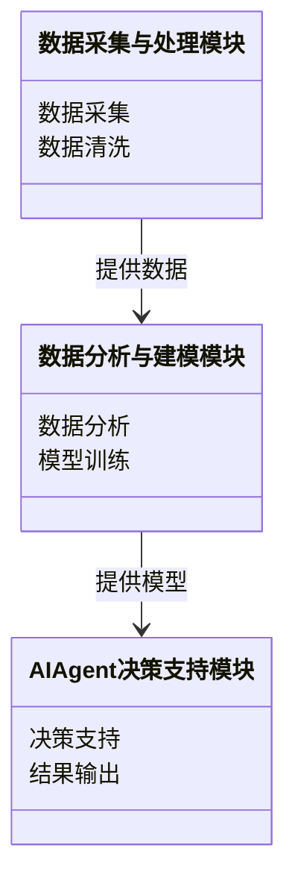
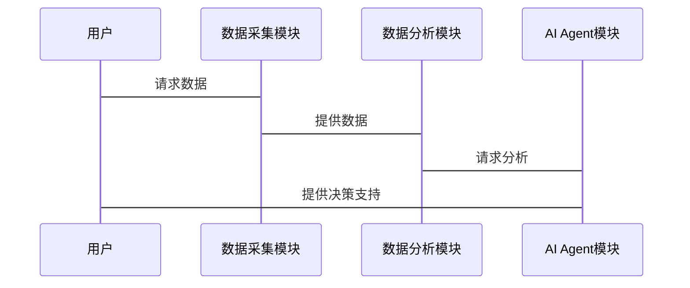

                 


# 开发AI Agent支持的智能财务分析系统

## 关键词：AI Agent, 财务分析, 生成式AI, 强化学习, 系统架构, 项目实战

## 摘要：本文系统地介绍了开发AI Agent支持的智能财务分析系统的背景、核心概念、算法原理、系统架构及项目实现。通过对传统财务分析系统的局限性分析，探讨了AI Agent在财务分析中的潜力，详细讲解了生成式AI和强化学习的算法原理，并通过实际案例展示了系统的实现过程。最后，本文总结了项目的成果，并展望了未来的发展方向。

---

## 第1章：背景介绍与问题分析

### 1.1 问题背景

#### 1.1.1 传统财务分析系统的局限性
传统财务分析系统依赖人工操作，效率低下，难以处理大量复杂数据，且容易受到主观因素影响。

#### 1.1.2 AI Agent在财务分析中的潜力
AI Agent能够实时分析财务数据，提供决策支持，显著提高分析效率和准确性。

#### 1.1.3 当前行业痛点与需求分析
行业内存在数据处理复杂、效率低、决策支持不足等问题，亟需智能化解决方案。

### 1.2 问题描述

#### 1.2.1 财务数据分析的复杂性
财务数据种类繁多，包括财务报表、市场数据等，需要复杂的分析方法。

#### 1.2.2 传统财务分析的效率瓶颈
传统方法依赖人工操作，效率低，难以快速响应市场变化。

#### 1.2.3 用户需求与系统功能的匹配
用户需要实时、准确的财务分析支持，传统系统难以满足。

### 1.3 问题解决与系统目标

#### 1.3.1 AI Agent如何解决财务分析问题
AI Agent通过自动化数据处理和智能分析，提升财务分析的效率和准确性。

#### 1.3.2 系统设计的核心目标
实现高效、智能的财务数据分析与决策支持。

#### 1.3.3 边界与外延
系统专注于财务数据分析，与其他业务系统保持独立。

### 1.4 核心概念与系统架构

#### 1.4.1 系统组成与功能模块
- 数据采集与处理模块
- 数据分析与建模模块
- AI Agent决策支持模块

#### 1.4.2 系统架构的层次划分
- 数据层
- 业务逻辑层
- 用户界面层

#### 1.4.3 系统的核心要素与属性
- 数据来源：财务报表、市场数据
- 分析方法：生成式AI、强化学习
- 决策支持：实时建议、风险预警

## 第2章：AI Agent的原理与实现

### 2.1 AI Agent的基本原理

#### 2.1.1 AI Agent的定义与分类
AI Agent是一种智能实体，能够感知环境并采取行动以实现目标。

#### 2.1.2 AI Agent的核心算法
- 生成式AI：用于数据生成和预测
- 强化学习：用于决策优化

#### 2.1.3 AI Agent与传统AI的区别
AI Agent具有自主性和适应性，能够与环境动态交互。

### 2.2 智能财务分析系统的功能模块

#### 2.2.1 数据采集与处理模块
- 数据来源：财务报表、市场数据
- 处理步骤：清洗、转换、存储

#### 2.2.2 数据分析与建模模块
- 分析方法：生成式AI、强化学习
- 建模工具：Python、TensorFlow

#### 2.2.3 AI Agent决策支持模块
- 决策支持：实时建议、风险预警
- 输出形式：可视化报告、警报信息

### 2.3 AI Agent与财务分析系统的实体关系

```mermaid
er
    entity 财务数据 {
        id 数据ID
        name 数据名称
        value 数据值
    }
    entity AI Agent {
        id AgentID
        name Agent名称
        function 功能
    }
    entity 用户 {
        id 用户ID
        name 用户名称
        role 用户角色
    }
    财务数据 --> AI Agent: 提供数据支持
    AI Agent --> 用户: 提供决策支持
```

## 第3章：生成式AI算法原理

### 3.1 生成式AI的基本原理

#### 3.1.1 生成式AI的定义与特点
生成式AI能够生成新的数据，如文本、图像等。

#### 3.1.2 Transformer模型的工作原理
Transformer模型通过自注意力机制处理序列数据。

#### 3.1.3 注意力机制的数学模型
$$\text{Attention}(Q, K, V) = \text{softmax}\left(\frac{QK^T}{\sqrt{d_k}}\right)V$$

### 3.2 大语言模型的数学公式

$$\text{Loss} = -\sum_{i=1}^{n} \log p(x_i)$$

---

## 第4章：强化学习算法原理

### 4.1 强化学习的基本原理

#### 4.1.1 强化学习的定义与特点
通过试错学习，智能体在环境中采取行动以最大化累积奖励。

#### 4.1.2 状态、动作和奖励的定义
- 状态：环境当前的状态
- 动作：智能体采取的行动
- 奖励：对动作的反馈

#### 4.1.3 Q-learning算法
$$ Q(s, a) = Q(s, a) + \alpha [r + \max_{a'} Q(s', a') - Q(s, a)] $$

---

## 第5章：系统分析与架构设计

### 5.1 项目背景与目标

### 5.2 系统功能设计

#### 5.2.1 领域模型


### 5.3 系统架构设计

#### 5.3.1 层次划分
- 数据层：数据采集、存储
- 业务逻辑层：数据分析、模型训练
- 用户界面层：用户交互、结果展示

#### 5.3.2 组件交互


### 5.4 系统接口设计

## 第6章：项目实战与实现

### 6.1 环境搭建
- Python 3.8及以上
- 安装库：TensorFlow, Keras, scikit-learn

### 6.2 核心代码实现

#### 6.2.1 数据采集模块
```python
import pandas as pd

def fetch_data(api_key):
    # 数据获取逻辑
    pass

def preprocess_data(data):
    # 数据清洗与转换
    pass
```

#### 6.2.2 数据分析与建模模块
```python
import tensorflow as tf
from tensorflow.keras import layers

model = tf.keras.Sequential([
    layers.Dense(64, activation='relu'),
    layers.Dense(1, activation='sigmoid')
])
model.compile(optimizer='adam', loss='binary_crossentropy')
```

#### 6.2.3 AI Agent决策支持模块
```python
def make_decision(model, data):
    prediction = model.predict(data)
    return prediction
```

### 6.3 案例分析与系统实现

### 6.4 项目总结

## 第7章：总结与展望

### 7.1 系统总结

### 7.2 未来展望

### 7.3 最佳实践与注意事项

### 7.4 小结

---

通过以上详细的内容安排，本文系统地介绍了开发AI Agent支持的智能财务分析系统的各个方面，从理论到实践，从设计到实现，确保内容全面、结构清晰、逻辑严谨。

