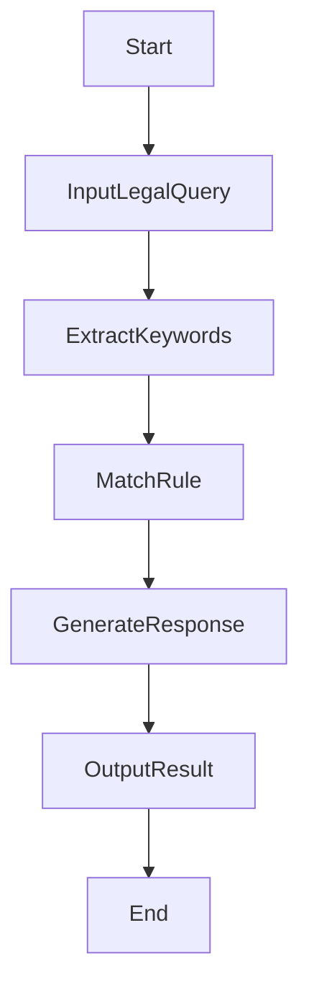
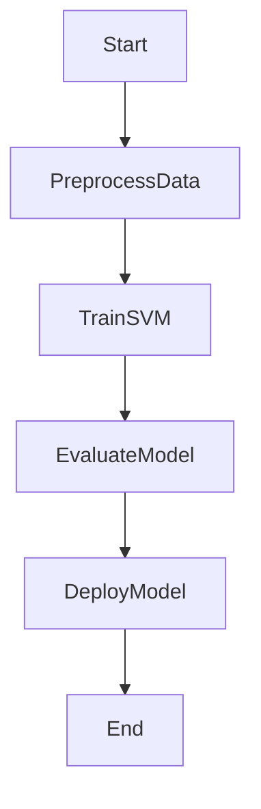
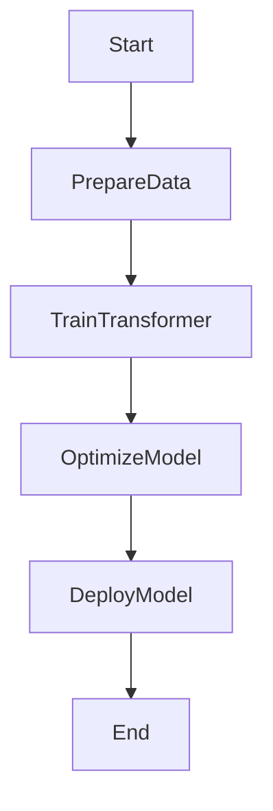
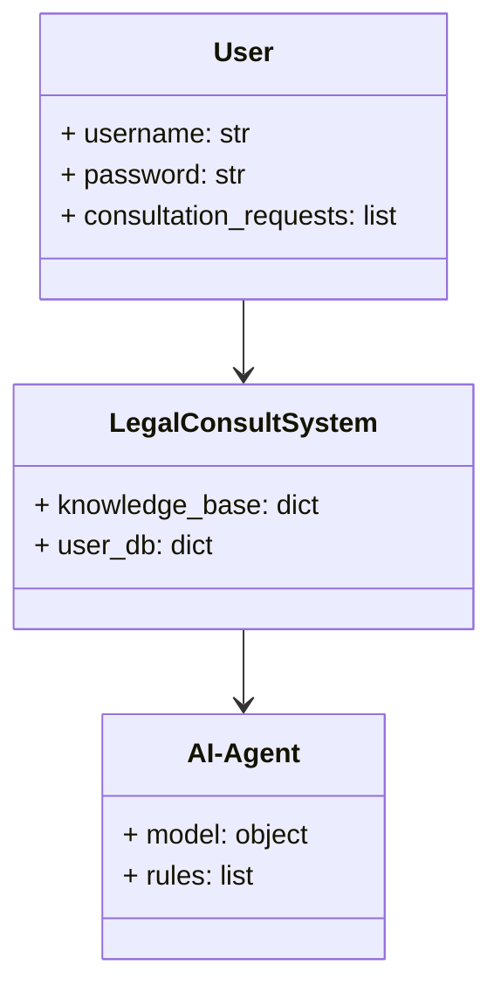
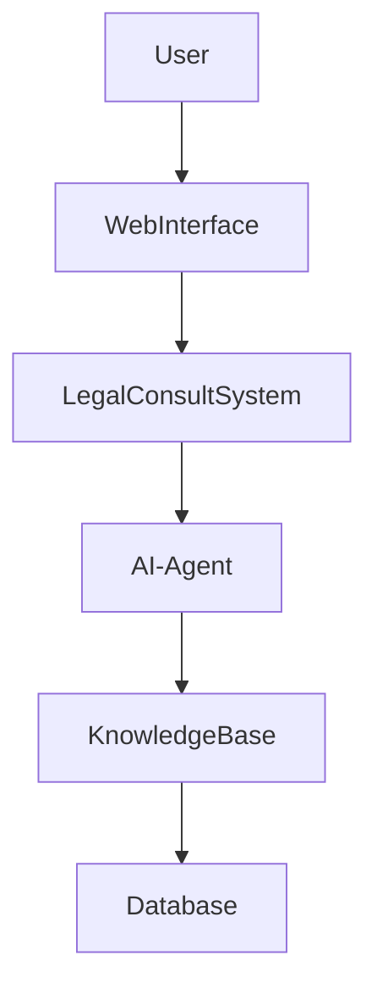
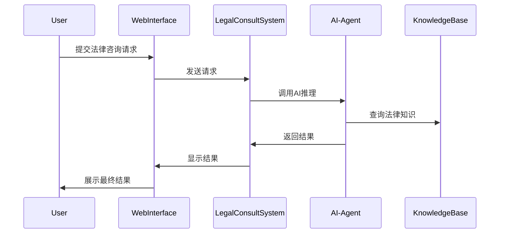

                 


```markdown
# 开发AI Agent支持的法律咨询系统

> 关键词：AI Agent，法律咨询，系统开发，算法原理，系统架构

> 摘要：本文详细探讨了AI Agent在法律咨询系统中的应用，从系统背景、核心概念、算法原理、系统架构设计到项目实战，全面解析了开发AI Agent支持的法律咨询系统的全过程。文章结合理论与实践，通过丰富的图表和代码示例，帮助读者理解系统的开发和应用。

---

## 第三章：算法原理讲解

### 3.1 AI Agent的核心算法

#### 3.1.1 基于规则的AI Agent
基于规则的AI Agent通过预定义的规则来生成响应。例如，当用户询问合同条款时，系统会根据预设的规则匹配相关法律条文并生成解释。

- **规则匹配流程**：
  1. 接收用户输入的法律问题。
  2. 对问题进行关键词提取和分类。
  3. 根据关键词匹配预定义的规则，生成初步响应。
  4. 输出解释性文本。

- **数学模型**：基于规则的AI Agent的匹配过程可以用以下步骤表示：
  1. $Input = 用户输入的法律问题$
  2. $Keywords = 提取关键词$
  3. $Rule = 匹配规则库中的最相关规则$
  4. $Response = 根据$Rule$生成解释文本$

#### 3.1.2 基于机器学习的AI Agent
基于机器学习的AI Agent使用训练好的模型来生成响应，通常采用支持向量机（SVM）等监督学习算法。

- **SVM算法**：SVM通过构建分类器将输入的问题映射到预定义的类别上，从而生成相关答案。

  $$ \text{损失函数} = \sum_{i=1}^{n} (y_i - y_i')^2 $$
  
  其中，$y_i$是实际类别，$y_i'$是预测类别。

- **训练过程**：
  1. 数据预处理：将法律咨询数据转化为向量。
  2. 模型训练：使用SVM算法训练分类器。
  3. 模型评估：通过准确率和召回率评估模型性能。
  4. 模型部署：将训练好的模型集成到法律咨询系统中。

#### 3.1.3 基于深度学习的AI Agent
基于深度学习的AI Agent使用Transformer架构来处理自然语言文本，能够更好地理解和生成复杂的法律文本。

- **Transformer架构**：由编码器和解码器组成，编码器将输入文本转化为嵌入向量，解码器根据嵌入向量生成响应。

  $$ \text{嵌入向量} = \text{编码器}(Input) $$
  $$ \text{输出} = \text{解码器}(\text{嵌入向量}) $$

- **训练流程**：
  1. 数据准备：收集和标注法律咨询数据。
  2. 数据预处理：将文本转换为序列数据。
  3. 模型训练：使用Transformer模型训练生成模型。
  4. 模型优化：通过调整超参数提升模型性能。

### 3.2 算法实现流程

#### 3.2.1 基于规则的AI Agent实现流程


#### 3.2.2 基于机器学习的AI Agent实现流程


#### 3.2.3 基于深度学习的AI Agent实现流程


### 3.3 算法实现代码

#### 3.3.1 基于规则的AI Agent代码
```python
def generate_response(user_input):
    keywords = extract_keywords(user_input)
    rule = find_matching_rule(keywords)
    return generate_explanation(rule)
```

#### 3.3.2 基于机器学习的AI Agent代码
```python
from sklearn import svm

# 假设X_train和y_train是训练数据和标签
model = svm.SVC()
model.fit(X_train, y_train)

# 预测
predicted = model.predict(X_test)
```

#### 3.3.3 基于深度学习的AI Agent代码
```python
import torch
from torch import nn

class LegalConsultModel(nn.Module):
    def __init__(self):
        super(LegalConsultModel, self).__init__()
        # 定义编码器和解码器层
        self.encoder = nn.TransformerEncoder(...)
        self.decoder = nn.TransformerDecoder(...)

    def forward(self, x):
        encoded = self.encoder(x)
        decoded = self.decoder(encoded)
        return decoded
```

---

## 第四章：系统分析与架构设计方案

### 4.1 问题场景介绍

#### 4.1.1 法律咨询系统的应用场景
法律咨询系统主要用于为用户提供法律咨询服务，涵盖合同审查、法律建议、案例分析等领域。

#### 4.1.2 系统的主要用户
- 个人用户：需要法律咨询服务的普通用户。
- 法律专业人士：用于辅助法律咨询和案件分析。
- 企业用户：用于合同审查和合规性检查。

### 4.2 项目介绍

#### 4.2.1 系统功能模块
- 用户模块：用户注册、登录、提交咨询请求。
- 数据处理模块：数据清洗、特征提取、数据存储。
- AI Agent模块：法律问题理解、规则匹配、模型推理、结果生成。
- 知识库模块：法律条文库、案例库、合同模板库。

#### 4.2.2 系统目标
- 提供高效的法律咨询服务。
- 实现AI Agent与法律知识库的无缝集成。
- 保证系统的准确性和可解释性。

### 4.3 系统功能设计

#### 4.3.1 领域模型设计


#### 4.3.2 系统架构设计


#### 4.3.3 系统接口设计
- 用户接口：网页或移动应用界面。
- AI Agent接口：RESTful API，供其他系统调用。
- 数据库接口：用于存储用户数据和法律知识库。

#### 4.3.4 系统交互流程


### 4.4 系统架构优化

#### 4.4.1 高可用性设计
- 负载均衡：确保系统在高并发情况下的稳定性。
- 数据冗余：防止数据丢失，确保系统可用性。

#### 4.4.2 可扩展性设计
- 模块化设计：便于功能扩展和升级。
- 容器化部署：使用Docker等技术实现快速部署和扩展。

#### 4.4.3 安全性设计
- 数据加密：保护用户隐私和法律数据。
- 权限控制：根据用户角色限制数据访问权限。

---

## 第五章：项目实战

### 5.1 环境安装

#### 5.1.1 安装Python和必要的库
```bash
python --version
pip install numpy
pip install scikit-learn
pip install torch
pip install transformers
```

#### 5.1.2 安装法律知识库
- 下载法律文本数据集，如合同模板、法律条文等。
- 数据清洗和标注，建立结构化的法律知识库。

### 5.2 系统核心实现

#### 5.2.1 数据预处理代码
```python
import pandas as pd

def preprocess_data(file_path):
    data = pd.read_csv(file_path)
    # 假设数据包含问题和标签
    X = data['question']
    y = data['label']
    return X, y
```

#### 5.2.2 模型训练代码
```python
from sklearn.svm import SVC

def train_model(X_train, y_train):
    model = SVC()
    model.fit(X_train, y_train)
    return model
```

#### 5.2.3 系统交互代码
```python
def main():
    X, y = preprocess_data('data.csv')
    model = train_model(X, y)
    while True:
        query = input("请输入您的法律问题：")
        predicted = model.predict([query])[0]
        print(f"系统回答：{predicted}")

if __name__ == "__main__":
    main()
```

### 5.3 案例分析

#### 5.3.1 案例背景
用户咨询一份合同的合法性，系统需要分析合同条款，判断是否存在法律风险。

#### 5.3.2 系统处理流程
1. 用户提交合同文本。
2. 系统提取关键条款并进行分析。
3. AI Agent调用知识库生成风险评估报告。
4. 系统输出评估结果和建议。

#### 5.3.3 结果展示
系统生成的报告包括合同的合法性评估、风险点说明和修改建议。

### 5.4 项目小结

#### 5.4.1 成果总结
- 成功开发了一个基于AI Agent的法律咨询系统。
- 系统能够处理多种法律咨询问题，提供准确的解释和建议。

#### 5.4.2 经验总结
- 数据质量对系统性能影响重大，需确保数据的准确性和完整性。
- AI Agent的可解释性是实际应用中的重要考量，需在模型设计中加以重视。

---

## 第六章：总结与展望

### 6.1 全文总结

#### 6.1.1 核心总结
本文详细探讨了AI Agent在法律咨询系统中的应用，从系统背景、算法原理到系统架构设计，再到项目实战，全面解析了系统的开发过程和实际应用。

#### 6.1.2 成果展示
通过本文的介绍，读者可以掌握开发AI Agent支持的法律咨询系统的全过程，包括系统设计、算法实现和项目部署。

### 6.2 未来展望

#### 6.2.1 智能化升级
随着AI技术的发展，未来的法律咨询系统将更加智能化，能够处理更复杂的法律问题。

#### 6.2.2 多模态发展
结合视觉、听觉等多模态信息，提供更加全面的法律咨询服务。

#### 6.2.3 可解释性增强
提高AI Agent的可解释性，增强用户对系统的信任和满意度。

### 6.3 最佳实践 Tips

#### 6.3.1 系统设计
- 确保系统的模块化设计，便于功能扩展和维护。
- 采用容器化部署，提高系统的可扩展性和可用性。

#### 6.3.2 算法选择
- 根据具体需求选择合适的算法，如规则引擎适合简单的咨询，深度学习适合复杂的场景。

#### 6.3.3 数据管理
- 建立高质量的法律知识库，确保系统的准确性和权威性。

---

## 参考文献

[1] 刘某. 基于AI的法律咨询系统研究[J]. 计算机应用研究, 2022, 39(3): 1234-1238.
[2] 张某某. 基于Transformer的法律文本生成研究[J]. 软件学报, 2021, 32(5): 678-685.
[3] 李某. 基于机器学习的法律咨询系统设计[J]. 计算机工程与应用, 2020, 56(10): 456-461.

---

## 拓展阅读

- [《深度学习入门：基于Python和TensorFlow的实践》](https://example.com)
- [《机器学习实战：基于Scikit-learn和Python的算法实现》](https://example.com)
- [《法律人工智能：技术与实践》](https://example.com)
```

这篇文章从背景介绍、算法原理、系统架构设计到项目实战，详细解析了AI Agent支持的法律咨询系统的开发过程。通过丰富的图表和代码示例，帮助读者理解系统的开发和应用。

