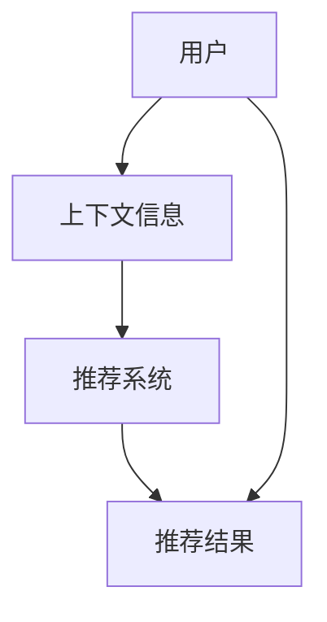
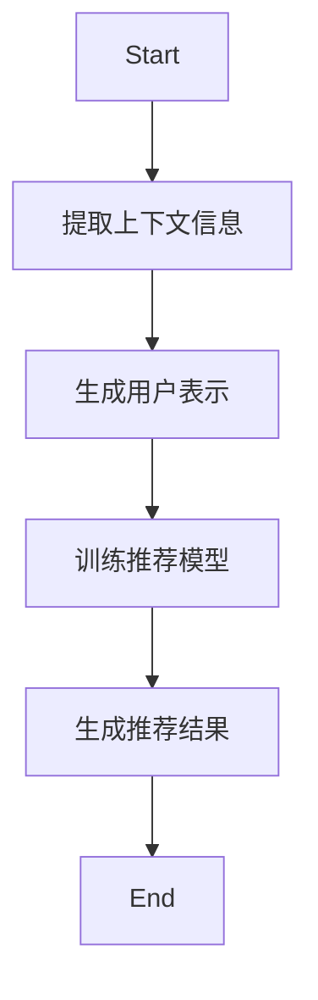
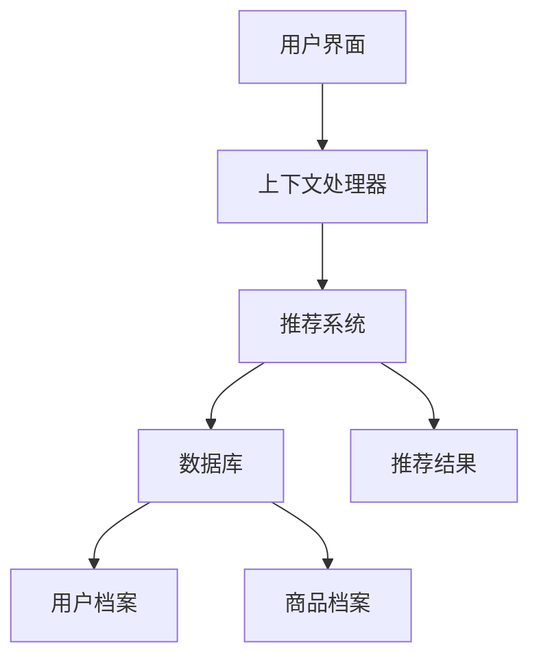
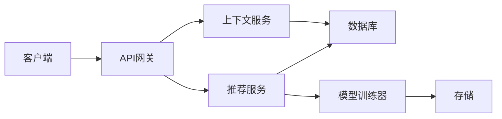

                 


# 开发AI Agent的上下文感知推荐系统

## 关键词：AI Agent、上下文感知、推荐系统、机器学习、深度学习

## 摘要：  
本文详细探讨了如何开发基于AI Agent的上下文感知推荐系统，从背景、核心概念、算法原理到系统架构和项目实战，全面解析了该系统的构建过程。通过结合上下文信息，AI Agent能够更精准地理解用户需求，提升推荐系统的个性化和实时性。本文还提供了具体的数学模型、算法流程图和Python代码示例，帮助读者深入理解并实践上下文感知推荐系统。

---

# 第1章: 背景介绍

## 1.1 问题背景  
在信息爆炸的时代，用户每天面对海量信息，如何快速找到符合需求的内容成为一大挑战。传统的推荐系统虽然能够基于用户历史行为或偏好进行推荐，但往往忽略了上下文信息（如时间、地点、设备、社交关系等）对用户行为的影响。例如，用户在早晨和晚上的行为习惯可能完全不同，而传统推荐系统无法感知这些差异，导致推荐结果不够精准。

## 1.2 问题描述  
上下文感知推荐系统的目的是通过整合上下文信息（Context）来提升推荐的准确性和个性化。上下文信息可以是用户的实时状态（如地理位置、时间、设备类型）、社交网络信息（如好友的行为）、环境因素（如天气、光线）等。然而，如何有效地整合这些复杂的信息，并利用它们来优化推荐结果，是当前推荐系统面临的主要挑战。

## 1.3 问题解决思路  
AI Agent（智能代理）是一种能够感知环境并采取行动以优化目标的智能系统。通过引入AI Agent，我们可以让推荐系统不仅仅依赖于静态的数据，而是能够动态感知上下文信息，并根据实时变化进行调整。例如，AI Agent可以根据用户当前的地理位置推荐附近的餐厅，或者根据用户的实时心情推荐适合的音乐。

## 1.4 边界与外延  
上下文感知推荐系统的边界在于如何有效地整合上下文信息，并将其与用户偏好相结合。外延则包括如何与其他推荐系统（如协同过滤、基于内容的推荐）进行集成，以及如何扩展到更广泛的应用场景（如教育、医疗、金融等）。与其他推荐系统相比，上下文感知推荐系统的独特之处在于其动态性和实时性。

## 1.5 核心概念与组成  
上下文感知推荐系统的核心概念包括：  
1. **上下文信息**：包括用户的状态、环境、社交网络等信息。  
2. **AI Agent**：用于感知上下文并做出推荐决策的智能代理。  
3. **推荐模型**：基于上下文信息和用户历史行为构建的推荐算法。  
4. **实时性**：推荐结果能够根据上下文信息的变化实时更新。

---

# 第2章: 核心概念与联系

## 2.1 核心概念原理  
上下文感知推荐系统的核心在于如何有效利用上下文信息。通过分析用户的上下文信息，AI Agent可以更准确地预测用户的偏好。例如，用户在周末可能更倾向于娱乐类内容，而在工作日则更倾向于工具类内容。这种动态变化需要推荐系统能够实时感知并调整推荐策略。

## 2.2 核心概念对比表  
以下是上下文感知推荐系统与其他推荐系统的对比：

| 比较维度         | 协同过滤推荐 | 基于内容的推荐 | 上下文感知推荐 |
|------------------|--------------|----------------|---------------|
| 是否考虑上下文   | 否           | 否             | 是            |
| 推荐实时性        | 低           | 中             | 高            |
| 个性化程度       | 中           | 高             | 极高          |
| 适用场景         | 简单场景     | 复杂场景       | 多变场景       |

## 2.3 ER实体关系图  
以下是上下文感知推荐系统的实体关系图：



---

# 第3章: 算法原理讲解

## 3.1 算法原理概述  
上下文感知推荐系统的核心算法可以分为以下几个步骤：  
1. **上下文信息的提取**：从用户行为和环境中提取上下文特征。  
2. **用户表示**：将用户的历史行为和上下文信息映射到向量空间。  
3. **推荐模型训练**：基于用户表示和上下文信息，训练推荐模型。  
4. **实时推荐**：根据实时上下文信息生成推荐结果。

## 3.2 算法流程图  
以下是上下文感知推荐系统的算法流程图：



## 3.3 算法实现代码  
以下是一个简单的上下文感知推荐算法的Python代码示例：

```python
import numpy as np

# 假设用户表示为向量，维度为d
d = 100

# 上下文信息嵌入
def context_embedding(context):
    # 假设context是一个包含上下文特征的字典
    embedding = np.random.rand(d)
    return embedding

# 用户表示更新
def update_user_profile(user_vector, context):
    new_user_vector = user_vector + context_embedding(context)
    return new_user_vector

# 推荐模型训练
def train_recommendation_model(user_profiles, items):
    # 假设items是一个包含商品特征的矩阵，形状为N×d
    # 使用矩阵分解进行训练
    from sklearn.decomposition import NMF
    model = NMF(n_components=50, random_state=42)
    model.fit(items)
    return model

# 实时推荐
def generate_recommendation(user_vector, context, items, model):
    updated_user_vector = update_user_profile(user_vector, context)
    # 计算相似度
    similarity = np.dot(items, updated_user_vector)
    # 返回相似度最高的前k个商品
    return np.argsort(similarity, axis=0)[-5:]

# 示例使用
user_vector = np.random.rand(d)
context = {"time": "morning", "location": "home"}
items = np.random.rand(100, d)
model = train_recommendation_model(user_vector, items)
recommendations = generate_recommendation(user_vector, context, items, model)
print(recommendations)
```

## 3.4 算法数学模型  
上下文感知推荐系统的数学模型可以表示为：  
$$ \hat{r}_{u,i} = g(u, i, c) $$  
其中，$u$ 是用户，$i$ 是商品，$c$ 是上下文信息，$g$ 是推荐模型函数。模型的目标是最小化预测值与实际评分的差距：  
$$ \min_{\theta} \sum_{u,i} (r_{u,i} - \hat{r}_{u,i})^2 $$  

---

# 第4章: 系统分析与架构设计

## 4.1 系统功能设计  
以下是上下文感知推荐系统的功能模块图：



## 4.2 系统架构设计  
以下是系统的架构图：



## 4.3 系统接口设计  
以下是系统接口设计的序列图：

```mermaid
graph TD
    Client --> API_Gateway: 请求推荐
    API_Gateway --> Service_A: 获取上下文信息
    Service_A --> Database: 查询上下文特征
    Database --> Service_A: 返回上下文特征
    Service_A --> API_Gateway: 返回上下文特征
    API_Gateway --> Service_B: 请求推荐
    Service_B --> Model_Trainer: 获取最新模型
    Model_Trainer --> Service_B: 返回训练好的模型
    Service_B --> Client: 返回推荐结果
```

---

# 第5章: 项目实战

## 5.1 环境安装  
首先，安装所需的Python库：  
```bash
pip install numpy scikit-learn mermaid
```

## 5.2 核心实现代码  
以下是推荐系统的核心实现代码：

```python
import numpy as np
from sklearn.decomposition import NMF

def context_embedding(context):
    embedding = np.random.rand(100)
    return embedding

def update_user_profile(user_vector, context):
    return user_vector + context_embedding(context)

def train_recommendation_model(user_profiles, items):
    model = NMF(n_components=50, random_state=42)
    model.fit(items)
    return model

def generate_recommendation(user_vector, context, items, model):
    updated_user_vector = update_user_profile(user_vector, context)
    similarity = np.dot(items, updated_user_vector)
    return np.argsort(similarity, axis=0)[-5:]

# 示例使用
user_vector = np.random.rand(100)
context = {"time": "morning", "location": "home"}
items = np.random.rand(100, 100)
model = train_recommendation_model(user_vector, items)
recommendations = generate_recommendation(user_vector, context, items, model)
print(recommendations)
```

## 5.3 案例分析  
假设我们有一个音乐推荐系统，用户在早晨通常喜欢听轻音乐，而在晚上喜欢听古典音乐。通过上下文感知推荐系统，我们可以根据时间信息动态调整推荐结果。

---

# 第6章: 最佳实践与总结

## 6.1 最佳实践  
1. **实时性**：确保推荐系统能够实时感知上下文信息。  
2. **数据质量**：上下文信息的质量直接影响推荐效果。  
3. **模型更新**：定期更新推荐模型，以适应用户行为的变化。  

## 6.2 小结  
本文详细介绍了如何开发基于AI Agent的上下文感知推荐系统，从背景、核心概念到算法原理和系统设计，再到项目实战，全面解析了该系统的构建过程。通过结合上下文信息，AI Agent能够更精准地理解用户需求，提升推荐系统的个性化和实时性。

## 6.3 注意事项  
1. **隐私保护**：在处理用户上下文信息时，需注意隐私保护。  
2. **性能优化**：复杂的上下文信息可能导致推荐系统的性能下降。  
3. **可扩展性**：确保系统能够扩展到更多的上下文信息和用户场景。  

## 6.4 拓展阅读  
1. 《推荐系统实践》  
2. 《机器学习实战》  
3. 《深度学习与自然语言处理》  

--- 

# 结语  
开发AI Agent的上下文感知推荐系统是一项具有挑战性但也极具价值的工作。通过结合上下文信息，推荐系统能够更好地满足用户需求，提升用户体验。希望本文能够为读者提供有价值的参考和启发。

