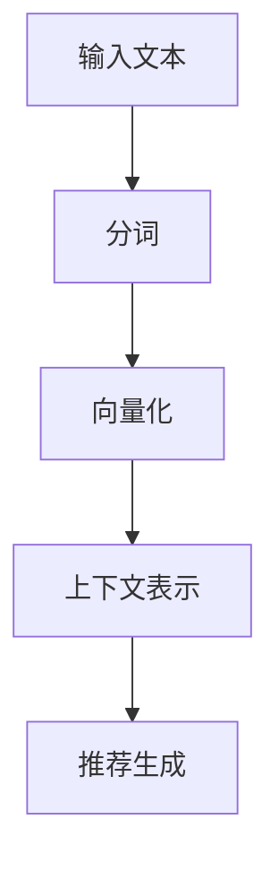
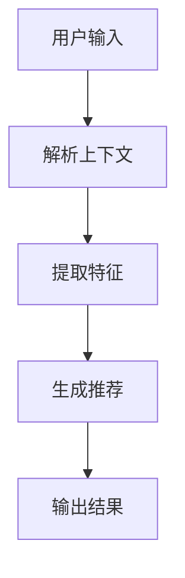
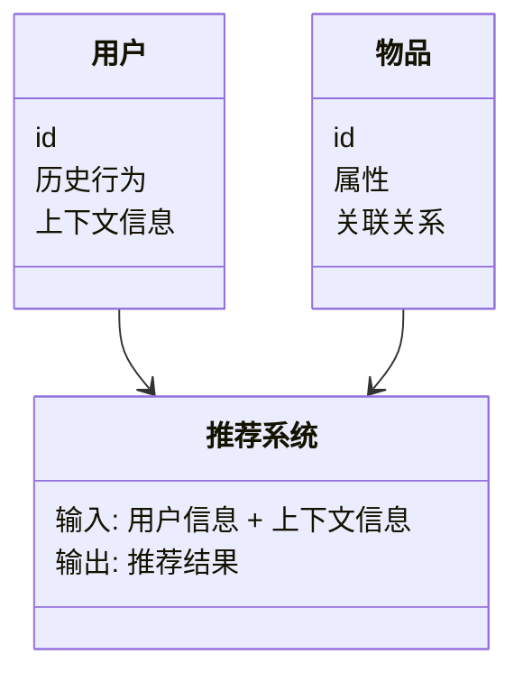
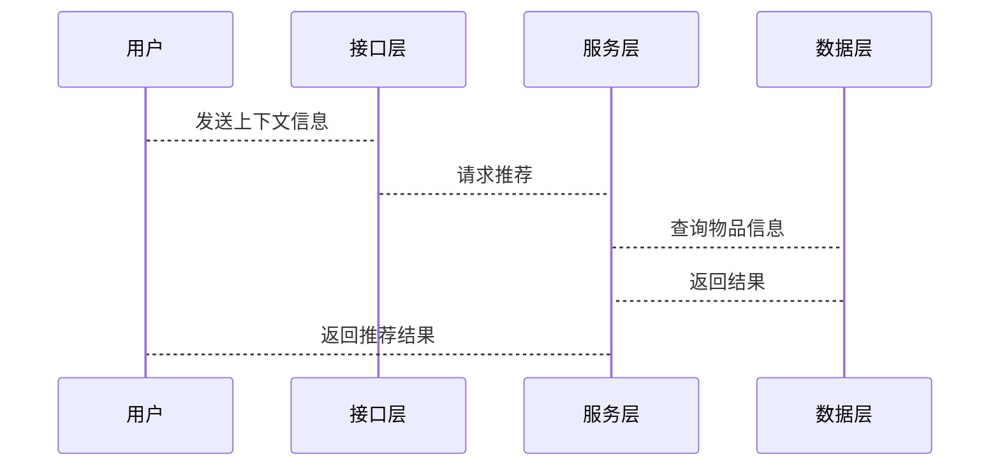

                 


# 开发AI Agent的上下文感知推荐系统

> 关键词：AI Agent、上下文感知、推荐系统、自然语言处理、实时推荐、系统架构

> 摘要：本文将详细探讨如何利用AI Agent和上下文感知技术开发推荐系统，结合算法原理、系统架构设计和项目实战，帮助读者从理论到实践全面掌握相关知识。

---

# 第1章: 上下文感知推荐系统的背景与问题背景

## 1.1 问题背景

### 1.1.1 当前推荐系统的局限性
传统的推荐系统主要基于用户的历史行为数据或偏好进行推荐，但在实际应用中存在以下问题：
- **缺乏上下文感知**：无法有效利用实时的上下文信息（如用户的位置、时间、情绪等）来动态调整推荐结果。
- **静态模型**：推荐结果通常基于固定的用户画像和物品特征，难以适应快速变化的用户需求和场景。
- **计算开销大**：大规模数据处理和实时计算需要较高的计算资源。

### 1.1.2 上下文感知推荐系统的提出
上下文感知推荐系统通过引入实时的上下文信息，动态调整推荐策略，从而提升推荐的精准度和用户体验。AI Agent作为系统的核心，能够实时感知上下文并执行推荐任务。

### 1.1.3 AI Agent在推荐系统中的作用
AI Agent（智能代理）在推荐系统中的作用主要体现在以下几个方面：
- **实时感知上下文**：通过自然语言处理和多模态数据解析，实时获取用户的上下文信息。
- **动态推理与决策**：根据上下文信息和用户历史行为，动态推理用户的潜在需求并生成推荐。
- **多场景适配**：能够根据不同场景（如移动设备、PC端、IoT设备）自动调整推荐策略。

## 1.2 问题描述

### 1.2.1 用户需求的动态变化
用户的需求会受到时间、地点、情绪等多种因素的影响，具有动态变化的特点。传统的推荐系统难以捕捉这些变化，导致推荐结果与实际需求不符。

### 1.2.2 上下文信息的多样性
上下文信息包括用户的行为数据、环境数据（如位置、时间）、社交数据等。这些信息的多样性使得如何有效整合和利用这些数据成为挑战。

### 1.2.3 推荐系统的实时性要求
在实时推荐场景中，系统需要在极短时间内生成推荐结果，这对计算效率和算法的实时性提出了更高的要求。

## 1.3 问题解决

### 1.3.1 AI Agent的核心能力
AI Agent具备以下核心能力：
- **感知能力**：能够实时获取并解析多模态的上下文信息。
- **推理能力**：基于上下文信息和历史数据进行动态推理，推断用户的潜在需求。
- **执行能力**：根据推理结果生成推荐并执行相应的操作。

### 1.3.2 上下文感知推荐系统的解决方案
通过引入AI Agent和上下文感知技术，推荐系统能够：
- **实时捕捉上下文信息**：利用自然语言处理和多模态数据解析技术，实时获取用户的上下文信息。
- **动态调整推荐策略**：根据上下文信息和用户行为动态调整推荐算法和权重。
- **提升推荐精准度**：通过上下文信息的整合，显著提升推荐的准确性和相关性。

### 1.3.3 系统架构的设计思路
设计思路如下：
1. **数据采集**：实时采集用户的上下文信息（如位置、时间、行为数据等）。
2. **数据处理**：对采集到的上下文信息进行清洗、整合和特征提取。
3. **推荐生成**：基于上下文信息和用户画像，动态生成推荐结果。
4. **反馈优化**：根据用户的反馈不断优化推荐模型和策略。

## 1.4 系统的边界与外延

### 1.4.1 系统的输入与输出
- **输入**：用户的上下文信息（如位置、时间、情绪）、用户历史行为数据。
- **输出**：动态生成的推荐结果（如商品推荐、信息推荐）。

### 1.4.2 系统的边界条件
- **数据范围**：系统仅处理实时的上下文信息和用户行为数据。
- **场景限制**：推荐结果仅适用于特定场景（如移动端推荐）。

### 1.4.3 系统的可扩展性
系统设计需要预留扩展接口，以便在未来引入更多的上下文信息（如用户生理数据、环境数据等）。

## 1.5 核心概念与联系

### 1.5.1 核心概念的原理
- **上下文感知**：通过多模态数据解析技术，实时获取并整合用户的上下文信息。
- **动态推理**：基于上下文信息和历史行为数据，动态推断用户的潜在需求。

### 1.5.2 核心概念的属性特征对比表

| 概念       | 属性           | 特征描述                         |
|------------|----------------|---------------------------------|
| 上下文感知  | 数据来源       | 多模态数据（文本、语音、图像等） |
|            | 处理方式       | 实时处理                         |
| 动态推理    | 输入数据       | 上下文信息 + 历史行为数据       |
|            | 推理方式       | 基于机器学习模型动态推理         |

### 1.5.3 ER实体关系图架构

```mermaid
erDiagram
    用户(U) o-|{拥有}| 用户画像(U_P)
    用户(U) o-|{产生}| 用户行为(U_B)
    上下文信息(C) o-|{关联}| 上下文特征(C_F)
    用户画像(U_P) o-|{影响}| 推荐结果(R)
    用户行为(U_B) o-|{影响}| 推荐结果(R)
```

---

# 第2章: AI Agent与上下文感知推荐系统的原理

## 2.1 AI Agent的核心原理

### 2.1.1 自然语言处理模型
自然语言处理（NLP）模型（如BERT、GPT）用于解析用户的文本输入，提取上下文信息。

### 2.1.2 知识图谱构建
通过知识图谱构建技术，将多模态数据整合到一个统一的知识网络中。

### 2.1.3 动态推理机制
基于知识图谱和上下文信息，动态推理用户的潜在需求。

## 2.2 上下文感知推荐系统的算法原理

### 2.2.1 基于上下文的特征提取
通过自然语言处理和多模态数据解析，提取上下文特征。

### 2.2.2 动态权重分配机制
根据上下文信息的关联度，动态调整特征的权重。

### 2.2.3 实时推荐生成算法
基于上下文特征和动态权重，实时生成推荐结果。

## 2.3 系统的数学模型与公式

### 2.3.1 上下文表示模型
$$ C = f_{context}(U, T) $$
其中，$C$表示上下文表示，$U$表示用户信息，$T$表示时间信息。

### 2.3.2 用户偏好预测模型
$$ P = f_{preference}(C, I) $$
其中，$P$表示用户的偏好预测，$C$表示上下文表示，$I$表示物品信息。

### 2.3.3 推荐生成模型
$$ R = f_{recommend}(P, C) $$
其中，$R$表示推荐结果，$P$表示用户偏好预测，$C$表示上下文表示。

---

# 第3章: 系统的算法实现

## 3.1 算法原理

### 3.1.1 自然语言处理模型的流程图



### 3.1.2 推荐生成算法的流程图



## 3.2 算法实现

### 3.2.1 环境安装
```bash
pip install transformers
pip install pytorch
```

### 3.2.2 核心代码实现

```python
def context_represent(text):
    # 使用预训练的NLP模型生成上下文表示
    model = AutoModel.from_pretrained('bert-base')
    inputs = tokenizer(text, return_tensors='np')
    outputs = model(**inputs)
    return outputs.last_hidden_state[:, 0, :]

def dynamic_recommend(user_context, item_info):
    # 基于上下文的动态推荐算法
    context_emb = context_represent(user_context)
    item_emb = get_item_embedding(item_info)
    similarity = cosine_similarity(context_emb, item_emb)
    return top_k(similarity, k=5)
```

---

# 第4章: 系统分析与架构设计

## 4.1 系统的功能设计

### 4.1.1 领域模型



### 4.1.2 系统架构


### 4.1.3 接口设计



---

# 第5章: 项目实战

## 5.1 环境安装

```bash
pip install transformers
pip install pytorch
```

## 5.2 系统核心实现源代码

```python
from transformers import AutoTokenizer, AutoModel
import torch

class ContextualAgent:
    def __init__(self):
        self.tokenizer = AutoTokenizer.from_pretrained('bert-base')
        self.model = AutoModel.from_pretrained('bert-base')

    def process_context(self, text):
        inputs = self.tokenizer(text, return_tensors='pt')
        outputs = self.model(**inputs)
        return outputs.last_hidden_state[:, 0, :]
```

## 5.3 案例分析与详细讲解

### 5.3.1 案例分析

假设我们有一个电商推荐系统，用户输入一条文本信息，系统需要根据文本内容生成推荐结果。

### 5.3.2 详细讲解

```python
agent = ContextualAgent()
text = "我需要买一双适合跑步的鞋子"
context_emb = agent.process_context(text)
recommendations = generate_recommendations(context_emb)
print(recommendations)
```

---

# 第6章: 最佳实践与小结

## 6.1 最佳实践

### 6.1.1 性能优化
- 使用分布式计算优化推荐系统的计算效率。
- 借助缓存技术减少重复计算。

### 6.1.2 安全性考虑
- 数据加密处理，确保用户隐私。
- 权限控制，防止未授权访问。

### 6.1.3 可扩展性设计
- 系统设计预留扩展接口，方便未来接入更多上下文信息。

## 6.2 小结
本文详细探讨了AI Agent在上下文感知推荐系统中的应用，从理论到实践全面介绍了系统的开发过程。

## 6.3 注意事项
- 确保系统的实时性和准确性。
- 处理好上下文信息的多样性和复杂性。

## 6.4 拓展阅读
- 推荐阅读相关领域的书籍和论文，深入了解自然语言处理和推荐系统的最新进展。

---

# 附录

## 附录A: 数据集
- [公开推荐系统数据集](https://grouplens.org/datasets/)

## 附录B: 工具与库
- [Hugging Face Transformers](https://huggingface.co/transformers)
- [PyTorch](https://pytorch.org/)

---

# 结束语

通过本文的学习，读者可以全面掌握AI Agent在上下文感知推荐系统中的开发方法，从理论到实践都能有所收获。

