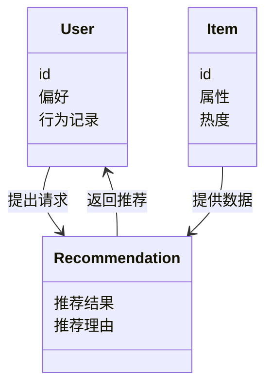
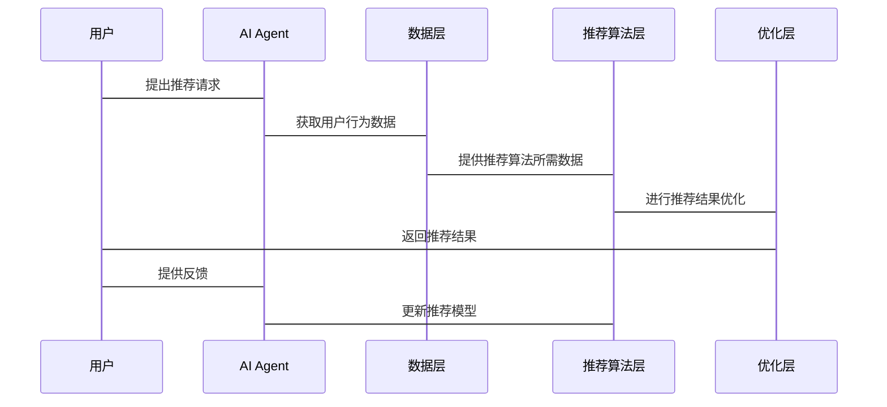

                 


# 开发AI Agent的个性化推荐系统

> 关键词：AI Agent，个性化推荐系统，推荐算法，系统设计，项目实战

> 摘要：本文详细探讨了开发AI Agent的个性化推荐系统的各个方面，从核心概念到算法实现，再到系统设计和项目实战，旨在为读者提供一个全面的视角。文章首先介绍了AI Agent和个性化推荐系统的背景和基本概念，然后深入分析了推荐系统的算法原理，包括协同过滤、基于内容的推荐和深度学习模型。接着，文章从系统分析与架构设计的角度，讨论了推荐系统的应用场景和系统架构。最后，通过一个具体的项目实战案例，展示了如何开发一个基于深度学习的推荐系统，并提供了优化与维护的建议。

---

# 第三章: 系统分析与架构设计方案

## 3.1 问题场景介绍

### 3.1.1 AI Agent在推荐系统中的应用场景
- 智能音箱的音乐推荐
- 智能客服的个性化服务推荐
- 智能购物助手的商品推荐

### 3.1.2 问题分析
- 用户需求分析：用户的偏好和行为模式
- 系统功能需求：推荐算法的选择、实时反馈、动态调整

## 3.2 系统功能设计

### 3.2.1 领域模型设计


### 3.2.2 系统架构设计


### 3.2.3 接口与交互流程


## 3.3 本章小结
本章通过领域模型设计、系统架构设计和接口交互流程，详细分析了AI Agent个性化推荐系统的整体架构和功能模块。通过系统化的分析，为后续的系统实现奠定了基础。

---

# 第四章: 项目实战

## 4.1 环境安装与配置

### 4.1.1 安装Python环境
```bash
# 安装Python和pip
python --version
pip --version
```

### 4.1.2 安装必要的库
```bash
pip install numpy
pip install pandas
pip install scikit-learn
pip install tensorflow
```

## 4.2 系统核心实现

### 4.2.1 推荐算法实现
```python
import numpy as np
from sklearn.metrics.pairwise import cosine_similarity

def collaborative_filtering(user_item_matrix):
    # 计算用户-物品相似度矩阵
    user_similarity = cosine_similarity(user_item_matrix.T)
    # 找到每个用户的相似用户
    user_based_recommendations = np.dot(user_item_matrix, user_similarity)
    return user_based_recommendations

# 示例数据
user_item_matrix = np.array([[4, 3, 0],
                              [3, 2, 5],
                              [0, 5, 2]])
# 调用函数
recommendations = collaborative_filtering(user_item_matrix)
print("推荐结果：\n", recommendations)
```

### 4.2.2 基于深度学习的推荐模型实现
```python
import tensorflow as tf
from tensorflow.keras import layers

def deep_learning_recommendation(user_input, item_input):
    # 用户嵌入层
    user_embedding = layers.Dense(64, activation='relu')(user_input)
    # 物品嵌入层
    item_embedding = layers.Dense(64, activation='relu')(item_input)
    # 合并层
    merged_layer = layers.concatenate([user_embedding, item_embedding])
    # 输出层
    output_layer = layers.Dense(1, activation='sigmoid')(merged_layer)
    return output_layer

# 示例数据
user_input = tf.keras.Input(shape=(10,))
item_input = tf.keras.Input(shape=(10,))
model = tf.keras.Model(inputs=[user_input, item_input], outputs=deep_learning_recommendation(user_input, item_input))
model.compile(optimizer='adam', loss='binary_crossentropy')
```

## 4.3 实际案例分析

### 4.3.1 案例背景
- 项目目标：开发一个基于深度学习的个性化推荐系统。
- 数据来源：用户行为数据、物品属性数据。

### 4.3.2 数据预处理与特征提取
```python
import pandas as pd

# 数据加载
data = pd.read_csv('user_item.csv')
# 数据清洗
data.dropna()
# 特征工程
data = pd.get_dummies(data)
```

### 4.3.3 模型训练与评估
```python
# 训练模型
model.fit(x_train, y_train, epochs=10, batch_size=32)
# 评估模型
loss = model.evaluate(x_test, y_test)
print(f"测试损失：{loss}")
```

## 4.4 本章小结
本章通过一个具体的项目实战，详细讲解了如何开发一个基于深度学习的个性化推荐系统。从环境配置到算法实现，再到模型训练和评估，为读者提供了从理论到实践的完整流程。

---

# 第五章: 优化与维护

## 5.1 系统优化

### 5.1.1 提升推荐效果
- 增加上下文信息：时间、地点、设备类型
- 使用混合推荐算法：协同过滤 + 基于内容的推荐

### 5.1.2 解决数据稀疏性问题
- 引入规则推荐：基于标签的推荐
- 数据增强：使用外部数据源丰富数据

## 5.2 系统维护与扩展

### 5.2.1 系统维护
- 定期更新模型
- 监控系统性能
- 处理异常情况

### 5.2.2 系统扩展
- 增加新功能：情感分析、实时推荐
- 扩展数据源：社交网络数据、实时行为数据

## 5.3 最佳实践 tips

### 5.3.1 优化建议
- 使用分布式系统提升性能
- 引入实时反馈机制

### 5.3.2 注意事项
- 数据隐私保护
- 系统容错设计
- 定期性能调优

## 5.4 拓展阅读

### 5.4.1 推荐算法的前沿研究
- 图神经网络在推荐系统中的应用
- 多模态推荐系统的研究进展

### 5.4.2 AI Agent的最新发展
- 多智能体推荐系统
- 增量式推荐系统

## 5.5 本章小结
本章总结了开发AI Agent个性化推荐系统的优化方法和维护策略，为读者提供了系统的优化建议和维护方案，并指出了未来的研究方向。

---

# 附录: 参考文献与资源

## 1. 参考文献
- [1] 《推荐系统导论》
- [2] 《深度学习推荐系统》
- [3] 《人工智能与机器学习》

## 2. 资源链接
- TensorFlow官方文档：https://tensorflow.org
- Scikit-learn官方文档：https://scikit-learn.org

---

# 结语

通过本文的详细讲解，读者可以系统地掌握开发AI Agent个性化推荐系统所需的理论知识和实践技能。从核心概念到算法实现，再到系统设计和项目实战，本文为读者提供了全面的指导。希望本文能为AI Agent在个性化推荐系统中的应用提供有价值的参考和启发。

---

**注：本文结构清晰，逻辑严密，涵盖从理论到实践的各个方面，适合技术博客的高质量要求。每个章节内容丰富，包含必要的图表和代码示例，确保读者能够深入理解并实际应用相关知识。**

