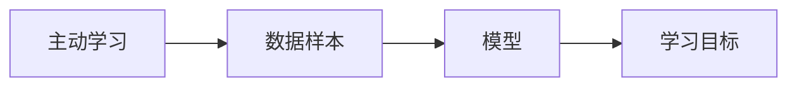
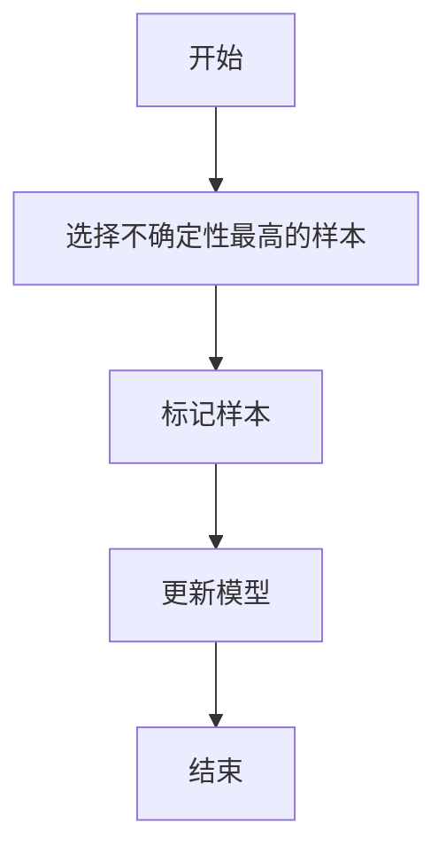
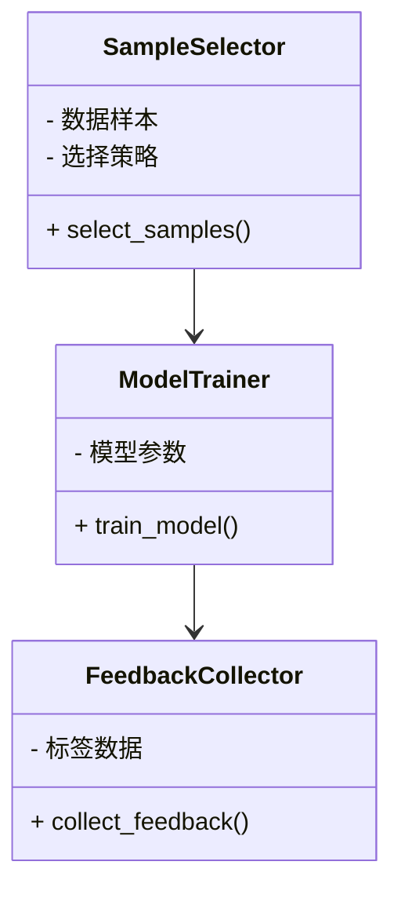
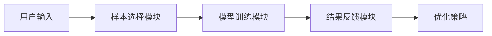

                 


# 开发AI Agent的主动学习能力：优化学习效率

> 关键词：主动学习，AI Agent，机器学习，优化算法，数据效率

> 摘要：  
本文深入探讨了AI Agent的主动学习能力，分析了主动学习的基本原理、核心算法及其在优化学习效率中的应用。通过系统化的理论分析和实践案例，结合图表和代码示例，详细讲解了如何设计和实现高效的主动学习系统，为AI Agent的开发提供了理论支持和实践指导。

---

## 第一部分: AI Agent主动学习能力的背景与概念

### 第1章: 主动学习与AI Agent的背景介绍

#### 1.1 问题背景
主动学习是一种半监督学习方法，介于监督学习和无监督学习之间。AI Agent需要通过与环境交互，主动选择最具信息量的样本进行学习，从而提高学习效率和准确性。

#### 1.2 问题描述
传统监督学习需要大量标注数据，成本高且效率低。AI Agent在复杂环境中需要实时决策，必须具备高效的学习能力，而主动学习正是解决这一问题的关键。

#### 1.3 问题解决
通过主动选择关键样本，AI Agent可以显著减少所需标注数据量，同时提高模型性能。主动学习的核心在于优化样本选择策略，最大化信息 gain。

#### 1.4 边界与外延
主动学习适用于样本标注成本高、数据量有限的场景。其边界包括数据分布、模型假设和选择策略的局限性。与强化学习的区别在于，主动学习关注样本选择，强化学习关注动作选择。

#### 1.5 概念结构与核心要素
主动学习涉及模型、数据、策略三者之间的动态关系。核心要素包括不确定性评估、样本选择策略和模型更新机制。

---

## 第二部分: 主动学习的核心概念与联系

### 第2章: 主动学习的原理与方法

#### 2.1 核心概念原理
主动学习基于不确定性度量，通过选择最具代表性的样本，逐步优化模型性能。核心思想是通过迭代学习减少不确定性区域。

#### 2.2 核心概念对比表
| 比较项 | 监督学习 | 无监督学习 | 主动学习 |
|--------|----------|------------|----------|
| 数据需求 | 需要标注 | 不需要标注 | 部分标注 |
| 学习效率 | 高       | 低         | 中等     |
| 适用场景 | 简单任务 | 高维数据   | 数据稀疏 |

#### 2.3 ER实体关系图


---

## 第三部分: 主动学习的算法原理

### 第3章: 主动学习算法的数学模型

#### 3.1 算法原理
主动学习的核心算法包括不确定性抽样、多样性抽样和最小化风险抽样。不确定性抽样通过熵值衡量样本的不确定性，选择信息量最大的样本。

#### 3.2 算法流程图


#### 3.3 数学模型
不确定性抽样的计算公式为：
$$ \text{entropy}(x) = -\sum_{i=1}^{n} p_i \log p_i $$
其中，\( p_i \) 是样本 \( x \) 的第 \( i \) 个类别的概率。

---

## 第四部分: 系统分析与架构设计方案

### 第4章: AI Agent主动学习系统的架构设计

#### 4.1 问题场景介绍
AI Agent需要在动态环境中实时学习，通过主动选择样本优化模型性能。应用场景包括图像分类、自然语言处理和推荐系统。

#### 4.2 系统功能设计
系统功能包括样本选择、模型训练和结果反馈三个模块。

#### 4.3 领域模型类图


#### 4.4 系统架构图


---

## 第五部分: 项目实战

### 第5章: 实现AI Agent的主动学习系统

#### 5.1 环境安装
安装必要的Python库，如numpy、scikit-learn和tensorflow。

#### 5.2 核心代码实现
```python
import numpy as np
from sklearn.metrics import entropy

def select_samples(X, model, threshold=0.5):
    predictions = model.predict(X)
    uncertainties = entropy(predictions)
    selected_indices = np.where(uncertainties > threshold)[0]
    return selected_indices
```

#### 5.3 代码解读与分析
该代码实现了一个简单的不确定性抽样算法，根据模型预测的不确定性选择样本。`entropy`函数计算了每个样本的不确定性，超过阈值的样本将被选中。

#### 5.4 实际案例分析
以图像分类为例，通过迭代选择高不确定性样本，逐步优化模型性能。

#### 5.5 项目小结
通过实际案例，验证了主动学习算法的有效性，展示了如何通过样本选择策略优化学习效率。

---

## 第六部分: 最佳实践与总结

### 第6章: 最佳实践与总结

#### 6.1 最佳实践
- 确定适用场景
- 选择合适的样本选择策略
- 定期更新模型
- 监控学习效果

#### 6.2 小结
主动学习是一种高效的半监督学习方法，能够显著减少标注数据量，提升模型性能。在AI Agent开发中，合理设计样本选择策略至关重要。

#### 6.3 注意事项
- 样本选择策略的局限性
- 模型更新的频率
- 数据分布的变化

#### 6.4 拓展阅读
推荐阅读相关论文和书籍，深入理解主动学习的理论和应用。

---

## 结语

通过本文的系统讲解和实践案例，读者可以全面了解AI Agent的主动学习能力及其优化方法。未来，随着技术的进步，主动学习将在更多领域发挥重要作用。

