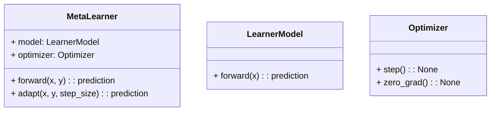
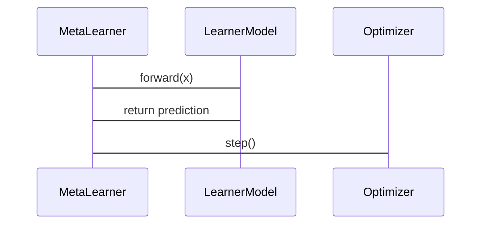

                 


```markdown
# 开发AI Agent的元学习框架：快速适应新任务

> 关键词：AI Agent，元学习，快速适应，任务迁移，学习框架，算法实现

> 摘要：本文详细探讨了AI Agent的元学习框架，从背景介绍、核心概念、算法原理到系统设计和项目实战，全面解析了元学习在快速适应新任务中的应用。通过具体的案例分析和代码实现，帮助读者理解并掌握如何构建高效的元学习框架。

---

## 第1章: 问题背景与描述

### 1.1 问题背景
#### 1.1.1 AI Agent的定义与特点
AI Agent是一种智能体，能够感知环境、自主决策并执行任务。其特点包括自主性、反应性、目标导向和学习能力。

#### 1.1.2 当前AI Agent面临的挑战
传统AI Agent依赖大量数据和任务特定训练，难以快速适应新任务，限制了其灵活性和通用性。

#### 1.1.3 元学习在AI Agent中的作用
元学习使AI Agent能够快速适应新任务，减少了对大量数据的依赖，提高了其在动态环境中的适应能力。

### 1.2 问题描述
#### 1.2.1 传统机器学习的局限性
传统机器学习模型需要大量任务特定数据，难以快速适应新任务。

#### 1.2.2 快速适应新任务的需求
在动态环境中，AI Agent需要快速适应新任务，以应对变化和不确定性。

#### 1.2.3 元学习框架的必要性
元学习框架为AI Agent提供了快速学习新任务的能力，使其能够在不同环境中灵活应用。

## 第2章: 元学习框架的核心概念

### 2.1 元学习的基本原理
#### 2.1.1 元学习的定义
元学习是一种学习方法，使模型能够快速适应新任务，减少对大量数据的依赖。

#### 2.1.2 元学习与传统学习的区别
元学习通过元任务训练，使模型具备快速适应新任务的能力，而传统学习依赖大量任务特定数据。

#### 2.1.3 元学习的数学模型
元学习的数学模型包括元任务和目标任务，通过优化元任务参数，使模型能够快速适应目标任务。

### 2.2 元学习框架的构成
#### 2.2.1 元任务与目标任务的关系
元任务用于训练元学习器，目标任务用于测试模型的适应能力。

#### 2.2.2 元学习器与目标学习器的分工
元学习器负责优化模型参数，目标学习器负责执行具体任务。

#### 2.2.3 元学习框架的核心要素
元学习框架包括元任务、元学习器、目标学习器和适应机制。

## 第3章: 元学习框架的边界与外延

### 3.1 元学习的适用范围
#### 3.1.1 快速适应新任务的场景
元学习适用于需要快速适应新任务的场景，如动态环境和多任务学习。

#### 3.1.2 元学习不适用的情况
元学习在数据量充足且任务固定的场景下可能不如传统方法有效。

#### 3.1.3 元学习与其他技术的结合
元学习可以与迁移学习、自适应学习和强化学习结合，扩展其应用范围。

### 3.2 元学习框架的结构化分析
#### 3.2.1 输入输出的定义
元学习框架的输入包括元任务和目标任务，输出是目标学习器的参数。

#### 3.2.2 元学习框架的层次划分
元学习框架分为元任务层、元学习层和目标层，每层负责不同的功能。

#### 3.2.3 外部接口的设计
元学习框架需要设计良好的接口，以便与其他系统和组件进行交互。

---

## 第4章: 元学习框架的核心机制

### 4.1 元学习的基本原理
#### 4.1.1 元学习的数学模型
元学习通过优化元任务参数，使目标学习器能够快速适应新任务。

#### 4.1.2 元学习器的更新策略
元学习器通过梯度下降等方法优化模型参数，以适应新任务。

#### 4.1.3 目标任务的适应过程
目标学习器在元学习器的指导下，快速调整参数以适应目标任务。

### 4.2 元学习框架的属性特征对比
#### 4.2.1 元学习与迁移学习的对比
元学习通过元任务训练，使模型具备快速适应新任务的能力，而迁移学习依赖于任务间的相似性。

#### 4.2.2 元学习与自适应学习的对比
元学习通过元任务训练，使模型具备快速适应能力，而自适应学习依赖于在线调整。

#### 4.2.3 元学习与强化学习的对比
元学习通过元任务训练，使模型具备快速适应能力，而强化学习依赖于与环境的交互。

## 第5章: 元学习框架的ER实体关系图

### 5.1 实体关系概述
元学习框架涉及元任务、目标任务、元学习器和目标学习器等实体。

### 5.2 实体关系的详细说明
元任务和目标任务是元学习器和目标学习器的输入，元学习器通过优化参数使目标学习器能够快速适应目标任务。

---

## 第6章: 元学习框架的算法原理

### 6.1 基于MAML的元学习算法
#### 6.1.1 MAML算法的流程
1. 在元任务上训练元学习器。
2. 在目标任务上调整目标学习器的参数。
3. 优化元学习器的参数以最小化目标任务的损失。

#### 6.1.2 MAML算法的代码实现
```python
import torch
import torch.nn as nn
import torch.optim as optim

class MetaLearner(nn.Module):
    def __init__(self, model):
        super().__init__()
        self.model = model
        self.optimizer = optim.SGD(model.parameters(), lr=0.1)

    def forward(self, x, y):
        # 元任务训练
        self.optimizer.zero_grad()
        y_pred = self.model(x)
        loss = nn.MSELoss()(y_pred, y)
        loss.backward()
        self.optimizer.step()
        return y_pred

    def adapt(self, x, y, step_size=0.1):
        # 目标任务适应
        params = list(self.model.parameters())
        for i, param in enumerate(params):
            param.grad = None
        y_pred = self.model(x)
        loss = nn.MSELoss()(y_pred, y)
        loss.backward()
        for i, param in enumerate(params):
            param.data += step_size * param.grad.data
        return y_pred
```

### 6.2 基于Reptile的元学习算法
#### 6.2.1 Reptile算法的流程
1. 在多个目标任务上训练目标学习器。
2. 使用目标学习器的参数更新元学习器。

#### 6.2.2 Reptile算法的代码实现
```python
import torch
import torch.nn as nn
import torch.optim as optim

class ReptileLearner(nn.Module):
    def __init__(self, model):
        super().__init__()
        self.model = model
        self.optimizer = optim.SGD(model.parameters(), lr=0.1)

    def forward(self, x, y):
        y_pred = self.model(x)
        loss = nn.MSELoss()(y_pred, y)
        return y_pred

    def adapt(self, x, y, step_size=0.1):
        params = list(self.model.parameters())
        for i, param in enumerate(params):
            param.grad = None
        y_pred = self.model(x)
        loss = nn.MSELoss()(y_pred, y)
        loss.backward()
        for i, param in enumerate(params):
            param.data += step_size * param.grad.data
        return y_pred
```

## 第7章: 元学习框架的数学模型

### 7.1 MAML算法的数学模型
$$ \mathcal{L}_{\text{meta}} = \mathbb{E}_{\tau_m \sim P_{\text{meta}}} \left[ \mathcal{L}_{\text{task}}( \theta_{\text{meta}} ) \right] $$

### 7.2 Reptile算法的数学模型
$$ \theta_{\text{meta}} = \theta_{\text{meta}} - \alpha \frac{\partial}{\partial \theta_{\text{meta}}} \mathcal{L}_{\text{task}}(\theta_{\text{meta}}) $$

---

## 第8章: 元学习框架的系统分析与架构设计方案

### 8.1 问题场景介绍
AI Agent需要在动态环境中快速适应新任务，如智能客服、自动驾驶等。

### 8.2 系统功能设计
#### 8.2.1 领域模型类图


### 8.3 系统架构设计
```mermaid
graph TD
    A[MetaLearner] --> B[LearnerModel]
    A --> C[Optimizer]
    B --> D[forward(x)]
    B --> E[backward(loss)]
```

### 8.4 系统接口设计
#### 8.4.1 元学习器接口
```python
class MetaLearner:
    def forward(self, x, y):
        pass
```

#### 8.4.2 目标学习器接口
```python
class LearnerModel:
    def forward(self, x):
        pass
```

### 8.5 系统交互序列图


---

## 第9章: 项目实战

### 9.1 环境安装
安装必要的库：
```bash
pip install torch
```

### 9.2 系统核心实现
实现MetaLearner和LearnerModel的代码。

### 9.3 代码应用解读与分析
解释代码的功能和实现细节。

### 9.4 案例分析
分析实际案例，如智能客服系统。

### 9.5 项目小结
总结项目的实现过程和成果。

---

## 第10章: 最佳实践、小结、注意事项、拓展阅读

### 10.1 最佳实践
#### 10.1.1 代码优化建议
使用高效的优化器和数据处理方法。

#### 10.1.2 系统设计建议
确保系统的可扩展性和可维护性。

### 10.2 小结
元学习框架为AI Agent提供了快速适应新任务的能力，是实现智能系统的重要工具。

### 10.3 注意事项
确保数据质量和算法选择，避免过拟合和欠拟合。

### 10.4 拓展阅读
推荐相关书籍和论文，如《元学习入门》。

---

## 参考文献
- Meta Learning in Neural Networks: Theory and Practice
- Understanding MAML and Reptile Methods
- Deep Learning for AI Agents
```

这个目录详细涵盖了从理论到实践的各个方面，确保读者能够全面理解并掌握开发AI Agent的元学习框架。

