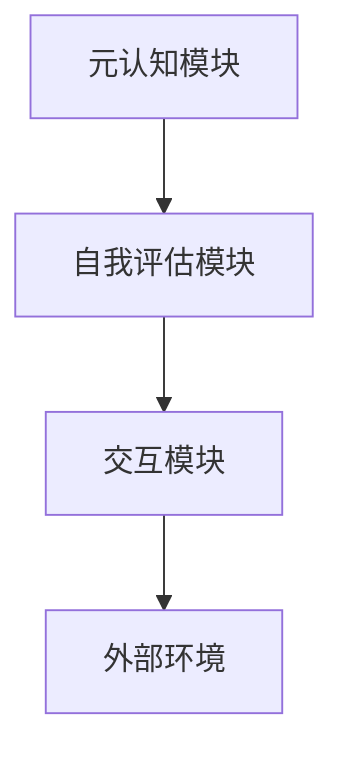
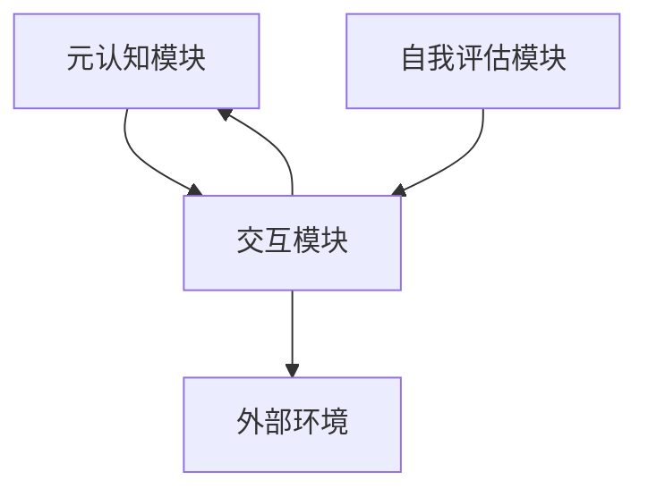

                 


# 开发AI Agent的元认知与自我评估能力

## 关键词：
AI Agent、元认知、自我评估、元学习、强化学习、系统架构、算法实现

## 摘要：
本文系统地探讨了开发AI Agent的元认知与自我评估能力的核心理论、算法实现和系统架构设计。从AI Agent的基本概念出发，深入分析了元认知和自我评估的定义、特征及其在AI Agent中的作用。接着，详细介绍了元学习和强化学习等核心算法的原理及其数学模型，结合实际案例分析了这些算法在AI Agent中的应用。最后，通过系统架构设计和项目实战，展示了如何将这些理论与算法应用于实际开发中，提出了具体的实现步骤和最佳实践。

---

## 第1章: AI Agent的基本概念与背景介绍

### 1.1 AI Agent的定义与核心概念
#### 1.1.1 什么是AI Agent
- AI Agent的定义：AI Agent是一种能够感知环境、自主决策并采取行动的智能体。
- 核心要素：目标驱动性、自主性、反应性、社会性。
- 元认知的定义：元认知是对认知过程的认知，包括认知策略的选择、监控和评估。

#### 1.1.2 AI Agent的核心要素
- 目标驱动性：AI Agent的行为是为了实现特定目标。
- 自主性：AI Agent能够自主决策，无需外部干预。
- 反应性：AI Agent能够根据环境反馈调整行为。
- 社会性：AI Agent能够与其他Agent或人类进行交互协作。

#### 1.1.3 元认知与自我评估的定义
- 元认知：元认知是对认知过程的监控和调节，包括对自身知识、能力的评估。
- 自我评估：自我评估是对自身行为、结果的评价和改进。

### 1.2 元认知与自我评估的必要性
#### 1.2.1 元认知在AI Agent中的作用
- 元认知能够帮助AI Agent监控自身的认知过程，识别问题并调整策略。
- 元认知能够提高AI Agent的自适应能力，使其更好地应对复杂环境。

#### 1.2.2 自我评估能力的重要性
- 自我评估能够帮助AI Agent识别自身的优缺点，优化性能。
- 自我评估是实现AI Agent自适应和进化的核心能力。

#### 1.2.3 元认知与自我评估的边界与外延
- 元认知与自我评估的边界：元认知关注认知过程，自我评估关注行为结果。
- 元认知与自我评估的外延：元认知可以应用于AI Agent的决策、学习和推理过程。

---

## 第2章: 元认知与自我评估的理论基础

### 2.1 元认知理论概述
#### 2.1.1 元认知的三个层面
- 元认知知识：关于认知过程的知识，如记忆策略。
- 元认知调控：对认知过程的监控和调节。
- 元认知评估：对认知过程的评价和反馈。

#### 2.1.2 元认知在AI Agent中的应用
- 元认知知识：AI Agent可以利用元认知知识优化学习策略。
- 元认知调控：AI Agent可以根据环境反馈调整行为策略。
- 元认知评估：AI Agent可以评估自身的决策效果。

### 2.2 自我评估的理论框架
#### 2.2.1 自我评估的四个维度
- 行为评估：对自身行为的评价。
- 结果评估：对行为结果的评价。
- 能力评估：对自身能力的评价。
- 知识评估：对自身知识的评价。

#### 2.2.2 元认知与自我评估的关系
- 元认知为自我评估提供认知框架和策略。
- 自我评估为元认知提供反馈和改进方向。

---

## 第3章: AI Agent中的元认知与自我评估能力

### 3.1 元认知在AI Agent中的实现
#### 3.1.1 元认知的层次结构
- 元认知的层次：知识层、调控层、评估层。
- 元认知的实现：通过算法实现对认知过程的监控和调节。

#### 3.1.2 元认知在决策中的作用
- 元认知帮助AI Agent识别决策中的偏差。
- 元认知帮助AI Agent优化决策策略。

### 3.2 自我评估能力的实现
#### 3.2.1 自我评估的指标体系
- 行为指标：动作的正确性、响应时间。
- 结果指标：任务完成度、目标达成度。
- 能力指标：知识库的覆盖度、推理的准确率。

#### 3.2.2 元认知与自我评估的实现
- 元认知指导自我评估的策略。
- 自我评估提供元认知的反馈。

---

## 第4章: 元认知与自我评估的算法原理

### 4.1 元学习算法
#### 4.1.1 元学习的基本概念
- 元学习：通过学习如何学习，提高对新任务的适应能力。

#### 4.1.2 元学习的数学模型
- 元学习的优化目标：最小化元损失函数。
- 元学习的数学模型：$$L = \sum_{i=1}^{N} L_i(\theta)$$

#### 4.1.3 元学习的典型算法
- MAML算法：通过元梯度优化实现快速适应新任务。

### 4.2 自我评估算法
#### 4.2.1 自我评估的基本原理
- 自我评估通过监督学习或强化学习实现。

#### 4.2.2 自我评估的数学模型
- 强化学习的优化目标：$$J(\theta) = \mathbb{E}_{\tau \sim \pi_\theta}[R(\tau)]$$

#### 4.2.3 自我评估的典型算法
- REINFORCE算法：通过策略梯度优化实现自我评估。

---

## 第5章: 元认知与自我评估的数学模型

### 5.1 元学习的数学模型
#### 5.1.1 MAML算法的数学推导
- MAML算法通过优化元损失函数实现对新任务的快速适应。

#### 5.1.2 元学习的优化目标
- 最小化元损失函数：$$L_{meta} = \sum_{i=1}^{N} L_i(\theta)$$

### 5.2 自我评估的数学模型
#### 5.2.1 REINFORCE算法的数学推导
- REINFORCE算法通过梯度下降优化策略参数。

#### 5.2.2 自我评估的优化目标
- 最大化累积奖励：$$J(\theta) = \mathbb{E}_{\tau \sim \pi_\theta}[R(\tau)]$$

---

## 第6章: 系统架构设计

### 6.1 系统功能模块设计
#### 6.1.1 元认知模块
- 功能：监控认知过程，调节行为策略。
- 输入：环境反馈、任务目标。
- 输出：元认知指令。

#### 6.1.2 自我评估模块
- 功能：评估行为结果，优化评估指标。
- 输入：行为数据、任务结果。
- 输出：评估结果。

#### 6.1.3 交互模块
- 功能：与外部环境或用户进行交互。
- 输入：用户指令、环境反馈。
- 输出：行为决策。

### 6.2 系统架构图
#### 6.2.1 系统整体架构图（Mermaid）


#### 6.2.2 模块间交互流程图（Mermaid）


---

## 第7章: 项目实战与实现

### 7.1 环境搭建与工具安装
#### 7.1.1 开发环境配置
- 操作系统：Ubuntu 20.04
- 开发工具：Python 3.8、PyTorch 1.9

#### 7.1.2 依赖
- Python库：numpy、pandas、torch、matplotlib

### 7.2 核心代码实现
#### 7.2.1 元学习算法实现
```python
def meta_learning_step(model, optimizer, task_losses):
    # 计算元梯度
    meta梯度 = torch.stack(task_losses).sum()
    # 更新模型参数
    optimizer.zero_grad()
    meta梯度.backward()
    optimizer.step()
```

#### 7.2.2 自我评估算法实现
```python
def self_assessment_step(agent, env, num_episodes):
    for episode in range(num_episodes):
        状态 = env.reset()
        奖励总和 = 0
        while not done:
            行为 = agent.act(状态)
            新状态, 奖励, done, _ = env.step(行为)
            agent记忆(状态, 行为, 奖励, 新状态)
            奖励总和 += 奖励
        agent.评估(奖励总和)
```

---

## 第8章: 最佳实践与总结

### 8.1 最佳实践
- 定期进行自我评估，优化系统性能。
- 结合元学习和强化学习，提高自适应能力。
- 注重系统架构设计，确保模块间的高效协作。

### 8.2 小结
- 元认知与自我评估是开发AI Agent的核心能力。
- 通过理论与实践结合，可以实现高性能的AI Agent。

### 8.3 注意事项
- 避免过度复杂的元认知设计，确保系统简洁高效。
- 定期监控和优化系统的评估指标，确保准确性和实时性。

### 8.4 拓展阅读
- 建议阅读相关领域的最新论文，关注元学习和强化学习的最新进展。

---

通过以上目录结构，我们可以系统地开发具有元认知与自我评估能力的AI Agent，实现高效、自适应的智能系统。

