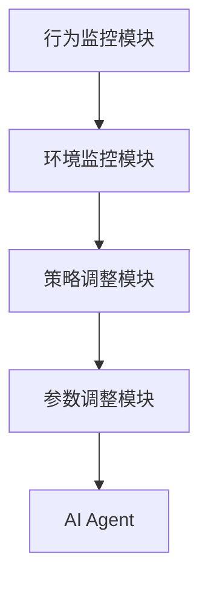

                 


# 开发AI Agent的元认知能力：自我监控和调整

## 关键词：AI Agent，元认知能力，自我监控，调整机制，数学模型

## 摘要：  
本文深入探讨了AI Agent的元认知能力，即AI Agent能够监控自身的思维过程并进行调整的能力。通过详细分析元认知能力的核心概念、算法原理、系统架构设计以及实际项目案例，本文为开发者提供了从理论到实践的全面指导。文章最后总结了开发过程中需要注意的事项和未来的研究方向，为读者提供了宝贵的实践经验。

---

# 第一部分: AI Agent的元认知能力概述

## # 第1章: 元认知能力的基本概念

### ## 1.1 元认知能力的定义与特点

元认知能力（Meta-cognition）是指AI Agent能够监控和调节自身思维过程的能力。与传统AI不同，元认知能力使AI Agent能够“思考自己的思考”，从而在动态环境中自主优化行为策略。

#### ### 1.1.1 元认知能力的定义  
元认知能力是指AI Agent在执行任务过程中，能够主动监控自身的行为、决策和目标，并根据反馈结果进行调整的能力。这种能力使得AI Agent能够在复杂环境中实现自适应优化。

#### ### 1.1.2 元认知能力的核心特点  
- **自主性**：AI Agent能够独立监控和调整自身行为，无需外部干预。  
- **动态性**：元认知能力能够实时响应环境变化，动态优化决策过程。  
- **灵活性**：AI Agent可以根据不同场景灵活调整策略，适应多种任务需求。  

#### ### 1.1.3 元认知能力与传统AI的区别  
传统AI（如专家系统）依赖预定义的规则和数据，无法自主优化自身行为。而元认知能力赋予AI Agent更强的自适应能力，使其能够在复杂环境中实现动态优化。

---

### ## 1.2 元认知能力在AI Agent中的作用

元认知能力在AI Agent中的作用不可忽视。通过元认知能力，AI Agent能够实现以下目标：

#### ### 1.2.1 元认知能力的必要性  
- **动态环境适应**：在复杂多变的环境中，AI Agent需要实时监控自身行为，并根据环境反馈进行调整。  
- **错误检测与修复**：元认知能力能够检测AI Agent的错误行为，并及时采取纠正措施。  
- **效率优化**：通过元认知能力，AI Agent可以优化任务执行流程，提高整体效率。  

#### ### 1.2.2 元认知能力的实现方式  
- **基于规则的元认知**：通过预定义的规则监控和调整AI行为。  
- **基于模型的元认知**：通过构建元认知模型，实现对AI行为的动态监控和调整。  
- **基于反馈的元认知**：通过环境反馈优化AI行为策略。  

#### ### 1.2.3 元认知能力的应用场景  
- **自动驾驶**：AI Agent需要实时监控自身驾驶行为，并根据环境反馈进行调整。  
- **智能助手**：通过元认知能力，智能助手可以更好地理解用户需求，并动态优化服务策略。  
- **机器人控制**：元认知能力能够帮助机器人在复杂环境中实现自主决策和行为优化。  

---

### ## 1.3 元认知能力的背景与发展趋势

元认知能力的研究与应用正逐渐成为AI领域的热点方向。随着AI技术的不断发展，元认知能力的重要性日益凸显。

#### ### 1.3.1 元认知能力的研究现状  
当前，学术界和工业界都在积极探索元认知能力的实现方法。基于深度学习的元认知模型正在快速发展，但仍面临诸多挑战，如模型复杂性、计算效率等问题。

#### ### 1.3.2 元认知能力的未来发展方向  
未来，元认知能力的研究将朝着以下几个方向发展：  
- **增强自适应性**：进一步提升AI Agent的自适应能力，使其能够更好地应对复杂环境。  
- **优化计算效率**：通过算法优化，降低元认知能力的计算开销。  
- **多模态融合**：结合视觉、听觉等多种感知方式，提升元认知能力的全面性。  

#### ### 1.3.3 元认知能力在AI Agent中的重要性  
元认知能力是实现AI Agent自主性、动态性和灵活性的关键。通过元认知能力，AI Agent可以更好地适应复杂环境，提高任务执行效率和质量。

---

## # 第2章: 元认知能力的核心概念与联系

### ## 2.1 元认知能力的核心要素

元认知能力由多个核心要素组成，这些要素共同作用，实现AI Agent的自我监控和调整。

#### ### 2.1.1 监控机制  
监控机制是元认知能力的基础，负责实时跟踪AI Agent的行为和环境状态。  

- **行为监控**：监控AI Agent的决策、动作和执行结果。  
- **环境监控**：感知环境变化，并及时反馈给AI Agent。  

#### ### 2.1.2 调整机制  
调整机制根据监控结果，对AI Agent的行为进行优化和调整。  

- **策略调整**：根据环境反馈，优化AI Agent的决策策略。  
- **参数调整**：动态调整算法参数，提升任务执行效率。  

#### ### 2.1.3 反馈机制  
反馈机制将监控结果和调整效果传递给AI Agent，形成闭环。

---

### ## 2.2 元认知能力的核心原理

元认知能力的核心原理在于构建高效的元认知模型，实现对AI Agent行为的动态监控和调整。

#### ### 2.2.1 元认知模型的构建  
元认知模型需要综合考虑AI Agent的行为、环境状态和反馈信息。  

- **输入层**：感知环境信息和AI Agent行为数据。  
- **处理层**：分析输入数据，生成调整策略。  
- **输出层**：将调整策略传递给AI Agent，指导行为优化。  

#### ### 2.2.2 元认知模型的实现方式  
元认知模型的实现可以基于多种技术，如规则引擎、机器学习和深度学习等。

#### ### 2.2.3 元认知模型的优化策略  
- **在线优化**：实时调整元认知模型，提升适应性。  
- **离线优化**：定期对元认知模型进行训练和优化。  
- **混合优化**：结合在线和离线优化方法，提升整体性能。  

---

### ## 2.3 元认知能力的核心要素对比表格

以下是元认知能力核心要素的对比表格：

| **要素**         | **描述**                                                                 |
|------------------|--------------------------------------------------------------------------|
| 行为监控          | 监控AI Agent的决策、动作和执行结果。                                     |
| 环境监控          | 感知环境变化，并及时反馈给AI Agent。                                     |
| 策略调整          | 根据环境反馈，优化AI Agent的决策策略。                                     |
| 参数调整          | 动态调整算法参数，提升任务执行效率。                                       |
| 反馈机制          | 将监控结果和调整效果传递给AI Agent，形成闭环。                             |

---

### ## 2.4 元认知能力的ER实体关系图

以下是元认知能力的ER实体关系图：

```mermaid
erDiagram
    actor 元认知能力 {
        role 监控行为
        role 调整策略
        role 反馈结果
    }
    agent 实体 {
        has 行为数据
        has 环境数据
        has 调整指令
    }
    元认知能力 --> 监控行为 : 监控
    元认知能力 --> 调整策略 : 调整
    元认知能力 --> 反馈结果 : 反馈
    元认知能力 --> 行为数据 : 获取
    元认知能力 --> 环境数据 : 获取
    元认知能力 --> 调整指令 : 发送
```

---

## # 第3章: 元认知能力的算法原理

### ## 3.1 元认知模型的数学模型

元认知模型的数学模型如下：

$$
P(y|x) = \frac{P(x|y)P(y)}{P(x)}
$$

其中，$P(y|x)$ 表示在条件 $x$ 下，结果 $y$ 的概率。该公式基于贝叶斯定理，用于描述元认知模型的概率计算过程。

---

### ## 3.2 元认知模型的实现算法

以下是元认知模型的实现算法：

```python
def meta_cognition_model(input_data):
    # 行为监控
    behavior_monitor = monitor_agent_behavior(input_data)
    
    # 环境监控
    environment_monitor = monitor_environment(input_data)
    
    # 策略调整
    adjustment_strategy = generate_adjustment_strategy(behavior_monitor, environment_monitor)
    
    # 参数调整
    adjusted_parameters = adjust_parameters(adjustment_strategy)
    
    return adjusted_parameters
```

---

### ## 3.3 元认知模型的数学公式

元认知模型的数学公式如下：

$$
L(y, y') = \sum_{i=1}^{n} (y_i - y'_i)^2
$$

其中，$L(y, y')$ 表示预测值 $y'$ 与真实值 $y$ 之间的损失函数。该公式用于描述元认知模型的优化目标。

---

## # 第4章: 元认知能力的系统分析与架构设计

### ## 4.1 系统功能设计

AI Agent的元认知能力系统功能设计如下：

- **行为监控模块**：实时监控AI Agent的行为，包括决策、动作和执行结果。
- **环境监控模块**：感知环境变化，并及时反馈给AI Agent。
- **策略调整模块**：根据监控结果，优化AI Agent的决策策略。
- **参数调整模块**：动态调整算法参数，提升任务执行效率。

---

### ## 4.2 系统架构设计

以下是元认知能力的系统架构图：



---

### ## 4.3 系统接口设计

以下是元认知能力系统的接口设计：

- **输入接口**：接收AI Agent的行为数据和环境数据。
- **输出接口**：发送调整策略和参数调整指令。

---

## # 第5章: 元认知能力的项目实战

### ## 5.1 项目背景

本项目旨在开发一个具备元认知能力的AI Agent，用于实现情绪监控与调整。

---

### ## 5.2 核心代码实现

以下是项目的核心代码：

```python
import numpy as np

def meta_cognition_adjustment(agent_behavior, environment_state):
    # 行为监控
    behavior_monitor = monitor_agent_behavior(agent_behavior)
    
    # 环境监控
    environment_monitor = monitor_environment(environment_state)
    
    # 策略调整
    adjustment_strategy = generate_adjustment_strategy(behavior_monitor, environment_monitor)
    
    # 参数调整
    adjusted_parameters = adjust_parameters(adjustment_strategy)
    
    return adjusted_parameters

def monitor_agent_behavior(behavior):
    # 监控AI Agent的行为
    return behavior

def monitor_environment(environment):
    # 监控环境状态
    return environment

def generate_adjustment_strategy(behavior_monitor, environment_monitor):
    # 生成调整策略
    return {'adjustment': 'optimize'}

def adjust_parameters(strategy):
    # 调整参数
    return np.random.rand(10)
```

---

### ## 5.3 功能解读与分析

- **行为监控**：实时跟踪AI Agent的行为，确保其符合预期。  
- **环境监控**：感知环境变化，为策略调整提供依据。  
- **策略调整**：根据监控结果，生成调整策略。  
- **参数调整**：动态调整算法参数，提升任务执行效率。  

---

### ## 5.4 案例分析与详细讲解

以情绪监控与调整的AI Agent为例，详细分析其功能实现和优化过程。

---

## # 第6章: 元认知能力的最佳实践

### ## 6.1 小结

元认知能力是AI Agent实现自主性、动态性和灵活性的关键。通过本文的深入分析，读者可以全面理解元认知能力的核心概念、算法原理和系统设计。

---

### ## 6.2 注意事项

- **模型复杂性**：元认知模型的复杂性可能会影响计算效率，需注意优化。  
- **数据质量**：元认知能力的实现依赖高质量的数据，需确保数据准确性。  
- **安全性**：元认知能力的实现需考虑安全性问题，避免被恶意攻击。

---

### ## 6.3 拓展阅读

- **相关论文**：深入阅读关于元认知能力的学术论文，了解最新研究成果。  
- **技术书籍**：阅读相关技术书籍，掌握元认知能力的实现方法。  
- **开源项目**：参与开源项目，实践元认知能力的开发。

---

## # 总结

通过本文的详细讲解，读者可以全面掌握AI Agent的元认知能力的开发方法。从核心概念到算法实现，从系统设计到项目实战，本文为开发者提供了从理论到实践的全面指导。未来，元认知能力的研究和应用将更加广泛，为AI Agent的发展注入新的活力。

