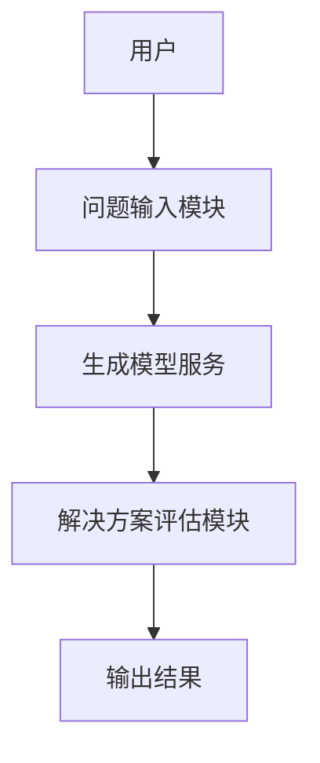

                 


# 《开发AI Agent的创造性问题解决能力》

## 关键词：AI Agent, 创造性问题解决, 生成模型, 系统架构设计, 创意算法

## 摘要：  
本文详细探讨了开发具备创造性问题解决能力的AI Agent的关键技术与方法。通过分析创造性思维的原理、创造性问题解决能力的核心算法，以及系统架构设计，本文为读者提供了一套系统的方法论，帮助AI Agent在复杂问题中展现创造性思维。文章内容涵盖从理论基础到实际应用的完整流程，包括环境配置、算法实现、系统设计等关键环节。

---

# 第三章: 创造性问题解决能力的核心算法

## 3.1 神经网络基础

### 3.1.1 神经网络的基本结构  
神经网络是AI Agent实现创造性问题解决能力的核心技术之一。其基本结构包括输入层、隐藏层和输出层。通过非线性激活函数（如ReLU、sigmoid等），神经网络能够学习复杂的特征表示。

$$
\text{输入层} \rightarrow \text{隐藏层} \rightarrow \text{输出层}
$$

### 3.1.2 神经网络的训练过程  
神经网络的训练通常采用反向传播算法（Backpropagation）和梯度下降（Gradient Descent）。损失函数（如交叉熵损失）用于衡量预测值与真实值的差距，通过优化器（如Adam）更新权重。

$$
L = -\sum y_i \log p(y_i) + (1 - y_i)\log (1 - p(y_i))
$$

### 3.1.3 神经网络的优化方法  
为提高神经网络的性能，常用的方法包括 dropout、批量归一化（Batch Normalization）和学习率衰减。这些技术有助于防止过拟合，加速收敛。

---

## 3.2 基于生成模型的创造性问题解决

### 3.2.1 变量自动编码器（VAE）  
变量子自动编码器通过最大化似然和正则化KL散度来生成多样化的样本。其概率图模型如下：


### 3.2.2 生成对抗网络（GAN）  
生成对抗网络由生成器和判别器组成。生成器尝试生成逼真的样本，而判别器试图区分生成样本和真实样本。

$$
\min_G \max_D \mathbb{E}_{x \sim p_{\text{data}}}[\log D(x)] + \mathbb{E}_{z \sim p_z}[ \log(1 - D(G(z)))]
$$

### 3.2.3 图像生成模型（如Diffusion）  
扩散模型通过逐步添加噪声并逐步去除噪声来生成高质量图像。其数学模型包括正向过程（添加噪声）和反向过程（去除噪声）。

$$
q(x_{t-1}|x_t) = \mathcal{N}(x_{t-1}|\mu_\theta(x_t, t), \sigma_\theta(x_t, t))
$$

---

## 3.3 算法的数学模型与公式

### 3.3.1 神经网络的数学表达  
神经网络的输出层可以通过以下公式计算：

$$
y = \sigma(Wx + b)
$$

其中，$\sigma$是非线性激活函数，$W$是权重矩阵，$b$是偏置项。

### 3.3.2 损失函数的定义与计算  
交叉熵损失函数用于分类任务：

$$
L = -\sum_{i=1}^{n} y_i \log p_i + (1 - y_i) \log (1 - p_i)
$$

其中，$y_i$是真实标签，$p_i$是模型预测概率。

### 3.3.3 梯度下降算法的实现  
梯度下降算法通过以下步骤更新权重：

$$
W := W - \eta \frac{\partial L}{\partial W}
$$

其中，$\eta$是学习率。

---

## 3.4 本章小结  
本章详细介绍了神经网络和生成模型的核心算法，包括VAE、GAN和Diffusion模型。这些算法为AI Agent的创造性问题解决提供了强大的生成能力。通过数学公式和模型结构的分析，读者可以更好地理解这些算法的工作原理。

---

# 第四章: 创造性问题解决能力的系统架构设计

## 4.1 系统功能设计

### 4.1.1 问题输入模块  
问题输入模块接收用户输入的问题描述，并将其转化为模型可处理的形式。

### 4.1.2 解决方案生成模块  
解决方案生成模块基于预训练的生成模型（如GAN或Diffusion），生成多样化的解决方案。

### 4.1.3 解决方案评估模块  
解决方案评估模块通过预定义的评估指标（如BLEU、ROUGE）对生成的解决方案进行打分，筛选出最优解。

---

## 4.2 系统架构设计

### 4.2.1 分层架构设计  
分层架构将系统划分为数据层、算法层和应用层，便于模块化开发和维护。

### 4.2.2 微服务架构设计  
微服务架构将系统功能拆分为独立的服务（如问题输入服务、生成模型服务），通过API进行交互。

### 4.2.3 可扩展性设计  
系统架构设计考虑了扩展性，支持动态添加新的生成模型和评估指标。

---

## 4.3 系统接口设计

### 4.3.1 输入接口定义  
输入接口接收JSON格式的请求：

```json
{
  "problem": "如何优化这个算法？",
  "parameters": { "max_length": 500 }
}
```

### 4.3.2 输出接口定义  
输出接口返回JSON格式的响应：

```json
{
  "solutions": ["解决方案1", "解决方案2", "解决方案3"],
  "scores": [0.85, 0.75, 0.90]
}
```

### 4.3.3 API设计规范  
API采用RESTful风格，支持GET和POST请求，使用JWT进行身份验证。

---

## 4.4 系统交互设计

### 4.4.1 交互流程图  
系统交互流程图如下：



---

## 4.5 本章小结  
本章详细描述了系统架构设计，包括功能模块、架构风格、接口定义和交互流程。通过合理的架构设计，系统能够高效地实现创造性问题解决能力。

---

# 第五章: 项目实战

## 5.1 环境配置

### 5.1.1 安装依赖  
安装必要的库：

```bash
pip install tensorflow-gpu torch transformers
```

### 5.1.2 配置GPU  
确保NVIDIA显卡驱动和CUDA环境已安装，并设置GPU可见性。

---

## 5.2 核心实现

### 5.2.1 生成模型实现  
实现一个简单的生成模型（如GAN）：

```python
class Generator(nn.Module):
    def __init__(self, latent_dim, img_size):
        super(Generator, self).__init__()
        self.fc = nn.Linear(latent_dim, 128*128*128)
        self.conv = nn.Conv3d(128, 3, kernel_size=3, stride=1, padding=1)
    
    def forward(self, x):
        x = self.fc(x).view(-1, 128, 128, 128)
        x = self.conv(x)
        return x
```

### 5.2.2 解决方案评估实现  
实现一个基于BLEU的评估函数：

```python
def bleu_score(candidate, references):
    # 计算BLEU分数
    pass
```

---

## 5.3 案例分析

### 5.3.1 案例背景  
假设我们需要解决一个图像生成问题，目标是生成高质量的图像。

### 5.3.2 实现过程  
训练GAN模型，分别训练生成器和判别器，调整超参数以提高生成质量。

### 5.3.3 结果分析  
通过生成的图像质量评估模型的性能，分析GAN的优势和局限性。

---

## 5.4 项目小结  
本章通过实际案例展示了如何配置环境、实现核心算法以及评估系统性能。读者可以通过这些代码和案例快速上手，开发具备创造性问题解决能力的AI Agent。

---

# 第六章: 总结与展望

## 6.1 本章总结  
本文系统地探讨了AI Agent创造性问题解决能力的开发方法，包括算法原理、系统架构设计和项目实战。通过理论与实践的结合，为读者提供了一套完整的开发框架。

## 6.2 未来展望  
未来的研究方向包括更高效的生成模型、多模态问题解决能力以及人机协作的优化。这些方向将推动AI Agent在创造性问题解决领域的发展。

---

## 关键词：AI Agent, 创造性问题解决, 生成模型, 系统架构设计, 创意算法

---

通过本文的系统讲解，读者可以全面理解并掌握开发AI Agent创造性问题解决能力的核心技术与方法。

