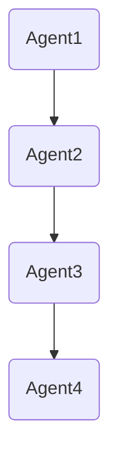
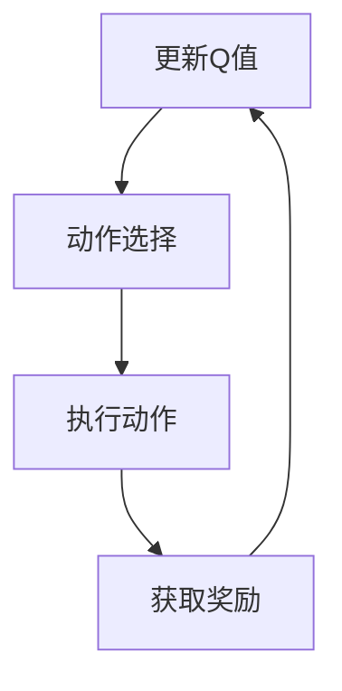
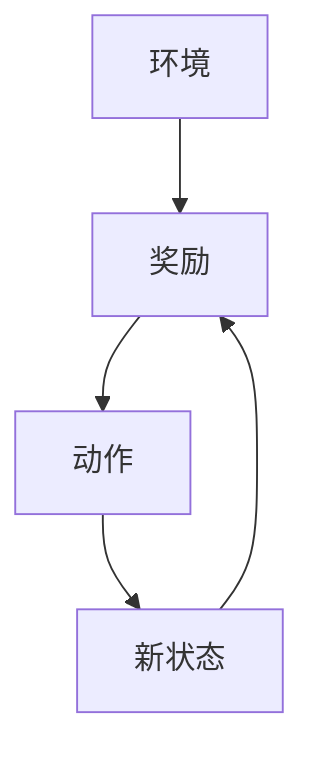
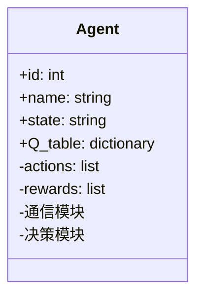
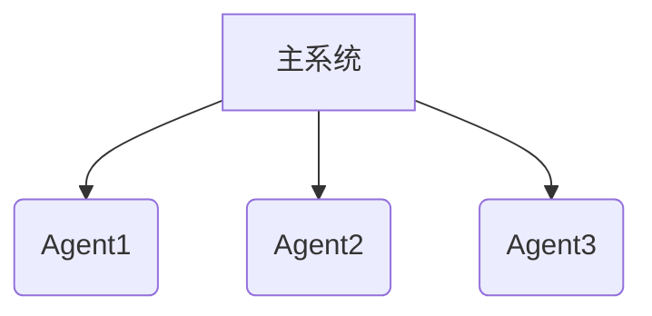

                 


# 开发AI Agent的多智能体协作学习系统

## 关键词：AI Agent，多智能体协作学习，分布式算法，机器学习，强化学习，系统架构

## 摘要：本文系统地介绍了AI Agent和多智能体协作学习的基本概念，深入分析了多智能体协作学习系统的协作机制，详细讲解了相关算法原理，提供了系统架构设计方案，并通过实际案例分析，帮助读者掌握开发AI Agent的多智能体协作学习系统的方法。

---

## 第一章：AI Agent与多智能体协作学习系统概述

### 1.1 AI Agent的基本概念

#### 1.1.1 什么是AI Agent
AI Agent（人工智能代理）是指能够感知环境、做出决策并采取行动以实现目标的智能实体。AI Agent可以是软件程序、机器人或其他智能系统，能够执行复杂任务。

#### 1.1.2 AI Agent的核心特征
- **自主性**：能够自主决策，无需外部干预。
- **反应性**：能够实时感知环境并做出响应。
- **目标导向**：以明确的目标为导向，优化决策。
- **学习能力**：通过经验改进性能。

#### 1.1.3 AI Agent的应用场景
AI Agent广泛应用于自动驾驶、智能助手、机器人控制等领域。

### 1.2 多智能体协作学习系统

#### 1.2.1 多智能体协作学习的定义
多智能体协作学习系统是指多个AI Agent协同工作，通过通信和协作完成复杂任务的学习系统。

#### 1.2.2 多智能体协作学习的核心要素
- **协作性**：多个Agent协同工作，共同完成任务。
- **通信机制**：Agent之间的信息交流方式。
- **学习机制**：通过经验优化协作策略。

#### 1.2.3 多智能体协作学习的边界与外延
- **边界**：仅限于多个AI Agent的协作，不涉及单个Agent的独立学习。
- **外延**：扩展到分布式系统、分布式计算等领域。

### 1.3 问题背景与问题描述

#### 1.3.1 当前AI Agent协作学习的痛点
- **信息孤岛**：各个Agent独立决策，缺乏协作。
- **资源浪费**：重复计算，效率低下。

#### 1.3.2 多智能体协作学习系统的必要性
- **提高效率**：通过协作优化资源利用。
- **解决复杂问题**：单个Agent难以完成的任务可以通过协作完成。

#### 1.3.3 问题解决的思路与目标
- **思路**：构建通信机制，实现信息共享和协作决策。
- **目标**：设计高效的协作学习算法，提升系统性能。

---

## 第二章：多智能体协作学习系统的核心概念与联系

### 2.1 多智能体协作学习系统的概念结构

#### 2.1.1 实体关系分析
通过ER图展示系统中的实体及其关系，帮助理解系统的结构。

#### 2.1.2 系统架构图
展示系统的主要模块及其交互关系。

#### 2.1.3 核心要素的属性对比表
对比AI Agent和多智能体协作学习系统的核心属性，帮助理解两者差异。

| 属性 | AI Agent | 多智能体协作学习系统 |
|------|----------|---------------------|
| 核心目标 | 单独完成任务 | 协作完成复杂任务 |
| 交互方式 | 独立决策 | 实时协作与通信 |
| 学习机制 | 基于单体 | 基于群体交互 |

### 2.2 多智能体协作学习系统的ER实体关系图



### 2.3 多智能体协作学习系统的属性对比

通过对比表，展示多智能体协作学习系统的核心要素及其特征。

---

## 第三章：多智能体协作学习系统的算法原理

### 3.1 基于Q-learning的多智能体协作学习

#### 3.1.1 Q-learning算法的基本原理
Q-learning是一种基于值的强化学习算法，通过更新Q值表来学习最优策略。

#### 3.1.2 多智能体协作学习中的Q-learning应用
在多智能体协作学习中，每个Agent维护自己的Q值表，并通过协作更新。

#### 3.1.3 算法流程图



### 3.2 基于DQN的多智能体协作学习

#### 3.2.1 DQN算法的基本原理
DQN（Deep Q-Network）通过深度神经网络近似Q值函数，避免了Q值表的维护。

#### 3.2.2 多智能体协作学习中的DQN实现
在多智能体协作学习中，每个Agent维护一个DQN网络，并通过协作更新。

#### 3.2.3 算法流程图



### 3.3 算法实现的数学模型

#### 3.3.1 Q-learning的数学公式
$$ Q(s, a) = Q(s, a) + \alpha (r + \max Q(s', a') - Q(s, a)) $$

#### 3.3.2 DQN的数学公式
$$ Q(s, a) = Q(s, a) + \alpha (r + \gamma \max Q(s', a') - Q(s, a)) $$

---

## 第四章：系统分析与架构设计

### 4.1 系统功能设计

#### 4.1.1 领域模型类图



#### 4.1.2 系统架构图



### 4.2 系统接口设计

#### 4.2.1 通信接口
定义Agent之间的通信接口，实现信息共享和协作决策。

#### 4.2.2 决策接口
定义Agent的决策接口，实现基于共享信息的协作决策。

### 4.3 系统交互序列图

```mermaid
sequenceDiagram
Participant A: 主系统
Participant B: Agent1
Participant C: Agent2
A -> B: 发送任务
B -> C: 通信协作
B -> A: 返回结果
C -> A: 返回结果
```

---

## 第五章：项目实战

### 5.1 环境搭建

#### 5.1.1 安装必要的库
安装Python、TensorFlow、OpenAI Gym等库。

#### 5.1.2 下载源代码

```bash
git clone https://github.com/yourusername/multi-agent-system.git
cd multi-agent-system
pip install -r requirements.txt
```

### 5.2 核心代码实现

#### 5.2.1 Agent类实现

```python
class Agent:
    def __init__(self, id):
        self.id = id
        self.Q_table = {}
        self.learning_rate = 0.1
        self.discount_factor = 0.9
        self.actions = ['action1', 'action2', 'action3']
    
    def get_action(self, state):
        # 选择动作
        pass
    
    def update_Q_table(self, state, action, reward, next_state):
        # 更新Q值表
        pass
```

#### 5.2.2 多智能体协作学习系统实现

```python
class MultiAgentSystem:
    def __init__(self, num_agents):
        self.agents = [Agent(i) for i in range(num_agents)]
    
    def run_episode(self):
        for agent in self.agents:
            state = agent感知环境()
            action = agent选择动作()
            next_state = agent执行动作()
            reward = agent获取奖励()
            agent更新Q值表()
```

### 5.3 案例分析

#### 5.3.1 环境搭建与代码实现
详细解读代码实现，解释每一部分的功能。

#### 5.3.2 系统运行与结果分析
展示系统运行结果，分析协作效果和优化方向。

---

## 第六章：最佳实践与小结

### 6.1 开发过程中的经验与教训

- **经验**：合理设计通信机制，确保协作效率。
- **教训**：忽略系统架构设计可能导致扩展性问题。

### 6.2 小结

通过本文的讲解，读者可以系统地了解AI Agent的多智能体协作学习系统的开发方法，掌握核心算法和系统设计的要点。

### 6.3 注意事项

- **性能优化**：注意系统的计算效率和资源利用率。
- **安全性**：确保系统通信的安全性和隐私性。

### 6.4 拓展阅读

建议读者进一步阅读分布式系统、强化学习和多智能体协作学习的深入内容。

---

## 总结

通过本文的详细讲解，读者可以系统地掌握AI Agent的多智能体协作学习系统的开发方法，从理论到实践，全面理解系统的架构设计和算法实现。希望本文能为读者在开发类似系统时提供有价值的参考和指导。

