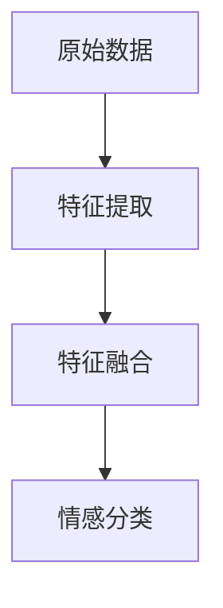
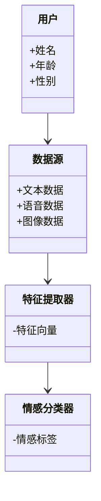
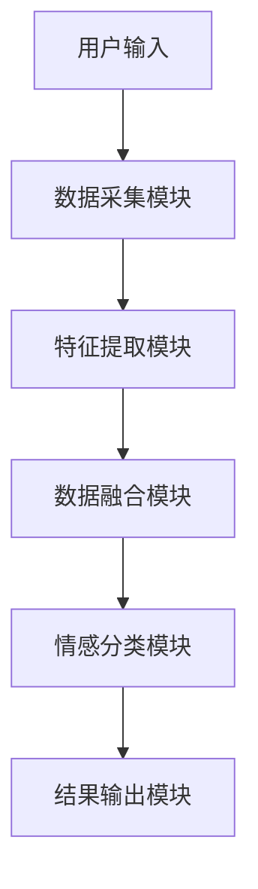
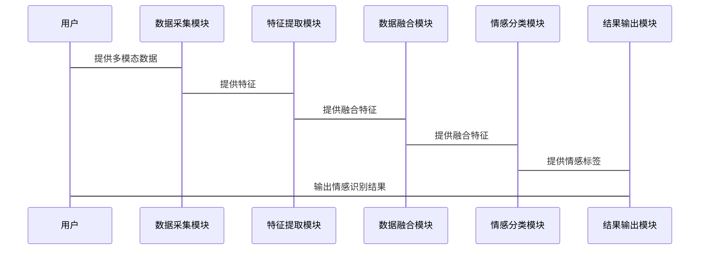

                 


# 开发AI Agent的多模态情感识别系统

> 关键词：AI Agent，多模态情感识别，情感计算，数据融合，深度学习

> 摘要：本文详细探讨了开发AI Agent的多模态情感识别系统的背景、核心概念、算法原理、系统架构设计及其实现。通过分析多模态数据融合、情感计算和跨模态特征提取等关键技术，结合实际项目案例，深入讲解了系统的开发过程和最佳实践。本文旨在为开发者提供全面的技术指导，帮助他们构建高效、准确的多模态情感识别系统。

---

# 第1章: 多模态情感识别系统背景介绍

## 1.1 问题背景

### 1.1.1 情感识别的定义与重要性
情感识别是指通过分析文本、语音、图像等多种数据源，识别人类情感状态的技术。在AI Agent（智能代理）中，情感识别是实现人机交互的核心能力之一。准确的情感识别能够提升用户体验，使AI Agent能够更好地理解用户需求，提供个性化的服务。

### 1.1.2 多模态数据的特点与优势
多模态数据是指来自多种感官渠道的数据，例如文本、语音、图像和视频。多模态数据融合的优势在于能够弥补单一模态数据的不足，提高情感识别的准确性和鲁棒性。例如，结合语音语调和面部表情可以更准确地识别人的情感状态。

### 1.1.3 AI Agent在情感识别中的作用
AI Agent需要通过情感识别技术来理解用户的意图和情感状态，从而提供更智能的服务。例如，在智能音箱中，情感识别可以帮助识别用户的语气，进而调整回应的方式。

## 1.2 问题描述

### 1.2.1 情感识别的主要挑战
情感识别面临的主要挑战包括数据标注的困难、跨模态数据的异构性以及情感表达的多样性。此外，如何在不同场景下保持识别的准确性和稳定性也是一个重要问题。

### 1.2.2 多模态数据融合的难点
多模态数据融合需要解决数据格式的异构性、特征的可比性以及融合策略的选择等问题。如何有效提取和融合多模态特征是多模态情感识别的核心挑战之一。

### 1.2.3 AI Agent情感识别的边界与外延
AI Agent的情感识别需要考虑其应用场景和目标用户。例如，在医疗场景中，情感识别需要更加谨慎，以确保隐私和数据安全。此外，情感识别的边界还包括如何处理中性情感和复杂情感状态。

## 1.3 问题解决思路

### 1.3.1 多模态数据融合的基本思路
多模态数据融合的基本思路包括数据预处理、特征提取、特征融合和情感分类。通过将不同模态的特征进行融合，可以提高情感识别的准确性和鲁棒性。

### 1.3.2 情感计算的核心方法
情感计算的核心方法包括基于规则的方法、基于统计的方法和基于深度学习的方法。深度学习方法在处理多模态数据时表现尤为突出。

### 1.3.3 AI Agent情感识别的整体架构
AI Agent的情感识别系统通常包括数据采集模块、特征提取模块、情感计算模块和结果输出模块。各模块协同工作，实现情感识别的目标。

## 1.4 核心概念与联系

### 1.4.1 多模态数据融合的概念属性对比
| 概念       | 特性                     |
|------------|--------------------------|
| 单模态数据   | 来自单一感官渠道的数据   |
| 多模态数据   | 来自多个感官渠道的数据   |
| 数据融合     | 将不同模态的数据进行整合   |

### 1.4.2 情感计算的ER实体关系图
```mermaid
er
actor: 用户
emotion: 情感状态
data_source: 数据源
feature_extractor: 特征提取器
emotion_classifier: 情感分类器
```

### 1.4.3 跨模态特征提取的流程图


---

# 第2章: 多模态情感识别的核心概念与联系

## 2.1 多模态数据融合原理

### 2.1.1 多模态数据的定义与分类
多模态数据可以分为文本、语音、图像和视频等多种类型。每种数据类型都有其独特的特征和应用场景。

### 2.1.2 数据融合的基本原理
数据融合的基本原理包括数据预处理、特征提取、特征融合和情感分类。通过将不同模态的特征进行融合，可以提高情感识别的准确性和鲁棒性。

### 2.1.3 跨模态特征提取的关键步骤
跨模态特征提取的关键步骤包括数据预处理、特征提取、特征对齐和特征融合。这些步骤需要在不同模态之间进行协调和优化。

## 2.2 情感计算的原理与方法

### 2.2.1 情感计算的基本原理
情感计算的基本原理是通过分析多模态数据，提取情感特征，然后通过分类器进行情感分类。深度学习方法在情感计算中表现尤为突出。

### 2.2.2 情感计算的主要方法
情感计算的主要方法包括基于规则的方法、基于统计的方法和基于深度学习的方法。深度学习方法在处理多模态数据时表现尤为突出。

### 2.2.3 情感计算与多模态数据的关系
情感计算与多模态数据密切相关。通过多模态数据融合，可以提高情感计算的准确性和鲁棒性。多模态数据的异构性也对情感计算提出了更高的要求。

## 2.3 AI Agent情感识别的核心要素

### 2.3.1 AI Agent的定义与特点
AI Agent是一种能够感知环境、自主决策并执行任务的智能系统。AI Agent具有自主性、反应性、目标导向性和社会性等特点。

### 2.3.2 情感识别在AI Agent中的作用
情感识别在AI Agent中起到关键作用，能够帮助AI Agent更好地理解用户需求，提供个性化服务。例如，在智能音箱中，情感识别可以帮助识别用户的语气，进而调整回应的方式。

### 2.3.3 多模态情感识别系统的组成要素
多模态情感识别系统通常包括数据采集模块、特征提取模块、情感计算模块和结果输出模块。各模块协同工作，实现情感识别的目标。

---

# 第3章: 多模态情感识别系统的算法原理

## 3.1 多模态融合算法

### 3.1.1 多模态融合算法的原理
多模态融合算法通过将不同模态的特征进行融合，提高情感识别的准确性和鲁棒性。常用的多模态融合算法包括特征融合、决策融合和混合融合。

### 3.1.2 多模态融合算法的实现步骤
1. 数据预处理：对多模态数据进行标准化和归一化处理。
2. 特征提取：从不同模态数据中提取特征。
3. 特征融合：将不同模态的特征进行融合。
4. 情感分类：对融合后的特征进行情感分类。

### 3.1.3 多模态融合算法的数学模型
$$ y = f(x_1, x_2, ..., x_n) $$
其中，$x_i$ 表示不同模态的特征，$f$ 表示融合函数。

## 3.2 注意力机制

### 3.2.1 注意力机制的原理
注意力机制是一种基于深度学习的特征提取方法，通过计算不同特征的重要性，自动关注对情感识别影响较大的特征。

### 3.2.2 注意力机制的实现步骤
1. 对输入特征进行编码。
2. 计算每个特征的注意力权重。
3. 根据注意力权重对特征进行加权求和。
4. 对加权后的特征进行情感分类。

### 3.2.3 注意力机制的数学模型
$$ \alpha_i = \text{softmax}(W^T x_i) $$
$$ y = \sum_{i=1}^{n} \alpha_i x_i $$

## 3.3 情感分类算法

### 3.3.1 情感分类算法的原理
情感分类算法通过对特征进行分类，实现情感识别。常用的分类算法包括支持向量机（SVM）、随机森林（RF）和深度学习模型（如LSTM、Transformer）。

### 3.3.2 情感分类算法的实现步骤
1. 数据预处理：对数据进行清洗和标注。
2. 特征提取：从数据中提取特征。
3. 模型训练：使用训练数据训练情感分类模型。
4. 模型测试：使用测试数据评估模型性能。

### 3.3.3 情感分类算法的数学模型
$$ P(y|x) = \prod_{i=1}^{n} P(y|x_i) $$

---

# 第4章: 多模态情感识别系统的系统分析与架构设计

## 4.1 项目背景

### 4.1.1 项目目标
本项目旨在开发一个基于多模态情感识别的AI Agent系统，能够识别人类情感状态，提供个性化服务。

### 4.1.2 项目需求
系统需要实现以下功能：
1. 多模态数据采集：包括文本、语音、图像等多种数据源。
2. 特征提取：从多模态数据中提取特征。
3. 数据融合：将不同模态的特征进行融合。
4. 情感分类：对融合后的特征进行情感分类。
5. 结果输出：将情感识别结果输出给AI Agent。

### 4.1.3 项目限制
1. 数据量有限：需要收集足够多的多模态数据进行训练。
2. 模型复杂度：需要在模型准确性和计算效率之间进行权衡。
3. 数据隐私：需要确保数据的安全性和隐私性。

## 4.2 系统功能设计

### 4.2.1 领域模型类图


### 4.2.2 系统架构设计


### 4.2.3 系统接口设计
系统接口包括：
1. 数据采集接口：用于采集多模态数据。
2. 特征提取接口：用于从数据中提取特征。
3. 数据融合接口：用于将不同模态的特征进行融合。
4. 情感分类接口：用于对融合后的特征进行情感分类。
5. 结果输出接口：用于将情感识别结果输出给AI Agent。

### 4.2.4 系统交互流程


---

# 第5章: 多模态情感识别系统的项目实战

## 5.1 环境搭建与开发工具

### 5.1.1 环境安装
需要安装以下环境和工具：
1. Python 3.8+
2. TensorFlow 2.0+
3. Keras 2.4+
4. OpenCV 4.5+
5. Jupyter Notebook

### 5.1.2 开发工具
推荐使用以下开发工具：
1. PyCharm：用于Python开发
2. VS Code：用于混合开发
3. Jupyter Notebook：用于快速原型开发

## 5.2 核心代码实现

### 5.2.1 数据预处理代码
```python
import numpy as np
import pandas as pd

# 读取数据
data = pd.read_csv('emotion_data.csv')

# 数据清洗
data = data.dropna()
data = data.replace(['', np.nan], np.nan)

# 数据标注
data['label'] = data['emotion'].map({'happy': 0, 'sad': 1, 'angry': 2, 'neutral': 3})
```

### 5.2.2 特征提取代码
```python
from tensorflow.keras.layers import Input, Dense, Activation
from tensorflow.keras.models import Model

# 定义特征提取模型
input_layer = Input(shape=(input_dim,))
dense_layer = Dense(64, activation='relu')(input_layer)
output_layer = Dense(1, activation='sigmoid')(dense_layer)

model = Model(inputs=input_layer, outputs=output_layer)
model.compile(optimizer='adam', loss='binary_crossentropy', metrics=['accuracy'])
```

### 5.2.3 数据融合代码
```python
import numpy as np

# 融合文本和语音特征
text_feature = np.load('text_feature.npy')
audio_feature = np.load('audio_feature.npy')
merged_feature = np.concatenate([text_feature, audio_feature], axis=1)
```

### 5.2.4 情感分类代码
```python
from sklearn.svm import SVC
from sklearn.metrics import accuracy_score

# 训练情感分类模型
model = SVC(kernel='rb

