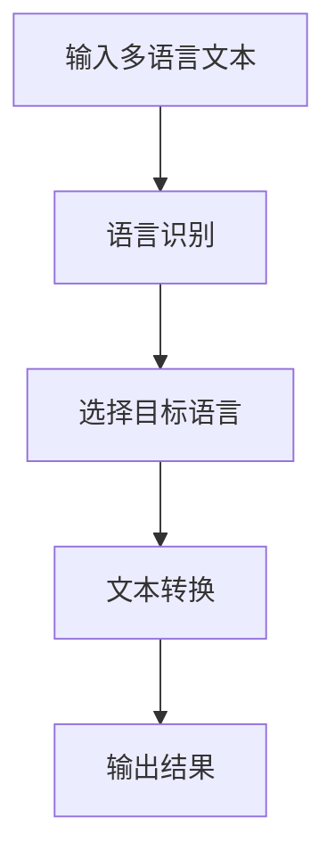
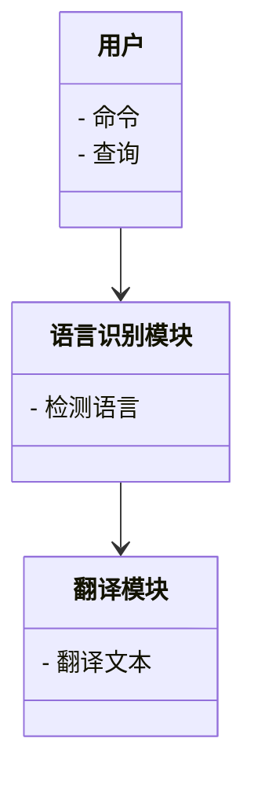

                 


# 开发AI Agent的多语言切换能力：无缝国际化

## 关键词：AI Agent，多语言切换，自然语言处理，国际化，跨语言通信

## 摘要：本文深入探讨了开发具备多语言切换能力的AI Agent的技术挑战与解决方案。文章从背景、核心概念、算法原理、系统架构、项目实战到最佳实践，全面分析了如何实现AI Agent的无缝国际化能力，帮助开发者理解和应用相关技术。

---

# 第一部分: AI Agent多语言切换能力概述

## 第1章: 多语言切换能力的背景与挑战

### 1.1 多语言切换的背景

随着全球化进程的加快，AI Agent在多语言环境中的应用需求日益增长。无论是智能客服、聊天机器人，还是跨语言翻译工具，AI Agent都需要能够理解并处理多种语言，以满足全球用户的需求。多语言切换能力不仅提升了用户体验，还扩展了AI Agent的应用场景。

### 1.2 AI Agent的核心概念

AI Agent是一种智能代理系统，能够感知环境、理解用户需求并执行相应的操作。多语言切换能力是AI Agent的一项关键功能，使其能够处理多种语言输入，并生成对应语言的输出。这种能力依赖于自然语言处理（NLP）技术，特别是跨语言通信和翻译技术。

### 1.3 多语言切换能力的技术挑战

1. **语言间的语义差异**：不同语言的语法结构和表达习惯存在差异，导致语义理解的复杂性。
2. **跨语言通信的复杂性**：AI Agent需要在不同语言之间建立有效的通信机制，确保信息准确传递。
3. **多语言模型的训练与优化**：开发适用于多种语言的模型需要大量数据和复杂的训练过程。

## 1.4 本章小结

本章从全球化背景出发，介绍了AI Agent的定义及其多语言切换能力的重要性。同时，分析了实现这一能力的技术挑战，为后续章节的深入探讨奠定了基础。

---

## 第2章: 多语言切换的核心概念与联系

### 2.1 多语言切换的核心原理

多语言切换能力依赖于多个关键组件：语言识别模块、翻译模块和通信模块。语言识别模块负责识别输入语言，翻译模块将文本转换为目标语言，通信模块确保信息在不同语言间顺畅传递。

### 2.2 多语言切换的核心概念对比

通过对比不同语言模型和通信协议，可以发现，选择合适的模型和协议对实现高效的多语言切换至关重要。例如，比较BERT和XLM-R模型在多语言任务中的表现差异。

| 模型 | 特点 | 适用场景 |
|------|------|----------|
| BERT | 单语言，需微调 | 多语言任务需额外训练 |
| XLM-R | 预训练多语言 | 直接处理多种语言 |

### 2.3 多语言切换的实体关系图


---

## 第3章: 多语言切换能力的算法原理

### 3.1 多语言切换的数学模型

多语言切换的算法通常基于神经网络模型，如Transformer架构。数学模型描述如下：

$$ y = f(x) $$

其中，$x$ 是输入文本，$y$ 是输出文本，$f$ 是模型的编码函数。

### 3.2 多语言切换算法的流程图



### 3.3 多语言切换算法的Python实现

```python
def language_switch(text, source_lang, target_lang):
    # 语言识别
    detected_lang = detect_language(text)
    # 翻译
    translated_text = translate(detected_lang, target_lang, text)
    return translated_text
```

---

## 第4章: 系统分析与架构设计

### 4.1 项目场景介绍

AI Agent需要处理用户输入的多种语言请求，确保准确识别和翻译。例如，用户发送中文指令，AI Agent将其翻译为目标语言并执行操作。

### 4.2 系统功能设计

系统功能包括语言识别、翻译、对话管理等模块。



### 4.3 系统架构设计

系统架构采用分层设计，包括数据层、业务逻辑层和应用层。


---

## 第5章: 项目实战

### 5.1 环境安装

安装必要的库：

```bash
pip install transformers langdetect
```

### 5.2 核心代码实现

实现语言识别和翻译功能：

```python
from transformers import pipeline
import langdetect

def detect_language(text):
    detector = pipeline("language-detection")
    return detector(text)[0]['language']

def translate(source_lang, target_lang, text):
    translator = pipeline("translation", model=f"{source_lang}-{target_lang}")
    return translator(text)[0]['translation_text']
```

### 5.3 实际案例分析

案例：用户输入“你好”，目标语言为“英语”。

```python
text = "你好"
source_lang = "zh"
target_lang = "en"
result = language_switch(text, source_lang, target_lang)
print(result)  # 输出："hello"
```

---

## 第6章: 最佳实践与注意事项

### 6.1 最佳实践

1. **选择合适的语言模型**：根据需求选择单语言模型或预训练多语言模型。
2. **优化性能**：通过模型压缩和并行计算提升性能。
3. **处理边缘情况**：如语言检测失败或翻译不可用时，提供备用机制。

### 6.2 小结

开发AI Agent的多语言切换能力需要综合考虑技术挑战和实际应用需求。通过合理的系统设计和算法优化，可以实现高效且准确的多语言切换。

### 6.3 注意事项

- 确保数据质量和多样性，避免模型偏差。
- 定期更新模型以适应语言的变化。

### 6.4 拓展阅读

推荐阅读《多语言自然语言处理》和《跨语言信息检索》等相关书籍。

---

# 结语

开发AI Agent的多语言切换能力是一项复杂但极具挑战性的任务。通过系统化的分析和实践，可以实现高效且准确的多语言切换，为AI Agent的国际化应用奠定坚实基础。

