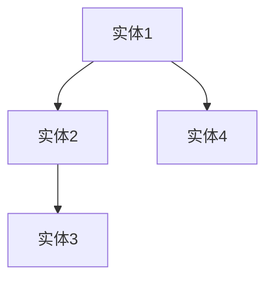

                 


# 开发AI Agent的多语言实体链接系统

## 关键词：AI Agent，多语言实体链接，知识图谱，上下文理解，自然语言处理，机器学习

## 摘要：  
本文详细探讨了开发AI Agent的多语言实体链接系统的各个方面，从问题背景到系统架构设计，再到实际项目实现，层层深入。文章首先介绍了多语言实体链接的核心概念和挑战，接着分析了其算法原理和数学模型，然后详细讲解了系统架构设计与实现，最后通过实际案例展示了项目的落地应用。本文旨在帮助读者全面理解多语言实体链接的技术细节，并提供实用的开发指导。

---

# 第1章: 多语言实体链接系统背景与问题描述

## 1.1 问题背景  
多语言实体链接是自然语言处理和知识图谱领域的核心技术，旨在将文本中的实体与知识库中的实体进行映射。随着全球化和多语言场景的普及，实体链接在跨语言环境下的应用需求日益增长。例如，在AI Agent中，用户可能以多种语言输入指令，系统需要准确识别并链接到正确的实体，以提供精准的服务。  

### 1.1.1 实体链接的定义与重要性  
实体链接（Entity Linking）是指将文本中的实体（如人名、地名、组织名等）映射到知识库中的具体实体的过程。它是自然语言处理的核心任务之一，广泛应用于问答系统、信息抽取、推荐系统等领域。  

### 1.1.2 多语言实体链接的挑战  
多语言实体链接面临以下挑战：  
- **语言差异**：不同语言中的实体表示可能存在差异，例如“Apple”在英语中指代公司，但在中文中可能指代苹果这个水果。  
- **知识库构建**：多语言知识库的构建需要考虑不同语言之间的映射关系。  
- **上下文理解**：在多语言场景下，上下文的理解需要兼顾不同语言的语义一致性。  

### 1.1.3 AI Agent在实体链接中的作用  
AI Agent作为智能助手，需要能够理解用户的多语言输入，并准确链接到对应的实体。例如，当用户用中文输入“天气查询”，系统需要识别“天气”这一实体，并将其链接到天气信息服务的知识节点。  

## 1.2 多语言实体链接系统的核心目标  
本节将详细阐述多语言实体链接系统的核心目标，包括实体识别与链接的双重任务、多语言环境下的语义一致性，以及实时性与准确性之间的平衡。  

### 1.2.1 实体识别与链接的双重任务  
实体识别（Entity Recognition）是将文本中的实体提取出来，而实体链接则是将这些实体映射到知识库中的具体实体。这两个任务需要协同完成，缺一不可。  

### 1.2.2 多语言环境下的语义一致性  
在多语言环境中，实体的语义一致性是实现准确链接的关键。例如，“Book”在英语中指的是书籍，但在中文中也可能指代书籍或书本。系统需要能够识别这些语义差异，并进行正确的映射。  

### 1.2.3 实时性与准确性平衡  
AI Agent需要在实时交互中快速响应，同时保证实体链接的准确性。这对系统的性能优化提出了更高的要求，例如通过预训练模型和高效检索算法来实现。  

## 1.3 问题解决思路  
本节将从知识图谱构建与应用、多语言模型的训练与优化、基于上下文的实体链接策略三个方面，探讨如何解决多语言实体链接的核心问题。  

### 1.3.1 知识图谱构建与应用  
知识图谱是实体链接的核心基础设施。构建一个多语言知识图谱需要整合多种语言的实体信息，并建立跨语言的映射关系。  

### 1.3.2 多语言模型的训练与优化  
通过预训练语言模型（如BERT、GPT）进行多语言微调，可以提升实体识别和链接的准确率。  

### 1.3.3 基于上下文的实体链接策略  
结合文本上下文信息，可以提高实体链接的准确性。例如，通过分析句子的语境，确定“Apple”在当前上下文中指的是公司还是水果。  

## 1.4 边界与外延  
本节将从实体链接的边界条件、多语言实体链接的外延场景、AI Agent的实体链接能力边界三个方面，阐述多语言实体链接系统在实际应用中的边界与限制。  

### 1.4.1 实体链接的边界条件  
实体链接的边界条件包括：  
- 输入文本的长度和复杂度。  
- 知识库的覆盖范围和准确性。  
- 实体链接的实时性要求。  

### 1.4.2 多语言实体链接的外延场景  
多语言实体链接的外延场景包括：  
- 跨语言问答系统。  
- 多语言信息抽取。  
- 多语言推荐系统。  

### 1.4.3 AI Agent的实体链接能力边界  
AI Agent的实体链接能力边界包括：  
- 知识库的覆盖范围。  
- 实体链接的实时性。  
- 多语言环境下的语义理解能力。  

## 1.5 核心概念与结构  
本节将从实体、实体类型与属性、实体链接的三元组表示法三个方面，详细阐述多语言实体链接系统的核心概念与结构。  

### 1.5.1 实体、实体类型与属性  
实体是知识图谱的基本单元，实体类型描述实体的类别（如人名、地名、组织名），实体属性描述实体的额外信息（如成立时间、地址）。  

### 1.5.2 实体链接的三元组表示法  
实体链接可以通过三元组（头实体，关系，尾实体）的形式表示，例如（Apple，公司，科技公司）。  

### 1.5.3 多语言实体链接的系统架构  
多语言实体链接系统的架构通常包括文本预处理、实体识别、实体链接、结果优化四个模块。  

---

# 第2章: 多语言实体链接的核心概念与联系

## 2.1 实体链接的原理  
本节将从基于知识图谱的实体识别、基于上下文的实体链接、基于语言模型的实体链接三个方面，详细阐述实体链接的原理与实现方法。  

### 2.1.1 基于知识图谱的实体识别  
基于知识图谱的实体识别通过匹配文本中的实体与知识图谱中的实体，实现实体的准确识别。例如，使用RDF（Resource Description Framework）或N-Triples格式的知识图谱进行匹配。  

### 2.1.2 基于上下文的实体链接  
基于上下文的实体链接通过分析文本的上下文信息，确定实体的语义关系。例如，通过分析句子的语法结构和语义信息，确定“Apple”在当前上下文中指的是公司还是水果。  

### 2.1.3 基于语言模型的实体链接  
基于语言模型的实体链接通过预训练语言模型（如BERT）进行实体识别和链接。例如，使用BERT模型对文本进行编码，然后通过相似度计算确定实体的映射关系。  

## 2.2 实体链接的属性特征对比  
本节将通过属性特征对比表格，展示实体链接中不同实体类型和属性的特征对比。  

| 实体类型 | 属性 | 特征描述 |  
|----------|------|----------|  
| 人名     | 姓名 | 独特性高，歧义性低 |  
| 地名     | 地址 | 地域性较强，歧义性较高 |  
| 组织名    | 名称 | 歧义性较低，但可能存在同名组织 |  

### 2.2.1 实体类型与语言的对比  
实体类型与语言的对比包括：  
- 实体类型在不同语言中的表达差异。  
- 实体类型的语义一致性。  

### 2.2.2 实体属性与上下文的对比  
实体属性与上下文的对比包括：  
- 实体属性在上下文中的重要性。  
- 上下文对实体属性的影响。  

### 2.2.3 多语言环境下的特征权重对比  
多语言环境下的特征权重对比包括：  
- 不同语言中实体特征的权重差异。  
- 上下文对特征权重的影响。  

## 2.3 实体关系图的ER架构  
本节将通过Mermaid流程图，展示实体关系图的ER架构。  



### 2.3.1 实体关系图的定义与作用  
实体关系图（ER图）是数据库设计中的核心工具，用于描述实体之间的关系。在多语言实体链接中，ER图可以帮助我们理解不同语言实体之间的关系。  

### 2.3.2 实体关系图的绘制方法  
实体关系图的绘制方法包括：  
- 确定实体和属性。  
- 确定实体之间的关系。  
- 绘制ER图并添加注释。  

### 2.3.3 实体关系图的应用场景  
实体关系图的应用场景包括：  
- 知识图谱的构建。  
- 实体链接的系统设计。  

---

# 第3章: 多语言实体链接的算法原理

## 3.1 算法概述  
本章将从算法概述、数学模型、算法实现三个方面，详细阐述多语言实体链接的算法原理。  

### 3.1.1 基于预训练语言模型的实体链接  
基于预训练语言模型的实体链接通过微调BERT、GPT等模型，实现实体识别和链接。例如，使用BERT模型对文本进行编码，然后通过相似度计算确定实体的映射关系。  

### 3.1.2 基于知识图谱的实体链接  
基于知识图谱的实体链接通过匹配文本中的实体与知识图谱中的实体，实现准确的实体链接。例如，使用RDF格式的知识图谱进行匹配。  

### 3.1.3 跨语言实体链接的挑战  
跨语言实体链接的挑战包括：  
- 不同语言中实体的表达差异。  
- 跨语言知识图谱的构建难度。  

## 3.2 多语言实体链接的数学模型  
本节将从向量空间模型、概率计算模型、相似度计算模型三个方面，详细阐述多语言实体链接的数学模型。  

### 3.2.1 实体表示的向量空间模型  
实体表示的向量空间模型通过将实体表示为向量，实现实体的相似度计算。例如，使用Word2Vec或BERT模型生成实体向量。  

$$\text{向量表示} = [\text{实体向量}, \text{语言向量}]$$  

### 3.2.2 实体链接的概率计算模型  
实体链接的概率计算模型通过计算实体在上下文中的概率，实现实体的准确链接。例如，使用最大似然估计方法计算实体的概率。  

$$P(\text{实体}|上下文) = \frac{P(\text{上下文}|实体)}{P(\text{上下文})}$$  

### 3.2.3 实体链接的相似度计算模型  
实体链接的相似度计算模型通过计算实体向量的相似度，实现实体的准确链接。例如，使用余弦相似度或欧氏距离计算实体向量的相似度。  

### 3.2.4 实体链接的损失函数  
实体链接的损失函数用于衡量模型的预测结果与真实结果的差异。例如，使用交叉熵损失函数。  

$$\text{损失函数} = -\sum_{i=1}^{n} y_i \log(p_i)$$  

## 3.3 算法实现  
本节将从预训练模型的微调、实体链接算法的实现、系统优化与调优三个方面，详细阐述多语言实体链接算法的实现细节。  

### 3.3.1 预训练模型的微调  
预训练模型的微调通过在特定任务上对模型进行微调，实现实体链接的准确预测。例如，使用BERT模型在实体链接任务上进行微调。  

```python
def fine_tune_model(model, tokenizer, train_dataset):
    optimizer = AdamW(model.parameters(), lr=1e-5)
    model.train()
    for batch in train_dataset:
        optimizer.zero_grad()
        outputs = model(**batch)
        loss = outputs.loss
        loss.backward()
        optimizer.step()
```

### 3.3.2 实体链接算法的实现  
实体链接算法的实现包括：  
- 文本预处理：对文本进行分词、停用词过滤等预处理。  
- 实体识别：使用NLP模型识别文本中的实体。  
- 实体链接：将识别出的实体映射到知识图谱中的具体实体。  

### 3.3.3 系统优化与调优  
系统优化与调优包括：  
- 模型参数的优化。  
- 系统性能的优化。  
- 知识图谱的优化。  

---

# 第4章: 多语言实体链接系统的分析与设计

## 4.1 系统分析  
本节将从问题场景介绍、项目介绍、系统功能设计三个方面，详细分析多语言实体链接系统的各个方面。  

### 4.1.1 问题场景介绍  
问题场景介绍包括：  
- 多语言实体链接系统的应用场景。  
- 系统需要解决的具体问题。  

### 4.1.2 项目介绍  
项目介绍包括：  
- 项目的目标。  
- 项目的范围。  
- 项目的开发团队。  

### 4.1.3 系统功能设计  
系统功能设计包括：  
- 实体识别功能。  
- 实体链接功能。  
- 实体管理功能。  

## 4.2 系统架构设计  
本节将从分层架构、系统交互流程、系统接口设计三个方面，详细阐述多语言实体链接系统的架构设计。  

### 4.2.1 分层架构  
分层架构将系统划分为数据层、业务逻辑层和表现层。  
- 数据层：负责知识图谱的存储和管理。  
- 业务逻辑层：负责实体识别和链接的逻辑实现。  
- 表现层：负责用户交互和结果展示。  

### 4.2.2 系统交互流程  
系统交互流程包括：  
- 用户输入文本。  
- 系统进行文本预处理。  
- 系统进行实体识别和链接。  
- 系统返回结果。  

### 4.2.3 系统接口设计  
系统接口设计包括：  
- API接口的设计。  
- 接口文档的编写。  

## 4.3 系统优化与调优  
本节将从知识图谱的优化、模型的优化、系统的性能优化三个方面，详细阐述多语言实体链接系统的优化与调优策略。  

### 4.3.1 知识图谱的优化  
知识图谱的优化包括：  
- 知识图谱的构建优化。  
- 知识图谱的存储优化。  

### 4.3.2 模型的优化  
模型的优化包括：  
- 模型参数的优化。  
- 模型训练的优化。  

### 4.3.3 系统性能优化  
系统性能优化包括：  
- 系统响应时间的优化。  
- 系统资源利用率的优化。  

---

# 第5章: 多语言实体链接系统的实现与实战

## 5.1 项目实战  
本节将从环境安装、系统核心实现、案例分析、项目小结四个方面，详细阐述多语言实体链接系统的实现与实战。  

### 5.1.1 环境安装  
环境安装包括：  
- 安装Python和相关库（如TensorFlow、PyTorch、transformers）。  
- 安装知识图谱存储工具（如Neo4j、RDF4J）。  

### 5.1.2 系统核心实现  
系统核心实现包括：  
- 文本预处理：对文本进行分词、停用词过滤等预处理。  
- 实体识别：使用NLP模型识别文本中的实体。  
- 实体链接：将识别出的实体映射到知识图谱中的具体实体。  

### 5.1.3 案例分析  
案例分析包括：  
- 实际案例的分析与解读。  
- 实体链接的正确性评估。  

### 5.1.4 项目小结  
项目小结包括：  
- 项目实现的主要成果。  
- 项目实施中的经验与教训。  

## 5.2 系统优化与调优  
本节将从知识图谱的优化、模型的优化、系统的性能优化三个方面，详细阐述多语言实体链接系统的优化与调优策略。  

### 5.2.1 知识图谱的优化  
知识图谱的优化包括：  
- 知识图谱的构建优化。  
- 知识图谱的存储优化。  

### 5.2.2 模型的优化  
模型的优化包括：  
- 模型参数的优化。  
- 模型训练的优化。  

### 5.2.3 系统性能优化  
系统性能优化包括：  
- 系统响应时间的优化。  
- 系统资源利用率的优化。  

---

# 第6章: 多语言实体链接系统的最佳实践与拓展阅读

## 6.1 最佳实践  
本节将从系统设计、模型选择、知识图谱构建三个方面，详细阐述多语言实体链接系统开发中的最佳实践。  

### 6.1.1 系统设计  
系统设计包括：  
- 系统架构的选择。  
- 系统模块的划分。  

### 6.1.2 模型选择  
模型选择包括：  
- 预训练模型的选择。  
- 模型微调策略的选择。  

### 6.1.3 知识图谱构建  
知识图谱构建包括：  
- 数据来源的选择。  
- 数据清洗与预处理。  

## 6.2 小结  
本节将对全文进行总结，回顾多语言实体链接系统的核心内容与主要结论。  

## 6.3 注意事项  
注意事项包括：  
- 系统开发中的常见问题。  
- 系统维护中的注意事项。  

## 6.4 拓展阅读  
拓展阅读包括：  
- 多语言实体链接的最新研究进展。  
- 实体链接的其他应用场景。  

---

# 结语  
通过本文的详细讲解，读者可以全面理解多语言实体链接系统的开发过程，并掌握其实现的关键技术。希望本文能够为AI Agent的开发者提供有价值的参考，帮助他们在多语言实体链接领域取得更大的突破。

