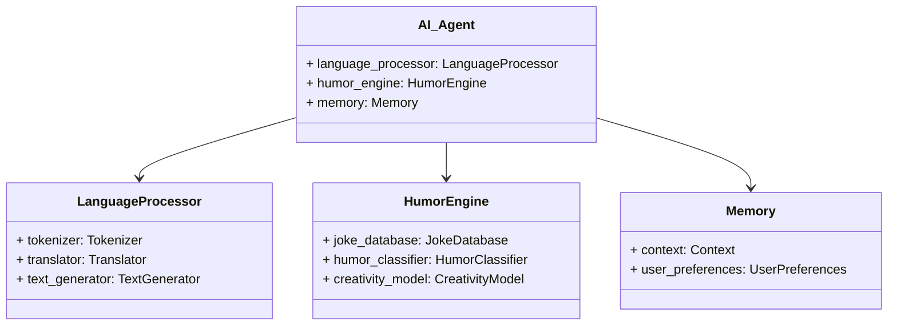
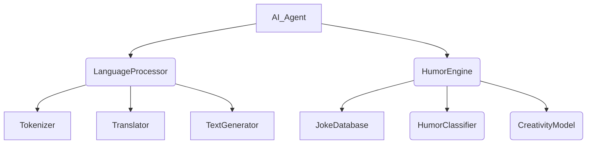

                 


# 开发AI Agent的多语言幽默理解与生成系统

> 关键词：AI Agent, 多语言, 幽默理解, 幽默生成, 自然语言处理

> 摘要：本文系统性地探讨了开发AI Agent的多语言幽默理解与生成系统的关键技术与实现方案。首先，介绍了AI Agent的发展背景及多语言幽默理解与生成的重要性。接着，深入分析了幽默理解与生成的核心概念与算法原理，包括概率模型、深度学习与Transformer模型的应用。然后，详细阐述了系统的架构设计与实现，包括领域模型设计、系统架构优化及接口设计。最后，通过实际项目案例展示了系统的实现过程，并提出了系统的优化建议与未来发展方向。

---

# 第1章: 背景介绍

## 1.1 AI Agent的发展背景

### 1.1.1 AI Agent的基本概念
AI Agent（人工智能代理）是指在计算机系统中能够感知环境、自主决策并执行任务的智能实体。AI Agent可以是软件程序、机器人或其他智能设备，其核心目标是通过与环境交互来实现特定目标。AI Agent具有以下几个核心特征：
1. **自主性**：能够在没有外部干预的情况下自主决策。
2. **反应性**：能够实时感知环境并做出反应。
3. **目标导向**：所有行为均围绕实现特定目标展开。
4. **学习能力**：能够通过经验改进自身的性能。

### 1.1.2 多语言处理的必要性
随着全球化进程的加速，跨语言交流变得越来越重要。AI Agent需要能够理解并生成多种语言的文本，以满足不同用户的需求。多语言处理的核心挑战在于不同语言的语法、语义和文化差异。目前，多语言NLP（自然语言处理）技术已取得显著进展，但要在不同语言之间实现高效的幽默理解与生成仍然面临巨大挑战。

### 1.1.3 幽默理解与生成的挑战
幽默是一种复杂的语言现象，其理解与生成需要结合语境、文化、情感等多个因素。幽默的核心在于对语言的灵活运用和对特定情境的深刻理解。AI Agent要实现幽默理解与生成，必须具备以下能力：
1. **语义理解**：能够理解语言中的隐含意义和双关语。
2. **文化敏感性**：能够根据语境判断幽默是否合适。
3. **情感共鸣**：能够理解幽默背后的情感需求。

## 1.2 多语言幽默理解与生成的背景

### 1.2.1 多语言处理的现状
近年来，多语言NLP技术取得了显著进展。基于Transformer的多语言模型（如Marian、_mBART）能够同时处理多种语言的文本。然而，现有的多语言NLP模型大多专注于通用文本处理，而缺乏对幽默这种特殊语言现象的支持。

### 1.2.2 幽默在人机交互中的重要性
幽默是人类语言中的一种高级表达形式，能够增强人机交互的趣味性和亲和力。在AI Agent与用户的对话中，幽默的运用可以提升用户体验，使交互更加自然和有趣。然而，幽默的理解与生成需要结合语言、文化和情感等多个维度，这使得幽默的AI处理具有较高的技术难度。

### 1.2.3 当前技术的局限性
尽管AI技术在语言处理方面取得了显著进展，但幽默的理解与生成仍面临诸多挑战：
1. **跨语言幽默的差异性**：不同语言中的幽默形式和文化背景差异较大，难以统一处理。
2. **幽默的语境依赖性**：幽默的理解需要结合具体语境，而现有模型在这方面的能力有限。
3. **幽默生成的创造性和灵活性**：幽默生成需要创造力和灵活性，而现有的生成模型往往过于僵化。

## 1.3 本章小结

### 1.3.1 核心问题总结
本文的核心问题在于如何开发一个多语言的AI Agent，使其能够理解并生成幽默文本。这一问题涉及多语言NLP、幽默理解与生成、跨文化适应等多个技术领域。

### 1.3.2 研究意义
解决这一问题将有助于提升AI Agent在人机交互中的表现，使其能够更好地服务于多元文化背景的用户。同时，这也为跨语言幽默研究提供了新的技术路径和理论支持。

### 1.3.3 目标与范围
本文旨在探讨AI Agent在多语言幽默理解与生成系统中的技术实现，重点分析幽默理解与生成的核心算法、系统架构设计及实现方案。

---

# 第2章: 核心概念与联系

## 2.1 AI Agent的核心概念

### 2.1.1 AI Agent的定义与分类
AI Agent可以根据功能和应用场景进行分类。常见的分类方式包括：
1. **简单反射型AI Agent**：基于预设规则做出简单反应。
2. **基于模型的反应型AI Agent**：通过构建环境模型进行决策。
3. **目标驱动型AI Agent**：以特定目标为导向，主动规划和执行任务。
4. **效用驱动型AI Agent**：通过最大化效用函数实现目标。

### 2.1.2 多语言处理的基本原理
多语言处理的核心在于实现语言之间的互译与理解。目前，主流的多语言NLP技术包括：
1. **机器翻译**：将一种语言的文本翻译成另一种语言。
2. **跨语言信息检索**：在多语言文本中进行信息检索。
3. **多语言文本生成**：生成多种语言的文本。

### 2.1.3 幽默理解与生成的机制
幽默理解与生成的机制可以分为以下几个步骤：
1. **语义分析**：理解文本的语义含义。
2. **语境推理**：结合上下文判断幽默的适用性。
3. **情感计算**：分析文本中的情感色彩。
4. **创造性生成**：根据需求生成幽默文本。

## 2.2 核心概念的联系

### 2.2.1 多语言与幽默的关系
多语言与幽默的关系可以分为以下几个方面：
1. **文化差异**：不同语言的幽默形式和内容往往与文化背景密切相关。
2. **语言结构**：幽默的实现依赖于语言的语法和语义结构。
3. **情感共鸣**：幽默的效果需要在特定的情感共鸣基础上实现。

### 2.2.2 AI Agent在幽默理解中的作用
AI Agent在幽默理解中的作用主要体现在以下几个方面：
1. **语义解析**：通过自然语言处理技术理解幽默文本的语义。
2. **情感计算**：分析幽默文本中的情感色彩。
3. **语境推理**：结合上下文判断幽默的适用性。

### 2.2.3 系统架构的实体关系图



---

# 第3章: 算法原理讲解

## 3.1 幽默理解的算法流程

### 3.1.1 基于概率的幽默识别模型
基于概率的幽默识别模型通过计算文本中关键词的出现概率来判断是否为幽默文本。例如，可以通过以下公式计算幽默的概率：

$$ P(\text{humor}) = \frac{N(\text{humor})}{N(\text{total})} $$

其中，$N(\text{humor})$ 表示幽默文本的数量，$N(\text{total})$ 表示所有文本的数量。

### 3.1.2 基于规则的幽默生成算法
基于规则的幽默生成算法通过预设的幽默规则生成幽默文本。例如，可以通过以下步骤生成双关语：

1. **关键词提取**：提取文本中的关键词。
2. **替换建议**：根据关键词生成替换建议。
3. **幽默评估**：评估替换建议的幽默程度。

### 3.1.3 深度学习在幽默理解中的应用
深度学习在幽默理解中的应用主要体现在以下几个方面：
1. **序列标注**：通过序列标注技术识别幽默文本中的关键要素。
2. **情感分析**：通过情感分析技术判断幽默文本的情感倾向。
3. **生成模型**：通过生成模型生成幽默文本。

## 3.2 多语言处理的算法实现

### 3.2.1 多语言NLP模型的构建
多语言NLP模型的构建可以采用以下步骤：
1. **数据收集**：收集多种语言的文本数据。
2. **模型训练**：使用多语言数据训练NLP模型。
3. **模型优化**：通过微调和优化提升模型性能。

### 3.2.2 跨语言迁移学习的流程
跨语言迁移学习的流程可以分为以下几个步骤：
1. **源语言模型训练**：在源语言上训练NLP模型。
2. **目标语言数据准备**：收集目标语言的文本数据。
3. **模型迁移**：将源语言模型迁移到目标语言。

### 3.2.3 基于Transformer的多语言模型
基于Transformer的多语言模型可以通过以下步骤实现：
1. **输入处理**：将输入文本转换为模型可处理的格式。
2. **编码器处理**：通过编码器提取文本特征。
3. **解码器处理**：通过解码器生成目标语言文本。

## 3.3 算法实现的数学模型

### 3.3.1 概率模型的公式推导
概率模型的公式推导可以通过以下步骤实现：
1. **定义事件**：定义需要计算概率的事件。
2. **计算概率**：通过概率公式计算事件的概率。
3. **验证结果**：通过实验验证概率计算的准确性。

### 3.3.2 Transformer模型的数学公式
Transformer模型的数学公式可以通过以下步骤实现：
1. **定义输入**：将输入文本转换为序列。
2. **编码器处理**：通过编码器提取序列特征。
3. **解码器处理**：通过解码器生成目标序列。

---

# 第4章: 系统分析与架构设计

## 4.1 问题场景介绍

### 4.1.1 用户需求分析
用户需求分析需要考虑以下几个方面：
1. **用户目标**：用户希望通过AI Agent实现多语言幽默理解与生成。
2. **功能需求**：用户需要AI Agent能够理解并生成多种语言的幽默文本。
3. **性能需求**：用户需要AI Agent具备较高的处理速度和准确性。

### 4.1.2 系统目标设定
系统目标设定需要考虑以下几个方面：
1. **核心功能**：实现多语言幽默理解与生成。
2. **性能指标**：确保系统的处理速度和准确性。
3. **可扩展性**：确保系统能够适应未来的扩展需求。

### 4.1.3 项目范围界定
项目范围界定需要考虑以下几个方面：
1. **功能范围**：明确系统的功能范围和边界。
2. **时间范围**：明确项目的开发周期。
3. **资源范围**：明确项目的资源需求。

## 4.2 系统功能设计

### 4.2.1 领域模型类图


### 4.2.2 系统架构设计



### 4.2.3 系统接口设计

```mermaid
flowchart TD
    A[User] --> B(API Gateway)
    B --> C(LanguageProcessor)
    C --> D(Token

