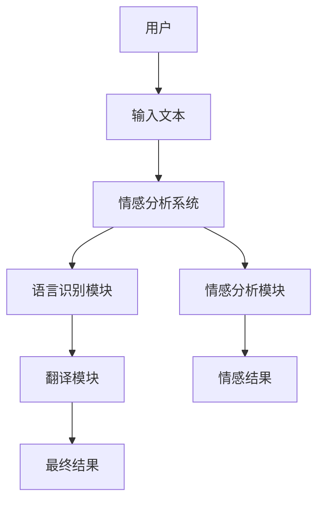
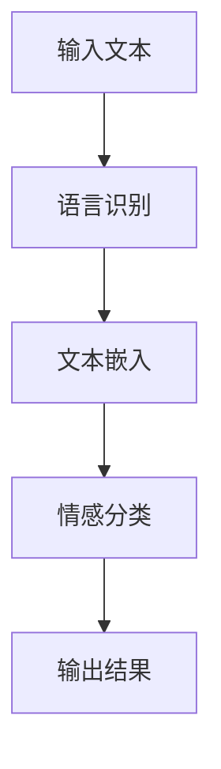
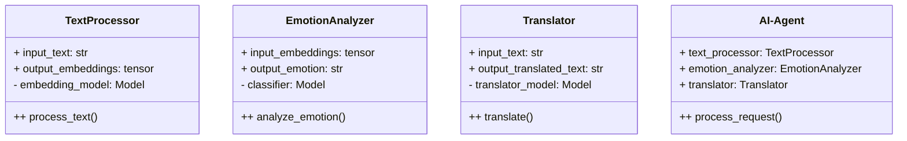
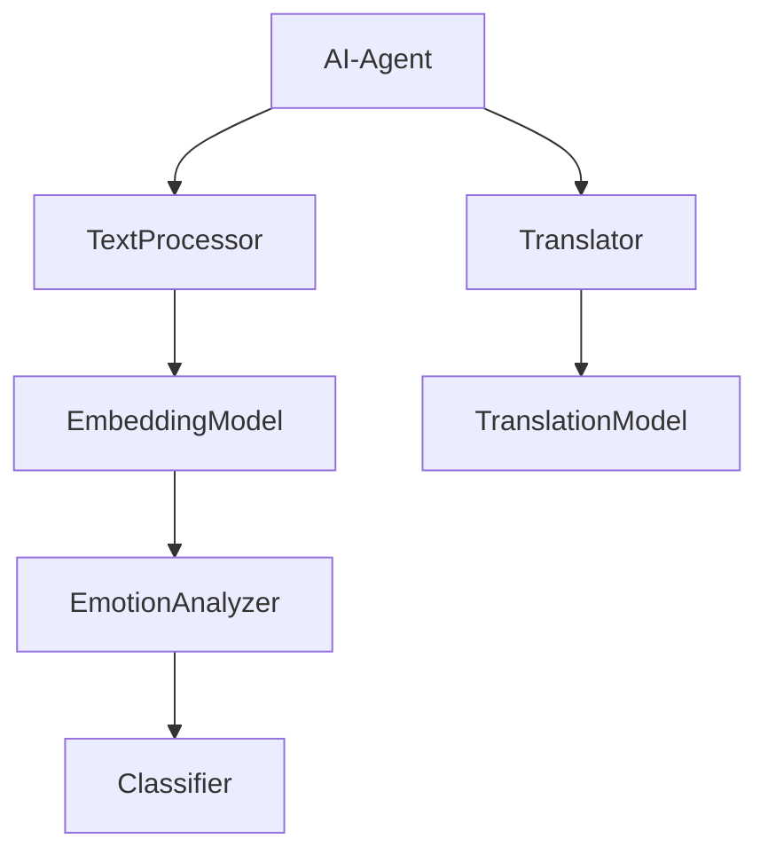
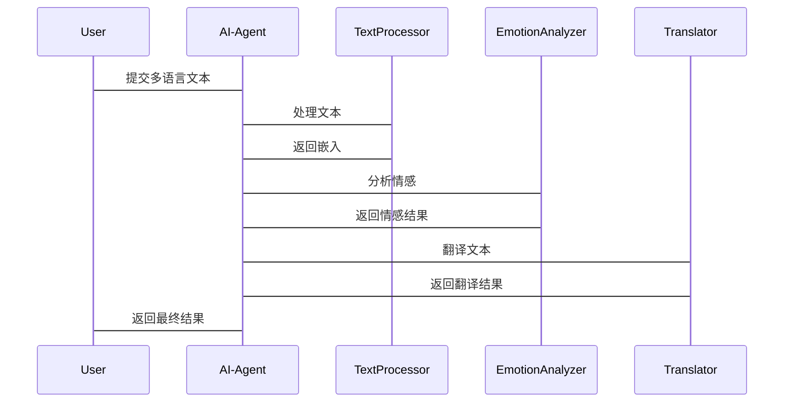

                 


# 开发AI Agent的多语言情感分析比较系统

> 关键词：AI Agent、多语言情感分析、自然语言处理、机器学习、深度学习、情感计算、跨语言分析

> 摘要：本文深入探讨了开发AI Agent的多语言情感分析系统的各个方面，从背景概念、核心原理到系统架构、实战案例，全面解析了这一技术的实现细节和应用潜力。

---

## 第一部分：AI Agent与多语言情感分析概述

### 第1章：AI Agent与多语言情感分析概述

#### 1.1 AI Agent的基本概念
- **1.1.1 AI Agent的定义与特点**
  - AI Agent是一种智能代理，能够感知环境、执行任务并做出决策。
  - 具备自主性、反应性、目标导向和社交能力等特点。

- **1.1.2 情感分析的基本概念**
  - 情感分析是自然语言处理的一个分支，用于识别文本中的情感倾向。
  - 常见任务包括二分类（正面/负面）或多分类（正面、中性、负面）。

- **1.1.3 多语言情感分析的背景与意义**
  - 随着全球化的发展，跨语言交流日益频繁，单一语言情感分析已无法满足需求。
  - 多语言情感分析能够帮助企业在多语言市场中更好地理解用户反馈。

---

#### 1.2 多语言情感分析的挑战
- **1.2.1 多语言数据的多样性**
  - 不同语言的语法结构、词汇习惯差异显著。
  - 数据分布不均衡，小语种数据获取困难。

- **1.2.2 不同语言的情感表达差异**
  - 同一情感在不同语言中的表达方式可能不同。
  - 例如，中文中“难过”可能对应英文的"sad"，但表达方式和语境可能有差异。

- **1.2.3 跨语言情感分析的难点**
  - 如何在缺乏标注数据的情况下进行有效的跨语言迁移学习。
  - 处理语言间的语义差异需要复杂的模型设计。

---

#### 1.3 本章小结
本章介绍了AI Agent的基本概念，情感分析的背景和意义，并深入分析了多语言情感分析面临的挑战。这些内容为后续章节的展开奠定了基础。

---

## 第二部分：多语言情感分析的核心概念与联系

### 第2章：情感分析的核心原理

#### 2.1 情感分析的分类
- **2.1.1 基于规则的情感分析**
  - 使用预定义的规则和情感词典进行情感判断。
  - 优点：简单易实现；缺点：难以处理复杂语境和语义。

- **2.1.2 基于统计模型的情感分析**
  - 使用机器学习算法（如SVM、Naive Bayes）进行训练和分类。
  - 优点：能够捕捉数据分布特征；缺点：对特征工程依赖较高。

- **2.1.3 基于深度学习的情感分析**
  - 使用神经网络模型（如RNN、CNN、BERT）进行情感分析。
  - 优点：能够自动提取文本特征；缺点：计算资源需求较高。

---

#### 2.2 多语言情感分析的实体关系图


---

#### 2.3 情感分析的优缺点对比
- **2.3.1 基于规则的优缺点**
  - 优点：规则简单，易于解释；缺点：无法处理复杂语境。

- **2.3.2 基于统计模型的优缺点**
  - 优点：能够捕捉数据分布；缺点：依赖特征工程。

- **2.3.3 基于深度学习的优缺点**
  - 优点：能够自动提取特征；缺点：计算资源需求高。

---

#### 2.4 本章小结
本章详细介绍了情感分析的主要分类及其优缺点，并通过实体关系图展示了多语言情感分析的整体架构。

---

## 第三部分：多语言情感分析的算法原理

### 第3章：基于深度学习的情感分析算法

#### 3.1 BERT模型的原理
- **3.1.1 BERT模型的基本结构**
  - BERT（Bidirectional Encoder Representations from Transformers）是一种基于Transformer的预训练语言模型。
  - 具备双向编码能力，能够更好地捕捉上下文信息。

- **3.1.2 BERT模型的训练流程**
  - 预训练阶段：利用大规模平行文本数据进行微调。
  - 下游任务：针对具体任务（如情感分析）进行模型微调。

- **3.1.3 BERT模型的情感分析应用**
  - 使用BERT模型对多语言文本进行情感分类。
  - 示例代码如下：

```python
import torch
from transformers import BertTokenizer, BertModel

# 加载BERT模型和tokenizer
model_name = "bert-base-multilingual-cased"
tokenizer = BertTokenizer.from_pretrained(model_name)
model = BertModel.from_pretrained(model_name)

# 定义输入文本
text = "This is a great product."
# 分词
inputs = tokenizer(text, return_tensors="pt")
# 前向传播
with torch.no_grad():
    outputs = model(**inputs)
# 获取隐藏层输出
last_hidden_state = outputs.last_hidden_state[:, 0, :].squeeze()

# 分类器
classifier = torch.nn.Linear(last_hidden_state.shape[-1], 3)
classifier(torch.nn.init.xavier_normal_(classifier.weight))
预测结果 = classifier(last_hidden_state)
```

---

#### 3.2 多语言BERT模型的实现
- **3.2.1 多语言BERT模型的结构**
  - 多语言BERT模型在同一模型中支持多种语言的处理。
  - 通过跨语言迁移学习，利用多语言数据进行模型预训练。

- **3.2.2 多语言BERT模型的训练方法**
  - 使用多语言数据进行预训练，模型自动学习语言间的共性特征。
  - 示例代码如下：

```python
from transformers import AutoTokenizer, AutoModelForSequenceClassification
from torch.utils.data import Dataset, DataLoader

# 加载多语言BERT模型
model_name = "bert-base-multilingual-cased"
tokenizer = AutoTokenizer.from_pretrained(model_name)
model = AutoModelForSequenceClassification.from_pretrained(model_name, num_labels=3)

# 自定义数据集类
class CustomDataset(Dataset):
    def __init__(self, texts, labels):
        self.texts = texts
        self.labels = labels
    def __len__(self):
        return len(self.texts)
    def __getitem__(self, idx):
        text = self.texts[idx]
        label = self.labels[idx]
        inputs = tokenizer(text, return_tensors="pt")
        return inputs['input_ids'].squeeze(), inputs['attention_mask'].squeeze(), label

# 创建数据加载器
batch_size = 16
dataset = CustomDataset(texts, labels)
dataloader = DataLoader(dataset, batch_size=batch_size, shuffle=True)
```

---

#### 3.3 情感分析的数学模型
- **3.3.1 情感分析的分类问题**
  - 情感分析可以看作是一个多分类问题，目标是将文本分类到不同的情感类别中。
  - 损失函数通常使用交叉熵损失函数：

$$ \text{损失函数} = -\frac{1}{N}\sum_{i=1}^{N} \sum_{j=1}^{C} y_{i,j} \log p(y_{i,j}) $$

- **3.3.2 基于BERT的情感分析模型**
  - 使用BERT模型提取文本的隐藏层表示，然后通过全连接层进行分类。

- **3.3.3 情感分析的损失函数**
  - 交叉熵损失函数用于衡量预测值与真实值之间的差异。

---

#### 3.4 算法流程图


---

#### 3.5 本章小结
本章详细介绍了基于深度学习的情感分析算法，特别是多语言BERT模型的实现及其应用。通过代码示例和流程图，展示了如何利用深度学习模型进行情感分析。

---

## 第四部分：多语言情感分析的系统架构与设计

### 第4章：系统分析与架构设计方案

#### 4.1 问题场景介绍
- **目标：** 开发一个能够处理多语言情感分析的AI Agent系统。
- **应用场景：** 企业级应用，如客服系统、社交媒体监控等。

#### 4.2 系统功能设计
- **领域模型：** 下面是一个领域模型的类图：



---

#### 4.3 系统架构设计
- **系统架构图：** 下面是一个系统架构的示意图：



---

#### 4.4 系统接口设计
- **输入接口：** 接收多语言文本输入。
- **输出接口：** 返回对应的情感分析结果。

---

#### 4.5 系统交互设计
- **交互序列图：** 下面是一个系统交互的序列图：



---

#### 4.6 本章小结
本章详细描述了多语言情感分析系统的架构设计，包括功能模块、系统交互流程等。

---

## 第五部分：项目实战与深入分析

### 第5章：项目实战

#### 5.1 环境安装
- **安装Python和必要的库：**
  ```bash
  pip install transformers torch numpy
  ```

- **安装BERT多语言模型：**
  ```bash
  pip install -r requirements.txt
  ```

---

#### 5.2 核心代码实现
- **情感分析模块的实现：**
  ```python
  import torch
  from transformers import AutoTokenizer, AutoModelForSequenceClassification

  class EmotionAnalyzer:
      def __init__(self, model_name):
          self.tokenizer = AutoTokenizer.from_pretrained(model_name)
          self.model = AutoModelForSequenceClassification.from_pretrained(model_name, num_labels=3)

      def analyze_emotion(self, text):
          inputs = self.tokenizer(text, return_tensors="pt")
          with torch.no_grad():
              outputs = self.model(**inputs)
          prediction = torch.argmax(outputs.logits).item()
          return ["negative", "neutral", "positive"][prediction]
  ```

- **翻译模块的实现：**
  ```python
  from googletrans import Translator

  class Translator:
      def __init__(self):
          self.translator = Translator()

      def translate_text(self, text, target_lang):
          return self.translator.translate(text, dest=target_lang).text
  ```

---

#### 5.3 代码应用解读与分析
- **情感分析模块：** 使用BERT模型对输入文本进行情感分类。
- **翻译模块：** 使用Google Translate API将文本翻译为目标语言。

---

#### 5.4 实际案例分析
- **案例1：中文到英文情感分析**
  - 输入文本：这是一部很差的电影。
  - 情感分析结果：negative。
  - 翻译结果：This is a very bad movie.

- **案例2：西班牙语到中文情感分析**
  - 输入文本：Este producto es increíble.
  - 情感分析结果：positive。
  - 翻译结果：这个产品太棒了。

---

#### 5.5 本章小结
本章通过实际案例分析，展示了多语言情感分析系统的实现过程。通过代码示例和案例分析，读者可以更好地理解系统的实际应用。

---

## 第六部分：最佳实践与总结

### 第6章：总结与展望

#### 6.1 最佳实践
- **数据质量：** 确保多语言数据的多样性和代表性。
- **模型选择：** 根据具体需求选择合适的模型（如BERT、SVM等）。
- **系统优化：** 对模型进行调优，如参数调整、数据增强等。

#### 6.2 注意事项
- **语言差异：** 注意不同语言间的语义差异，避免直接翻译。
- **计算资源：** 深度学习模型需要较高的计算资源。

#### 6.3 未来展望
- **多模态情感分析：** 结合图像、语音等多模态信息进行情感分析。
- **自适应模型：** 开发能够自适应不同语言和文化背景的模型。

---

## 第七部分：参考文献与拓展阅读

### 7.1 参考文献
- [1] BERT官方文档：https://huggingface.co/transformers/
- [2] 多语言情感分析相关论文：(引用具体论文)

### 7.2 拓展阅读
- 推荐书籍：《Deep Learning for NLP》
- 推荐博客：Hugging Face的官方博客

---

**附录：**

- **代码示例汇总：** 本文中涉及的所有代码示例。
- **术语表：** 本文中涉及的专业术语及其解释。

---

以上是《开发AI Agent的多语言情感分析比较系统》的技术博客文章的详细目录和内容概览。通过逐步分析和推理，结合实际案例和代码示例，本文全面解析了多语言情感分析的实现细节和应用前景。

