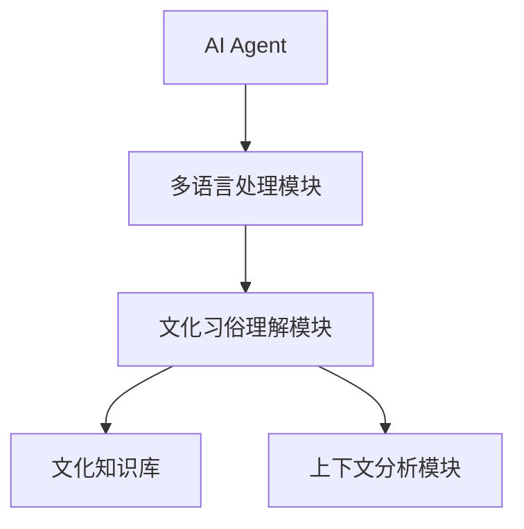
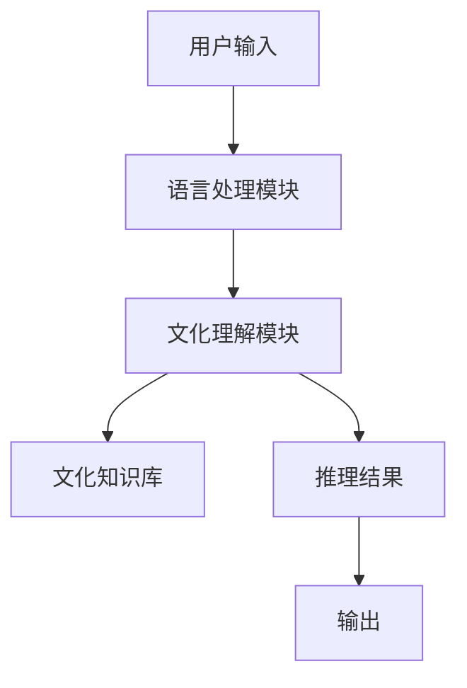

                 


# 开发AI Agent的多语言文化习俗理解系统

> 关键词：AI Agent，多语言，文化习俗理解，自然语言处理，跨文化交互

> 摘要：本文详细探讨了开发具备多语言文化习俗理解能力的AI Agent系统的各个方面。从背景分析到技术实现，系统阐述了如何构建一个能够理解并处理不同语言和文化习俗的智能系统，为实际应用提供了理论和实践指导。

---

# 第一部分: 背景介绍

## 第1章: AI Agent与多语言文化习俗理解的背景

### 1.1 问题背景

#### 1.1.1 AI Agent的基本概念
AI Agent（智能体）是指能够感知环境并采取行动以实现目标的实体。AI Agent可以是软件程序，也可以是机器人，它们通过处理信息做出决策，与用户或环境进行交互。

#### 1.1.2 多语言文化习俗理解的重要性
在全球化的背景下，AI Agent需要与来自不同文化背景的人进行有效沟通。理解多语言和文化习俗可以提升用户体验，使AI Agent更加智能化和人性化。

#### 1.1.3 当前技术的局限性
现有的AI系统在多语言处理和文化习俗理解方面存在不足。许多模型仅能处理单一语言，难以准确理解不同文化中的隐含意义和习俗。

### 1.2 问题描述

#### 1.2.1 多语言理解的挑战
多语言理解涉及语法、语义和语用等多个层面。不同语言的复杂性和差异性增加了理解的难度。

#### 1.2.2 文化习俗理解的复杂性
文化习俗的理解需要对特定文化背景下的行为、习惯和价值观有深刻理解，这需要结合上下文和文化知识。

#### 1.2.3 综合问题的提出
如何构建一个能够同时处理多语言和文化习俗理解的AI Agent系统，是当前技术面临的重要挑战。

### 1.3 问题解决思路

#### 1.3.1 多语言处理的技术路径
使用预训练的多语言模型，结合跨语言迁移学习，提升系统的多语言处理能力。

#### 1.3.2 文化习俗理解的方法论
通过构建文化知识库，结合上下文分析，实现对文化习俗的理解。

#### 1.3.3 综合解决方案的设计
将多语言处理和文化习俗理解模块集成到AI Agent中，确保系统能够准确理解和响应用户的多语言和文化需求。

### 1.4 系统的边界与外延

#### 1.4.1 系统功能的边界
系统主要关注多语言和文化习俗的理解，不涉及AI Agent的其他功能，如动作执行和决策制定。

#### 1.4.2 外延与相关领域
系统的外延包括跨文化交互设计、文化知识库构建和多语言模型优化等领域。

#### 1.4.3 与其他系统的区别
与其他AI系统相比，本系统专注于多语言和文化习俗的理解，能够更准确地处理跨文化场景。

### 1.5 核心概念与组成

#### 1.5.1 AI Agent的核心要素
AI Agent的核心要素包括感知、决策、行动和学习能力。

#### 1.5.2 多语言处理的关键模块
多语言处理的关键模块包括语言识别、翻译和语义理解。

#### 1.5.3 文化习俗理解的组件
文化习俗理解的组件包括文化知识库、上下文分析和文化推理模块。

---

## 第2章: 核心概念与联系

### 2.1 核心概念原理

#### 2.1.1 多语言处理的原理
多语言处理涉及将输入文本映射到通用语义空间，确保不同语言的语义一致性。

#### 2.1.2 文化习俗理解的机制
文化习俗理解依赖于文化知识库和上下文分析，通过推理和关联规则实现。

#### 2.1.3 AI Agent的交互模型
AI Agent通过多语言理解和文化推理与用户进行有效交互，确保交流的准确性和自然性。

### 2.2 核心概念对比表

| 比较维度 | 单语言处理 | 多语言处理 |
|----------|------------|------------|
| 处理范围 | 单一语言    | 多种语言    |
| 复杂性   | 较低        | 较高        |
| 应用场景 | 本地化应用   | 全球化应用   |

### 2.3 实体关系图



---

## 第3章: 技术基础

### 3.1 预训练语言模型

#### 3.1.1 多语言模型介绍
多语言模型如mBert可以在多种语言上进行预训练，提升跨语言处理能力。

#### 3.1.2 跨语言迁移学习
通过迁移学习，利用资源丰富的语言数据来提升资源匮乏语言的处理能力。

### 3.2 文化知识库构建

#### 3.2.1 知识库内容
文化知识库包括节日、礼仪、禁忌和习俗等信息。

#### 3.2.2 知识表示方法
使用本体论（ ontology）进行知识建模，确保知识的结构化和可推理性。

---

## 第4章: 算法原理

### 4.1 多语言文化理解模型

#### 4.1.1 模型结构
模型包括语言编码器、文化推理器和语义理解器。

#### 4.1.2 损失函数
损失函数用于衡量预测与实际的差异，通常包括交叉熵损失和文化推理损失。

### 4.2 训练方法

#### 4.2.1 跨语言预训练
使用多语言语料进行预训练，提升模型的跨语言表示能力。

#### 4.2.2 文化微调
在特定文化语料上进行微调，优化模型的文化理解能力。

---

## 第5章: 系统架构设计

### 5.1 功能模块划分

#### 5.1.1 语言处理模块
负责语言识别和翻译。

#### 5.1.2 文化理解模块
负责文化推理和习俗判断。

### 5.2 系统架构图



---

## 第6章: 项目实战

### 6.1 环境配置

#### 6.1.1 Python版本
建议使用Python 3.8及以上版本。

#### 6.1.2 依赖安装
安装必要的库如transformers和numpy。

### 6.2 核心代码实现

#### 6.2.1 多语言处理代码
```python
from transformers import AutoTokenizer, AutoModelForMaskedLM
tokenizer = AutoTokenizer.from_pretrained('bert-base-multilingual-cased')
model = AutoModelForMaskedLM.from_pretrained('bert-base-multilingual-cased')
```

#### 6.2.2 文化推理代码
```python
def cultural_reasoning(input_text, knowledge_base):
    # 实现文化推理逻辑
    pass
```

### 6.3 案例分析

#### 6.3.1 实际案例
分析用户在不同文化背景下的查询，展示系统的理解和响应过程。

---

## 第7章: 总结与展望

### 7.1 核心要点回顾
总结多语言和文化习俗理解的关键技术和实现方法。

### 7.2 未来展望
展望AI Agent在跨文化交互中的潜在应用和改进方向。

---

通过以上章节的详细阐述，我们系统地探讨了开发AI Agent的多语言文化习俗理解系统的各个方面，为实际应用提供了理论和实践指导。

