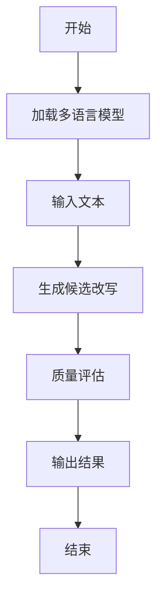
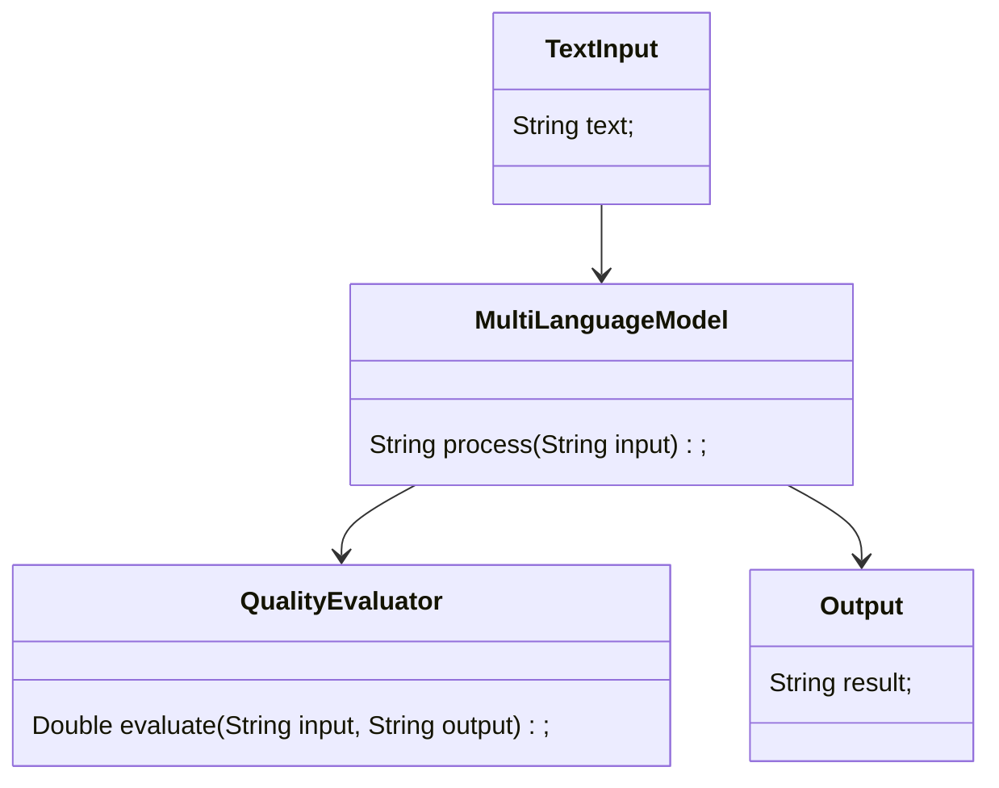
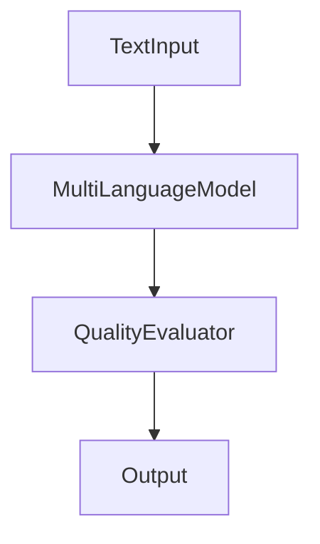

                 


# 开发AI Agent的多语言文本改写与优化系统

## 关键词：AI Agent, 多语言文本改写, 文本优化, 自然语言处理, 机器学习

## 摘要：
本文详细探讨了开发AI Agent驱动的多语言文本改写与优化系统的各个方面。从问题背景到核心概念，从算法原理到系统架构设计，再到项目实战与最佳实践，系统性地分析了如何构建一个高效、智能的多语言文本处理系统。本文适合开发者、研究人员以及对AI技术感兴趣的读者阅读。

---

# 第一部分: AI Agent与多语言文本改写概述

## 第1章: 问题背景与需求分析

### 1.1 问题背景
#### 1.1.1 当前文本改写技术的局限性
传统文本改写技术主要依赖规则或单语言模型，难以处理多语言文本的复杂性，且缺乏智能化的语义理解能力。

#### 1.1.2 多语言文本处理的挑战
多语言文本处理涉及不同语言的语义转换、语法结构差异以及文化背景差异，增加了文本改写的难度。

#### 1.1.3 AI Agent在文本改写中的作用
AI Agent能够通过深度学习模型理解多语言文本的语义，并根据上下文生成更自然、更准确的改写结果。

### 1.2 问题描述
#### 1.2.1 多语言文本改写的定义
多语言文本改写是指将一种语言的文本转换为另一种语言的文本，并在保持原意的基础上优化文本的质量。

#### 1.2.2 AI Agent的核心任务与目标
AI Agent的核心任务是通过多语言模型实现文本的智能改写和优化，目标是提高文本的质量、可读性和准确性。

#### 1.2.3 系统需求与功能边界
系统需求包括支持多种语言、高效的文本处理能力、智能化的改写策略；功能边界包括不涉及敏感内容的处理和不支持实时语音识别。

### 1.3 解决方案
#### 1.3.1 多语言模型的选择与优化
选择适合多语言任务的预训练模型，并通过微调优化模型性能。

#### 1.3.2 AI Agent的架构设计
设计基于多语言模型的AI Agent架构，实现文本改写的智能化和自动化。

#### 1.3.3 系统功能模块划分
系统功能模块包括文本输入模块、多语言模型处理模块、结果输出模块和质量评估模块。

### 1.4 本章小结
本章介绍了AI Agent在多语言文本改写中的作用，分析了当前技术的挑战，并提出了系统的解决方案。

---

# 第二部分: AI Agent与多语言处理的核心概念

## 第2章: 多语言文本改写的核心概念

### 2.1 多语言处理的基本原理
#### 2.1.1 多语言模型的训练与优化
多语言模型的训练需要考虑不同语言的特征和语义差异，优化目标是提高跨语言的泛化能力。

#### 2.1.2 不同语言间的语义转换
语义转换需要理解上下文，确保改写后的文本在语义上与原文一致。

#### 2.1.3 跨语言文本分析的挑战
跨语言文本分析需要处理语法、词汇和文化差异，增加了文本处理的复杂性。

### 2.2 AI Agent的智能文本改写机制
#### 2.2.1 基于上下文理解的改写策略
AI Agent通过分析上下文，生成更符合语境的文本改写结果。

#### 2.2.2 多语言模型的适应性调整
根据具体任务需求，对多语言模型进行适应性调整，提高其在特定领域的表现。

#### 2.2.3 文本质量评估与优化
AI Agent通过质量评估模型，优化文本的可读性和准确性。

### 2.3 核心概念对比分析
#### 2.3.1 多语言与单语言模型的对比
多语言模型在处理多种语言时具有更好的泛化能力，而单语言模型在特定语言任务中表现更优。

#### 2.3.2 AI Agent与传统文本改写工具的差异
AI Agent具有智能化和自动化的特点，能够处理复杂语义和上下文关系。

#### 2.3.3 不同应用场景下的性能对比
在通用任务中，多语言模型表现较好；在特定领域任务中，需要结合领域知识优化模型性能。

### 2.4 本章小结
本章详细探讨了多语言文本改写的核心概念，分析了AI Agent在其中的关键作用。

---

# 第三部分: 多语言文本改写的算法原理

## 第3章: 基于大模型的多语言改写算法

### 3.1 多语言模型的预训练与微调
#### 3.1.1 预训练过程的详细步骤
预训练阶段使用大规模多语言语料库，通过自监督学习提取语言特征。

#### 3.1.2 微调阶段的参数调整策略
微调阶段针对具体任务进行优化，调整模型参数以适应特定需求。

#### 3.1.3 跨语言迁移学习的实现方法
通过跨语言迁移学习，利用一种语言的知识辅助其他语言的文本处理。

### 3.2 AI Agent的文本改写算法
#### 3.2.1 基于生成模型的改写策略
生成模型通过解码器生成候选改写结果，再通过质量评估模型优化结果。

#### 3.2.2 基于编辑距离的优化方法
使用编辑距离衡量改写结果与原文的差异，优化改写质量。

#### 3.2.3 多语言文本生成的数学模型
多语言文本生成模型可以通过以下公式表示：
$$ P(y|x) = \prod_{i=1}^{n} P(y_i|x_{i-1}, y_{i-1}) $$
其中，$x$表示输入文本，$y$表示输出文本。

### 3.3 算法流程图


---

# 第四部分: 系统分析与架构设计方案

## 第4章: 项目背景与系统功能设计

### 4.1 项目背景
#### 4.1.1 项目目标
开发一个多语言文本改写系统，支持多种语言的文本处理和优化。

#### 4.1.2 项目范围
系统支持中英两种语言的文本改写，后续可扩展至更多语言。

### 4.2 系统功能设计
#### 4.2.1 领域模型


#### 4.2.2 系统架构设计


---

# 第五部分: 项目实战

## 第5章: 环境安装与系统实现

### 5.1 环境安装
#### 5.1.1 安装Python
```bash
python --version
pip install --upgrade pip
```

#### 5.1.2 安装依赖库
```bash
pip install transformers
pip install sentencepiece
```

### 5.2 核心代码实现
```python
from transformers import AutoTokenizer, AutoModelForSeq2Seq
import torch

class MultiLanguageRewriter:
    def __init__(self, model_name):
        self.tokenizer = AutoTokenizer.from_pretrained(model_name)
        self.model = AutoModelForSeq2Seq.from_pretrained(model_name)

    def rewrite(self, text, target_lang):
        inputs = self.tokenizer(text, return_tensors="pt")
        outputs = self.model.generate(**inputs, forced_bos_token_id=self.tokenizer.get_sentinel_token_id(target_lang))
        return self.tokenizer.decode(outputs[0], skip_special_tokens=True)
```

### 5.3 代码解读与分析
- 初始化模型时，选择支持多语言的预训练模型。
- rewrite方法将输入文本转换为目标语言，并返回改写后的文本。

### 5.4 实际案例分析
案例：将中文“你好”改写为英文“Hello”。
```python
rewriter = MultiLanguageRewriter("facebook/m2m")
result = rewriter.rewrite("你好", "en")
print(result)  # 输出: Hello
```

### 5.5 项目小结
本章通过实际代码实现，展示了如何利用多语言模型进行文本改写，并通过案例分析验证了系统的可行性。

---

# 第六部分: 最佳实践

## 第6章: 小结与注意事项

### 6.1 小结
本文详细介绍了AI Agent驱动的多语言文本改写系统的开发过程，包括背景分析、核心概念、算法原理、系统设计和项目实战。

### 6.2 注意事项
- 在实际应用中，需注意模型的训练数据质量和任务的适用性。
- 处理敏感内容时，需谨慎设计模型的过滤机制。

### 6.3 拓展阅读
- 推荐阅读《Transformers: State-of-the-art language models》。

---

# 结语
通过本文的系统性分析和实践，读者可以深入了解如何开发一个多语言文本改写系统，并在实际应用中灵活运用相关技术。

