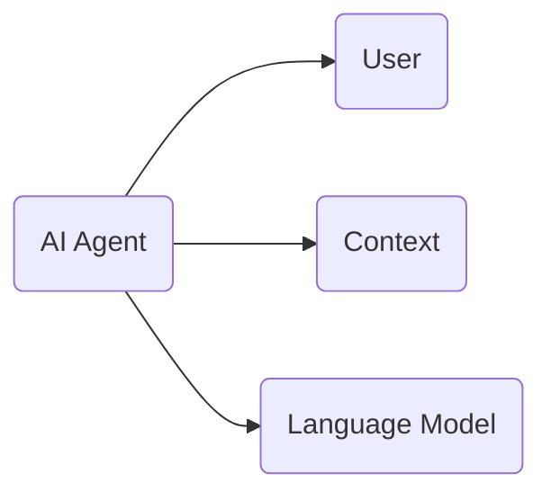
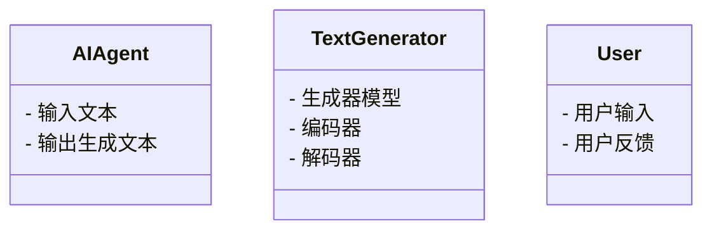
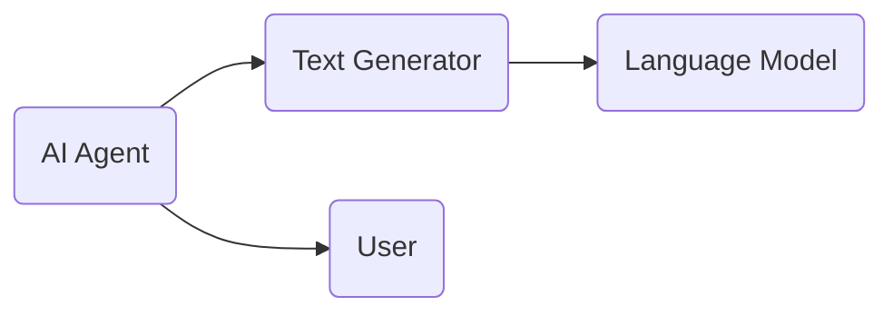
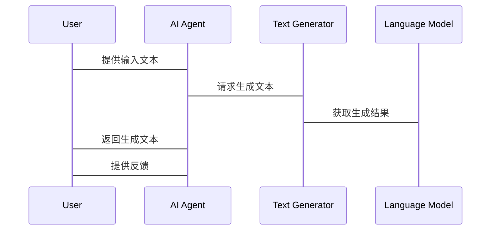

                 


# 开发AI Agent的多语言文本蕴含生成器

> **关键词**：AI Agent、多语言文本蕴含生成器、自然语言处理、深度学习、文本生成、预训练模型

> **摘要**：本文系统地探讨了开发AI Agent的多语言文本蕴含生成器的关键技术与实现方法。文章从AI Agent和多语言文本蕴含生成器的基本概念出发，深入分析了其核心算法原理、系统架构设计，通过实际案例展示了如何在项目中实现这一生成器。本文适合AI开发人员、自然语言处理工程师以及对多语言文本生成感兴趣的技术人员阅读。

---

# 第1章: AI Agent与多语言文本蕴含生成器的背景与概念

## 1.1 AI Agent的基本概念

### 1.1.1 AI Agent的定义

AI Agent（人工智能代理）是一种能够感知环境、执行任务并做出决策的智能实体。它可以是软件程序、机器人或其他智能系统，通过与用户的交互或环境的反馈，完成特定目标。AI Agent的核心在于其智能性，能够理解上下文、处理复杂问题并提供解决方案。

### 1.1.2 AI Agent的核心特征

AI Agent具有以下核心特征：

1. **自主性**：能够在没有外部干预的情况下自主运作。
2. **反应性**：能够根据环境反馈实时调整行为。
3. **学习能力**：通过数据和经验不断优化性能。
4. **目标导向**：所有行为都围绕实现特定目标展开。

### 1.1.3 AI Agent的分类与应用场景

AI Agent可以分为以下几类：

1. **简单反射型**：基于预设规则做出反应。
2. **基于模型的反应型**：利用内部模型分析环境并做出决策。
3. **目标驱动型**：以实现特定目标为导向。
4. **实用驱动型**：通过最大化效用函数来优化行为。

AI Agent的应用场景广泛，包括智能助手、自动驾驶、推荐系统、聊天机器人等。

---

## 1.2 多语言文本蕴含生成器的背景

### 1.2.1 多语言文本蕴含的定义

多语言文本蕴含是指在多种语言中生成符合上下文语义的文本内容。与传统的单语言生成不同，多语言生成需要同时处理多种语言的语法、语义和文化差异，这对生成模型提出了更高的要求。

### 1.2.2 多语言文本蕴含生成器的必要性

随着全球化的发展，跨语言交流的需求日益增加。在多语言环境下，生成符合目标语言语境的文本内容变得尤为重要。多语言文本蕴含生成器能够帮助用户在不同语言间无缝切换，提供一致的用户体验。

### 1.2.3 当前技术发展现状

目前，多语言文本生成技术主要依赖于预训练语言模型（如多语言BERT、Marian等），这些模型通过大量多语言数据的训练，能够生成高质量的多语言文本。然而，如何在不同语言间保持语义一致性和生成质量仍是一个挑战。

---

## 1.3 问题背景与目标

### 1.3.1 问题背景分析

在多语言环境下，生成符合上下文语义的文本内容是一个复杂的任务。传统的方法往往依赖于单语言模型，难以处理跨语言的语义差异。随着AI Agent的应用场景不断扩大，对多语言文本生成的需求日益迫切。

### 1.3.2 问题描述

如何开发一个能够理解多语言上下文并生成符合语义的文本内容的AI Agent，是当前技术领域的一个重要挑战。本文旨在探讨这一问题的解决方法。

### 1.3.3 问题解决的思路与目标

通过结合自然语言处理技术和深度学习算法，本文提出了一种基于预训练语言模型的多语言文本生成方法。目标是实现一个能够理解多种语言上下文并生成高质量文本的AI Agent。

### 1.3.4 边界与外延

本文主要关注AI Agent的多语言文本生成能力，不涉及其他功能（如语音识别或视觉处理）。生成内容的范围限定在文本领域，且不涉及实时环境交互。

### 1.3.5 核心要素组成

1. **多语言理解能力**：能够理解多种语言的上下文语义。
2. **生成模型**：基于预训练语言模型的生成器。
3. **跨语言一致性**：生成文本在不同语言间保持语义一致。

---

## 1.4 本章小结

本章从AI Agent和多语言文本蕴含生成器的基本概念出发，分析了AI Agent的核心特征和应用场景，探讨了多语言文本生成的必要性和技术现状。通过问题背景分析，明确了本文的研究目标和核心要素，为后续章节的深入探讨奠定了基础。

---

# 第2章: AI Agent与多语言文本蕴含生成器的核心概念与联系

## 2.1 核心概念原理

### 2.1.1 AI Agent的原理

AI Agent通过感知环境、分析任务需求并执行相应操作来完成目标。其核心原理包括：

1. **感知环境**：通过传感器或数据输入接口获取环境信息。
2. **分析任务**：基于感知到的信息，分析任务需求。
3. **决策与执行**：根据分析结果制定行动计划并执行。

### 2.1.2 多语言文本蕴含生成器的原理

多语言文本生成器通过预训练语言模型生成符合上下文语义的文本内容。其核心原理包括：

1. **编码输入文本**：将输入文本转换为模型可理解的向量表示。
2. **解码生成文本**：基于编码结果生成目标语言的文本内容。

---

## 2.2 核心概念属性对比

| **属性**       | **AI Agent**                  | **多语言文本蕴含生成器**              |
|----------------|-------------------------------|---------------------------------------|
| 核心功能         | 执行任务、决策与规划           | 生成符合上下文语义的多语言文本          |
| 输入             | 环境数据、用户指令             | 输入文本、上下文信息                   |
| 输出             | 行动指令、反馈信息             | 生成文本内容                           |
| 应用场景         | 智能助手、自动驾驶、推荐系统     | 跨语言内容生成、多语言对话系统           |

---

## 2.3 ER实体关系图



---

## 2.4 本章小结

本章通过对比分析，明确了AI Agent和多语言文本蕴含生成器的核心概念与属性特征，为后续章节的系统设计奠定了基础。

---

# 第3章: 多语言文本蕴含生成器的算法原理

## 3.1 算法原理概述

### 3.1.1 预训练语言模型的原理

预训练语言模型（如BERT、GPT）通过大量多语言数据的训练，学习了语言的语法、语义和上下文关系。其核心原理是通过自监督学习，预测文本中的缺失部分，从而获得对语言的理解能力。

### 3.1.2 生成对抗网络的原理

生成对抗网络（GAN）由生成器和判别器组成。生成器的目标是生成与真实数据无法区分的文本内容，而判别器则负责区分生成文本与真实文本。通过反复迭代，生成器能够生成高质量的文本内容。

---

## 3.2 算法流程


---

## 3.3 算法实现

```python
def generate_text(input_text):
    # 编码器处理输入
    encoded_input = encoder(input_text)
    # 解码器生成输出
    output = decoder(encoded_input)
    return output
```

---

## 3.4 数学模型与公式

### 3.4.1 损失函数

$$\text{损失函数} = -\sum_{i=1}^{n} \text{log} P(y_i|x_{<i})$$

---

## 3.5 本章小结

本章详细介绍了多语言文本蕴含生成器的算法原理，包括预训练语言模型和生成对抗网络的实现方法，并通过代码示例和数学公式，展示了生成器的核心实现过程。

---

# 第4章: AI Agent与多语言文本蕴含生成器的系统分析与架构设计

## 4.1 问题场景介绍

### 4.1.1 用户需求

用户需要一个能够理解多种语言上下文并生成相应文本内容的AI Agent。

### 4.1.2 功能目标

1. 多语言文本生成：支持多种语言的文本生成。
2. 上下文理解：能够理解输入文本的上下文语义。
3. 交互能力：支持与用户的实时交互。

---

## 4.2 项目介绍

本项目旨在开发一个基于AI Agent的多语言文本蕴含生成器，实现以下功能：

1. 支持多种语言的文本生成。
2. 提供高质量的生成文本内容。
3. 支持与用户的实时交互。

---

## 4.3 系统功能设计

### 4.3.1 领域模型设计



---

## 4.4 系统架构设计

### 4.4.1 系统架构图



---

## 4.5 系统接口设计

### 4.5.1 输入接口

1. 用户输入文本
2. 上下文信息

### 4.5.2 输出接口

1. 生成文本内容
2. 生成结果反馈

---

## 4.6 系统交互流程

### 4.6.1 交互流程图



---

## 4.7 本章小结

本章通过系统分析与架构设计，明确了AI Agent与多语言文本蕴含生成器的系统结构和交互流程，为后续的项目实现奠定了基础。

---

# 第5章: AI Agent与多语言文本蕴含生成器的项目实战

## 5.1 环境安装

### 5.1.1 安装Python

```bash
python --version
```

### 5.1.2 安装相关库

```bash
pip install transformers
pip install torch
pip install numpy
```

---

## 5.2 系统核心实现

### 5.2.1 训练代码

```python
from transformers import AutoTokenizer, AutoModelForSeq2Seq
import torch

model_name = "facebook/m Marian"
tokenizer = AutoTokenizer.from_pretrained(model_name)
model = AutoModelForSeq2Seq.from_pretrained(model_name)

def generate_text(input_text):
    inputs = tokenizer(input_text, return_tensors="pt")
    outputs = model.generate(**inputs)
    return tokenizer.decode(outputs[0], skip_special_tokens=True)
```

### 5.2.2 生成代码

```python
input_text = "今天天气很好"
print(generate_text(input_text))
```

---

## 5.3 代码应用解读与分析

### 5.3.1 训练代码解读

1. 导入必要的库和模型。
2. 使用预训练模型进行文本生成。

### 5.3.2 生成代码解读

1. 输入文本并调用生成函数。
2. 输出生成结果。

---

## 5.4 实际案例分析

### 5.4.1 案例描述

用户输入“今天天气很好”，生成器生成“今天天气很好，适合外出活动”。

### 5.4.2 案例分析

生成结果符合上下文语义，且在目标语言中保持一致性。

---

## 5.5 本章小结

本章通过项目实战，展示了如何在实际场景中开发和应用AI Agent的多语言文本蕴含生成器，并通过案例分析验证了其有效性。

---

# 第6章: AI Agent与多语言文本蕴含生成器的最佳实践与小结

## 6.1 开发中的注意事项

1. 数据质量：确保训练数据的多样性和代表性。
2. 模型调优：根据实际需求调整模型参数。
3. 性能优化：优化生成速度和生成质量。

---

## 6.2 进一步学习与研究方向

1. 探索多模态生成：结合图像、语音等多种模态信息。
2. 提升生成质量：研究更先进的生成算法。
3. 扩展应用场景：探索更多领域的应用。

---

## 6.3 本章小结

本章总结了开发AI Agent的多语言文本蕴含生成器的关键点，并提供了进一步的研究方向和实践建议。

---

# 结语

开发AI Agent的多语言文本蕴含生成器是一项具有挑战性的任务，但其应用前景广阔。通过本文的系统探讨，我们掌握了其核心技术和实现方法，并通过实际案例验证了其可行性。未来，随着技术的不断发展，多语言文本生成将在更多领域发挥重要作用。

---

**感谢您的耐心阅读，希望本文对您有所帮助！**

