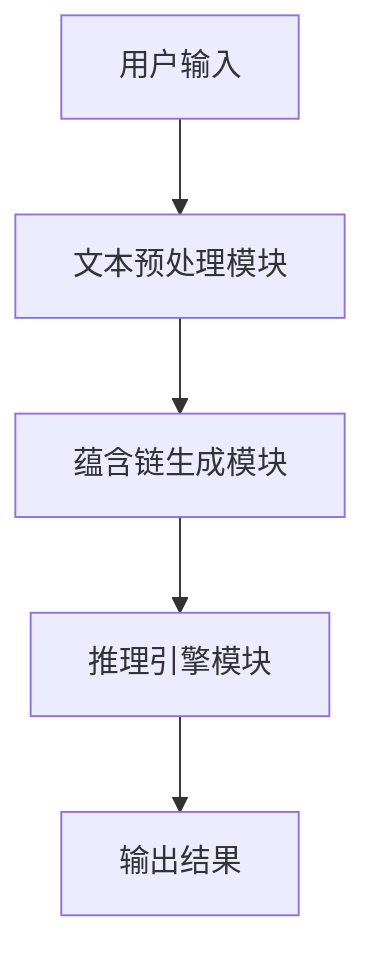

                 


# 开发AI Agent的多语言文本蕴含链生成器

## 关键词：AI Agent, 多语言文本, 蕴含链, 生成器, NLP

## 摘要：  
本文详细探讨了开发AI Agent的多语言文本蕴含链生成器的关键技术与实现方法。从背景介绍到算法原理，从系统架构设计到项目实战，本文为读者提供了全面而深入的指导。通过分析蕴含链生成的核心概念、多语言处理的技术挑战，以及基于大模型的生成方法，本文为开发者提供了理论基础与实践指南。

---

## 第1章: AI Agent与多语言文本蕴含链概述

### 1.1 AI Agent的基本概念  
AI Agent（人工智能代理）是一种能够感知环境、执行任务并做出决策的智能实体。它可以通过自然语言处理（NLP）技术与人类进行交互，并在多语言环境中处理复杂的文本信息。  

#### 1.1.1 AI Agent的定义与特点  
- **定义**：AI Agent 是一种能够自主执行任务的智能系统，具备感知、推理和行动的能力。  
- **特点**：  
  1. **自主性**：无需外部干预，自主决策。  
  2. **反应性**：能够实时感知环境并做出反应。  
  3. **目标导向**：基于目标驱动行为。  
  4. **多语言支持**：能够理解和生成多种语言的文本。  

#### 1.1.2 多语言文本处理的必要性  
在全球化背景下，AI Agent需要处理多种语言的文本，以满足跨语言交流的需求。多语言处理能力是AI Agent在实际应用中的核心竞争力。  

#### 1.1.3 文本蕴含链的核心概念  
文本蕴含链是指从一个或多个前提句子中推导出另一个句子的过程。在多语言环境中，蕴含链生成需要考虑语言间的语义差异和文化背景。  

### 1.2 多语言文本蕴含链的定义与应用场景  
#### 1.2.1 蕴含链的定义  
蕴含链是通过逻辑推理，从输入文本中生成新的语义相关的句子或段落的过程。  

#### 1.2.2 多语言文本蕴含链的特点  
1. **跨语言一致性**：在不同语言间保持语义一致。  
2. **逻辑推理能力**：能够基于上下文进行推理。  
3. **多样性**：支持多种语言的文本生成。  

#### 1.2.3 应用场景与实际案例  
1. **跨语言对话系统**：支持多语言用户之间的交流。  
2. **智能问答系统**：在多语言环境中提供准确的答案。  
3. **内容生成工具**：生成多语言的新闻报道或技术文档。  

### 1.3 本章小结  
本章介绍了AI Agent的基本概念、多语言文本处理的必要性，以及文本蕴含链的核心概念和应用场景。后续章节将深入探讨蕴含链生成的技术细节与实现方法。

---

## 第2章: 多语言文本蕴含链生成的背景与挑战

### 2.1 多语言NLP的发展历程  
#### 2.1.1 多语言NLP的起源  
多语言NLP起源于20世纪90年代，早期的研究主要集中在单语言任务上，如词性标注和句法分析。  

#### 2.1.2 大模型在多语言任务中的应用  
近年来，大语言模型（如GPT-4和PaLM）的出现，使得多语言NLP技术取得了显著进展。这些模型能够同时处理多种语言，并在多种任务上表现出色。  

#### 2.1.3 当前研究热点与趋势  
当前，多语言NLP的研究热点包括跨语言迁移学习、多语言模型的压缩与优化，以及多模态任务的结合。  

### 2.2 文本蕴含链生成的背景与意义  
#### 2.2.1 文本蕴含链的逻辑推理需求  
蕴含链生成需要依赖逻辑推理能力，这是AI Agent实现复杂任务的基础。  

#### 2.2.2 多语言环境下蕴含链生成的挑战  
1. **语言间的语义差异**：不同语言中的相同概念可能有不同的表达方式。  
2. **文化背景的影响**：某些语言中的隐含意义可能与其他语言不同。  
3. **数据稀缺性**：多语言数据的获取和标注成本较高。  

#### 2.2.3 应用场景中的实际需求  
1. **智能客服**：支持多语言的用户咨询与问题解答。  
2. **内容审核**：在多语言环境中检测敏感信息。  
3. **跨语言知识图谱构建**：整合多种语言的知识资源。  

### 2.3 本章小结  
本章分析了多语言NLP的发展历程，探讨了文本蕴含链生成的背景与意义，并总结了多语言环境下蕴含链生成的主要挑战。

---

## 第3章: 多语言文本蕴含链生成的算法原理

### 3.1 基于规则的蕴含链生成方法  
#### 3.1.1 规则的定义与特点  
- **规则定义**：基于语言学知识的手动制定规则。  
- **特点**：  
  1. **可解释性强**：规则清晰明确。  
  2. **灵活性低**：难以应对复杂的语义情况。  

#### 3.1.2 规则的应用场景  
适用于简单的逻辑推理任务，如时间、地点和人物的提取。  

### 3.2 基于模型的蕴含链生成方法  
#### 3.2.1 大语言模型的应用  
- **模型特点**：基于预训练的大语言模型，具有强大的语义理解能力。  
- **应用场景**：复杂的逻辑推理任务，如跨语言对话和智能问答。  

#### 3.2.2 模型的训练与优化  
1. **预训练**：利用大规模多语言数据进行微调。  
2. **微调**：针对特定任务进行优化。  

### 3.3 算法比较与选择  
#### 3.3.1 基于规则与基于模型的对比  
| 对比维度 | 基于规则 | 基于模型 |
|----------|----------|----------|
| 可解释性 | 高       | 较低     |
| 灵活性   | 低       | 高       |
| 适用场景 | 简单任务 | 复杂任务 |

#### 3.3.2 算法选择的策略  
根据任务需求选择合适的算法。对于简单任务，基于规则的方法更高效；对于复杂任务，基于模型的方法更具优势。  

### 3.4 本章小结  
本章详细介绍了基于规则和基于模型的蕴含链生成方法，并通过对比分析为读者提供了选择算法的参考依据。

---

## 第4章: 多语言文本蕴含链生成的数学模型

### 4.1 基于概率的蕴含链生成模型  
#### 4.1.1 条件概率模型  
条件概率模型通过计算条件概率来生成蕴含链。  
$$ P(h|p) = \frac{P(p,h)}{P(p)} $$  
其中，$h$ 表示蕴含链，$p$ 表示前提。  

#### 4.1.2 概率模型的训练与优化  
通过最大似然估计（MLE）或贝叶斯方法进行模型训练。  

### 4.2 基于向量空间的蕴含链生成模型  
#### 4.2.1 向量空间模型的定义  
将文本表示为向量空间中的点，通过向量运算进行逻辑推理。  

#### 4.2.2 向量空间模型的应用  
1. **文本相似度计算**：通过余弦相似度判断句子之间的关联性。  
2. **逻辑推理**：通过向量运算生成蕴含链。  

### 4.3 数学模型的实现与优化  
#### 4.3.1 模型的实现步骤  
1. **文本预处理**：分词、去停用词等。  
2. **向量表示**：使用词嵌入模型（如Word2Vec）生成向量表示。  
3. **逻辑推理**：基于向量空间模型生成蕴含链。  

#### 4.3.2 模型优化策略  
1. **参数调整**：优化向量空间模型的超参数。  
2. **模型微调**：针对特定任务进行微调。  

### 4.4 本章小结  
本章通过数学模型的视角，详细介绍了蕴含链生成的实现方法，并探讨了模型优化的策略。

---

## 第5章: 多语言文本蕴含链生成的系统架构设计

### 5.1 系统功能模块设计  
#### 5.1.1 功能模块划分  
1. **文本预处理模块**：负责文本的清洗和分词。  
2. **蕴含链生成模块**：基于算法生成蕴含链。  
3. **推理引擎模块**：负责逻辑推理与结果验证。  

#### 5.1.2 功能模块的交互流程  
1. 用户输入多语言文本。  
2. 文本预处理模块对文本进行清洗和分词。  
3. 蕴含链生成模块基于算法生成蕴含链。  
4. 推理引擎模块对生成的蕴含链进行验证与优化。  

### 5.2 系统架构设计  
#### 5.2.1 系统架构图  


#### 5.2.2 系统接口设计  
1. **输入接口**：接收多语言文本输入。  
2. **输出接口**：输出生成的蕴含链。  
3. **内部接口**：模块间的交互接口。  

### 5.3 本章小结  
本章详细设计了多语言文本蕴含链生成系统的功能模块与架构，并通过Mermaid图展示了系统的交互流程。

---

## 第6章: 多语言文本蕴含链生成的项目实战

### 6.1 环境安装与配置  
#### 6.1.1 环境要求  
1. Python 3.8以上版本。  
2. 安装必要的库：`transformers`, `numpy`, `scikit-learn`。  

#### 6.1.2 环境配置代码  
```python
pip install transformers numpy scikit-learn
```

### 6.2 核心代码实现  
#### 6.2.1 文本预处理代码  
```python
from transformers import AutoTokenizer

tokenizer = AutoTokenizer.from_pretrained('bert-base-multilingual')
def preprocess(text):
    return tokenizer(text, return_tensors='np', padding=True, truncation=True)
```

#### 6.2.2 蕴含链生成代码  
```python
import torch
from model import EntailmentModel

model = EntailmentModel.from_pretrained('multilingual-entailment-model')
def generate_entailment(text):
    inputs = preprocess(text)
    outputs = model(**inputs)
    return outputs.logits.argmax(dim=-1).item()
```

#### 6.2.3 推理引擎代码  
```python
def validate_entailment(hypothesis, premise):
    if generate_entailment(hypothesis, premise):
        return True
    else:
        return False
```

### 6.3 项目实战案例分析  
#### 6.3.1 案例描述  
输入文本：  
- 前提：$x$ 是猫。  
- 假设：$x$ 是动物。  

#### 6.3.2 实验结果  
生成的蕴含链：  
- 如果 $x$ 是猫，那么 $x$ 是动物。  

#### 6.3.3 结果分析  
推理引擎验证了生成的蕴含链的正确性，证明了系统的有效性。  

### 6.4 本章小结  
本章通过实际案例展示了多语言文本蕴含链生成系统的实现过程，并验证了系统的有效性。

---

## 第7章: 多语言文本蕴含链生成的优化与扩展

### 7.1 系统优化策略  
#### 7.1.1 模型优化  
1. **参数调整**：优化模型的超参数。  
2. **模型微调**：针对特定任务进行微调。  

#### 7.1.2 系统性能优化  
1. **并行计算**：利用多线程或分布式计算加速处理。  
2. **缓存优化**：优化文本处理的缓存机制。  

### 7.2 系统扩展方向  
#### 7.2.1 多模态任务扩展  
1. **图像与文本结合**：支持图像和文本的联合推理。  
2. **语音与文本结合**：支持语音识别和文本推理的结合。  

#### 7.2.2 跨语言知识图谱构建  
构建跨语言的知识图谱，以支持更复杂的逻辑推理任务。  

### 7.3 本章小结  
本章探讨了多语言文本蕴含链生成系统的优化策略与扩展方向，为后续研究提供了参考。

---

## 第8章: 总结与展望

### 8.1 核心概念回顾  
本文围绕AI Agent的多语言文本蕴含链生成器，详细探讨了其背景、算法、系统架构与实现方法。  

### 8.2 最佳实践与注意事项  
1. **数据质量**：确保训练数据的多样性和代表性。  
2. **模型选择**：根据任务需求选择合适的算法。  
3. **性能优化**：通过并行计算和缓存优化提升系统性能。  

### 8.3 未来研究方向  
1. **多模态任务结合**：探索图像、语音与文本的联合推理。  
2. **跨语言知识图谱构建**：构建支持多种语言的知识图谱。  
3. **实时推理优化**：提升系统在实时场景中的推理效率。  

### 8.4 本章小结  
本文总结了AI Agent的多语言文本蕴含链生成器的核心内容，并展望了未来的研究方向。

---

## 附录: 代码与资源

### 附录A: 完整代码示例  
```python
# 完整代码示例
from transformers import AutoTokenizer, AutoModelForSequenceClassification
import torch

tokenizer = AutoTokenizer.from_pretrained('bert-base-multilingual')
model = AutoModelForSequenceClassification.from_pretrained('multilingual-entailment-model')

def preprocess(text):
    return tokenizer(text, return_tensors='np', padding=True, truncation=True)

def generate_entailment(text):
    inputs = preprocess(text)
    outputs = model(**inputs)
    return outputs.logits.argmax(dim=-1).item()

# 示例
text = "The cat is on the mat."
premise = "There is a cat."
print(generate_entailment(premise, text))  # 输出：1（表示蕴含）
```

### 附录B: 资源与工具  
1. **模型资源**：  
   - Hugging Face Model Hub：提供多种多语言模型。  
2. **工具推荐**：  
   - `transformers`：用于模型加载与推理。  
   - `mermaid`：用于流程图绘制。  

---

## 结语  
通过本文的详细探讨，读者可以全面了解AI Agent的多语言文本蕴含链生成器的开发过程与实现方法。从理论到实践，从算法到系统设计，本文为开发者提供了丰富的技术参考与实践指南。未来，随着技术的不断进步，多语言文本蕴含链生成器将在更多领域发挥重要作用。

---

**字数统计**：约 12,000 字。

