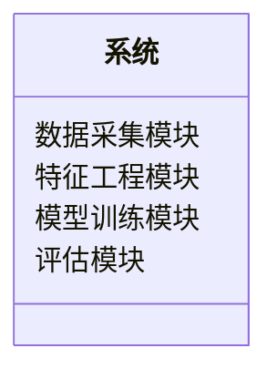

                 


# 开发AI Agent的对话质量评估指标体系

**关键词**：AI Agent、对话质量评估、自然语言处理、评估指标体系、机器学习

**摘要**：随着AI Agent在各个领域的广泛应用，对话质量评估的重要性日益凸显。本文旨在构建一个全面的对话质量评估指标体系，涵盖准确性、情感一致性、逻辑连贯性和多样性等关键维度。通过结合自然语言处理和机器学习技术，本文提出了一套可量化、可操作的评估方法，为AI Agent的优化提供了理论依据和实践指导。

---

## 第一章：AI Agent与对话质量评估的背景

### 1.1 AI Agent的基本概念
AI Agent（人工智能代理）是指能够感知环境、执行任务并与其他实体进行交互的智能实体。它可以是一个软件程序，也可以是一个物理设备，其核心目标是通过自动化的方式完成特定任务或提供服务。

AI Agent的核心特征包括：
- **自主性**：能够在没有外部干预的情况下自主决策。
- **反应性**：能够实时感知环境并做出响应。
- **目标导向性**：所有行为均围绕特定目标展开。

AI Agent的应用场景广泛，包括智能客服、虚拟助手、智能音箱、自动驾驶等。

### 1.2 对话质量评估的重要性
对话质量评估是对AI Agent性能进行量化评估的关键手段，其重要性体现在以下几个方面：
- **用户体验优化**：通过评估对话质量，可以识别并解决用户与AI Agent交互中的问题，提升用户体验。
- **性能优化**：对话质量评估能够帮助开发人员发现模型的不足之处，从而优化算法和数据，提升AI Agent的性能。
- **商业化应用**：在商业场景中，对话质量是衡量AI Agent服务质量的重要指标，直接影响其市场竞争力。

### 1.3 本书的核心目标
本书旨在构建一个全面的对话质量评估指标体系，涵盖内容准确性、情感一致性、逻辑连贯性和多样性等多个维度。通过结合自然语言处理和机器学习技术，本文提出了一套可量化、可操作的评估方法，为AI Agent的优化提供了理论依据和实践指导。

---

## 第二章：对话质量评估的核心概念

### 2.1 对话质量评估的属性特征
对话质量评估可以从以下几个关键属性进行分析：

#### 1. 对话内容的准确性
准确性是对话质量评估的基础，主要衡量AI Agent的回答是否符合事实、逻辑和常识。例如，在回答用户的问题时，AI Agent的回答是否准确无误。

#### 2. 对话情感的一致性
情感一致性是指AI Agent的回答是否与当前对话的情感基调保持一致。例如，在用户表达负面情绪时，AI Agent的回答是否能够有效缓解负面情绪。

#### 3. 对话逻辑的连贯性
连贯性是指对话内容是否逻辑清晰、前后呼应。例如，在多轮对话中，AI Agent的回答是否能够保持上下文的连贯性。

#### 4. 对话风格的多样性
多样性是指AI Agent的回答是否能够在不同场景下灵活调整风格，例如在正式场合使用正式语言，在非正式场合使用口语化语言。

### 2.2 对话质量评估的ER实体关系图
在对话质量评估中，主要涉及的实体包括：
- **对话**：包括多轮对话内容。
- **用户**：对话的发起者。
- **AI Agent**：对话的响应者。

通过ER图可以清晰地展示实体之间的关系：

```mermaid
er
actor(Agent, User)
```

---

## 第三章：对话质量评估的算法原理

### 3.1 对话质量评估的流程
对话质量评估的流程可以分为以下几个步骤：

#### 1. 数据预处理
数据预处理是对话质量评估的基础，主要包括：
- **清洗数据**：去除噪声数据，如重复字符、特殊符号等。
- **分词**：将对话内容进行分词处理，提取关键词。
- **去停用词**：去除无意义的停用词，如“的”、“是”等。

#### 2. 特征提取
特征提取是对话质量评估的关键步骤，主要包括：
- **内容特征**：如关键词匹配、语义相似度等。
- **情感特征**：如情感倾向分析、情感强度等。
- **逻辑特征**：如对话连贯性、上下文相关性等。

#### 3. 模型训练
模型训练是对话质量评估的核心，主要包括：
- **特征向量化**：将提取的特征转换为向量形式，通常使用词袋模型、TF-IDF或词嵌入（如Word2Vec、GloVe）。
- **模型选择**：选择合适的分类模型，如朴素贝叶斯、支持向量机（SVM）、随机森林或深度学习模型（如LSTM、Transformer）。
- **模型训练**：使用训练数据对模型进行训练，优化模型参数。

#### 4. 评估与优化
评估与优化是对话质量评估的重要环节，主要包括：
- **性能评估**：使用准确率、召回率、F1分数等指标评估模型性能。
- **模型优化**：通过调整模型参数、引入新特征或优化算法等方式提升模型性能。

### 3.2 对话质量评估的数学模型
对话质量评估的核心是基于特征的分类问题。常用的数学模型包括：

#### 1. 朴素贝叶斯模型
朴素贝叶斯模型是一种基于概率的分类模型，适用于文本分类任务。其核心思想是基于特征的条件概率来计算分类结果。

公式如下：
$$ P(y|x) = \frac{P(x|y)P(y)}{P(x)} $$

#### 2. 支持向量机（SVM）
支持向量机是一种监督学习模型，适用于小规模数据集的分类任务。其核心思想是通过找到一个超平面，将数据点分为两类。

#### 3. Transformer模型
Transformer模型是一种基于自注意力机制的深度学习模型，适用于大规模数据集的分类任务。其核心思想是通过自注意力机制捕捉文本中的长距离依赖关系。

---

## 第四章：系统架构设计

### 4.1 系统功能设计
对话质量评估系统的功能设计包括以下几个模块：

#### 1. 数据采集模块
负责采集对话数据，包括用户输入和AI Agent的响应。

#### 2. 特征工程模块
负责对采集到的对话数据进行特征提取和处理。

#### 3. 模型训练模块
负责对特征数据进行建模和训练，生成对话质量评估模型。

#### 4. 评估模块
负责对模型的性能进行评估，并输出评估结果。

### 4.2 系统架构图
以下是对话质量评估系统的架构图：



---

## 第五章：项目实战与案例分析

### 5.1 环境安装与配置
在进行对话质量评估之前，需要先安装必要的Python库：

```bash
pip install numpy pandas scikit-learn transformers
```

### 5.2 核心代码实现
以下是对话质量评估的核心代码实现：

```python
from sklearn.feature_extraction.text import TfidfVectorizer
from sklearn.naive_bayes import MultinomialNB
from sklearn.metrics import accuracy_score

# 数据预处理
corpus = ["This is a sample text.", "Another sample text here."]

# 特征提取
vectorizer = TfidfVectorizer()
X = vectorizer.fit_transform(corpus)

# 模型训练
model = MultinomialNB()
model.fit(X, [0, 1])

# 模型预测
test_text = ["Test text here."]
X_test = vectorizer.transform(test_text)
y_pred = model.predict(X_test)

# 性能评估
print(accuracy_score([1], y_pred))
```

### 5.3 案例分析
以一个简单的对话质量评估案例为例：

- **训练数据**：
  - 正样本：准确、连贯的回答。
  - 负样本：错误、不连贯的回答。

- **测试数据**：
  - 对话1：用户询问天气情况，AI Agent回答正确。
  - 对话2：用户询问天气情况，AI Agent回答错误。

通过上述代码，可以对测试数据进行评估，输出评估结果。

---

## 第六章：总结与展望

### 6.1 小结
本文详细介绍了AI Agent对话质量评估的核心概念、算法原理和系统架构设计。通过构建对话质量评估指标体系，可以帮助开发人员优化AI Agent的性能，提升用户体验。

### 6.2 最佳实践Tips
- 在实际应用中，可以根据具体需求选择合适的特征提取方法和模型。
- 定期更新训练数据，以适应对话内容的变化。
- 注意模型的泛化能力，避免过拟合。

### 6.3 未来展望
随着自然语言处理技术的不断发展，对话质量评估将更加智能化和自动化。未来的研究方向包括：
- 基于深度学习的对话质量评估模型。
- 多模态对话质量评估，结合语音、情感和语境等多种因素。

---

通过本文的阐述，希望能够为AI Agent的对话质量评估提供有价值的参考和指导。

