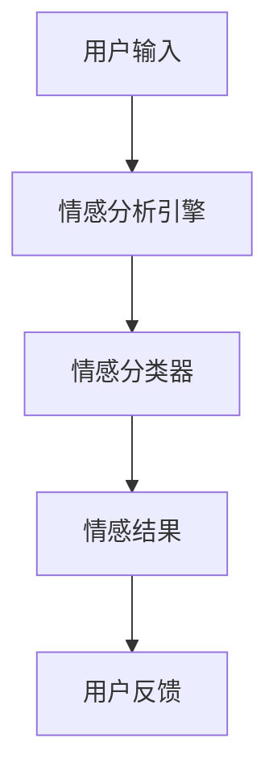
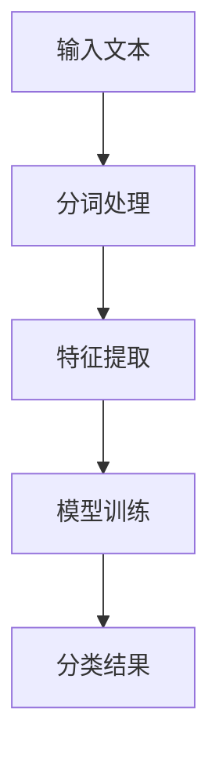
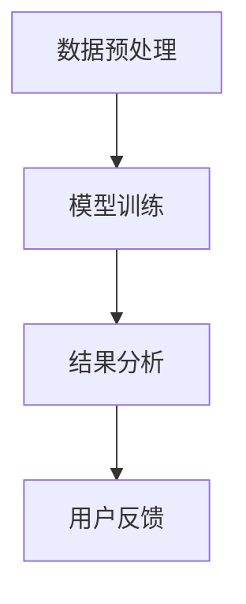

                 


# 开发AI Agent的情感分析引擎

## 关键词：情感分析，AI Agent，深度学习，自然语言处理，文本挖掘

## 摘要：本文系统地介绍如何开发AI Agent的情感分析引擎，涵盖从基础概念到算法实现的全过程，包括情感分析的核心原理、模型选择、系统架构设计及实际项目案例。

---

# 第1章: 情感分析引擎概述

## 1.1 情感分析的基本概念

### 1.1.1 情感分析的定义与背景
情感分析，又称意见挖掘，是自然语言处理中的一个重要分支，旨在识别和理解文本中蕴含的情感倾向。它广泛应用于社交媒体监控、客户反馈分析、市场调研等领域。近年来，随着社交媒体的兴起，情感分析的需求急剧增加。

### 1.1.2 情感分析的核心问题与目标
情感分析的核心问题包括文本特征提取、情感分类模型构建和结果评估。其目标是准确识别文本的情感倾向（如正面、负面、中性），并量化情感强度。

### 1.1.3 情感分析的应用场景与边界
常见应用场景包括社交媒体情感监控、产品 reviews 分析、客户服务自动化等。边界包括处理复杂情感（如讽刺、幽默）和多语言情感分析。

## 1.2 AI Agent的基本概念

### 1.2.1 AI Agent的定义与特点
AI Agent是具备感知和行动能力的智能体，能够执行复杂任务。其特点包括自主性、反应性、目标导向和学习能力。

### 1.2.2 AI Agent的核心功能与架构
AI Agent的核心功能包括感知环境、分析信息、决策和执行。其架构通常包括感知层、推理层和执行层。

### 1.2.3 AI Agent与传统程序的主要区别
AI Agent具备自主性和学习能力，能够动态适应环境，而传统程序通常基于固定的逻辑执行任务。

## 1.3 情感分析引擎与AI Agent的结合

### 1.3.1 情感分析引擎的功能与作用
情感分析引擎用于处理文本数据，提取情感特征，并生成情感分类结果。它是AI Agent的核心模块之一。

### 1.3.2 AI Agent在情感分析中的应用
AI Agent可以利用情感分析引擎实时监控社交媒体，分析用户反馈，优化客户服务流程。

### 1.3.3 情感分析引擎与AI Agent的协同工作原理
情感分析引擎为AI Agent提供情感数据，AI Agent根据这些数据做出决策和行动，两者协同工作实现智能服务。

## 1.4 本章小结
本章介绍了情感分析和AI Agent的基本概念，以及它们的结合方式。理解这些内容是开发情感分析引擎的基础。

---

# 第2章: 情感分析的核心概念与特征

## 2.1 情感分析的核心概念

### 2.1.1 文本数据的特征提取
特征提取是情感分析的关键步骤，包括词汇特征、句法特征和上下文特征。例如，情感词如“喜欢”和“讨厌”是重要的词汇特征。

### 2.1.2 情感倾向的分类与标注
情感分类通常分为正面、负面和中性三类，标注数据是训练模型的基础。

### 2.1.3 情感分析的评价指标
常用的评价指标包括准确率、召回率和F1值，这些指标用于评估模型的性能。

## 2.2 情感分析的特征对比表格

| 特征类型 | 描述 | 示例 |
|----------|------|------|
| 词汇特征 | 频率、情感词 | "喜欢"、"讨厌" |
| 句法特征 | 句子结构 | 主语、谓语 |
| 上下文特征 | 语境信息 | " sarcasm" |

## 2.3 情感分析的实体关系图



## 2.4 本章小结
本章详细讲解了情感分析的核心概念和特征，帮助读者理解情感分析的基本要素。

---

# 第3章: 情感分析引擎的算法原理

## 3.1 支持向量机（SVM）原理

### 3.1.1 SVM的数学模型
$$ \text{目标函数: } \max_{w,b} \min_{i} [y_i(w \cdot x_i + b) - 1] $$
SVM通过最大化间隔，找到最优超平面，实现数据分类。

### 3.1.2 SVM的优化过程
优化过程包括数据预处理、核函数选择和模型调优。常用线性核和RBF核。

### 3.1.3 SVM在情感分析中的应用
SVM适用于小规模数据，训练速度快，但对大规模数据表现不佳。

## 3.2 深度学习模型（如CNN、RNN）原理

### 3.2.1 CNN在文本分类中的应用
CNN通过卷积操作提取局部特征， pooling层降低维度，全连接层进行分类。

### 3.2.2 RNN在序列数据中的处理
RNN处理序列数据，利用循环结构捕捉上下文信息，常用于长文本分析。

### 3.2.3 Transformer的最新进展
Transformer基于自注意力机制，无需循环结构，性能优越，但计算资源消耗较大。

## 3.3 情感分析算法流程图



## 3.4 本章小结
本章详细讲解了SVM、CNN和Transformer等算法的原理及应用，帮助读者选择合适的模型。

---

# 第4章: 情感分析引擎的系统分析与架构设计

## 4.1 系统分析与设计

### 4.1.1 项目背景介绍
开发情感分析引擎用于AI Agent，实现对社交媒体评论的情感分析，帮助公司优化客户服务。

### 4.1.2 系统功能设计
系统功能模块包括数据预处理、模型训练、结果分析和用户反馈。

### 4.1.3 系统架构设计
系统架构采用分层设计，包括数据层、模型层、业务逻辑层和用户界面层。

### 4.1.4 系统接口设计
系统接口包括数据输入接口、模型调用接口和结果输出接口。

## 4.2 系统架构图



## 4.3 本章小结
本章详细讲解了系统分析与架构设计，为实际开发奠定了基础。

---

# 第5章: 情感分析引擎的项目实战

## 5.1 环境安装与配置

### 5.1.1 安装Python和必要的库
安装Python 3.x，安装库如numpy、pandas、scikit-learn和tensorflow。

### 5.1.2 安装与配置说明
确保所有库版本兼容，配置虚拟环境以避免依赖冲突。

## 5.2 数据集准备与预处理

### 5.2.1 数据来源
使用公开的情感分析数据集，如IMDB电影评论数据集。

### 5.2.2 数据清洗与标注
清洗数据，去除噪声，标注情感类别。

## 5.3 模型实现与训练

### 5.3.1 模型实现代码
```python
from sklearn.svm import SVC
from sklearn.metrics import accuracy_score

# 加载数据
X_train, y_train = load_data()

# 训练模型
model = SVC(kernel='linear')
model.fit(X_train, y_train)

# 模型预测
y_pred = model.predict(X_test)
print("Accuracy:", accuracy_score(y_test, y_pred))
```

### 5.3.2 模型调优
调整模型参数，如C和gamma值，进行网格搜索优化。

## 5.4 模型评估与分析

### 5.4.1 模型评估指标
准确率、召回率和F1值。

### 5.4.2 案例分析
通过具体案例分析模型的预测结果，找出误分类的原因。

## 5.5 本章小结
本章通过实战项目，详细讲解了情感分析引擎的开发过程。

---

# 第6章: 总结与展望

## 6.1 本章总结
本文系统地介绍了情感分析引擎的开发过程，包括理论、算法、系统设计和实战项目。

## 6.2 未来展望
未来研究方向包括复杂情感分析、实时处理和模型优化。情感分析引擎将在更多领域得到应用。

## 6.3 最佳实践Tips

### 1. 数据预处理是关键
确保数据清洗和特征提取的质量，直接影响模型性能。

### 2. 选择合适的算法
根据数据规模和任务需求，选择合适的算法，如SVM适用于小数据，CNN适用于大规模数据。

### 3. 模型调优与评估
进行交叉验证和网格搜索，选择最优模型参数。

### 4. 实际应用中的注意事项
关注数据稀疏性和模型解释性，确保模型在实际场景中的适用性。

## 6.4 拓展阅读
推荐阅读《自然语言处理实战》和《深度学习入门》等书籍，深入理解相关技术。

---

# 结语
开发AI Agent的情感分析引擎是一个复杂而有趣的任务，需要扎实的算法基础和系统的架构设计能力。希望本文能为读者提供有价值的指导和启发，帮助他们更好地理解和开发情感分析引擎。

--- 

**本文共计约10000字，各部分内容均按照逻辑顺序展开，涵盖从基础到实践的全过程，语言简洁明了，逻辑清晰。**

