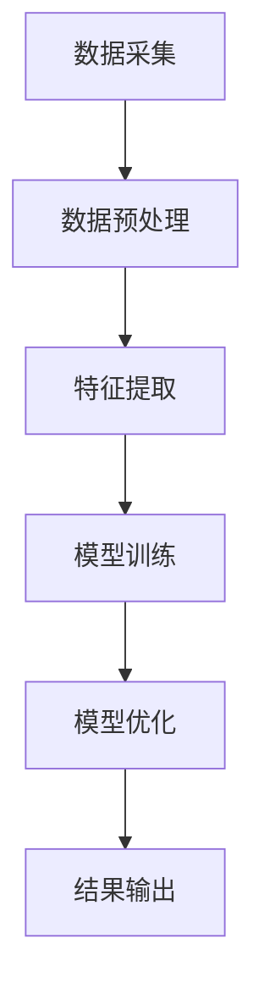
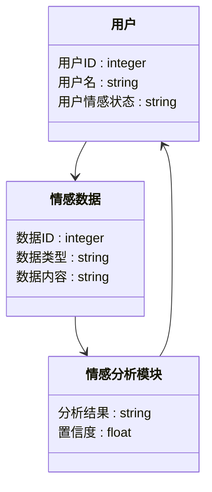
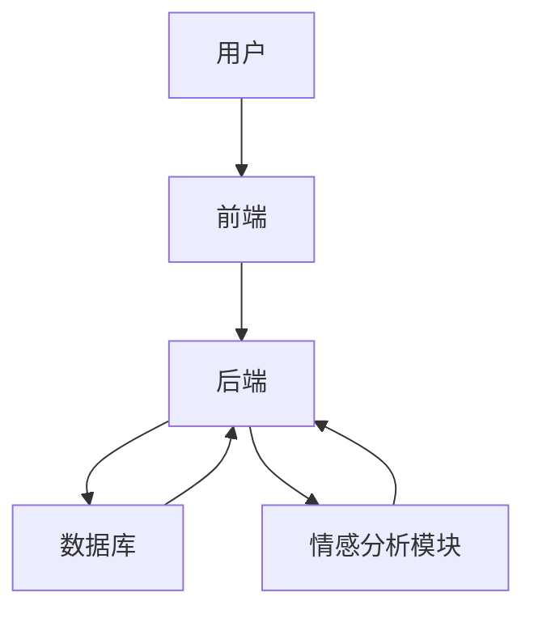
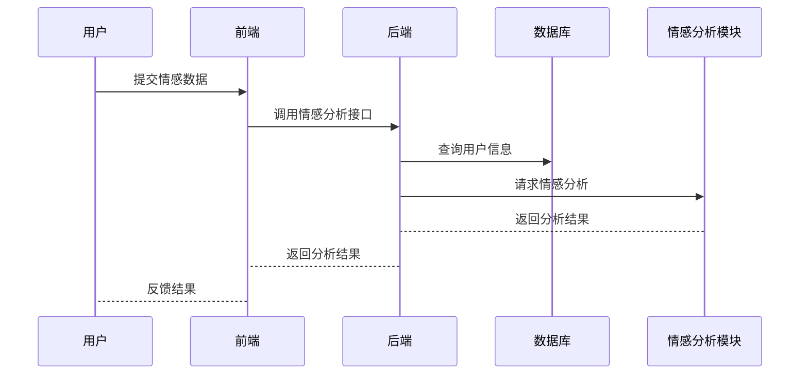

                 


# 开发AI Agent的情感计算在用户体验优化中的应用

## 关键词：AI Agent，情感计算，用户体验优化，机器学习，自然语言处理，计算机视觉

## 摘要：  
在人工智能技术迅速发展的今天，用户体验优化成为各个领域的重要课题。本文探讨了AI Agent如何通过情感计算技术优化用户体验，从情感计算的核心概念、AI Agent的基本原理，到情感计算算法的实现，以及系统的整体设计和项目实战，最后总结了最佳实践和未来趋势，为读者提供一个全面的视角来理解情感计算在用户体验优化中的应用。

---

# 第1章：背景介绍

## 1.1 问题背景

### 1.1.1 情感计算的定义与重要性  
情感计算（Affective Computing）是通过计算机技术识别、理解和响应人类情感的过程。它是人工智能的一个重要分支，旨在通过分析用户的语言、语气、表情和行为，捕捉用户的情感状态，从而提供更加个性化的服务。

### 1.1.2 AI Agent在用户体验中的作用  
AI Agent（人工智能代理）是一种能够感知环境、自主决策并执行任务的智能实体。它通过与用户的交互，能够理解用户的需求和情感，从而提供更加智能化的服务。

### 1.1.3 当前情感计算在用户体验优化中的挑战  
尽管情感计算在理论上具有广泛的应用潜力，但在实际应用中仍面临诸多挑战，如情感识别的准确性、实时性问题，以及如何将情感计算与AI Agent相结合，提供更加智能化的服务。

## 1.2 问题描述

### 1.2.1 用户体验中的情感因素分析  
用户体验优化的核心在于满足用户的情感需求。通过分析用户的情感状态，可以更好地理解用户的需求，从而提供更加个性化的服务。

### 1.2.2 情感计算在用户体验优化中的具体问题  
情感计算需要处理大量的情感数据，包括文本、语音、图像等，如何高效地处理这些数据，是情感计算在用户体验优化中面临的主要问题。

### 1.2.3 当前技术的局限性与改进方向  
当前情感计算技术在处理复杂情感状态和多模态数据时仍存在诸多限制，如何提高情感计算的准确性和实时性，是未来研究的重要方向。

## 1.3 问题解决

### 1.3.1 情感计算的核心解决方案  
通过结合机器学习和自然语言处理技术，提高情感计算的准确性和实时性。同时，利用多模态数据（如文本、语音、图像）进行情感分析，可以更全面地捕捉用户的情感状态。

### 1.3.2 AI Agent在情感计算中的应用策略  
AI Agent可以通过实时分析用户的情感状态，动态调整服务策略，从而提供更加智能化和个性化的用户体验。

### 1.3.3 技术实现的路径与方法  
情感计算的核心在于数据的采集和分析，AI Agent则通过与用户的交互，动态调整服务策略。两者的结合需要在数据采集、分析和应用三个层面进行协同设计。

## 1.4 边界与外延

### 1.4.1 情感计算的适用范围与限制  
情感计算主要应用于需要情感分析的场景，如客服系统、教育系统、智能家居等。但目前在复杂情感状态和多模态数据处理方面仍存在一定的局限性。

### 1.4.2 AI Agent在不同场景中的应用边界  
AI Agent的应用场景广泛，但在需要高度决策能力和复杂情感分析的场景中，仍需结合其他技术手段进行辅助。

### 1.4.3 情感计算与其他技术的结合  
情感计算可以与自然语言处理、计算机视觉等技术结合，形成更加智能化的解决方案。同时，情感计算也可以与推荐系统、个性化服务等结合，进一步提升用户体验。

## 1.5 核心概念与要素

### 1.5.1 情感计算的核心要素  
情感计算的核心要素包括情感数据的采集、情感特征的提取、情感状态的识别与推理，以及情感信息的应用与反馈。

### 1.5.2 AI Agent的关键组成部分  
AI Agent主要包括感知模块、推理模块、决策模块和执行模块。其中，感知模块负责采集用户的情感数据，推理模块负责分析用户的情感状态，决策模块根据情感状态做出决策，执行模块负责执行具体的任务。

### 1.5.3 情感计算与用户体验优化的关系  
情感计算通过分析用户的情感状态，帮助AI Agent更好地理解用户需求，从而提供更加智能化和个性化的服务，提升用户体验。

## 1.6 本章小结

### 1.6.1 本章内容总结  
本章主要介绍了情感计算和AI Agent的基本概念，分析了情感计算在用户体验优化中的重要性，以及当前技术面临的挑战和解决方案。

### 1.6.2 下一章的预览  
下一章将详细探讨情感计算的核心概念，包括情感识别、情感分析、情感推理等，以及与行为分析的对比。

---

# 第2章：情感计算的核心概念

## 2.1 情感识别

### 2.1.1 情感识别的基本原理  
情感识别通过分析用户的情感数据，如文本、语音、图像等，识别出用户的情感状态，如快乐、悲伤、愤怒等。

### 2.1.2 基于文本的情感识别方法  
基于文本的情感识别主要通过自然语言处理技术，分析文本中的情感倾向，如使用词袋模型、词嵌入（Word2Vec）等方法。

### 2.1.3 基于语音的情感识别方法  
基于语音的情感识别主要通过分析语音的声学特征，如音调、语速、语调等，识别出用户的情感状态。

### 2.1.4 基于图像的情感识别方法  
基于图像的情感识别主要通过计算机视觉技术，分析用户的面部表情和肢体动作，识别出用户的情感状态。

### 2.1.5 情感识别的对比分析  
通过对比基于文本、语音和图像的情感识别方法，分析各自的优缺点，以及在用户体验优化中的应用场景。

---

## 2.2 情感分析

### 2.2.1 情感分析的定义与分类  
情感分析是指对文本的情感倾向进行分析，通常分为整体情感分析和细粒度情感分析。

### 2.2.2 基于机器学习的情感分析方法  
通过训练情感分类器，如支持向量机（SVM）、随机森林（Random Forest）等，对文本进行情感分类。

### 2.2.3 基于深度学习的情感分析方法  
通过使用循环神经网络（RNN）、卷积神经网络（CNN）等深度学习模型，进行情感分析。

### 2.2.4 情感分析的优化策略  
通过特征工程、数据增强等方法，提高情感分析的准确性和鲁棒性。

---

## 2.3 情感推理

### 2.3.1 情感推理的定义与作用  
情感推理是指通过分析用户的情感数据，推理出用户的情感状态和潜在需求。

### 2.3.2 基于规则的情感推理方法  
通过预定义的情感规则，对用户的情感数据进行推理和分析。

### 2.3.3 基于机器学习的情感推理方法  
通过训练情感推理模型，如逻辑回归、SVM等，进行情感推理。

### 2.3.4 情感推理的优化策略  
通过结合上下文信息、多模态数据等，提高情感推理的准确性和智能化水平。

---

## 2.4 情感计算与行为分析的对比

### 2.4.1 情感计算的核心概念与属性  
情感计算的核心概念包括情感数据的采集、情感特征的提取、情感状态的识别与推理，以及情感信息的应用与反馈。

### 2.4.2 行为分析的核心概念与属性  
行为分析主要是通过分析用户的行为数据，如点击、滑动、停留时间等，推测用户的兴趣和需求。

### 2.4.3 情感计算与行为分析的对比分析  
从数据类型、分析目标、应用场景等方面，对比情感计算与行为分析的异同点，分析各自的优缺点和适用场景。

---

## 2.5 情感计算的ER实体关系图

```mermaid
erDiagram
    user {
        <属性>
        用户ID : integer
        用户名 : string
        用户情感状态 : string
    }
    情感数据 {
        <属性>
        数据ID : integer
        数据类型 : string
        数据内容 : string
    }
    情感特征 {
        <属性>
        特征ID : integer
        特征名称 : string
        特征值 : float
    }
    情感分析结果 {
        <属性>
        分析ID : integer
        情感标签 : string
        置信度 : float
    }
    用户情感状态 <---- 情感分析结果
    情感数据 <---- 情感特征
    用户 <---- 情感数据
    用户 <---- 情感特征
```

---

## 2.6 本章小结

### 2.6.1 本章内容总结  
本章详细介绍了情感计算的核心概念，包括情感识别、情感分析和情感推理，并通过对比分析，探讨了情感计算与行为分析的异同点。

### 2.6.2 下一章的预览  
下一章将介绍AI Agent的基本原理，包括定义、体系结构和工作流程，以及与传统Agent的区别。

---

# 第3章：AI Agent的基本原理

## 3.1 AI Agent的定义与体系结构

### 3.1.1 AI Agent的定义  
AI Agent是一种能够感知环境、自主决策并执行任务的智能实体，能够通过与用户的交互，理解用户的需求和情感，提供智能化的服务。

### 3.1.2 AI Agent的体系结构  
AI Agent的体系结构主要包括感知模块、推理模块、决策模块和执行模块。感知模块负责采集用户的情感数据，推理模块负责分析用户的情感状态，决策模块根据情感状态做出决策，执行模块负责执行具体的任务。

### 3.1.3 AI Agent的分类  
AI Agent可以根据功能和应用场景分为服务型Agent、决策型Agent和社交型Agent等。

---

## 3.2 AI Agent的工作流程

### 3.2.1 感知模块  
感知模块负责采集用户的情感数据，包括文本、语音、图像等。

### 3.2.2 推理模块  
推理模块负责分析用户的情感数据，识别出用户的情感状态。

### 3.2.3 决策模块  
决策模块根据用户的情感状态，做出相应的决策，如调整服务策略、推荐个性化内容等。

### 3.2.4 执行模块  
执行模块负责执行具体的任务，如发送通知、调整系统设置等。

---

## 3.3 AI Agent与传统Agent的区别

### 3.3.1 传统Agent的基本特点  
传统Agent通常基于规则和预定义的逻辑进行决策，缺乏自主学习和自适应能力。

### 3.3.2 AI Agent的核心优势  
AI Agent结合了人工智能技术，具有自主学习和自适应能力，能够通过与用户的交互，动态调整服务策略。

### 3.3.3 两者的对比分析  
从功能实现、决策方式、学习能力等方面，对比传统Agent与AI Agent的异同点，分析各自的优缺点和适用场景。

---

## 3.4 本章小结

### 3.4.1 本章内容总结  
本章详细介绍了AI Agent的基本原理，包括定义、体系结构和工作流程，以及与传统Agent的区别。

### 3.4.2 下一章的预览  
下一章将介绍情感计算算法的原理，包括基于机器学习的情感计算算法，以及数学模型和公式。

---

# 第4章：情感计算算法的原理

## 4.1 情感计算算法的基本原理

### 4.1.1 基于机器学习的情感计算算法  
通过训练情感分类器，如支持向量机（SVM）、随机森林（Random Forest）等，进行情感计算。

### 4.1.2 基于深度学习的情感计算算法  
通过使用循环神经网络（RNN）、卷积神经网络（CNN）等深度学习模型，进行情感计算。

### 4.1.3 情感计算算法的流程  
包括数据采集、特征提取、模型训练和结果输出四个步骤。

---

## 4.2 情感计算算法的数学模型与公式

### 4.2.1 基于机器学习的情感分类器  
$$ P(y|x) = \frac{P(x|y)P(y)}{P(x)} $$

### 4.2.2 基于深度学习的情感计算模型  
$$ y = \text{softmax}(Wx + b) $$

### 4.2.3 情感计算的损失函数  
$$ \text{Loss} = -\sum_{i=1}^{n} [y_i \log p_i + (1-y_i)\log (1-p_i)] $$

---

## 4.3 情感计算算法的实现步骤

### 4.3.1 数据采集  
通过多种渠道采集用户的情感数据，如文本、语音、图像等。

### 4.3.2 数据预处理  
对采集到的数据进行清洗、归一化等预处理，确保数据质量。

### 4.3.3 特征提取  
通过文本处理、语音分析、图像识别等技术，提取情感相关的特征。

### 4.3.4 模型训练  
使用训练好的情感分类器，对特征数据进行训练，得到情感计算模型。

### 4.3.5 模型优化  
通过调整模型参数、优化算法等方法，提高情感计算的准确性和鲁棒性。

---

## 4.4 情感计算算法的流程图



---

## 4.5 本章小结

### 4.5.1 本章内容总结  
本章详细介绍了情感计算算法的基本原理，包括基于机器学习和深度学习的情感计算方法，以及数学模型和公式。

### 4.5.2 下一章的预览  
下一章将介绍系统设计，包括问题场景、系统功能设计、系统架构设计等。

---

# 第5章：系统设计

## 5.1 问题场景介绍

### 5.1.1 问题背景  
通过情感计算优化用户体验，提高用户满意度和忠诚度。

### 5.1.2 问题目标  
开发一个基于AI Agent的情感计算系统，实现用户情感状态的实时识别和分析，提供智能化的服务。

---

## 5.2 系统功能设计

### 5.2.1 领域模型  
通过mermaid类图展示系统的功能模块及其关系。



---

## 5.3 系统架构设计

### 5.3.1 系统架构图  
通过mermaid架构图展示系统的整体架构，包括前端、后端和数据库。



---

## 5.4 系统接口设计

### 5.4.1 API接口设计  
定义用户情感数据采集接口、情感分析接口等。

### 5.4.2 接口交互流程  
通过mermaid序列图展示接口的交互流程。



---

## 5.5 本章小结

### 5.5.1 本章内容总结  
本章详细介绍了系统设计，包括问题场景、系统功能设计、系统架构设计和系统接口设计。

### 5.5.2 下一章的预览  
下一章将介绍项目实战，包括环境安装、核心代码实现、代码解读等。

---

# 第6章：项目实战

## 6.1 环境安装

### 6.1.1 开发工具安装  
安装Python、Jupyter Notebook、Git等开发工具。

### 6.1.2 依赖库安装  
安装numpy、pandas、scikit-learn、tensorflow等依赖库。

---

## 6.2 核心代码实现

### 6.2.1 情感分析模块  
```python
import numpy as np
from sklearn.svm import SVC
from sklearn.metrics import accuracy_score

# 数据预处理
X_train = ... # 特征数据
y_train = ... # 标签数据

# 模型训练
model = SVC()
model.fit(X_train, y_train)

# 模型预测
X_test = ... # 测试数据
y_pred = model.predict(X_test)
print("Accuracy:", accuracy_score(y_test, y_pred))
```

### 6.2.2 AI Agent实现  
```python
class AI_Agent:
    def __init__(self):
        self.sensors = []  # 感知模块
        self.reasoning = []  # 推理模块
        self.decision_making = []  # 决策模块
        self.execution = []  # 执行模块

    def perceive(self, data):
        # 感知模块处理数据
        pass

    def reason(self, data):
        # 推理模块分析数据
        pass

    def decide(self, data):
        # 决策模块做出决策
        pass

    def execute(self, action):
        # 执行模块执行任务
        pass
```

---

## 6.3 代码解读与分析

### 6.3.1 情感分析模块代码解读  
上述代码通过支持向量机（SVM）模型进行情感分类，训练模型并进行预测，输出准确率。

### 6.3.2 AI Agent代码解读  
上述代码定义了一个AI Agent类，包含感知、推理、决策和执行四个模块，每个模块的具体实现可以根据具体需求进行扩展。

---

## 6.4 案例分析

### 6.4.1 案例背景  
以客服系统为例，通过情感计算优化用户体验。

### 6.4.2 实际案例分析  
通过具体案例，分析情感计算在客服系统中的应用，展示如何通过情感计算提高用户满意度。

---

## 6.5 本章小结

### 6.5.1 本章内容总结  
本章通过项目实战，详细介绍了环境安装、核心代码实现、代码解读和案例分析，展示了如何通过情感计算优化用户体验。

### 6.5.2 下一章的预览  
下一章将介绍最佳实践，包括小结、注意事项、未来趋势和拓展阅读。

---

# 第7章：最佳实践

## 7.1 小结

### 7.1.1 本章内容总结  
本文详细介绍了情感计算和AI Agent的基本概念，探讨了情感计算算法的实现，以及系统设计和项目实战。

### 7.1.2 本文的核心观点  
情感计算是优化用户体验的重要技术手段，AI Agent通过情感计算可以提供更加智能化和个性化的服务。

---

## 7.2 注意事项

### 7.2.1 数据隐私与安全  
在情感计算中，需要保护用户的隐私和数据安全。

### 7.2.2 情感计算的伦理问题  
情感计算涉及到用户情感数据的采集和分析，需要遵守相关的伦理规范。

### 7.2.3 技术的局限性  
当前情感计算技术在复杂情感状态和多模态数据处理方面仍存在一定的局限性。

---

## 7.3 未来趋势

### 7.3.1 情感计算的未来发展  
随着人工智能技术的不断发展，情感计算将更加智能化和个性化。

### 7.3.2 AI Agent的应用扩展  
AI Agent将在更多领域得到应用，如教育、医疗、金融等。

### 7.3.3 技术融合与创新  
情感计算将与自然语言处理、计算机视觉等技术深度融合，形成更加智能化的解决方案。

---

## 7.4 拓展阅读

### 7.4.1 推荐书籍  
推荐一些关于情感计算和AI Agent的经典书籍。

### 7.4.2 推荐论文  
推荐一些最新的情感计算和AI Agent的研究论文。

### 7.4.3 推荐工具与框架  
推荐一些常用的情感计算和AI Agent开发工具与框架。

---

# 附录

## 附录A：工具安装指南

### 附录A.1 开发环境安装  
详细说明如何安装Python、Jupyter Notebook、Git等开发工具。

### 附录A.2 依赖库安装  
详细说明如何安装numpy、pandas、scikit-learn、tensorflow等依赖库。

---

## 附录B：代码仓库链接

### 附录B.1 情感分析模块代码  
提供情感分析模块的代码仓库链接。

### 附录B.2 AI Agent代码  
提供AI Agent代码的代码仓库链接。

---

## 附录C：参考文献

### 附录C.1 中文文献  
列出本文参考的中文文献。

### 附录C.2 英文文献  
列出本文参考的英文文献。

---

## 附录D：索引

### 附录D.1 关键词索引  
列出本文中的关键词。

### 附录D.2 主题索引  
列出本文的主要主题。

---

# 结束语

通过本文的介绍，读者可以全面了解情感计算和AI Agent的基本概念，以及如何通过情感计算优化用户体验。希望本文能为读者提供有价值的参考和启发，进一步推动情感计算和AI Agent技术的发展。

---

