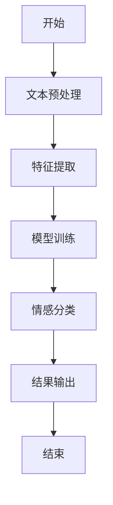
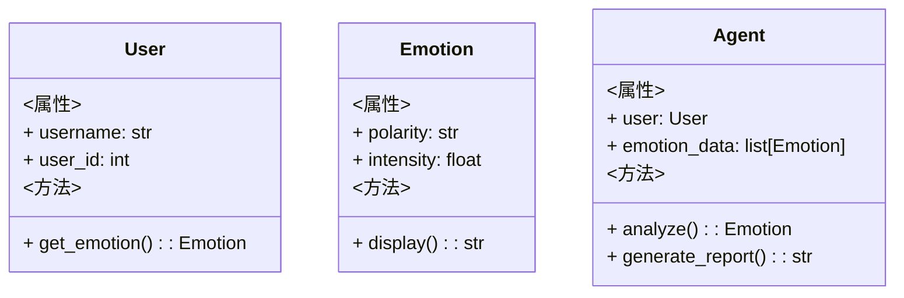
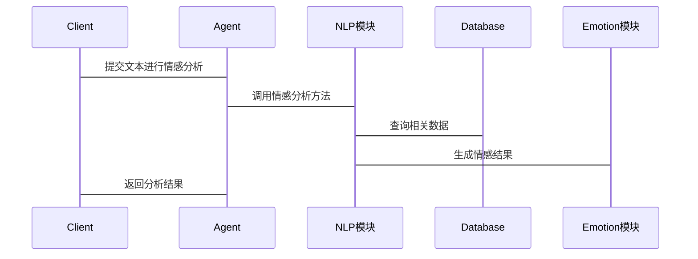

                 


# 开发AI Agent的情感计算在社交媒体分析中的应用

## 关键词：情感计算、社交媒体分析、AI Agent、自然语言处理、机器学习

## 摘要：本文探讨了AI Agent在情感计算中的应用，特别是在社交媒体分析中的情感识别与处理。文章从背景介绍、核心概念、算法原理、系统架构到项目实战，详细阐述了情感计算的应用流程和实现方法。通过理论与实践结合，帮助读者理解如何利用AI Agent进行情感分析，提升社交媒体数据的处理能力。

---

# 第一部分: 情感计算与社交媒体分析的背景与概念

## 第1章: 情感计算与社交媒体分析的背景

### 1.1 情感计算的基本概念

#### 1.1.1 情感计算的定义
情感计算（Affective Computing）是指通过计算机技术来识别、理解、分析和模拟人类情感的过程。它涉及自然语言处理、机器学习和数据挖掘等技术，旨在从文本、语音或图像中提取情感信息。

#### 1.1.2 情感计算的核心要素
- **情感识别**：识别文本中的情感倾向（如正面、负面、中性）。
- **情感强度**：分析情感的强烈程度。
- **情感分类**：将情感分为多个类别（如快乐、愤怒、悲伤）。

#### 1.1.3 情感计算的应用场景
- **社交媒体分析**：分析用户评论、点赞、分享等行为的情感倾向。
- **客户服务**：通过情感分析改进客户支持。
- **市场分析**：帮助企业了解消费者情感偏好。

### 1.2 社交媒体分析的背景

#### 1.2.1 社交媒体的定义与特点
社交媒体是通过互联网平台进行信息分享、传播和互动的工具，具有实时性、互动性和广泛性等特点。

#### 1.2.2 社交媒体分析的重要性
社交媒体分析帮助企业了解用户需求、品牌声誉和市场趋势。

#### 1.2.3 情感计算在社交媒体分析中的作用
情感计算帮助识别社交媒体中的情感信息，提供更精准的分析结果。

### 1.3 AI Agent在情感计算中的角色

#### 1.3.1 AI Agent的定义与特点
AI Agent是一种智能代理，能够感知环境、自主决策并执行任务。

#### 1.3.2 AI Agent在情感计算中的应用
AI Agent可以处理大量社交媒体数据，自动识别情感信息并生成报告。

#### 1.3.3 AI Agent与传统情感计算的区别
AI Agent具有自主性和实时性，能够更快地处理和响应情感信息。

### 1.4 本章小结
本章介绍了情感计算和社交媒体分析的基本概念，以及AI Agent在情感计算中的角色和优势。

---

## 第2章: 情感计算的核心概念与联系

### 2.1 情感计算的核心概念

#### 2.1.1 情感计算的理论基础
情感计算基于心理学、语言学和计算机科学的理论，结合自然语言处理技术。

#### 2.1.2 情感计算的主要方法
- **基于词典的方法**：利用情感词典进行情感分析。
- **基于机器学习的方法**：使用分类器（如SVM、随机森林）进行情感分类。
- **基于深度学习的方法**：利用神经网络进行情感分析。

#### 2.1.3 情感计算的关键技术
- **文本预处理**：分词、去除停用词、词干提取。
- **特征提取**：提取情感相关特征（如情感词、句法结构）。
- **模型训练**：训练情感分类模型。

### 2.2 情感计算与社交媒体分析的联系

#### 2.2.1 情感数据的来源与特点
- **来源**：社交媒体上的评论、帖子、点赞等。
- **特点**：实时性、多样性、情感丰富性。

#### 2.2.2 情感计算在社交媒体分析中的应用
- **情感分析**：识别用户情感倾向。
- **情感强度分析**：分析情感的强烈程度。
- **情感主题分析**：找出情感相关的主题。

#### 2.2.3 情感计算与社交媒体分析的结合
通过结合情感计算和社交媒体分析，企业可以更好地了解用户情感，优化产品和服务。

### 2.3 情感计算的核心要素对比

#### 2.3.1 情感计算的核心属性
- **情感类别**：正面、负面、中性。
- **情感强度**：情感的强烈程度。
- **情感主题**：情感相关的话题。

#### 2.3.2 情感计算与其他计算方法的对比
| 方法 | 优点 | 缺点 |
|------|------|------|
| 词典方法 | 实现简单 | 精度低 |
| 机器学习方法 | 精度高 | 需要大量标注数据 |
| 深度学习方法 | 高精度 | 计算资源需求高 |

#### 2.3.3 ER实体关系图
```mermaid
er
actor: 用户
agent: AI情感计算Agent
emotion_data: 情感数据
analysis_result: 分析结果
action: 行动建议
actor --> agent: 提供情感数据
agent --> emotion_data: 处理情感数据
agent --> analysis_result: 生成分析结果
agent --> action: 提出行动建议
```

### 2.4 本章小结
本章详细讲解了情感计算的核心概念和其在社交媒体分析中的应用，通过对比分析不同方法的优势和劣势，帮助读者更好地理解情感计算的实现过程。

---

## 第3章: 情感计算的算法原理

### 3.1 情感计算的算法流程

#### 3.1.1 算法流程图


#### 3.1.2 文本预处理
- 分词：将文本分割成词语或短语。
- 去除停用词：移除无意义的词语（如“的”、“了”）。
- 词干提取：将词语转化为其基本形式。

#### 3.1.3 特征提取
- 情感词提取：提取具有情感倾向的词语。
- 句法分析：分析句子结构，提取情感特征。

#### 3.1.4 模型训练
- 使用机器学习算法（如SVM、随机森林）训练情感分类模型。
- 使用深度学习算法（如LSTM、BERT）进行情感分析。

#### 3.1.5 情感分类
- 对测试文本进行情感分类，输出情感倾向。

### 3.2 情感计算的数学模型

#### 3.2.1 支持向量机（SVM）模型
SVM是一种常用的分类算法，适用于情感分类。
$$ SVM: y = \text{sign}(w \cdot x + b) $$
其中，$w$是权重向量，$x$是输入特征，$b$是偏置项。

#### 3.2.2 随机森林模型
随机森林是一种基于决策树的集成学习算法，适用于文本分类。
$$ RF: y = \text{多数投票}(决策树预测结果) $$

#### 3.2.3 深度学习模型
使用循环神经网络（RNN）或变换器（Transformer）进行情感分析。
$$ LSTM: h_t = \tanh(W_{hh} h_{t-1} + W_{xh} x_t + b) $$

### 3.3 情感计算的Python实现

#### 3.3.1 环境安装
安装必要的库：
```bash
pip install numpy scikit-learn nltk
```

#### 3.3.2 核心代码实现
```python
import numpy as np
from sklearn.svm import SVC
from sklearn.feature_extraction.text import TfidfVectorizer

# 文本预处理
def preprocess(text):
    # 分词
    words = text.split()
    # 去除停用词
    stopwords = set(['的', '了', '是', '在', '我'])
    filtered_words = [word for word in words if word not in stopwords]
    return ' '.join(filtered_words)

# 特征提取
vectorizer = TfidfVectorizer()
X = vectorizer.fit_transform([preprocess(text) for text in texts])

# 模型训练
model = SVC()
model.fit(X, labels)

# 情感分类
test_text = "这是一个好产品"
test_X = vectorizer.transform([preprocess(test_text)])
predicted = model.predict(test_X)
print(predicted)
```

#### 3.3.3 代码解读与分析
- **文本预处理**：对输入文本进行分词和停用词处理。
- **特征提取**：使用TF-IDF方法提取文本特征。
- **模型训练**：使用SVM算法训练情感分类模型。
- **情感分类**：对测试文本进行情感分类，输出结果。

### 3.4 本章小结
本章详细讲解了情感计算的算法原理，包括算法流程、数学模型和Python代码实现，帮助读者理解情感计算的技术细节。

---

## 第4章: 系统分析与架构设计方案

### 4.1 问题场景介绍

#### 4.1.1 问题背景
社交媒体数据量庞大，情感信息丰富，如何高效地进行情感分析是一个挑战。

#### 4.1.2 问题描述
开发一个AI Agent，能够实时分析社交媒体上的文本，识别情感倾向并生成分析报告。

#### 4.1.3 问题解决
通过设计一个基于AI Agent的情感计算系统，实现高效的社交媒体情感分析。

### 4.2 系统功能设计

#### 4.2.1 领域模型类图


#### 4.2.2 系统架构设计


#### 4.2.3 系统接口设计
- **API接口**：提供HTTP接口，接收用户请求并返回情感分析结果。
- **数据库接口**：与数据库交互，存储和检索用户信息。

#### 4.2.4 系统交互流程


### 4.3 本章小结
本章设计了一个基于AI Agent的社交媒体情感分析系统，详细描述了系统的功能模块、架构设计和交互流程，为后续的开发提供了指导。

---

## 第5章: 项目实战

### 5.1 环境安装与配置

#### 5.1.1 安装必要的库
```bash
pip install numpy scikit-learn nltk transformers
```

#### 5.1.2 安装依赖项
安装自然语言处理工具，如spaCy：
```bash
pip install spacy
python -m spacy download en_core_web_sm
```

### 5.2 核心代码实现

#### 5.2.1 AI Agent的实现
```python
import spacy
from transformers import pipeline

nlp = spacy.load("en_core_web_sm")
sentiment_analyzer = pipeline("sentiment-analysis")

def analyze_emotion(text):
    doc = nlp(text)
    result = sentiment_analyzer(text)
    return result['label']

text = "I love this product!"
emotion = analyze_emotion(text)
print(emotion)  # 输出: 'POSITIVE'
```

#### 5.2.2 系统功能实现
```python
class AI_Agent:
    def __init__(self):
        self.nlp = spacy.load("en_core_web_sm")
        self.sentiment_analyzer = pipeline("sentiment-analysis")

    def analyze(self, text):
        return self.sentiment_analyzer(text)['label']

    def generate_report(self, results):
        # 生成情感分析报告
        pass
```

### 5.3 实际案例分析

#### 5.3.1 数据采集
从社交媒体平台获取评论数据：
```python
import tweepy

# 设置API密钥
auth = tweepy.OAuthHandler(consumer_key, consumer_secret)
api = tweepy.API(auth)

# 获取推特数据
tweets = api.search(q="AI", count=100)
```

#### 5.3.2 情感分析
对获取的推特数据进行情感分析：
```python
agent = AI_Agent()
results = []
for tweet in tweets:
    emotion = agent.analyze(tweet.text)
    results.append(emotion)

print(results)
```

#### 5.3.3 结果可视化
使用图表展示情感分析结果：
```python
import matplotlib.pyplot as plt

positive = results.count('POSITIVE')
negative = results.count('NEGATIVE')
neutral = results.count('NEUTRAL')

plt.bar(['Positive', 'Negative', 'Neutral'], [positive, negative, neutral])
plt.show()
```

### 5.4 本章小结
本章通过实际案例展示了如何开发一个基于AI Agent的社交媒体情感分析系统，详细讲解了环境配置、代码实现和结果可视化，帮助读者掌握实际操作技能。

---

## 第6章: 最佳实践与总结

### 6.1 小结

#### 6.1.1 核心知识点回顾
- 情感计算的基本概念和应用场景。
- AI Agent在社交媒体分析中的角色和优势。
- 情感计算的算法原理和实现方法。
- 系统架构设计和项目实战经验。

### 6.2 注意事项

#### 6.2.1 数据质量
- 确保数据的准确性和完整性，避免噪声干扰。
- 处理多语言文本时，需考虑语言差异。

#### 6.2.2 模型选择
- 根据任务需求选择合适的模型和算法。
- 定期更新模型，保持分类精度。

#### 6.2.3 系统优化
- 优化算法性能，提升处理速度。
- 采用分布式架构，提高系统的扩展性。

### 6.3 拓展阅读

#### 6.3.1 推荐书籍
- 《Affective Computing》
- 《自然语言处理实战》

#### 6.3.2 推荐博客与资源
- Medium上的相关技术博客。
- GitHub上的开源项目。

### 6.4 本章小结
本章总结了全文的核心知识点，提出了实际应用中的注意事项，并推荐了进一步学习的资源，帮助读者巩固知识，提升技能。

---

# 结语

开发AI Agent的情感计算在社交媒体分析中的应用是一项复杂但极具挑战性的任务。通过本文的系统介绍，读者可以全面理解情感计算的技术原理和实现方法，掌握AI Agent在社交媒体分析中的应用技巧。希望本文能为相关领域的研究和实践提供有价值的参考和指导。

