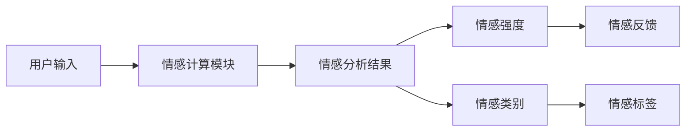
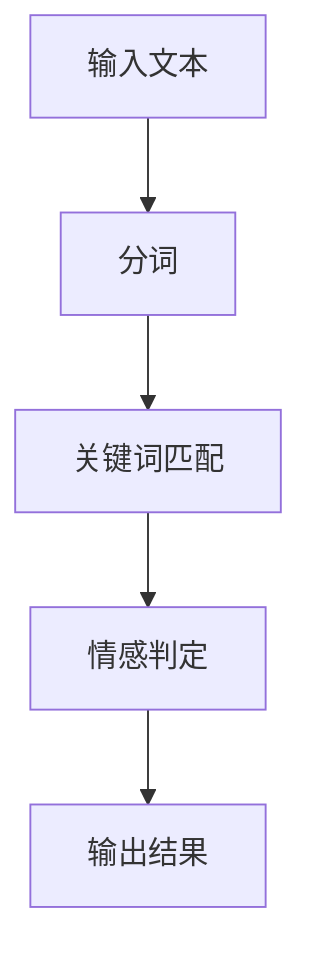
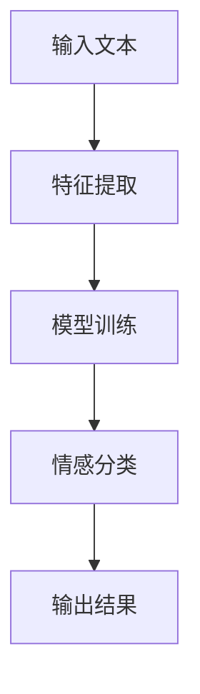
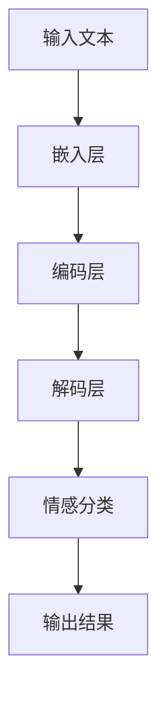

                 


# 开发AI Agent的情感计算模块

> 关键词：情感计算，AI Agent，自然语言处理，深度学习，情感分析，机器学习

> 摘要：本文详细探讨了开发AI Agent的情感计算模块的关键技术，包括情感计算的背景、核心概念、算法原理、系统架构设计、项目实战以及最佳实践。文章通过逐步分析，结合实际案例和代码实现，帮助读者深入理解情感计算模块的开发过程和应用价值。

---

# 第1章: 情感计算模块开发背景

## 1.1 情感计算的基本概念

### 1.1.1 情感计算的定义与核心目标

情感计算（Affective Computing）是人工智能领域的一个重要分支，专注于识别、理解和计算人类情感。其核心目标是通过分析文本、语音或图像等输入，提取其中的情感信息，如快乐、悲伤、愤怒等，并将其转化为可计算的模型。情感计算的目标是让计算机能够理解人类的情感状态，从而实现更自然的交互。

### 1.1.2 情感计算的应用场景与重要性

情感计算在多个领域有广泛应用，例如：

- **社交媒体分析**：分析用户评论的情感倾向，帮助企业了解用户反馈。
- **智能客服**：通过分析用户语气，提供更个性化的服务。
- **虚拟助手**：如Siri、Alexa等，能够根据用户情感调整交互方式。
- **医疗健康**：通过分析患者的情感状态，辅助诊断和治疗。

情感计算的重要性在于它能够增强人机交互的自然性和智能性，使计算机系统更加贴近人类的情感需求。

### 1.1.3 AI Agent与情感计算的关系

AI Agent（智能体）是一个能够感知环境并采取行动以实现目标的实体。情感计算作为AI Agent的一个重要模块，负责处理与情感相关的信息，使AI Agent能够更好地理解用户的情感需求，从而提供更个性化的服务。

---

## 1.2 AI Agent的定义与特点

### 1.2.1 AI Agent的基本定义

AI Agent是一种智能实体，能够感知环境、理解用户需求并采取行动以实现目标。AI Agent可以是软件程序、机器人或其他智能设备，其核心能力包括感知、推理、学习和行动。

### 1.2.2 AI Agent的核心特点

- **自主性**：能够在没有外部干预的情况下独立运行。
- **反应性**：能够实时感知环境并做出反应。
- **学习能力**：能够通过数据和经验不断优化自身行为。
- **社交能力**：能够与人类或其他智能体进行交互。

### 1.2.3 AI Agent在情感计算中的角色

AI Agent通过情感计算模块，能够理解用户的语言、语气和情感状态，从而在交互中提供更人性化和个性化的服务。例如，在智能客服中，AI Agent可以通过分析用户的情感状态，调整回答的语气和内容，提升用户体验。

---

## 1.3 情感计算模块的开发背景

### 1.3.1 情感计算的发展历程

情感计算的概念最早由Picard在1995年提出，此后随着人工智能技术的发展，情感计算逐渐从理论研究走向实际应用。近年来，随着深度学习技术的进步，情感计算的准确性和效率有了显著提升。

### 1.3.2 当前AI Agent在情感计算中的应用趋势

当前，情感计算在AI Agent中的应用呈现多样化趋势，包括：

- **情感识别**：通过文本、语音或图像识别用户情感。
- **情感分析**：对用户输入的情感倾向进行分类。
- **情感反馈**：根据用户情感调整交互策略。

### 1.3.3 开发情感计算模块的意义与价值

开发情感计算模块能够显著提升AI Agent的智能性和用户体验，使其能够更好地理解用户需求，提供更个性化的服务。同时，情感计算也是实现人机自然交互的重要基础。

---

## 1.4 本章小结

### 1.4.1 情感计算模块的核心概念总结

情感计算是人工智能领域的重要分支，通过分析情感信息，帮助计算机理解人类情感需求。AI Agent通过情感计算模块，能够实现更自然和个性化的交互。

### 1.4.2 AI Agent情感计算模块的开发目标

开发情感计算模块的目标是提升AI Agent的智能性，使其能够理解并响应用户的情感需求，从而提供更优质的服务。

---

# 第2章: 情感计算的核心概念与联系

## 2.1 情感计算的理论基础

### 2.1.1 情感计算的基本原理

情感计算的基本原理包括以下几个步骤：

1. **输入获取**：获取用户的输入，如文本、语音或图像。
2. **特征提取**：从输入中提取情感相关的特征，如关键词、语调、面部表情等。
3. **情感分析**：通过算法对特征进行分析，确定用户的情感状态。
4. **结果输出**：输出情感分析结果，如情感类别和情感强度。

### 2.1.2 情感计算的关键技术

- **特征提取技术**：如文本分词、关键词提取。
- **情感分析技术**：如基于规则的分析、机器学习模型、深度学习模型。
- **情感表达技术**：如情感可视化、情感反馈。

### 2.1.3 情感计算与自然语言处理的关系

情感计算与自然语言处理（NLP）密切相关。情感计算依赖于NLP技术来提取文本中的情感信息，而NLP技术也通过情感计算来增强其在实际应用中的智能性。

---

## 2.2 情感计算的核心算法模型

### 2.2.1 基于规则的情感分析模型

基于规则的模型通过预定义的规则和关键词来判断情感。例如，如果文本中包含“很好”、“满意”等关键词，则判定为正面情感。

### 2.2.2 基于机器学习的情感分析模型

基于机器学习的模型通过训练数据学习情感特征，常用的算法包括支持向量机（SVM）、随机森林（Random Forest）等。

### 2.2.3 基于深度学习的情感分析模型

基于深度学习的模型（如LSTM、Transformer）能够自动学习情感相关的特征，具有更高的准确性和鲁棒性。

---

## 2.3 情感计算模型的对比分析

### 2.3.1 不同模型的优缺点对比

| 模型类型        | 优点                          | 缺点                          |
|-----------------|-------------------------------|-------------------------------|
| 基于规则        | 实现简单，易于解释            | 精度低，难以处理复杂情感       |
| 基于机器学习    | 精度较高，适合大规模数据       | 实现复杂，需要大量标注数据     |
| 基于深度学习    | 精度最高，能够处理复杂情感     | 计算资源消耗大，实现复杂       |

### 2.3.2 模型选择的依据与策略

模型选择需要考虑数据量、计算资源和精度要求。对于小数据集，基于规则的模型可能更合适；对于大规模数据，深度学习模型更具优势。

### 2.3.3 情感计算模型的评估指标

常用的评估指标包括准确率（Accuracy）、精确率（Precision）、召回率（Recall）和F1值（F1-score）。

---

## 2.4 情感计算的ER实体关系图



---

## 2.5 本章小结

### 2.5.1 情感计算的核心概念总结

情感计算通过分析情感特征，利用规则、机器学习和深度学习模型，实现对用户情感状态的识别和分类。

### 2.5.2 不同情感计算模型的优缺点分析

不同模型在精度、实现复杂度和计算资源需求方面各有优劣，选择合适的模型需要根据具体场景和需求进行权衡。

---

# 第3章: 情感计算模块的算法原理

## 3.1 情感分析算法概述

### 3.1.1 基于规则的情感分析算法

基于规则的算法通过预定义的规则和关键词匹配来判断情感。例如，如果文本中包含“开心”、“满意”等关键词，则判定为正面情感。

### 3.1.2 基于机器学习的情感分析算法

基于机器学习的算法通过训练数据学习情感特征，常用的算法包括SVM和随机森林。

### 3.1.3 基于深度学习的情感分析算法

基于深度学习的算法（如LSTM、Transformer）能够自动学习情感相关的特征，具有更高的准确性和鲁棒性。

---

## 3.2 基于规则的情感分析算法

### 3.2.1 算法流程



### 3.2.2 规则库的构建与优化

规则库的构建需要根据具体场景和数据特点进行优化，例如通过统计关键词出现频率来调整规则的权重。

---

## 3.3 基于机器学习的情感分析算法

### 3.3.1 算法流程



### 3.3.2 模型训练与优化

模型训练需要大量的标注数据，并通过交叉验证和超参数调优来优化模型性能。

### 3.3.3 情感分类的数学模型

情感分类可以通过逻辑回归模型实现，例如：

$$ P(y=1|x) = \frac{1}{1 + e^{-w^T x - b}} $$

其中，$w$ 是权重向量，$x$ 是输入特征，$b$ 是偏置项。

---

## 3.4 基于深度学习的情感分析算法

### 3.4.1 算法流程



### 3.4.2 深度学习模型的实现细节

深度学习模型（如BERT）可以通过预训练和微调来实现情感分类，其核心思想是通过多层神经网络提取文本的深层语义特征。

---

## 3.5 情感分析的数学模型

### 3.5.1 逻辑回归模型

逻辑回归模型用于二分类情感分析，其损失函数可以表示为：

$$ L = -\sum_{i=1}^{n} [y_i \ln p_i + (1 - y_i) \ln (1 - p_i)] $$

其中，$p_i$ 是第i个样本的预测概率，$y_i$ 是标签。

### 3.5.2 支持向量机模型

支持向量机（SVM）通过构建超平面实现情感分类，其优化目标为：

$$ \min_{w, b} \frac{1}{2} \|w\|^2 + C \sum_{i=1}^{n} \max(0, 1 - y_i (w^T x_i + b)) $$

其中，$C$ 是惩罚系数，$y_i$ 是标签。

---

## 3.6 本章小结

### 3.6.1 情感分析算法的核心原理总结

情感分析算法通过特征提取、模型训练和情感分类，实现对用户情感状态的识别和分类。

### 3.6.2 不同算法的优缺点分析

基于规则的算法简单但精度低，基于机器学习的算法精度高但实现复杂，基于深度学习的算法精度最高但计算资源消耗大。

---

# 第4章: 情感计算模块的系统架构设计

## 4.1 系统功能设计

### 4.1.1 系统功能模块划分

情感计算模块的主要功能包括：

- **输入处理**：接收用户输入的文本、语音或图像。
- **特征提取**：从输入中提取情感相关的特征。
- **情感分析**：对特征进行分析，确定用户的情感状态。
- **结果反馈**：根据分析结果生成反馈信息。

### 4.1.2 系统功能模块的交互流程


---

## 4.2 系统架构设计

### 4.2.1 系统架构图


### 4.2.2 系统架构设计的优缺点

- **优点**：模块化设计，便于维护和扩展。
- **缺点**：需要处理模块之间的交互问题，可能增加系统复杂性。

---

## 4.3 系统接口设计

### 4.3.1 系统接口的定义

系统接口包括：

- **输入接口**：接收用户输入的文本、语音或图像。
- **输出接口**：输出情感分析结果和反馈信息。

### 4.3.2 接口设计的注意事项

- **兼容性**：确保接口能够支持多种输入格式。
- **性能**：优化接口的响应速度和处理能力。

---

## 4.4 系统交互流程设计

### 4.4.1 系统交互流程图


### 4.4.2 交互流程的优化建议

- **优化1**：通过并行处理减少系统响应时间。
- **优化2**：通过缓存技术减少重复计算。

---

## 4.5 本章小结

### 4.5.1 系统架构设计的核心要点总结

情感计算模块的系统架构设计需要考虑模块化、接口兼容性和性能优化。

### 4.5.2 系统架构设计的未来发展趋势

随着技术的进步，情感计算模块的系统架构将更加智能化和分布式，支持更大规模的数据处理和更复杂的交互场景。

---

# 第5章: 情感计算模块的项目实战

## 5.1 项目背景与目标

### 5.1.1 项目背景

本项目旨在开发一个基于AI Agent的情感计算模块，用于分析用户评论的情感倾向。

### 5.1.2 项目目标

- 实现情感计算模块的核心功能，包括输入处理、特征提取和情感分析。
- 提供一个可扩展的系统架构，支持未来的功能扩展。

---

## 5.2 项目环境搭建

### 5.2.1 环境要求

- **操作系统**：Linux/Windows/MacOS
- **编程语言**：Python 3.8+
- **深度学习框架**：TensorFlow/PyTorch
- **依赖库**：numpy、pandas、scikit-learn、transformers

### 5.2.2 环境搭建步骤

1. 安装Python和必要的依赖库。
2. 安装深度学习框架（如TensorFlow或PyTorch）。
3. 下载预训练的情感分析模型（如BERT）。

---

## 5.3 核心代码实现

### 5.3.1 输入处理模块

```python
def preprocess_input(text):
    # 分词
    words = text.split()
    # 转换为小写
    words = [word.lower() for word in words]
    return ' '.join(words)
```

### 5.3.2 特征提取模块

```python
from sklearn.feature_extraction.text import TfidfVectorizer

vectorizer = TfidfVectorizer()
X = vectorizer.fit_transform(corpus)
```

### 5.3.3 情感分析模块

```python
from sklearn.svm import SVC

model = SVC(C=1.0, gamma='auto')
model.fit(X, y)
```

### 5.3.4 结果反馈模块

```python
def generate_feedback(emotion):
    feedback = {
        'positive': '感谢您的支持，很高兴为您服务！',
        'negative': '非常抱歉给您带来不好的体验，我们会改进的！'
    }
    return feedback.get(emotion, '谢谢您的反馈！')
```

---

## 5.4 项目实战案例分析

### 5.4.1 案例背景

假设我们有一个社交媒体评论数据集，包含用户的评论和情感标签（正面、负面）。

### 5.4.2 案例分析

1. **数据预处理**：对评论进行分词和大小写转换。
2. **特征提取**：使用TF-IDF提取文本特征。
3. **模型训练**：使用SVM进行情感分类。
4. **结果反馈**：根据分类结果生成反馈信息。

---

## 5.5 项目总结

### 5.5.1 项目实现的关键点总结

- **输入处理**：确保输入数据的格式和格式化处理。
- **特征提取**：选择合适的特征提取方法，如TF-IDF。
- **情感分析**：选择适合的模型进行情感分类。
- **结果反馈**：根据情感分析结果生成合适的反馈信息。

### 5.5.2 项目实现的优化建议

- **优化1**：使用更高效的特征提取方法，如Word2Vec。
- **优化2**：使用更复杂的模型（如BERT）提升分类精度。

---

# 第6章: 情感计算模块的最佳实践

## 6.1 开发中的注意事项

### 6.1.1 数据预处理

- 确保数据的干净性和一致性。
- 处理停用词和标点符号。

### 6.1.2 模型选择

- 根据数据量和计算资源选择合适的模型。
- 对于小数据集，基于规则的模型可能更合适。

### 6.1.3 模型调优

- 使用交叉验证和超参数调优优化模型性能。
- 处理数据偏差，确保模型的泛化能力。

---

## 6.2 情感计算模块的维护与优化

### 6.2.1 模型维护

- 定期更新模型，确保其适应新的数据和场景。
- 监控模型的性能，及时调整和优化。

### 6.2.2 情感计算的实时性优化

- 优化系统架构，提升处理速度。
- 使用缓存技术减少重复计算。

---

## 6.3 情感计算的安全性与隐私保护

### 6.3.1 数据隐私保护

- 确保用户数据的安全和隐私。
- 遵守相关法律法规，如GDPR。

### 6.3.2 情感计算的伦理问题

- 避免情感计算的滥用，如深度伪造和情感操控。

---

## 6.4 未来的发展方向

### 6.4.1 情感计算的多模态融合

- 结合文本、语音、图像等多种模态信息，提升情感计算的准确性和全面性。

### 6.4.2 情感计算的实时反馈机制

- 实现情感计算的实时反馈，提升用户体验和交互效率。

---

## 6.5 本章小结

### 6.5.1 情感计算模块的开发注意事项总结

在开发情感计算模块时，需要注意数据预处理、模型选择和调优，确保系统的高效性和准确性。

### 6.5.2 情感计算的未来发展趋势

随着技术的进步，情感计算将更加智能化和多模态化，支持更复杂和多样化的应用场景。

---

# 第7章: 结论与展望

## 7.1 研究总结

### 7.1.1 情感计算模块的核心价值

情感计算模块能够提升AI Agent的智能性和用户体验，使其能够更自然和个性化地与用户交互。

### 7.1.2 本文的主要贡献

本文详细探讨了情感计算模块的开发背景、核心概念、算法原理、系统架构设计和项目实战，并提出了最佳实践和未来的发展方向。

---

## 7.2 未来展望

### 7.2.1 情感计算的技术进步

随着深度学习和多模态技术的发展，情感计算的准确性和效率将不断提升。

### 7.2.2 情感计算的应用拓展

情感计算将在更多领域得到应用，如教育、医疗、娱乐等，推动人机交互的智能化和个性化。

---

## 7.3 结论

情感计算模块是AI Agent实现人机自然交互的重要组成部分。本文通过系统的分析和实践，为开发者提供了情感计算模块的开发指南和优化建议。未来，随着技术的进步，情感计算将在更多领域发挥重要作用。

---

# 参考文献

1. Picard, R. W. (1995). Affective computing. MIT press.
2. Liu, H. (2012). Sentiment analysis: Mining opinions,  identifying attitudes, tracking attitudes. Synthesis lectures on artificial intelligence and machine learning.
3. LeCun, Y., Bengio, Y., & Hinton, G. (2015). Deep learning. Nature, 521(7555), 436-444.

