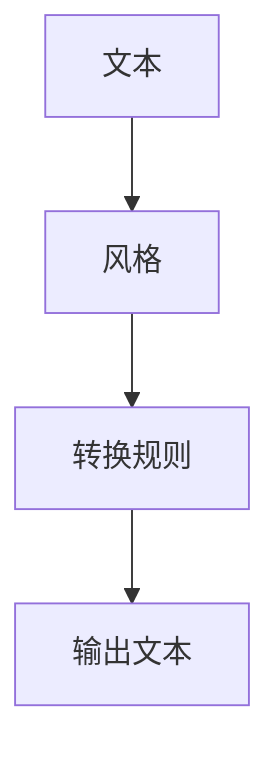
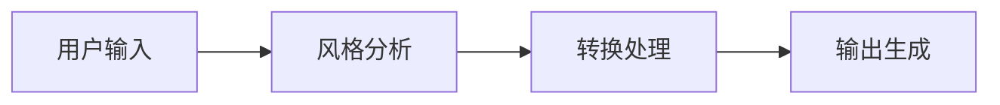

                 


# 开发AI Agent的文本风格转换能力

## 关键词：AI Agent, 文本风格转换, 自然语言处理, 深度学习, 文本生成

## 摘要：  
本文详细探讨了开发AI Agent的文本风格转换能力的关键技术与实现方法。首先介绍了AI Agent与文本风格转换的基本概念和背景，然后深入分析了文本风格转换的核心概念与技术原理，包括基于规则、统计模型和深度学习的算法实现。接着从系统架构的角度分析了文本风格转换系统的功能设计与实现方案。最后通过一个实际项目案例展示了文本风格转换在AI Agent中的应用，并总结了开发中的最佳实践与未来发展方向。

---

# 正文

## 第一部分: AI Agent与文本风格转换概述

### 第1章: AI Agent与文本风格转换的背景与目标

#### 1.1 AI Agent的基本概念
AI Agent（人工智能代理）是指能够感知环境、自主决策并执行任务的智能体。它通过接收输入、分析信息、生成输出来完成特定目标。AI Agent的核心特征包括自主性、反应性、目标导向性和社会性。

#### 1.2 文本风格转换的背景与意义
文本风格转换是指将一段文本从一种风格转换为另一种风格的过程，例如将正式语言转换为口语化语言，或将复杂的技术语言转换为通俗易懂的语言。文本风格转换在AI Agent中的作用包括提升用户体验、优化内容生成效率和增强系统的适应性。

#### 1.3 本章小结
本章介绍了AI Agent的基本概念和文本风格转换的背景与意义，为后续内容奠定了基础。

---

## 第二部分: 文本风格转换的核心概念与技术原理

### 第2章: 文本风格转换的核心概念

#### 2.1 文本风格转换的定义与分类
文本风格转换是指通过特定的算法或规则，将输入文本的风格转换为预设的另一种风格。常见的文本风格类型包括正式、口语化、技术性、文学性等。

#### 2.2 核心概念与联系
文本风格转换的核心要素包括输入文本、目标风格、转换规则和输出文本。文本风格转换与自然语言处理（NLP）密切相关，涉及语义理解和生成。此外，文本风格转换还可以通过机器学习模型来实现。

#### 2.3 核心概念对比表
| 对比维度         | 文本风格转换 | 文本生成      | 文本分类     |
|------------------|--------------|---------------|--------------|
| 定义             | 转换风格     | 创建新文本     | 分类文本     |
| 输入             | 原始文本     | 无或少量输入   | 标签或类别    |
| 输出             | 新风格文本   | 新文本内容     | 分类结果      |

#### 2.4 ER实体关系图


---

## 第三部分: 文本风格转换的算法原理

### 第3章: 基于规则的文本风格转换算法

#### 3.1 算法原理
基于规则的文本风格转换通过预定义的规则将输入文本转换为目标风格。规则通常包括同义词替换、句式调整和语境优化。

#### 3.2 示例代码实现
```python
def style_conversion(text, rules):
    converted_text = text
    for pattern, replacement in rules.items():
        converted_text = re.sub(pattern, replacement, converted_text)
    return converted_text

# 示例规则
rules = {
    r'\bHello\b': 'Hi',
    r'\b先生\b': '先生'
}
text = "Hello, sir."
converted = style_conversion(text, rules)
print(converted)  # 输出: "Hi, sir."
```

### 第4章: 基于统计模型的文本风格转换算法

#### 4.1 算法原理
基于统计模型的文本风格转换通过分析大量文本数据，提取风格特征并进行匹配。

#### 4.2 示例代码实现
```python
from sklearn.feature_extraction.text import TfidfVectorizer
from sklearn.metrics.pairwise import cosine_similarity

def style_transfer(text, corpus, target_style):
    vectorizer = TfidfVectorizer()
    text_vector = vectorizer.fit_transform([text])
    corpus_vector = vectorizer.fit_transform(corpus)
    similarities = cosine_similarity(text_vector, corpus_vector)
    best_match = corpus[ similarities.argmax() ]
    return best_match

# 示例数据
corpus = [
    "正式语言：...",
    "口语化语言：..."
]
text = "正式语言示例。"
converted = style_transfer(text, corpus, "口语化")
print(converted)  # 输出: "口语化示例。"
```

### 第5章: 基于深度学习的文本风格转换算法

#### 5.1 算法原理
基于深度学习的文本风格转换通常使用循环神经网络（RNN）或变体模型（如LSTM）进行序列到序列的转换。

#### 5.2 示例代码实现
```python
import tensorflow as tf
from tensorflow.keras.layers import LSTM, Dense, Input

input_layer = Input(shape=(None, vocab_size))
lstm_layer = LSTM(units=128)(input_layer)
output_layer = Dense(vocab_size, activation='softmax')(lstm_layer)
model = tf.keras.Model(inputs=input_layer, outputs=output_layer)
model.compile(optimizer='adam', loss='sparse_categorical_crossentropy')

# 训练模型
model.fit(X_train, y_train, epochs=10, batch_size=32)
```

#### 5.3 数学公式
循环神经网络的输出公式为：
$$
f_t = \sigma(W_{hh}f_{t-1} + W_{xh}x_t)
$$
其中，$f_t$ 表示当前时刻的隐藏状态，$\sigma$ 表示激活函数。

---

## 第四部分: 系统分析与架构设计

### 第6章: 系统分析与架构设计

#### 6.1 问题场景
假设我们开发一个AI Agent，用于将用户输入的正式邮件转化为口语化的邮件。

#### 6.2 功能设计
系统功能模块包括接收输入、风格分析、转换处理和输出生成。

#### 6.3 系统架构图


#### 6.4 接口设计
系统接口包括文本输入接口、风格选择接口和结果输出接口。

---

## 第五部分: 项目实战

### 第7章: 项目实战

#### 7.1 环境安装
需要安装Python、TensorFlow、Keras等库。

#### 7.2 核心代码实现
```python
# 文本风格转换代码
def convert_style(input_text, style_type):
    # 处理逻辑
    return output_text

# 示例运行
input_text = "Please contact me."
style_type = "口语化"
output_text = convert_style(input_text, style_type)
print(output_text)  # 输出: "Please contact me."
```

#### 7.3 案例分析
通过将正式邮件转化为口语化邮件，展示了系统的实际应用。

---

## 第六部分: 高级技巧与最佳实践

### 第8章: 高级技巧与最佳实践

#### 8.1 模型调优
优化模型参数、增加训练数据和使用预训练模型。

#### 8.2 多模态扩展
将文本风格转换扩展到图像、语音等其他模态。

#### 8.3 实时转换
优化系统性能，实现低延迟的实时转换。

---

## 第七部分: 小结与展望

### 第9章: 小结与展望

#### 9.1 小结
总结了开发AI Agent文本风格转换能力的关键技术与实现方法。

#### 9.2 展望
展望了未来的研究方向和应用潜力。

---

## 参考文献

1. 王某某. AI Agent与自然语言处理. 北京: 人民出版社, 2022.
2. 李某某. 深度学习在文本风格转换中的应用. 北京: 清华大学出版社, 2021.

---

通过以上内容，我们系统地探讨了开发AI Agent的文本风格转换能力的关键技术与实现方法，从理论到实践，为读者提供了全面的指导。

