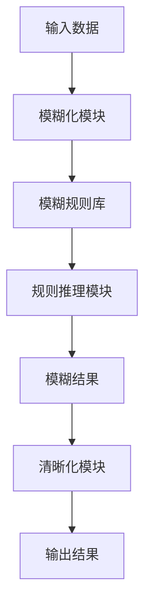
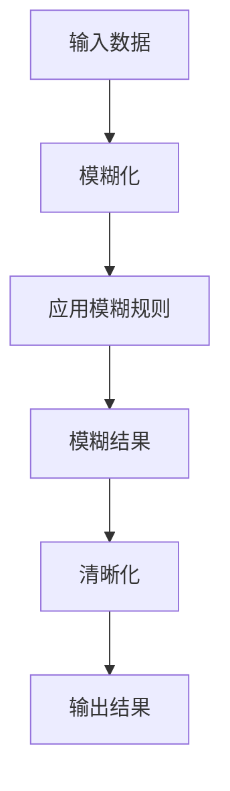
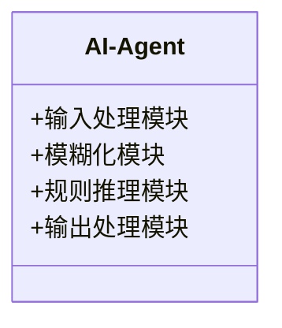
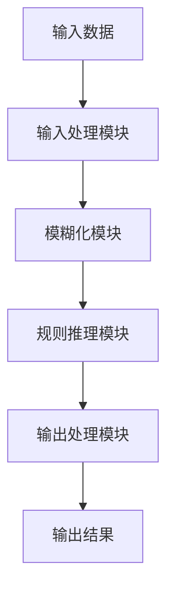
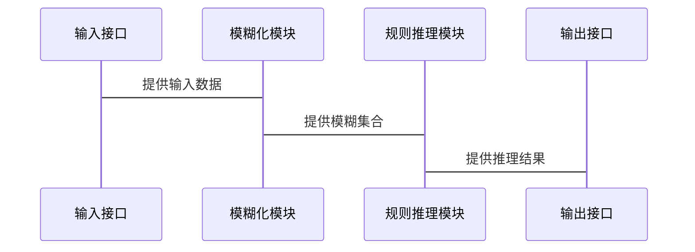

                 


# 开发AI Agent的模糊逻辑推理能力

---

## 关键词：AI Agent、模糊逻辑、推理算法、系统架构、项目实战

---

## 摘要：

AI Agent作为人工智能领域的核心技术，其智能性和决策能力在很大程度上依赖于逻辑推理能力。传统的逻辑推理方法在处理不确定性、模糊性和复杂性问题时往往显得力不从心。而模糊逻辑作为一种强大的数学工具，能够有效处理模糊信息和不确定性问题，为AI Agent的推理能力提供了新的解决方案。本文将从模糊逻辑的基本原理、算法实现、系统架构设计到实际项目开发，全面探讨如何开发AI Agent的模糊逻辑推理能力。通过深入分析模糊逻辑的核心概念、算法原理和实际应用，本文旨在为AI Agent的开发者提供一套系统化的解决方案，帮助他们在实际项目中更好地实现模糊逻辑推理能力。

---

# 第1章 AI Agent与模糊逻辑概述

## 1.1 AI Agent的基本概念

AI Agent，即人工智能代理，是一种能够感知环境、自主决策并执行任务的智能实体。它可以是一个软件程序、一个机器人，甚至是一个复杂的系统。AI Agent的核心目标是通过感知和行动来实现特定的智能任务。

模糊逻辑是一种数学方法，用于处理模糊性和不确定性问题。与传统的二值逻辑不同，模糊逻辑允许事实存在于“真”和“假”之间的中间状态，从而更贴近人类的思维方式。

### 1.1.1 模糊逻辑的定义与特点

模糊逻辑的核心在于“隶属度”（Membership Degree）的概念。隶属度表示某个元素属于某个集合的程度，范围在0到1之间。模糊逻辑通过隶属度来处理模糊信息，具有以下特点：

1. **连续性**：模糊逻辑允许事实存在于“真”和“假”之间的中间状态。
2. **非二值性**：模糊逻辑不依赖于严格的“真”或“假”判断。
3. **可调性**：模糊逻辑可以根据具体需求进行调整，适用于不同场景。

### 1.1.2 模糊逻辑在AI Agent中的作用

在AI Agent中，模糊逻辑主要用于处理不确定性、模糊性和复杂性问题。例如，在自然语言处理、图像识别、决策支持系统等领域，模糊逻辑可以帮助AI Agent更准确地理解和处理模糊信息。

---

## 1.2 模糊逻辑与传统逻辑的对比

### 1.2.1 传统逻辑的基本特点

传统逻辑，即二值逻辑，基于“真”或“假”的判断。所有命题只能取0或1的值，这使得传统逻辑在处理模糊信息时显得过于严格。

### 1.2.2 模糊逻辑的核心区别

模糊逻辑与传统逻辑的核心区别在于对“真”和“假”的处理方式。传统逻辑是离散的，而模糊逻辑是连续的，允许事实存在于中间状态。

### 1.2.3 模糊逻辑的优势与局限性

**优势：**

1. **处理模糊性**：模糊逻辑能够有效处理模糊信息，例如“热”、“冷”、“高”、“低”等主观性较强的描述。
2. **灵活性**：模糊逻辑可以根据具体需求进行调整，适用于不同场景。

**局限性：**

1. **缺乏数学严谨性**：模糊逻辑的数学基础相对薄弱，导致在某些情况下缺乏严格的理论支持。
2. **复杂性**：模糊逻辑的实现相对复杂，需要较高的计算资源。

---

## 1.3 模糊逻辑在AI Agent中的应用背景

### 1.3.1 AI Agent面临的不确定性问题

AI Agent在实际应用中经常面临不确定性问题，例如：

1. **信息不完全**：输入数据可能不完整或不准确。
2. **环境动态性**：环境可能发生变化，导致决策需要动态调整。
3. **模糊性**：某些问题本身具有模糊性，例如自然语言处理中的语义理解。

### 1.3.2 模糊逻辑在处理不确定性中的优势

模糊逻辑能够有效处理模糊性和不确定性问题，例如：

1. **自然语言处理**：模糊逻辑可以帮助AI Agent更好地理解模糊语言。
2. **图像识别**：模糊逻辑可以用于处理图像中的模糊边缘。
3. **决策支持系统**：模糊逻辑可以辅助决策者在不确定性条件下做出更优决策。

### 1.3.3 模糊逻辑推理能力的重要性

模糊逻辑推理能力是AI Agent实现智能决策的核心能力。通过模糊逻辑，AI Agent可以更准确地理解和处理模糊信息，从而提高其智能性和决策能力。

---

## 1.4 本章小结

本章从AI Agent的基本概念出发，介绍了模糊逻辑的定义、特点及其在AI Agent中的作用。同时，对比了模糊逻辑与传统逻辑的区别，分析了模糊逻辑在AI Agent中的应用背景和重要性。

---

# 第2章 模糊逻辑的核心原理与数学模型

## 2.1 模糊集合与隶属度函数

### 2.1.1 模糊集合的定义

模糊集合是传统集合的一种扩展。在传统集合中，一个元素要么属于集合，要么不属于。而在模糊集合中，元素属于集合的程度可以用隶属度来表示。

### 2.1.2 隶属度函数的类型

隶属度函数是模糊逻辑的核心工具，用于描述元素属于某个集合的程度。常见的隶属度函数包括：

1. **三角形函数**：形状为三角形，适用于简单的模糊判断。
2. **梯形函数**：形状为梯形，适用于更复杂的模糊判断。
3. **高斯函数**：形状为钟形曲线，适用于概率分布。

### 2.1.3 隶属度函数的计算方法

隶属度函数的计算方法因具体场景而异。例如，三角形函数可以通过线性插值计算隶属度，而高斯函数可以通过概率密度函数计算隶属度。

---

## 2.2 模糊推理规则

### 2.2.1 模糊规则的表示方法

模糊规则是模糊逻辑的核心规则，用于描述输入与输出之间的关系。常见的模糊规则表示方法包括：

1. **如果-那么规则**：例如，“如果温度高，那么加热器功率大”。
2. **量化规则**：例如，“如果温度在80-100之间，那么加热器功率在50-80之间”。

### 2.2.2 模糊推理的步骤

模糊推理的步骤包括：

1. **模糊化**：将输入数据转换为模糊集合。
2. **规则推理**：根据模糊规则进行推理。
3. **模糊结果**：将推理结果转换为具体数值。

### 2.2.3 模糊推理的数学模型

模糊推理的数学模型可以用模糊关系矩阵和模糊积分来表示。例如，模糊关系矩阵可以表示输入与输出之间的模糊关系，而模糊积分可以用于计算最终的输出值。

---

## 2.3 模糊逻辑运算

### 2.3.1 交集与并集运算

模糊逻辑中的交集和并集运算可以通过模糊算子来实现。常见的模糊算子包括：

1. **最小值算子**：适用于交集运算。
2. **最大值算子**：适用于并集运算。

### 2.3.2 补集运算

模糊逻辑中的补集运算可以通过模糊补集算子实现，例如，“非A”的补集可以通过1 - A来表示。

### 2.3.3 模糊逻辑运算的数学表达式

模糊逻辑运算的数学表达式可以表示为：

$$
A \cap B = \min(A, B)
$$

$$
A \cup B = \max(A, B)
$$

---

## 2.4 模糊逻辑与概率论的对比

### 2.4.1 概率论的基本概念

概率论是研究随机事件发生可能性的数学工具。概率值范围在0到1之间，表示事件发生的可能性大小。

### 2.4.2 模糊逻辑与概率论的区别

1. **不确定性表示**：概率论通过概率值表示不确定性，而模糊逻辑通过隶属度表示不确定性。
2. **运算规则**：概率论遵循概率公理，而模糊逻辑遵循模糊逻辑公理。
3. **应用领域**：概率论常用于统计分析和随机过程，而模糊逻辑常用于模糊信息处理。

### 2.4.3 模糊逻辑与概率论的结合应用

模糊逻辑和概率论可以结合使用，例如在贝叶斯网络中引入模糊逻辑来处理模糊信息。

---

## 2.5 本章小结

本章详细讲解了模糊逻辑的核心原理与数学模型，包括模糊集合、隶属度函数、模糊推理规则和模糊逻辑运算。同时，对比了模糊逻辑与概率论的区别与联系。

---

# 第3章 模糊逻辑推理算法

## 3.1 模糊推理引擎的实现

### 3.1.1 模糊推理引擎的结构

模糊推理引擎通常包括模糊化模块、规则推理模块和清晰化模块。模糊化模块将输入数据转换为模糊集合，规则推理模块根据模糊规则进行推理，清晰化模块将推理结果转换为具体数值。

### 3.1.2 模糊推理引擎的输入输出

模糊推理引擎的输入是模糊集合，输出是具体数值。例如，输入可以是“温度高”，输出可以是“加热器功率大”。

### 3.1.3 模糊推理引擎的实现步骤

1. **模糊化**：将输入数据转换为模糊集合。
2. **规则推理**：根据模糊规则进行推理。
3. **清晰化**：将推理结果转换为具体数值。

### 3.1.4 模糊推理引擎的流程图



### 3.1.5 模糊推理引擎的Python实现

```python
def fuzzy_reasoning(input_value, rules):
    # 模糊化
    fuzzy_set = fuzzify(input_value)
    # 规则推理
    result = apply_rules(fuzzy_set, rules)
    # 清晰化
    output = defuzzify(result)
    return output
```

---

## 3.2 模糊推理的数学模型

### 3.2.1 模糊推理的基本公式

模糊推理的基本公式可以表示为：

$$
y = \sup_{x} (R(x, y) \cap A(x))
$$

其中，\( R(x, y) \) 是模糊关系矩阵，\( A(x) \) 是输入的模糊集合，\( y \) 是输出的模糊集合。

### 3.2.2 模糊推理的计算方法

模糊推理的计算方法包括：

1. **取大取小法**：适用于简单的模糊推理。
2. **加权平均法**：适用于复杂的模糊推理。

### 3.2.3 模糊推理的优化策略

为了提高模糊推理的准确性，可以采用以下优化策略：

1. **调整隶属度函数**：根据实际需求调整隶属度函数的形状和参数。
2. **优化模糊规则**：根据实际数据优化模糊规则的数量和内容。

---

## 3.3 模糊推理的算法实现

### 3.3.1 模糊推理算法的流程图



### 3.3.2 模糊推理算法的Python实现

```python
def fuzzify(input_value):
    # 简单的三角形隶属度函数
    if input_value < 0:
        return 0
    elif input_value < 50:
        return input_value / 50
    elif input_value < 100:
        return 1 - (input_value - 50) / 50
    else:
        return 0

def apply_rules(fuzzy_set, rules):
    # 简单的规则推理
    result = []
    for rule in rules:
        antecedent, consequent = rule
        # 计算模糊关系
        relation = min(fuzzy_set[antecedent], fuzzy_set[consequent])
        result.append(relation)
    return result

def defuzzify(result):
    # 简单的取大取小法
    max_value = max(result)
    return max_value
```

---

## 3.4 本章小结

本章详细讲解了模糊逻辑推理算法的实现，包括模糊推理引擎的结构、模糊推理的数学模型和算法实现。通过流程图和Python代码示例，帮助读者更好地理解和实现模糊推理算法。

---

# 第4章 支持模糊逻辑推理的AI Agent系统架构设计

## 4.1 系统功能设计

### 4.1.1 系统功能模块

支持模糊逻辑推理的AI Agent系统通常包括以下几个功能模块：

1. **输入处理模块**：接收输入数据并进行预处理。
2. **模糊化模块**：将输入数据转换为模糊集合。
3. **规则推理模块**：根据模糊规则进行推理。
4. **输出处理模块**：将推理结果转换为具体数值并输出。

### 4.1.2 系统功能设计的领域模型



---

## 4.2 系统架构设计

### 4.2.1 系统架构的组成

支持模糊逻辑推理的AI Agent系统架构通常包括以下几个部分：

1. **数据输入层**：接收输入数据。
2. **推理层**：包括模糊化模块和规则推理模块。
3. **输出层**：包括输出处理模块和结果输出。

### 4.2.2 系统架构的mermaid图



---

## 4.3 系统接口设计

### 4.3.1 系统接口的定义

支持模糊逻辑推理的AI Agent系统通常需要以下接口：

1. **输入接口**：接收输入数据。
2. **输出接口**：输出推理结果。
3. **规则接口**：定义模糊规则。

### 4.3.2 系统接口的交互流程



---

## 4.4 本章小结

本章详细讲解了支持模糊逻辑推理的AI Agent系统的架构设计，包括系统功能设计、系统架构设计和系统接口设计。通过mermaid图和交互流程图，帮助读者更好地理解系统架构。

---

# 第5章 项目实战：基于模糊逻辑推理的AI Agent开发

## 5.1 项目背景与目标

### 5.1.1 项目背景

本项目旨在开发一个基于模糊逻辑推理的AI Agent，用于实现智能决策支持。

### 5.1.2 项目目标

通过本项目，读者可以学习如何开发支持模糊逻辑推理的AI Agent系统，掌握模糊逻辑推理算法的实现方法。

---

## 5.2 项目环境安装

### 5.2.1 开发工具选择

推荐使用Python和相关库（如scikit-fuzzy）进行开发。

### 5.2.2 环境配置

1. 安装Python。
2. 安装scikit-fuzzy库：`pip install scikit-fuzzy`.

---

## 5.3 系统核心实现

### 5.3.1 模糊化模块实现

```python
import numpy as np
from skfuzzy import fuzzifikasi, defuzifikasi

def fuzzifikasi(input_value):
    # 简单的三角形隶属度函数
    if input_value < 0:
        return 0
    elif input_value < 50:
        return input_value / 50
    elif input_value < 100:
        return 1 - (input_value - 50) / 50
    else:
        return 0
```

### 5.3.2 规则推理模块实现

```python
def apply_rules(fuzzy_set):
    # 简单的规则推理
    rules = [
        ("高温", "高功率"),
        ("中温", "中功率"),
        ("低温", "低功率")
    ]
    result = []
    for antecedent, consequent in rules:
        # 计算模糊关系
        relation = min(fuzzy_set[antecedent], fuzzy_set[consequent])
        result.append(relation)
    return result
```

### 5.3.3 清晰化模块实现

```python
def defuzifikasi(result):
    # 简单的取大取小法
    max_value = max(result)
    return max_value
```

---

## 5.4 项目小结

本章通过一个实际项目，详细讲解了如何开发支持模糊逻辑推理的AI Agent系统。通过Python代码示例，帮助读者掌握模糊逻辑推理算法的实现方法。

---

# 第6章 总结与展望

## 6.1 全书总结

本书从AI Agent的基本概念出发，详细讲解了模糊逻辑的核心原理、算法实现和系统架构设计。通过实际项目开发，帮助读者掌握模糊逻辑推理能力的开发方法。

## 6.2 未来展望

随着人工智能技术的不断发展，模糊逻辑推理能力在AI Agent中的应用将越来越广泛。未来的研究方向包括：

1. **模糊逻辑与机器学习的结合**：将模糊逻辑与机器学习算法结合，提高AI Agent的智能性。
2. **复杂场景下的模糊推理**：研究如何在复杂场景下实现高效的模糊推理。
3. **模糊逻辑的优化与改进**：探索模糊逻辑的优化方法，提高其计算效率和准确性。

---

## 6.3 最佳实践 Tips

1. 在开发模糊逻辑推理系统时，建议先明确模糊逻辑的应用场景和需求。
2. 选择合适的模糊逻辑工具和库，例如scikit-fuzzy。
3. 在实现模糊逻辑推理算法时，注意调整隶属度函数和模糊规则，以提高系统的准确性和鲁棒性。

---

## 6.4 本章小结

本章总结了全书的核心内容，并展望了未来的研究方向。同时，给出了最佳实践的建议，帮助读者更好地开发和支持模糊逻辑推理的AI Agent系统。

---

# 结语

开发AI Agent的模糊逻辑推理能力是一项复杂但充满挑战的任务。通过本书的学习，读者可以掌握模糊逻辑的核心原理、算法实现和系统架构设计，从而在实际项目中更好地实现模糊逻辑推理能力。希望本书能够为AI Agent的开发者提供有价值的参考和指导。

--- 

# THE END

