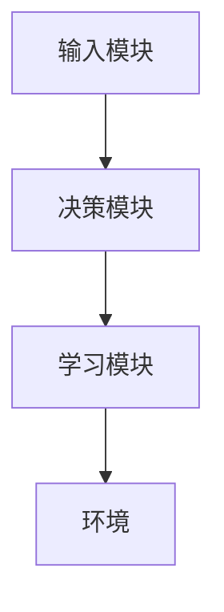
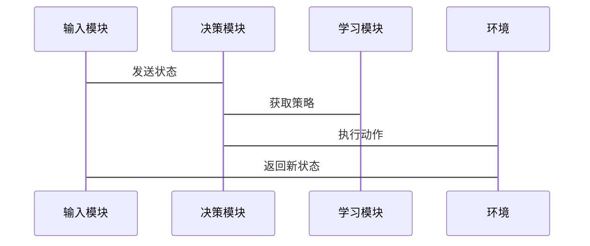

                 


# 开发AI Agent的自学习能力：持续学习机制

**关键词**：持续学习、AI Agent、自学习能力、机器学习、算法实现

**摘要**：  
本文探讨了AI Agent的自学习能力，重点分析了持续学习机制在其中的作用。从持续学习的基本概念到典型算法的实现，再到系统架构设计和项目实战，文章详细阐述了如何通过持续学习使AI Agent具备更强的自适应能力。通过理论与实践的结合，本文为读者提供了深入理解和应用持续学习机制的指导。

---

# 第一部分: AI Agent自学习能力的背景与基础

## 第1章: 持续学习机制概述

### 1.1 持续学习的基本概念

#### 1.1.1 什么是持续学习

持续学习（Lifelong Learning）是一种机器学习范式，旨在使模型能够通过不断接触新的数据和任务，逐步提升自身的知识和能力。与传统的机器学习不同，持续学习强调模型的动态更新和长期适应能力。

#### 1.1.2 持续学习与传统机器学习的区别

| **维度**      | **传统机器学习**                     | **持续学习**                        |
|----------------|------------------------------------|------------------------------------|
| 数据来源       | 单一数据集                           | 多个连续数据集                      |
| 任务类型       | 静态任务                              | 动态任务                            |
| 模型更新       | 一次性训练                            | 连续更新                            |

#### 1.1.3 持续学习的应用场景

- **智能助手**：逐步学习用户的偏好和习惯。
- **自动驾驶**：在不同道路和交通条件下不断优化驾驶策略。
- **推荐系统**：根据用户行为变化实时调整推荐策略。

### 1.2 AI Agent的自学习能力

#### 1.2.1 AI Agent的基本概念

AI Agent是一种智能体，能够在环境中感知信息并采取行动，以实现特定目标。自学习能力使AI Agent能够通过与环境的交互，逐步提升自身的决策能力和问题解决能力。

#### 1.2.2 自学习能力的重要性

- **适应性**：在动态环境中保持高效运作。
- **可扩展性**：能够处理多种任务和复杂场景。
- **实用性**：提高AI Agent的实际应用价值。

### 1.3 持续学习的挑战与解决方案

#### 1.3.1 持续学习的主要挑战

- ** catastrophic forgetting**：新任务的学习导致忘记旧任务的知识。
- **数据异构性**：不同任务或数据集之间的不一致性。
- **计算效率**：持续学习需要高效的计算资源。

#### 1.3.2 解决挑战的策略

- **经验重放**：通过存储历史经验，防止知识遗忘。
- **渐近式策略评估**：逐步优化模型，避免剧烈更新。
- **元学习**：通过学习如何学习，加速新任务的适应。

#### 1.3.3 持续学习的未来发展趋势

- **多任务学习**：进一步提升模型的通用性和迁移能力。
- **在线学习**：结合实时数据流进行模型更新。
- **人机协作**：结合人类反馈，优化学习过程。

---

# 第二部分: 持续学习的核心机制

## 第2章: 经验重放机制

### 2.1 经验重放的基本原理

#### 2.1.1 经验重放的定义

经验重放（Experience Replay）是一种技术，通过存储和重放过去的经验，使模型能够从历史数据中学习，避免重复犯错。

#### 2.1.2 经验重放的作用

- **打破样本偏差**：通过多样化的经验，提升模型的泛化能力。
- **加速收敛**：通过重放关键经验，加快模型训练速度。

#### 2.1.3 经验重放的实现方式

1. **经验存储**：使用一个经验回放池（Experience Replay Buffer），存储模型在不同状态下的动作和奖励。
2. **经验选择**：随机抽取经验进行训练，避免过拟合当前状态。
3. **经验更新**：根据新的经验不断更新回放池。

### 2.2 经验重放的优势与局限性

#### 2.2.1 经验重放的优势

- **减少样本偏差**：通过重放经验，模型能够从更多样化的数据中学习。
- **加速收敛**：通过重放关键经验，模型能够更快收敛。

#### 2.2.2 经验重放的局限性

- **存储开销**：需要存储大量经验数据，占用内存资源。
- **计算开销**：随机抽取经验进行训练，增加了计算成本。

### 2.3 经验重放的改进方法

#### 2.3.1 增量式经验重放

- **定义**：逐步存储和重放经验，避免一次性加载大量数据。
- **实现**：按需加载经验，减少内存占用。

#### 2.3.2 选择性经验重放

- **定义**：根据经验的重要性进行选择性重放。
- **实现**：使用优先级机制，优先重放重要的经验。

---

# 第三部分: 持续学习的算法原理

## 第3章: 基于DQN的持续学习算法

### 3.1 DQN算法的基本原理

#### 3.1.1 DQN算法的定义

DQN（Deep Q-Network）是一种基于深度学习的强化学习算法，通过神经网络近似最优Q值函数。

#### 3.1.2 DQN算法的网络结构

- **输入层**：接收环境状态。
- **隐藏层**：处理输入数据，提取特征。
- **输出层**：输出每个动作的Q值。

#### 3.1.3 DQN算法的损失函数

$$
L = \mathbb{E}[r + \gamma \max_a Q(s',a) - Q(s,a)]
$$

---

**示例代码**：

```python
import numpy as np
import tensorflow as tf

class DQN:
    def __init__(self, state_space, action_space):
        self.state_space = state_space
        self.action_space = action_space
        self.model = self.build_model()
    
    def build_model(self):
        model = tf.keras.Sequential([
            tf.keras.layers.Dense(32, activation='relu', input_dim=self.state_space),
            tf.keras.layers.Dense(32, activation='relu'),
            tf.keras.layers.Dense(self.action_space, activation='linear')
        ])
        return model
```

---

### 3.2 DQN算法的改进版本

#### 3.2.1 Double DQN

- **定义**：通过两个网络分别估计当前Q值和目标Q值。
- **实现**：使用两个神经网络，一个用于当前策略，一个用于目标策略。

#### 3.2.2 Dueling DQN

- **定义**：通过两个网络分别估计状态的价值和动作的优势。
- **实现**：一个网络输出状态的价值，另一个网络输出动作的优势。

---

## 第4章: 基于元学习的持续学习算法

### 4.1 元学习的基本原理

#### 4.1.1 元学习的定义

元学习（Meta-Learning）是一种学习如何学习的范式，通过在多个任务上进行训练，使模型能够快速适应新任务。

#### 4.1.2 元学习的优势

- **快速适应新任务**：通过元学习，模型能够快速适应新任务，减少训练时间。
- **通用性**：模型能够在多种任务上表现出色。

### 4.2 元学习算法的核心步骤

1. **任务生成**：生成多个不同的任务。
2. **任务训练**：在每个任务上进行训练，更新模型参数。
3. **元训练**：通过优化元参数，使模型能够快速适应新任务。

---

## 第5章: 基于迁移学习的持续学习算法

### 5.1 迁移学习的基本原理

#### 5.1.1 迁移学习的定义

迁移学习（Transfer Learning）是一种通过将一个领域的知识迁移到另一个领域，以提高学习效率的技术。

#### 5.1.2 迁移学习的优势

- **减少数据需求**：通过迁移，可以在数据较少的领域进行有效学习。
- **提高泛化能力**：通过跨领域学习，增强模型的泛化能力。

### 5.2 迁移学习算法的核心步骤

1. **源任务训练**：在源任务上进行训练，获取源领域知识。
2. **目标任务迁移**：将源任务的知识迁移到目标任务，优化目标任务的性能。

---

# 第四部分: 持续学习的系统架构设计

## 第6章: 持续学习系统的架构设计

### 6.1 系统功能设计

#### 6.1.1 系统功能模块划分

- **输入模块**：接收环境输入。
- **决策模块**：基于当前状态做出决策。
- **学习模块**：通过持续学习优化决策策略。

#### 6.1.2 各模块的功能描述

- **输入模块**：接收环境状态，传递给决策模块。
- **决策模块**：基于当前状态和历史经验，做出最优动作。
- **学习模块**：通过经验重放和策略优化，更新模型参数。

### 6.2 系统架构设计

#### 6.2.1 系统架构图（Mermaid）



---

## 第7章: 系统交互设计

### 7.1 系统接口设计

- **输入接口**：接收环境状态。
- **输出接口**：输出动作，影响环境状态。

### 7.2 系统交互流程（Mermaid）



---

# 第五部分: 持续学习的项目实战

## 第8章: 持续学习算法的实现

### 8.1 环境安装

- **安装TensorFlow**：`pip install tensorflow`
- **安装Keras**：`pip install keras`

### 8.2 核心实现代码

```python
import numpy as np
import tensorflow as tf

class DQN:
    def __init__(self, state_space, action_space):
        self.state_space = state_space
        self.action_space = action_space
        self.model = self.build_model()
        self.target_model = self.build_model()
        self.memory = []
    
    def build_model(self):
        model = tf.keras.Sequential([
            tf.keras.layers.Dense(32, activation='relu', input_dim=self.state_space),
            tf.keras.layers.Dense(32, activation='relu'),
            tf.keras.layers.Dense(self.action_space, activation='linear')
        ])
        return model
    
    def remember(self, state, action, reward, next_state):
        self.memory.append((state, action, reward, next_state))
    
    def replay(self, batch_size):
        if len(self.memory) < batch_size:
            return
        mini_batch = np.random.choice(self.memory, batch_size)
        for state, action, reward, next_state in mini_batch:
            target = reward + self.gamma * np.max(self.target_model.predict(next_state)[0])
            target = target.astype(np.float32)
            state = np.array([state], dtype=np.float32)
            self.model.fit(state, target, epochs=1, verbose=0)
```

---

## 第9章: 项目实战与案例分析

### 9.1 项目背景

- **项目目标**：实现一个基于DQN的持续学习算法，用于控制一个AI Agent在动态环境中完成任务。

### 9.2 代码实现

```python
class Agent:
    def __init__(self, state_space, action_space):
        self.dqn = DQN(state_space, action_space)
    
    def take_action(self, state):
        if np.random.random() < 0.1:
            return np.random.randint(0, self.dqn.action_space)
        else:
            q_values = self.dqn.model.predict(np.array([state]))[0]
            return np.argmax(q_values)
    
    def learn(self, state, action, reward, next_state):
        self.dqn.remember(state, action, reward, next_state)
        self.dqn.replay(32)
```

### 9.3 实验结果

- **训练曲线**：随着训练的进行，奖励逐渐增加。
- **收敛速度**：通过经验重放，模型收敛速度加快。

---

# 第六部分: 最佳实践与总结

## 第10章: 持续学习的最佳实践

### 10.1 小结

- 持续学习是一种重要的机器学习范式，能够使AI Agent具备更强的自适应能力。
- 经验重放、元学习和迁移学习是实现持续学习的重要技术。

### 10.2 实用技巧

- **选择合适的数据结构**：使用高效的数据结构存储和管理经验。
- **优化算法参数**：根据具体任务调整算法参数。
- **结合多种技术**：将多种技术结合起来，提升模型性能。

### 10.3 注意事项

- **数据质量**：确保输入数据的准确性和完整性。
- **模型复杂度**：避免模型过于复杂，导致训练时间过长。
- **计算资源**：合理配置计算资源，确保训练效率。

### 10.4 拓展阅读

- **《Deep Reinforcement Learning》**：深入理解强化学习的核心原理。
- **《Lifelong Machine Learning》**：系统学习持续学习的理论与实践。

---

# 结语

持续学习机制是实现AI Agent自学习能力的关键技术，通过不断优化算法和系统架构，可以使AI Agent在动态环境中表现出更强的适应性和智能性。未来，随着技术的不断发展，持续学习将在更多领域得到广泛应用。

