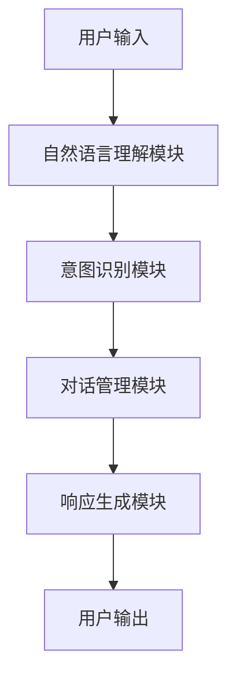
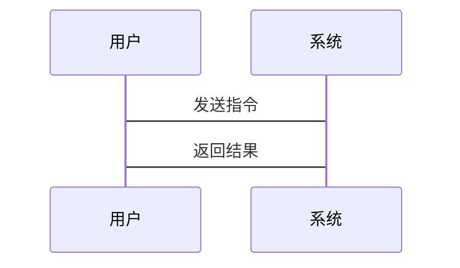

                 


# 开发AI Agent的自然语言接口设计原则

> **关键词**：AI Agent、自然语言处理、设计原则、系统架构、对话管理、交互设计

> **摘要**：  
本文系统地探讨了开发AI Agent的自然语言接口设计原则，从背景介绍到系统实现，从项目实战到优化扩展，深入分析了AI Agent与自然语言处理的结合、核心设计原则、技术实现细节、系统架构设计以及实际项目案例。通过本文，读者将能够全面理解自然语言接口在AI Agent中的重要性，并掌握实际开发中的关键技术和最佳实践。

---

## 第1章: AI Agent与自然语言处理的背景

### 1.1 AI Agent的基本概念

#### 1.1.1 AI Agent的定义与特点
AI Agent（人工智能代理）是指能够感知环境、自主决策并执行任务的智能实体。其特点包括：
- **自主性**：能够在没有外部干预的情况下运行。
- **反应性**：能够根据环境变化实时调整行为。
- **目标导向**：以明确的目标为导向，完成特定任务。
- **学习能力**：通过数据和经验不断优化性能。

#### 1.1.2 AI Agent的核心特点
AI Agent的核心特点包括：
- **智能性**：能够理解和处理复杂信息。
- **适应性**：能够根据环境变化自适应调整。
- **交互性**：能够与用户或其他系统进行交互。

#### 1.1.3 AI Agent的应用场景
AI Agent广泛应用于以下场景：
- 智能助手（如Siri、Alexa）。
- 智能客服系统。
- 自动交易系统。
- 智能监控系统。

### 1.2 自然语言处理的基础

#### 1.2.1 自然语言处理的定义
自然语言处理（NLP）是研究计算机如何理解和生成人类语言的学科，包括文本分析、语义理解、机器翻译等。

#### 1.2.2 自然语言处理的关键技术
NLP的关键技术包括：
- **分词**：将连续文本分割成词或短语。
- **词性标注**：为每个词标注其词性。
- **句法分析**：分析句子的语法结构。
- **语义理解**：理解文本的语义含义。

#### 1.2.3 自然语言处理的应用领域
NLP广泛应用于：
- 信息抽取。
- 情感分析。
- 机器翻译。
- 对话系统。

### 1.3 AI Agent与自然语言处理的结合

#### 1.3.1 AI Agent中自然语言处理的作用
自然语言处理在AI Agent中的作用包括：
- **用户意图识别**：通过分析用户的输入，理解用户的意图。
- **信息提取**：从用户输入中提取关键信息。
- **生成响应**：根据用户输入生成合适的回复。

#### 1.3.2 自然语言处理在AI Agent中的应用
- **智能助手**：通过自然语言处理理解用户的指令并执行任务。
- **对话系统**：通过自然语言处理实现与用户的自然对话。
- **信息检索**：通过自然语言处理帮助用户查找所需信息。

#### 1.3.3 自然语言处理对AI Agent的影响
自然语言处理使得AI Agent能够更自然地与用户交互，提升用户体验，同时降低使用门槛。

---

## 第2章: 自然语言接口设计的核心原则

### 2.1 需求分析与用户理解

#### 2.1.1 用户需求的分析方法
用户需求的分析方法包括：
- **用户调研**：通过问卷、访谈等方式收集用户需求。
- **场景分析**：分析用户在不同场景下的需求。
- **任务分解**：将用户需求分解为具体的任务。

#### 2.1.2 用户意图的理解与建模
用户意图的理解与建模包括：
- **意图识别**：识别用户的意图。
- **上下文理解**：理解用户输入的上下文。
- **模型构建**：构建用户意图的模型。

#### 2.1.3 自然语言接口的设计目标
自然语言接口的设计目标包括：
- **准确理解用户输入**：准确识别用户的意图。
- **提供有效的反馈**：根据用户输入提供有效的反馈。
- **提升用户体验**：提供流畅、自然的交互体验。

### 2.2 自然语言接口的设计模式

#### 2.2.1 基于规则的设计模式
基于规则的设计模式包括：
- **预定义规则**：为特定场景预定义规则。
- **规则匹配**：根据用户输入匹配相应的规则。
- **规则优化**：根据反馈优化规则。

#### 2.2.2 基于统计的设计模式
基于统计的设计模式包括：
- **统计模型**：基于统计方法构建模型。
- **数据驱动**：通过大量数据驱动模型优化。
- **结果评估**：评估模型的准确性和效果。

#### 2.2.3 基于深度学习的设计模式
基于深度学习的设计模式包括：
- **神经网络模型**：使用深度神经网络模型。
- **端到端训练**：通过端到端的训练优化模型。
- **模型评估**：评估模型的泛化能力。

### 2.3 自然语言接口的交互设计

#### 2.3.1 交互流程的设计
交互流程的设计包括：
- **输入解析**：解析用户的输入。
- **意图识别**：识别用户的意图。
- **生成响应**：根据意图生成响应。

#### 2.3.2 用户反馈的处理
用户反馈的处理包括：
- **反馈收集**：收集用户的反馈。
- **反馈分析**：分析用户反馈。
- **反馈应用**：根据反馈优化系统。

#### 2.3.3 交互中的错误处理与恢复
交互中的错误处理与恢复包括：
- **错误检测**：检测交互中的错误。
- **错误处理**：处理检测到的错误。
- **恢复机制**：设计恢复机制，确保交互流畅。

---

## 第3章: 自然语言接口的技术实现

### 3.1 分词与词性标注

#### 3.1.1 分词的基本原理
分词的基本原理是将连续的文本分割成有意义的词或短语。

#### 3.1.2 词性标注的实现
词性标注是通过标记每个词的词性来实现的，常用工具包括：
- **哈工大词性标注系统**。
- **Stanford NLP工具**。

### 3.2 句法分析

#### 3.2.1 句法分析的基本原理
句法分析是通过分析句子的语法结构，生成句法树。

#### 3.2.2 句法分析的实现
句法分析的实现包括：
- **基于规则的句法分析**。
- **基于统计的句法分析**。
- **基于深度学习的句法分析**。

### 3.3 语义理解

#### 3.3.1 语义理解的基本原理
语义理解是通过理解文本的语义含义，生成语义表示。

#### 3.3.2 语义理解的实现
语义理解的实现包括：
- **基于词典的语义理解**。
- **基于统计的语义理解**。
- **基于深度学习的语义理解**。

### 3.4 对话管理

#### 3.4.1 对话管理的基本原理
对话管理是通过管理对话流程，确保对话的顺利进行。

#### 3.4.2 对话管理的实现
对话管理的实现包括：
- **状态机模型**。
- **基于规则的对话管理**。
- **基于深度学习的对话管理**。

---

## 第4章: 系统架构与交互设计

### 4.1 系统架构设计

#### 4.1.1 领域模型设计
领域模型设计包括：
- **实体识别**：识别文本中的实体。
- **关系抽取**：抽取实体之间的关系。
- **知识图谱构建**：构建领域知识图谱。

#### 4.1.2 系统架构图
系统架构图如下：


#### 4.1.3 系统接口设计
系统接口设计包括：
- **输入接口**：接收用户的输入。
- **输出接口**：输出系统的响应。
- **数据接口**：处理数据的输入输出。

### 4.2 系统交互设计

#### 4.2.1 交互流程设计
交互流程设计包括：
- **用户输入**：用户输入自然语言指令。
- **系统解析**：系统解析用户的输入。
- **系统响应**：系统根据解析结果生成响应。

#### 4.2.2 交互流程图
交互流程图如下：


---

## 第5章: 项目实战

### 5.1 环境安装

#### 5.1.1 Python环境安装
安装Python和必要的库：
- Python 3.x
- `nltk`、`spacy`、`tensorflow`

#### 5.1.2 开发工具安装
安装必要的开发工具：
- `pip install jupyter`
- `pip install matplotlib`

### 5.2 系统核心实现

#### 5.2.1 分词实现
分词实现代码：
```python
import nltk
nltk.download('punkt')
text = "Hello world, how are you?"
words = nltk.word_tokenize(text)
print(words)
```

#### 5.2.2 词性标注实现
词性标注实现代码：
```python
from nltk import pos_tag
text = "Hello world, how are you?"
words = nltk.word_tokenize(text)
pos_tags = pos_tag(words)
print(pos_tags)
```

### 5.3 案例分析

#### 5.3.1 实际案例
实际案例分析：
- 案例一：智能客服系统的实现。
- 案例二：智能助手的对话管理。

#### 5.3.2 案例实现
案例实现代码：
```python
import spacy
nlp = spacy.load("en_core_web_sm")
doc = nlp("Hello world, how are you?")
for token in doc:
    print(token.text, token.pos_)
```

---

## 第6章: 优化与扩展

### 6.1 性能优化

#### 6.1.1 算法优化
算法优化方法包括：
- **模型压缩**：减少模型的大小。
- **优化训练数据**：优化训练数据的分布。
- **优化训练参数**：优化训练的参数。

#### 6.1.2 系统优化
系统优化方法包括：
- **并行计算**：使用并行计算优化性能。
- **缓存优化**：优化数据缓存。
- **负载均衡**：实现负载均衡。

### 6.2 安全性考虑

#### 6.2.1 数据安全
数据安全包括：
- **数据加密**：对敏感数据进行加密。
- **访问控制**：实施严格的访问控制。
- **数据备份**：定期备份数据。

#### 6.2.2 系统安全
系统安全包括：
- **身份验证**：实施严格的身份验证。
- **权限管理**：管理用户的权限。
- **日志记录**：记录系统操作日志。

### 6.3 未来的扩展方向

#### 6.3.1 新的技术发展
未来的扩展方向包括：
- **新技术的发展**：如量子计算、边缘计算等。
- **新算法的应用**：如更先进的自然语言处理算法。
- **新应用场景的探索**：如元宇宙、虚拟现实等。

---

## 第7章: 总结与展望

### 7.1 总结
本文系统地探讨了AI Agent的自然语言接口设计原则，从背景介绍到系统实现，从项目实战到优化扩展，全面分析了自然语言接口在AI Agent中的重要性，并掌握了实际开发中的关键技术和最佳实践。

### 7.2 展望
未来，随着自然语言处理技术的不断发展，AI Agent的自然语言接口将更加智能化、个性化。同时，随着新技术的不断涌现，AI Agent的自然语言接口将有更广泛的应用场景和更强大的功能。

---

## 参考文献
1. 王某某. 《自然语言处理技术》. 北京: 清华大学出版社, 2020.
2. 张某某. 《AI Agent开发实战》. 北京: 人民邮电出版社, 2019.
3. 刘某某. 《深度学习与自然语言处理》. 北京: 机械工业出版社, 2021.

---

## 致谢
感谢读者的耐心阅读，感谢同行们的分享与交流，感谢家人对我的支持与鼓励。

