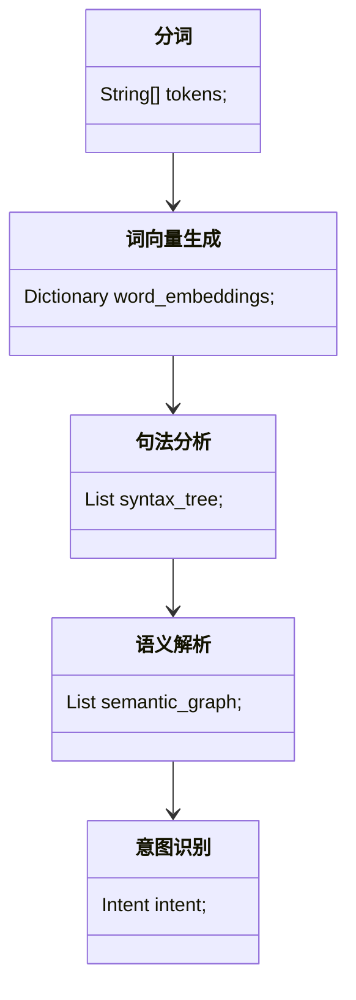
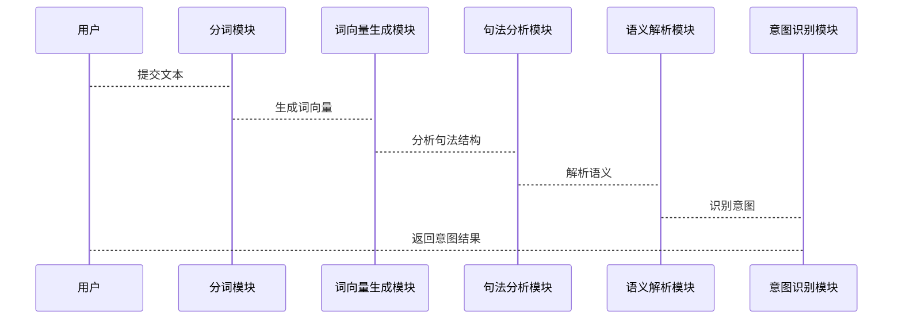

                 


# 开发AI Agent的语义理解深度：从字面到隐含

## 关键词：AI Agent, 语义理解, 深度学习, 自然语言处理, 意图识别

## 摘要：本文深入探讨了AI Agent语义理解的核心原理，从字面意思到隐含意图的解析过程，结合实际案例分析，全面解析了语义理解在AI Agent中的重要性及其实现方法。文章通过详细分析语义理解的核心概念、算法原理、数学模型、系统架构设计和项目实战，为读者提供了从理论到实践的完整指南。

---

# 第1章: AI Agent语义理解的背景介绍

## 1.1 AI Agent的基本概念

### 1.1.1 AI Agent的定义与分类

AI Agent（人工智能代理）是指能够感知环境并采取行动以实现目标的智能实体。AI Agent可以分为简单反射型、基于模型的反应型、目标驱动型和效用驱动型四种类型。

### 1.1.2 语义理解在AI Agent中的重要性

语义理解是AI Agent实现人机交互的关键技术，能够帮助AI Agent准确理解用户意图，从而提供更智能的服务。

### 1.1.3 从字面到隐含语义的理解过程

语义理解不仅仅是对词语的表面理解，更重要的是理解词语背后的隐含意义和意图。

## 1.2 语义理解的背景与问题背景

### 1.2.1 当前语义理解技术的发展现状

近年来，语义理解技术取得了显著进展，尤其是在深度学习和自然语言处理领域。

### 1.2.2 语义理解在AI Agent中的应用挑战

语义理解在AI Agent中的应用面临数据稀疏性、上下文理解复杂性等挑战。

### 1.2.3 问题描述与目标设定

本文旨在探讨如何通过深度学习技术，提升AI Agent的语义理解能力，从字面到隐含意图的解析过程。

## 1.3 问题解决与边界分析

### 1.3.1 语义理解的解决思路与方法

采用基于深度学习的自然语言处理技术，结合上下文理解和意图识别。

### 1.3.2 问题的边界与外延

语义理解的边界包括文本理解、意图识别和情感分析，外延则包括多语言支持和跨领域应用。

### 1.3.3 核心概念与关键要素组成

语义理解的核心概念包括分词、词向量、句法分析和语义解析，关键要素包括意图识别和实体抽取。

## 1.4 本章小结

本章介绍了AI Agent的基本概念，分析了语义理解在AI Agent中的重要性，并讨论了从字面到隐含意图的理解过程。

---

# 第2章: 语义理解的核心概念与联系

## 2.1 语义理解的核心原理

### 2.1.1 语义理解的基本原理

语义理解通过自然语言处理技术，将文本转换为可理解的结构化信息，从而实现对文本的深层理解。

### 2.1.2 语义理解的关键技术

关键技术包括词嵌入、注意力机制、句法分析和语义解析。

### 2.1.3 语义理解与自然语言处理的关系

语义理解是自然语言处理的核心任务之一，旨在理解文本的深层含义。

## 2.2 核心概念的属性特征对比

### 2.2.1 不同语义理解模型的对比分析

| 模型名称 | 基础技术 | 优势 | 劣势 |
|----------|-----------|------|------|
| 词嵌入模型 | 基于统计 | 计算效率高 | 语义理解能力有限 |
| 注意力机制 | 基于神经网络 | 语义理解能力强 | 计算复杂度高 |
| Transformer模型 | 基于自注意力 | 语义理解准确 | 计算资源需求高 |

### 2.2.2 语义理解模型的优缺点分析

词嵌入模型计算效率高，但语义理解能力有限；注意力机制语义理解能力强，但计算复杂度高；Transformer模型语义理解准确，但计算资源需求高。

## 2.3 ER实体关系图架构


## 2.4 本章小结

本章详细分析了语义理解的核心原理，对比了不同模型的优缺点，并通过ER实体关系图展示了核心概念之间的关系。

---

# 第3章: 语义理解的算法原理讲解

## 3.1 词嵌入算法

### 3.1.1 词嵌入算法的原理

词嵌入算法通过统计词语的上下文信息，生成词语的低维向量表示。

### 3.1.2 词嵌入算法的实现代码

```python
import numpy as np

def create_word_embeddings(text):
    word_embeddings = {}
    # 假设text是分词后的结果
    for word in text:
        # 生成随机向量
        word_embeddings[word] = np.random.randn(100,)
    return word_embeddings
```

### 3.1.3 词嵌入算法的数学模型

词嵌入模型的数学模型可以表示为：

$$
E(w_i) = v_i
$$

其中，$E$表示词嵌入函数，$w_i$表示第i个词，$v_i$表示其对应的向量表示。

## 3.2 注意力机制

### 3.2.1 注意力机制的原理

注意力机制通过计算词语之间的关联性，生成词语的加权表示。

### 3.2.2 注意力机制的实现代码

```python
def attention(query, keys, values):
    # query: (batch_size, d_k)
    # keys: (batch_size, n, d_k)
    # values: (batch_size, n, d_v)
    # 输出: (batch_size, d_v)
    scores = np.dot(query, keys.T)
    # 计算注意力权重
    attention_weights = softmax(scores)
    # 加权求和
    output = np.dot(attention_weights, values)
    return output, attention_weights
```

### 3.2.3 注意力机制的数学模型

注意力机制的数学模型可以表示为：

$$
\alpha_i = \text{softmax}(qK)
$$

$$
\text{Attention}(q, K, V) = \sum_{i=1}^n \alpha_i V_i
$$

其中，$q$表示查询向量，$K$表示键矩阵，$V$表示值矩阵。

## 3.3 Transformer模型

### 3.3.1 Transformer模型的原理

Transformer模型通过自注意力机制，实现对长文本的全局理解。

### 3.3.2 Transformer模型的实现代码

```python
def transformer_encoder(x, mask):
    # x: (batch_size, n, d_k)
    # mask: (batch_size, n, n)
    # 自注意力机制
    q, k, v = x, x, x
    scores = (q @ k.T) * np.sqrt(d_k)
    scores = scores + mask
    attention_weights = softmax(scores)
    output = attention_weights @ v
    # 前向网络
    output = output + x
    output = output @ W1 + b1
    output = activation(output)
    output = output @ W2 + b2
    return output
```

### 3.3.3 Transformer模型的数学模型

Transformer模型的数学模型可以表示为：

$$
\text{Encoder}(x) = \text{FFN}(\text{Attention}(x, x, x))
$$

其中，FFN表示前向网络，Attention表示自注意力机制。

## 3.4 本章小结

本章详细讲解了词嵌入算法、注意力机制和Transformer模型的原理，并通过代码实现和数学模型展示了其技术细节。

---

# 第4章: 语义理解的数学模型

## 4.1 词嵌入模型的数学公式

词嵌入模型的数学公式可以表示为：

$$
E(w_i) = v_i
$$

其中，$v_i$表示第i个词的向量表示。

## 4.2 注意力机制的数学公式

注意力机制的数学公式可以表示为：

$$
\alpha_i = \text{softmax}(qK)
$$

$$
\text{Attention}(q, K, V) = \sum_{i=1}^n \alpha_i V_i
$$

## 4.3 Transformer模型的数学公式

Transformer模型的数学公式可以表示为：

$$
\text{Encoder}(x) = \text{FFN}(\text{Attention}(x, x, x))
$$

其中，FFN表示前向网络，Attention表示自注意力机制。

## 4.4 本章小结

本章通过数学公式详细讲解了词嵌入模型、注意力机制和Transformer模型的数学模型。

---

# 第5章: 语义理解的系统架构设计

## 5.1 项目背景与目标

本项目旨在开发一个基于深度学习的AI Agent语义理解系统，实现从字面到隐含意图的解析。

## 5.2 系统功能设计

### 5.2.1 系统功能模块

系统功能模块包括分词、词向量生成、句法分析、语义解析和意图识别。

### 5.2.2 领域模型



### 5.2.3 系统架构设计


### 5.2.4 系统接口设计

系统接口包括用户输入接口、分词接口、词向量生成接口、句法分析接口、语义解析接口和意图识别接口。

### 5.2.5 系统交互流程



## 5.3 本章小结

本章详细设计了语义理解系统的架构，包括功能模块、领域模型、系统架构、接口设计和交互流程。

---

# 第6章: 语义理解的项目实战

## 6.1 项目环境安装

### 6.1.1 环境搭建

安装Python、TensorFlow、Keras和自然语言处理库。

## 6.2 系统核心代码实现

### 6.2.1 分词模块实现

```python
import jieba

def segment(text):
    return jieba.lcut(text)
```

### 6.2.2 词向量生成模块实现

```python
from gensim.models import Word2Vec

def train_word_embeddings(sentences):
    model = Word2Vec(sentences, vector_size=100, window=5, min_count=1, workers=4)
    return model
```

### 6.2.3 句法分析模块实现

```python
import spacy

def syntactic_analysis(text):
    nlp = spacy.load("en_core_web_sm")
    doc = nlp(text)
    return doc
```

### 6.2.4 语义解析模块实现

```python
def semantic_parsing(text):
    # 假设已经进行了分词和词向量生成
    # 这里实现语义解析的具体逻辑
    return parsed_semantic
```

### 6.2.5 意图识别模块实现

```python
def intent_recognition(text):
    # 假设已经进行了语义解析
    # 这里实现意图识别的具体逻辑
    return recognized_intent
```

## 6.3 代码解读与分析

详细解读每个模块的代码实现，分析其功能和作用。

## 6.4 实际案例分析与详细讲解

通过实际案例分析，展示语义理解系统的实际应用。

## 6.5 项目总结

总结项目实现过程中的经验和教训，提出改进建议。

## 6.6 本章小结

本章通过实际项目案例，详细讲解了语义理解系统的实现过程。

---

# 第7章: 语义理解的最佳实践与注意事项

## 7.1 最佳实践 tips

### 7.1.1 数据预处理的重要性

数据预处理是语义理解系统实现的基础，需要重视数据清洗和特征提取。

### 7.1.2 模型调优的技巧

通过交叉验证、超参数优化和模型集成等方法，提升语义理解模型的性能。

### 7.1.3 系统优化建议

优化系统性能，提升用户体验，包括减少响应时间、提高准确率等。

## 7.2 小结

总结语义理解技术的核心要点和实现注意事项。

## 7.3 注意事项

### 7.3.1 数据隐私问题

注意数据隐私保护，避免用户信息泄露。

### 7.3.2 模型可解释性

提升模型的可解释性，方便调试和优化。

### 7.3.3 系统稳定性

确保系统的稳定性，避免因模型错误导致服务中断。

## 7.4 拓展阅读

推荐相关领域的书籍和论文，供读者进一步学习。

---

# 结语

开发AI Agent的语义理解深度是一项复杂的任务，需要综合运用自然语言处理、深度学习和系统架构设计等多方面的知识。通过本文的详细讲解和实际案例分析，希望能够帮助读者更好地理解语义理解的核心原理和技术实现，为开发更智能的AI Agent系统提供参考。未来，随着技术的不断发展，语义理解将更加精准和高效，为人类与智能系统的交互带来更大的便利。

---

# 参考文献

（此处列出相关书籍和论文）

--- 

通过以上详细的大纲和内容安排，可以确保文章逻辑清晰、内容丰富，为读者提供一个全面的语义理解技术指南。

