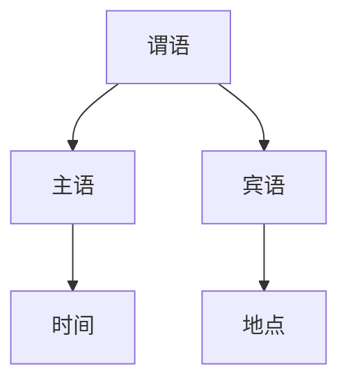
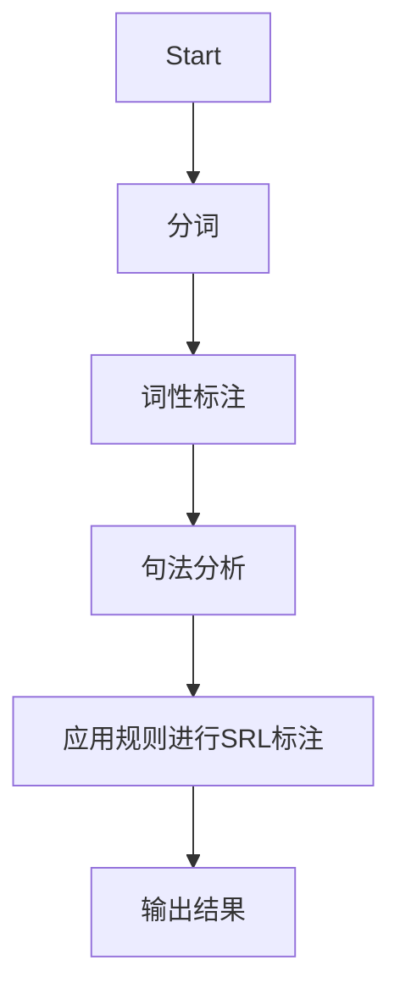
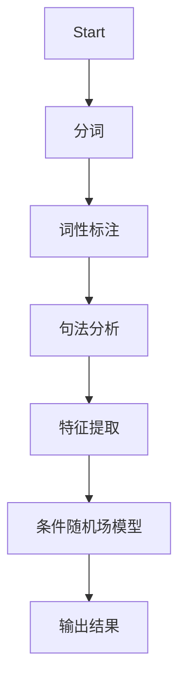
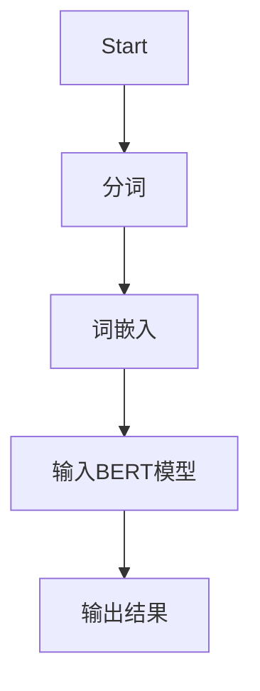
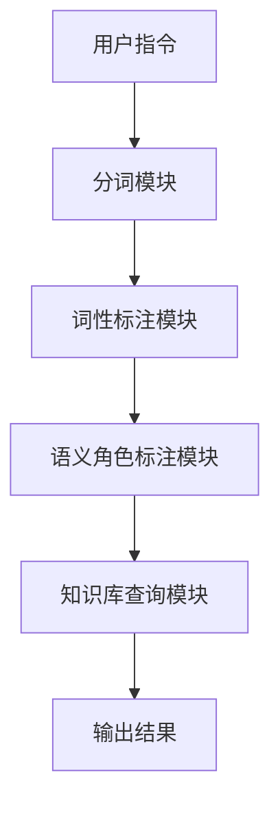
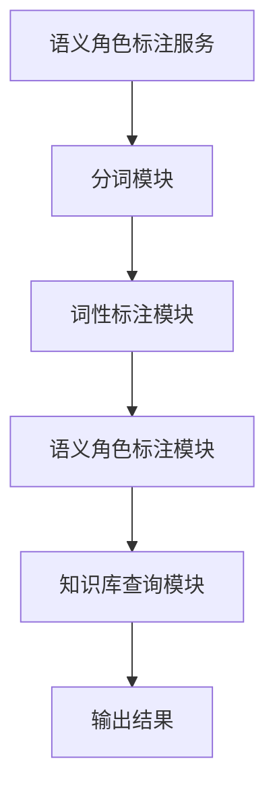
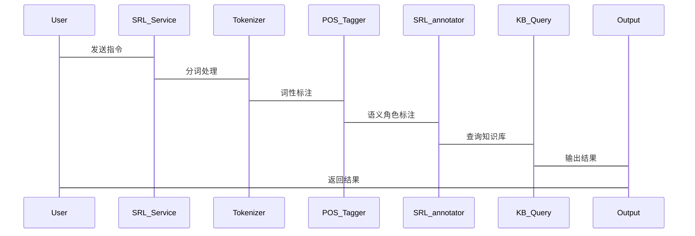

                 


# 开发AI Agent的语义角色标注能力

## 关键词：AI Agent, 语义角色标注, 自然语言处理, 深度学习, 信息抽取, 知识图谱

## 摘要：
语义角色标注（Semantic Role Labeling, SRL）是自然语言处理中的一个关键任务，旨在识别句子中每个词语的语义角色。本文将详细介绍AI Agent中语义角色标注的核心概念、算法原理、系统架构设计以及实际应用案例。通过系统化的讲解和丰富的实战代码，帮助读者掌握从理论到实践的完整开发流程，打造具备强大语义理解能力的AI Agent。

---

# 第一部分: 语义角色标注（SRL）基础

## 第1章: 语义角色标注（SRL）概述

### 1.1 语义角色标注的基本概念
- **1.1.1 什么是语义角色标注**
  - 语义角色标注（SRL）是对自然语言句子中词语的语义角色进行识别和标注的过程。
  - 例如：在句子“小明买了书”，“买了”是谓语，“小明”是主语，“书”是宾语。

- **1.1.2 语义角色标注的目标与作用**
  - 目标：将自然语言句子中的词语标注为具体的语义角色（如主语、谓语、宾语、地点、时间等）。
  - 作用：帮助AI Agent理解句子的结构和语义关系，从而更好地进行信息抽取、问答系统、对话生成等任务。

- **1.1.3 语义角色标注的核心要素**
  - 句子结构：包括主语、谓语、宾语、状语、定语、补语等。
  - 语义角色：如Agent（执行者）、Action（动作）、Patient（患者/宾语）、Location（地点）、Time（时间）等。

### 1.2 语义角色标注的应用场景
- **1.2.1 自然语言处理中的应用**
  - 信息抽取：从文本中提取事件、实体及其关系。
  - 问答系统：帮助回答“谁做了什么”的问题。
  - 对话生成：生成符合语境的对话回复。

- **1.2.2 信息抽取与知识图谱构建**
  - 从文本中抽取结构化信息，构建知识图谱。
  - 例如：从新闻中抽取“谁做了什么事情”，构建事件知识图谱。

- **1.2.3 人机交互中的应用**
  - 帮助AI Agent理解用户的意图。
  - 例如：在智能音箱中，理解用户的指令“播放音乐”中的“播放”是谓语，“音乐”是宾语。

### 1.3 语义角色标注的挑战与研究现状
- **1.3.1 当前技术的局限性**
  - 数据依赖性：基于统计和深度学习的SRL需要大量标注数据。
  - 多义词处理：某些词语在不同语境中有不同的语义角色。
  - 跨语言挑战：不同语言的语序和语法规则不同，增加了标注的难度。

- **1.3.2 研究热点与未来方向**
  - 跨语言SRL：研究如何在多种语言之间共享标注模型。
  - 预训练模型：结合大规模预训练语言模型（如BERT）提升SRL的准确性。
  - 实时应用：研究如何在低资源环境下高效进行SRL。

- **1.3.3 语义角色标注的评估指标**
  - 精准率（Precision）：正确标注的比例。
  - 召回率（Recall）：实际标注的正确比例。
  - F1分数：综合考虑精准率和召回率的调和平均数。

### 1.4 本章小结
- 本章介绍了语义角色标注的基本概念、应用场景以及面临的挑战，为后续章节的深入学习奠定了基础。

---

## 第2章: 语义角色标注的核心概念与联系

### 2.1 语义角色标注的原理
- **2.1.1 基于规则的语义角色标注**
  - 使用预定义的规则进行标注。
  - 例如：根据动词的形态（如过去式、现在式）确定谓语。

- **2.1.2 统计学习的语义角色标注**
  - 基于机器学习算法（如SVM、CRF）训练模型，预测每个词语的语义角色。

- **2.1.3 深度学习的语义角色标注**
  - 使用神经网络（如RNN、LSTM、BERT）进行语义角色标注，提升准确率。

### 2.2 语义角色标注的核心要素对比
- **2.2.1 基于规则与基于统计的对比分析**
  - 规则方法：准确率高，但依赖人工规则设计。
  - 统计方法：自动学习，但需要大量标注数据。

- **2.2.2 基于统计与基于深度学习的对比分析**
  - 统计方法：适合小规模数据，但准确率有限。
  - 深度学习：在大规模数据上表现更好，但需要更多计算资源。

- **2.2.3 三者优缺点总结**
  - 规则方法：简单易懂，但难以应对复杂语境。
  - 统计方法：自动化程度高，但依赖数据质量。
  - 深度学习：性能优越，但需要大量计算资源。

### 2.3 语义角色标注的ER实体关系图


### 2.4 本章小结
- 本章分析了语义角色标注的三种主要方法及其优缺点，并通过ER实体关系图展示了语义角色之间的关系。

---

## 第3章: 语义角色标注的算法原理

### 3.1 基于规则的语义角色标注算法
- **3.1.1 规则的构建与应用**
  - 例如：动词短语通常作为谓语，名词短语通常作为主语或宾语。

- **3.1.2 规则的优缺点分析**
  - 优点：简单易懂，准确率高。
  - 缺点：难以应对复杂语境和多义词。

- **3.1.3 规则的实现流程图**


### 3.2 基于统计的语义角色标注算法
- **3.2.1 统计学习的原理**
  - 使用条件随机场（CRF）模型，基于词性、句法结构等特征进行标注。

- **3.2.2 统计模型的数学公式**
  - CRF模型的损失函数：
  $$ L = -\sum_{i=1}^{n} \log P(y_i|x_i) $$
  - 其中，\( y_i \) 是第i个词的标签，\( x_i \) 是输入特征。

- **3.2.3 统计模型的实现流程图**


### 3.3 基于深度学习的语义角色标注算法
- **3.3.1 深度学习的原理**
  - 使用预训练语言模型（如BERT）进行语义角色标注。

- **3.3.2 深度学习模型的数学公式**
  - BERT模型中的自注意力机制：
  $$ \text{Attention}(Q,K,V) = \text{softmax}\left( \frac{QK^T}{\sqrt{d_k}} \right)V $$
  - 其中，\( Q \) 是查询向量，\( K \) 是键向量，\( V \) 是值向量。

- **3.3.3 深度学习的实现流程图**


### 3.4 本章小结
- 本章详细介绍了三种语义角色标注算法的原理、实现流程及其数学公式，帮助读者理解不同方法的优缺点。

---

# 第二部分: 系统分析与架构设计

## 第4章: 语义角色标注系统的架构设计

### 4.1 系统功能设计
- **4.1.1 问题场景介绍**
  - AI Agent需要理解用户的指令，例如“请帮我预订明天的火车票”。

- **4.1.2 系统功能模块**
  - 分词模块：将输入文本分割成词语。
  - 词性标注模块：标注每个词语的词性。
  - 语义角色标注模块：标注每个词语的语义角色。
  - 知识库查询模块：根据语义角色信息查询相关信息。

- **4.1.3 功能模块的交互流程图**


### 4.2 系统架构设计
- **4.2.1 系统架构图**


- **4.2.2 系统接口设计**
  - 输入接口：接收用户指令的字符串。
  - 输出接口：输出标注结果和相关知识。

- **4.2.3 系统交互序列图**


### 4.3 本章小结
- 本章通过系统架构设计展示了AI Agent中语义角色标注的实现流程，为后续的项目开发奠定了基础。

---

# 第三部分: 项目实战

## 第5章: 语义角色标注的项目实现

### 5.1 环境安装与配置
- **5.1.1 Python环境的安装**
  - 安装Python 3.8及以上版本。
- **5.1.2 必要库的安装**
  - 使用pip安装以下库：
    ```
    pip install spacy
    pip install transformers
    pip install networkx
    ```

### 5.2 核心代码实现
- **5.2.1 分词模块**
  ```python
  import spacy

  nlp = spacy.load("en_core_web_sm")

  def tokenize(text):
      doc = nlp(text)
      return [token.text for token in doc]
  ```

- **5.2.2 词性标注模块**
  ```python
  import spacy

  nlp = spacy.load("en_core_web_sm")

  def pos_tagging(text):
      doc = nlp(text)
      return [(token.text, token.pos_) for token in doc]
  ```

- **5.2.3 语义角色标注模块**
  ```python
  from transformers import BertForTokenClassification, BertTokenizer

  model = BertForTokenClassification.from_pretrained("bert-base")
  tokenizer = BertTokenizer.from_pretrained("bert-base")

  def srl_annotation(text):
      inputs = tokenizer(text, return_tensors="pt")
      outputs = model(**inputs)
      predictions = outputs.logits.argmax(dim=2)
      return predictions
  ```

- **5.2.4 知识库查询模块**
  ```python
  import networkx as nx

  def query_knowledge_base(subject, predicate, object):
      # 实现知识库查询逻辑
      return "相关信息"
  ```

### 5.3 实际案例分析
- **5.3.1 案例1：简单句子的标注**
  - 输入句子：“小明买了书。”
  - 分词结果：["小明", "买了", "书"]
  - 词性标注结果：[("小明", "名词"), ("买了", "动词"), ("书", "名词")]
  - 语义角色标注结果：主语“小明”，谓语“买了”，宾语“书”。

- **5.3.2 案例2：复杂句子的标注**
  - 输入句子：“昨天，小明在书店买了一本书。”
  - 分词结果：["昨天", "，", "小明", "在", "书店", "买", "了", "一", "本", "书", "."]
  - 词性标注结果：[("昨天", "名词"), ("，", "标点"), ("小明", "名词"), ("在", "介词"), ("书店", "名词"), ("买", "动词"), ("了", "助词"), ("一", "数量词"), ("本", "量词"), ("书", "名词"), ("。", "标点")]
  - 语义角色标注结果：主语“小明”，谓语“买”，宾语“书”，时间“昨天”，地点“书店”。

### 5.4 项目小结
- 本章通过实际案例展示了语义角色标注的实现过程，帮助读者理解理论在实践中的应用。

---

## 第6章: 语义角色标注的优化与扩展

### 6.1 系统优化
- **6.1.1 数据增强**
  - 通过数据增强技术（如同义词替换、句式变化）提升模型的鲁棒性。

- **6.1.2 模型优化**
  - 使用预训练语言模型（如BERT、GPT）提升标注的准确率。

### 6.2 功能扩展
- **6.2.1 跨语言标注**
  - 研究如何在多种语言之间共享标注模型。

- **6.2.2 实时标注**
  - 研究如何在低资源环境下高效进行语义角色标注。

### 6.3 本章小结
- 本章讨论了语义角色标注系统的优化与扩展方向，为读者提供了进一步研究的思路。

---

# 第四部分: 总结与展望

## 第7章: 总结与展望

### 7.1 全书总结
- 本书系统地介绍了AI Agent中语义角色标注的核心概念、算法原理、系统架构设计以及实际应用案例。

### 7.2 未来展望
- 随着深度学习技术的不断发展，语义角色标注将更加精准和高效。
- 跨语言标注和实时标注将是未来研究的重点方向。

### 7.3 最佳实践Tips
- 在实际开发中，建议结合预训练语言模型提升标注的准确率。
- 在资源有限的情况下，可以尝试使用基于规则的方法进行快速标注。

### 7.4 本章小结
- 本书为读者提供了从理论到实践的完整指导，帮助读者开发具备强大语义角色标注能力的AI Agent。

---

# 参考文献

（此处列出相关的参考文献，包括书籍、论文、技术文档等。）

---

通过以上目录大纲，读者可以系统地学习和掌握开发AI Agent的语义角色标注能力所需的知识和技能。

