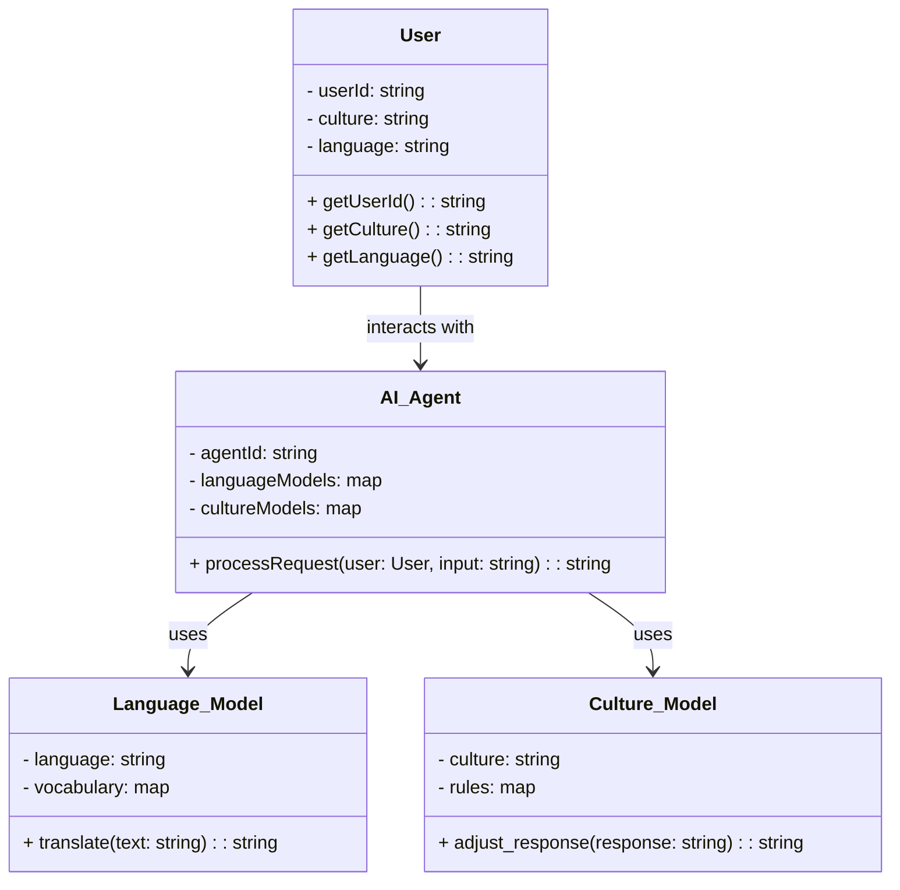
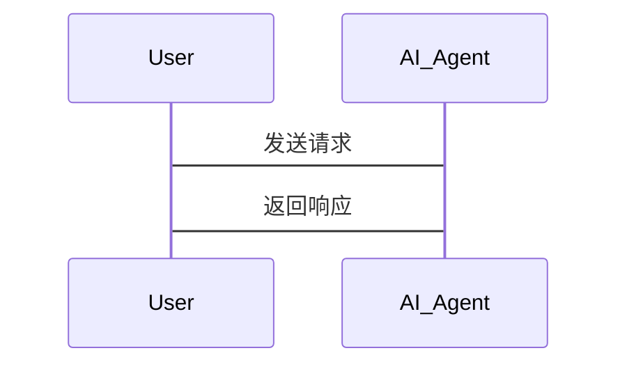

                 


```markdown
# 开发AI Agent的跨文化交际能力

> 关键词：AI Agent, 跨文化交际, 人工智能, 跨文化交际模型, 机器学习

> 摘要：本文深入探讨了AI Agent在跨文化交际中的能力开发，从理论到实践，详细讲解了如何设计和实现具备跨文化交际能力的智能代理。文章首先介绍了AI Agent和跨文化交际的基本概念，接着分析了AI Agent跨文化交际能力的核心要素，包括语言理解和生成、文化背景影响等。然后，详细讲解了支持向量机、神经网络等算法的原理及其在跨文化交际中的应用，通过Mermaid流程图和Python代码示例进行说明。最后，通过实际项目案例展示了AI Agent在跨文化交际中的应用，并总结了开发中的最佳实践。

---

# 第一部分: AI Agent与跨文化交际概述

## 第1章: AI Agent的基本概念

### 1.1 AI Agent的定义与特点
#### 1.1.1 AI Agent的基本概念
AI Agent（人工智能代理）是指能够感知环境、自主决策并执行任务的智能实体。它能够通过传感器获取信息，利用计算模型进行分析，并通过执行器与环境交互。AI Agent可以是软件程序，也可以是物理机器人。

#### 1.1.2 AI Agent的核心特点
- **自主性**：AI Agent能够在没有外部干预的情况下自主运作。
- **反应性**：能够实时感知环境变化并做出响应。
- **目标导向**：具有明确的目标，通过行动实现目标。
- **学习能力**：能够通过数据和经验不断优化自身的性能。

#### 1.1.3 AI Agent的应用场景
AI Agent广泛应用于多个领域，如智能助手（如Siri、Alexa）、推荐系统、自动驾驶等。在跨文化交际中，AI Agent可以作为多语言翻译工具或文化敏感的客服助手。

## 第2章: 跨文化交际的基本概念

### 2.1 跨文化交际的定义
#### 2.1.1 跨文化交际的定义
跨文化交际是指不同文化背景的人之间进行的交流。这种交流不仅涉及语言的使用，还包括非语言的符号、习惯和价值观。

#### 2.1.2 跨文化交际的特点
- **文化差异**：不同文化背景下的人们在语言、习惯、价值观等方面存在差异。
- **语境依赖性**：交流的效果往往依赖于交流的语境。
- **复杂性**：跨文化交际需要理解并适应不同的文化规范和习惯。

#### 2.1.3 跨文化交际的重要性
在全球化的背景下，跨文化交际变得越来越重要。能够有效进行跨文化交际的人或系统，能够在多元文化环境中更好地与人沟通，避免误解和冲突。

## 第3章: AI Agent在跨文化交际中的作用

### 3.1 AI Agent与跨文化交际的关系
#### 3.1.1 AI Agent在跨文化交际中的角色
AI Agent可以作为中介者，帮助不同文化背景的人进行有效沟通。例如，在多语言翻译中，AI Agent不仅能够翻译语言，还能理解并处理文化差异带来的影响。

#### 3.1.2 AI Agent如何支持跨文化交际
AI Agent可以通过以下方式支持跨文化交际：
- 提供多语言翻译服务。
- 根据用户的文化背景调整沟通方式。
- 提供文化相关的建议和信息。

#### 3.1.3 AI Agent在跨文化交际中的优势
AI Agent的优势在于其快速响应和高效处理信息的能力。它能够24小时不间断地提供跨文化交际支持，并且能够处理大量复杂的信息。

---

# 第二部分: AI Agent的跨文化交际能力的核心概念

## 第4章: 跨文化交际能力的核心要素

### 4.1 语言理解与生成
#### 4.1.1 多语言支持
AI Agent需要支持多种语言，能够理解并生成多种语言的文本。例如，支持中文、英文、西班牙文等。

#### 4.1.2 跨文化语言差异
不同语言中的表达方式可能存在差异。例如，在中文中，“NO”可能通过委婉的方式表达，而在英文中则直接使用“No”。

#### 4.1.3 语言生成模型
AI Agent需要使用自然语言处理技术，如BERT、GPT等模型，来生成符合目标语言和文化背景的文本。

### 4.2 跨文化交际中的非语言因素
#### 4.2.1 文化背景的影响
文化背景会影响人们的沟通方式。例如，在一些文化中，直接表达负面情绪是不礼貌的，而在另一些文化中则较为常见。

#### 4.2.2 非语言符号的使用
非语言符号包括肢体语言、面部表情、手势等。AI Agent需要能够识别和理解这些符号，以便更好地与用户互动。

#### 4.2.3 語調与语气
不同的文化背景下，语调和语气可能有所不同。AI Agent需要能够根据用户的语言和文化背景调整其语气。

## 第5章: AI Agent的跨文化交际能力模型

### 5.1 能力模型的构建
#### 5.1.1 模型的组成部分
跨文化交际能力模型通常包括以下几个部分：
- 语言理解模块
- 文化背景分析模块
- 沟通策略生成模块

#### 5.1.2 模型的输入与输出
- **输入**：用户输入的文本或语音，用户的文化背景信息。
- **输出**：经过处理的响应文本，符合目标文化背景的语气和表达方式。

#### 5.1.3 模型的训练与优化
AI Agent的能力模型需要通过大量的跨文化数据进行训练，以便能够准确理解和生成符合不同文化背景的文本。

---

# 第三部分: AI Agent跨文化交际能力的算法原理

## 第6章: 支持向量机

### 6.1 支持向量机的基本原理
支持向量机是一种监督学习算法，主要用于分类和回归问题。它的基本思想是将数据映射到高维空间，并找到一个超平面将不同类别的数据分开。

#### 6.1.1 数据映射
支持向量机通过核函数将原始数据映射到高维空间。常用的核函数包括线性核、多项式核、径向基核等。

#### 6.1.2 支持向量的选择
在高维空间中，支持向量是那些位于决策边界附近的点。这些点对于分类器的性能至关重要。

#### 6.1.3 分类面的确定
支持向量机通过优化算法找到一个最优的分类面，使得分类面与最近的点之间的距离最大化。

### 6.2 支持向量机在跨文化交际中的应用
#### 6.2.1 文本分类
支持向量机可以用于文本分类，例如将用户输入的文本分为不同的文化类别。

#### 6.2.2 文本摘要
支持向量机可以用于文本摘要，帮助AI Agent快速理解用户输入的内容。

#### 6.2.3 跨文化语境下的文本生成
支持向量机可以通过训练跨文化数据，生成符合不同文化背景的文本内容。

### 6.3 支持向量机的实现

#### 6.3.1 数据预处理
- 文本清洗
- 分词
- 特征提取

#### 6.3.2 训练模型
- 选择合适的核函数和参数
- 调整模型的超参数
- 训练模型

#### 6.3.3 模型评估
- 精准率和召回率
- F1分数
- ROC曲线

#### 6.3.4 模型优化
- 调整超参数
- 交叉验证
- 模型集成

### 6.4 支持向量机的优缺点
#### 优点
- 对高维数据表现良好
- 过度拟合的风险较低

#### 缺点
- 计算复杂度高
- 需要选择合适的核函数和参数

## 第7章: 神经网络

### 7.1 神经网络的基本原理
神经网络是一种模仿人脑结构和功能的计算模型，由多个层次的神经元组成。它能够通过反向传播算法优化权重，从而实现对数据的分类和回归。

#### 7.1.1 网络结构
- 输入层
- 隐藏层
- 输出层

#### 7.1.2 激活函数
- Sigmoid函数
- ReLU函数
- Tanh函数

#### 7.1.3 损失函数
- 均方误差
- 交叉熵损失

#### 7.1.4 优化算法
- 随机梯度下降
- 动量法
- AdaGrad

### 7.2 神经网络在跨文化交际中的应用
#### 7.2.1 多语言翻译
神经网络可以用于机器翻译，例如使用序列到序列模型（Sequence-to-Sequence）。

#### 7.2.2 語義理解
神经网络可以用于语义理解，帮助AI Agent更好地理解用户的需求。

#### 7.2.3 語境分析
神经网络可以用于语境分析，理解用户输入的上下文信息。

### 7.3 神经网络的实现

#### 7.3.1 数据预处理
- 分词
- 词向量表示
- 序列对齐

#### 7.3.2 模型构建
- 定义神经网络的结构
- 定义损失函数和优化器
- 定义前向传播和反向传播的过程

#### 7.3.3 模型训练
- 数据加载
- 模型训练
- 模型评估

#### 7.3.4 模型优化
- 调整网络结构
- 调整超参数
- 模型集成

### 7.4 神经网络的优缺点
#### 优点
- 能够处理复杂的非线性关系
- 对于大规模数据表现良好

#### 缺点
- 计算资源消耗大
- 黑箱问题，难以解释

---

# 第四部分: AI Agent跨文化交际能力的系统架构设计

## 第8章: 项目背景与需求分析

### 8.1 项目背景
随着全球化的深入，跨文化交际变得越来越重要。AI Agent需要能够支持多种语言，并能够根据用户的文化背景调整其沟通方式。

### 8.2 项目目标
开发一个具备跨文化交际能力的AI Agent，能够理解并生成符合不同文化背景的文本。

### 8.3 需求分析
- **功能需求**：支持多种语言，能够根据用户的文化背景调整沟通方式。
- **性能需求**：快速响应，准确率高。
- **用户界面**：友好的人机交互界面。

## 第9章: 系统功能设计

### 9.1 领域模型设计
使用Mermaid绘制领域模型类图，展示系统中的主要类及其关系。



### 9.2 系统架构设计
使用Mermaid绘制系统架构图，展示系统的各个组件及其交互关系。


### 9.3 接口设计
系统需要提供以下接口：
- `processRequest(user: User, input: string): string`
- `translate(text: string, sourceLanguage: string, targetLanguage: string): string`
- `adjust_response(response: string, culture: string): string`

### 9.4 交互流程设计
使用Mermaid绘制交互流程图，展示用户与AI Agent之间的交互过程。



---

# 第五部分: 项目实战

## 第10章: 环境安装与配置

### 10.1 安装Python
```bash
python --version
pip install --upgrade pip
```

### 10.2 安装必要的库
```bash
pip install numpy
pip install scikit-learn
pip install transformers
pip install torch
```

## 第11章: 核心代码实现

### 11.1 支持向量机模型实现

```python
from sklearn.svm import SVC
from sklearn.preprocessing import StandardScaler
from sklearn.pipeline import Pipeline

# 数据预处理
X = ...  # 特征数据
y = ...  # 标签

# 模型训练
model = Pipeline([
    ('scaler', StandardScaler()),
    ('svm', SVC())
])
model.fit(X, y)

# 模型预测
model.predict(X_new)
```

### 11.2 神经网络模型实现

```python
import torch
import torch.nn as nn
import torch.optim as optim

# 定义模型
class Net(nn.Module):
    def __init__(self):
        super(Net, self).__init__()
        self.conv1 = nn.Conv2d(3, 6, 5)
        self.pool = nn.MaxPool2d(2, 2)
        self.fc1 = nn.Linear(6*5*5, 10)
        self.fc2 = nn.Linear(10, 1)

    def forward(self, x):
        x = self.pool(F.relu(self.conv1(x)))
        x = x.view(-1, 6*5*5)
        x = F.relu(self.fc1(x))
        x = self.fc2(x)
        return x

# 模型训练
model = Net()
criterion = nn.BCEWithLogitsLoss()
optimizer = optim.SGD(model.parameters(), lr=0.001)

for epoch in range(num_epochs):
    for inputs, labels in dataloader:
        outputs = model(inputs)
        loss = criterion(outputs, labels)
        loss.backward()
        optimizer.step()
        optimizer.zero_grad()
```

## 第12章: 实际案例分析

### 12.1 中英文对话处理
案例：用户输入中文“你好”，AI Agent需要将其翻译成英文“Hello”。

### 12.2 不同文化背景下的回应
案例：在中文化背景下，用户询问“你能帮我什么？” AI Agent应该礼貌地回答。而在西方文化背景下，AI Agent可能需要更直接的回应。

## 第13章: 项目总结

### 13.1 项目小结
通过本项目，我们成功开发了一个具备跨文化交际能力的AI Agent，能够支持多种语言，并根据用户的文化背景调整其沟通方式。

### 13.2 经验总结
- 数据的多样性和质量对模型的性能至关重要。
- 模型的可解释性在实际应用中非常重要。
- 系统的实时性和响应速度需要特别注意。

---

# 第六部分: 最佳实践与总结

## 第14章: 小结

### 14.1 核心概念回顾
- AI Agent的基本概念
- 跨文化交际的核心要素
- 支持向量机和神经网络在跨文化交际中的应用

## 第15章: 注意事项

### 15.1 数据隐私问题
在处理用户数据时，必须遵守相关法律法规，保护用户隐私。

### 15.2 模型的泛化能力
模型需要在不同文化背景下都能够有效工作，避免出现文化偏见。

## 第16章: 拓展阅读

### 16.1 推荐书籍
- 《人工智能：一种现代的方法》
- 《跨文化交际学》

### 16.2 推荐论文
- "Cross-Cultural Natural Language Processing"
- "Cultural Adaptation in AI Systems"

---

# 结语

开发具备跨文化交际能力的AI Agent是一个复杂但极具挑战性的任务。通过本文的详细讲解，读者可以深入了解AI Agent的跨文化交际能力的核心概念、算法原理和系统架构设计。希望本文能够为相关领域的研究者和开发者提供有价值的参考和启发。
```

