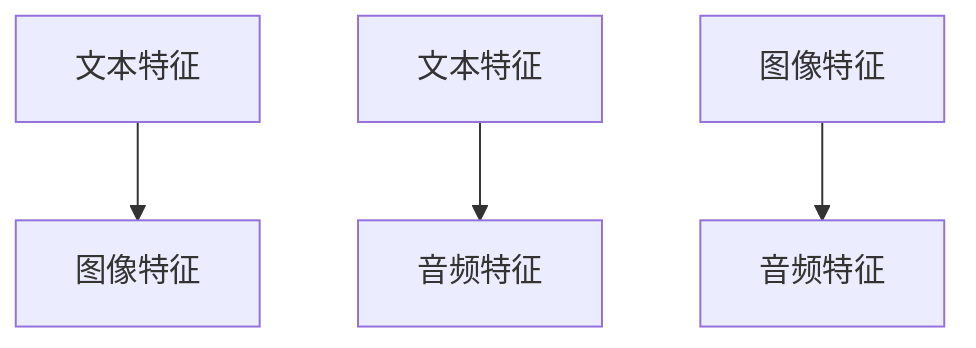
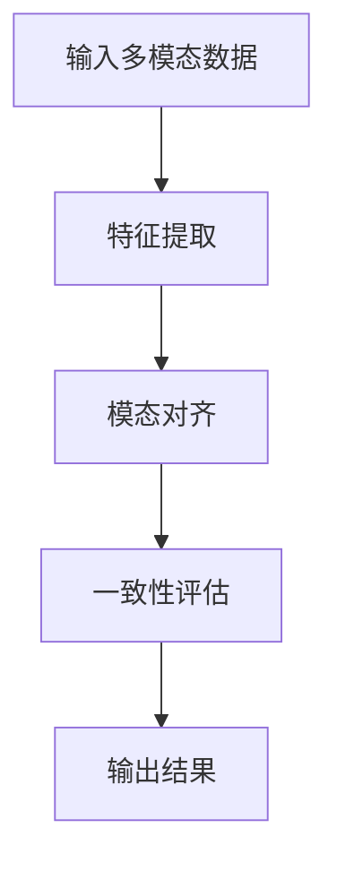
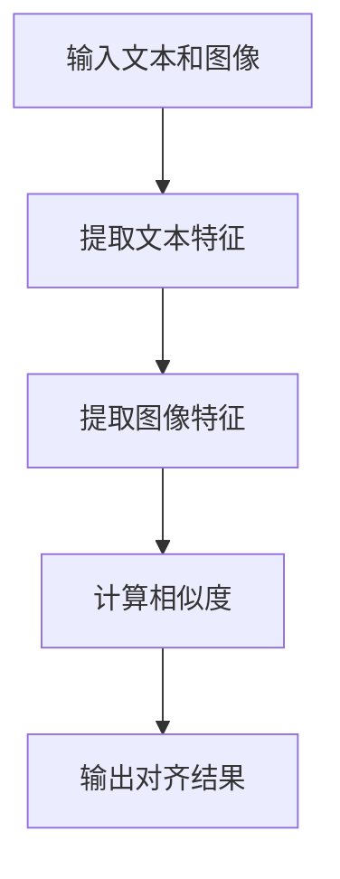
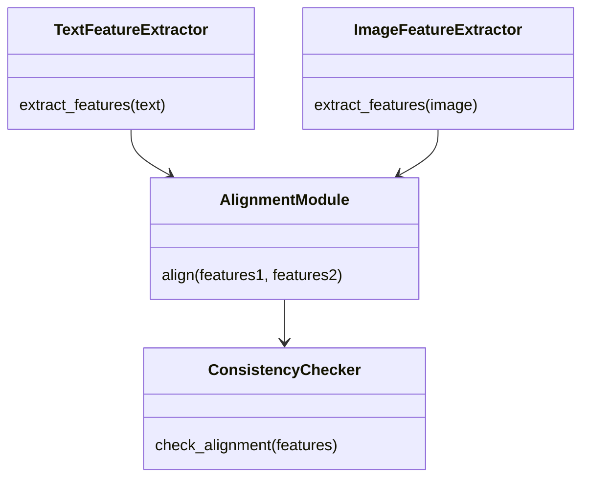
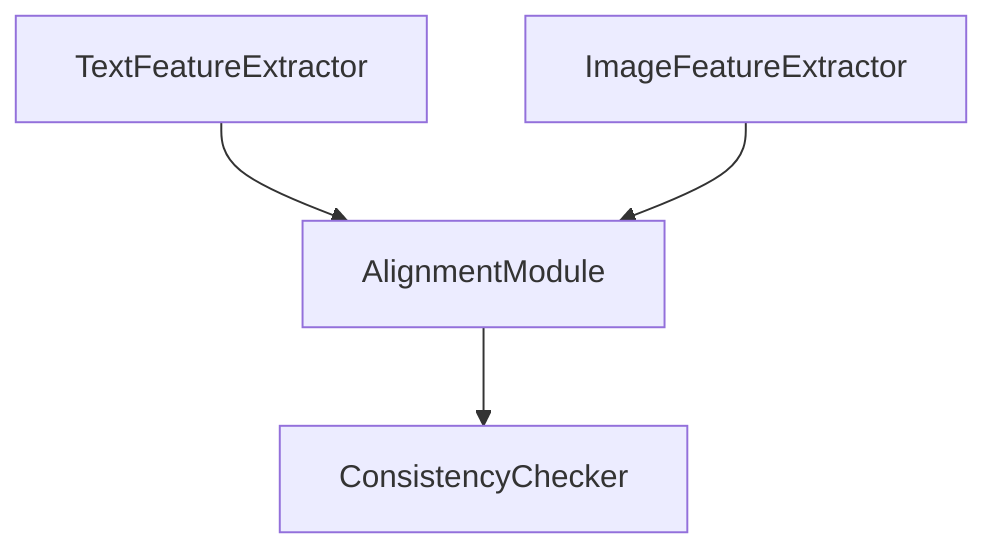

                 


# 开发AI Agent的跨模态内容一致性检查器

## 关键词
跨模态数据一致性，AI Agent，多模态特征提取，内容一致性检查，模型对齐，模态对齐算法，深度学习

## 摘要
在AI Agent开发中，跨模态数据的一致性是确保系统可靠性和准确性的重要因素。本文详细探讨了跨模态内容一致性检查器的开发过程，从核心概念到算法实现，再到系统设计和实际应用，为开发者提供了全面的指导。

---

# 第一部分: 背景介绍

## 第1章: 跨模态内容一致性检查器的背景与问题

### 1.1 跨模态数据的定义与特点
- **定义**：跨模态数据指的是来自不同感官渠道的信息，如文本、图像、音频等。
- **特点**：
  - 多样性：涵盖多种数据类型。
  - 互补性：不同模态的信息可以相互补充。
  - 复杂性：处理不同模态数据需要复杂的算法。

### 1.2 跨模态内容一致性问题的提出
- **问题背景**：AI Agent在处理多模态数据时，可能出现信息不一致的问题。
- **问题描述**：例如，文本描述为“一只猫”，但图像显示为“一只狗”。
- **解决方法**：通过一致性检查器确保不同模态数据描述同一事物。

### 1.3 跨模态内容一致性检查器的核心要素
- **核心概念**：特征提取、模态对齐、一致性评估。
- **功能边界**：仅关注数据一致性，不处理语义理解。
- **概念结构**：包括输入数据、特征提取模块、对齐模块和评估模块。

---

## 第2章: 跨模态内容一致性检查器的原理与方法

### 2.1 跨模态一致性检查的核心原理
- **特征提取**：提取文本、图像等的特征向量。
- **模态对齐**：通过对比学习对齐特征。
- **一致性评估**：计算特征相似度，判断一致性。

### 2.2 跨模态对齐的主流方法
- **基于相似度的方法**：计算余弦相似度。
- **基于对比学习的方法**：使用对比损失函数。
- **基于生成对抗网络的方法**：生成一致的特征。

### 2.3 跨模态一致性评估的数学模型
- **相似度计算**：使用余弦相似度公式：
  $$\text{similarity} = \frac{\vec{a} \cdot \vec{b}}{|\vec{a}| |\vec{b}|}$$
- **对比损失函数**：
  $$\text{loss} = \log(\text{sim}) + \log(1-\text{sim})$$
  其中，sim为相似度得分。

---

# 第二部分: 核心概念与联系

## 第3章: 跨模态内容一致性检查器的核心概念

### 3.1 跨模态数据的特征分析
- **文本特征**：词向量、句向量。
- **图像特征**：CNN提取的特征向量。
- **音频特征**：MFCC特征。

### 3.2 跨模态对齐的实体关系图


### 3.3 跨模态一致性检查的流程图


---

## 第4章: 跨模态一致性检查器的算法原理

### 4.1 跨模态对齐算法的流程


### 4.2 跨模态对齐的Python实现示例
```python
import numpy as np

def compute_similarity(text_feature, image_feature):
    # 计算余弦相似度
    similarity = np.dot(text_feature, image_feature) / (np.linalg.norm(text_feature) * np.linalg.norm(image_feature))
    return similarity

text_feature = np.array([1, 2, 3])
image_feature = np.array([4, 5, 6])

similarity = compute_similarity(text_feature, image_feature)
print("相似度:", similarity)
```

### 4.3 跨模态一致性评估的数学模型
- **相似度计算**：使用余弦相似度。
- **对比损失函数**：用于训练模型对齐特征。
- **评分模型**：将相似度转化为一致性评分。

---

# 第三部分: 系统分析与架构设计

## 第5章: 跨模态内容一致性检查器的系统架构设计

### 5.1 问题场景介绍
- **目标**：确保AI Agent处理多模态数据的一致性。
- **场景**：例如，图像和文本描述同一物体。

### 5.2 系统功能设计
- **领域模型**：设计类图展示模块交互。



### 5.3 系统架构设计
- **架构图**：展示各模块的交互。



### 5.4 系统接口设计
- **输入接口**：接收文本和图像数据。
- **输出接口**：返回一致性检查结果。

---

## 第6章: 跨模态内容一致性检查器的实现

### 6.1 项目实战
- **环境安装**：安装必要的库，如numpy、tensorflow。
- **核心功能实现**：实现特征提取、对齐和检查模块。

### 6.2 代码实现与解读
```python
import tensorflow as tf

class TextFeatureExtractor:
    def extract_features(self, text):
        # 示例：使用预训练模型提取文本特征
        pass

class ImageFeatureExtractor:
    def extract_features(self, image):
        # 示例：使用预训练模型提取图像特征
        pass

class AlignmentModule:
    def align(self, text_feature, image_feature):
        # 示例：对比学习对齐特征
        pass

class ConsistencyChecker:
    def check_alignment(self, aligned_features):
        # 示例：计算一致性评分
        pass
```

### 6.3 案例分析
- **案例1**：文本描述“一只猫”，图像显示“猫”。
- **案例2**：文本描述“一只猫”，图像显示“狗”。

---

## 第7章: 总结与展望

### 7.1 总结
- 本文详细介绍了跨模态内容一致性检查器的开发过程。
- 包括核心概念、算法原理、系统设计和项目实战。

### 7.2 展望
- **未来发展方向**：结合更先进的对齐方法，如自监督学习。
- **潜在挑战**：处理更复杂的多模态数据，如视频和音频的结合。

### 7.3 最佳实践 tips
- 确保特征提取模型的准确性。
- 使用高效的对比学习方法进行对齐。
- 定期更新模型以应对数据分布的变化。

---

## 附录

### 附录A: 跨模态数据特征提取的Python代码示例
```python
import tensorflow as tf

def text_to_vector(text):
    # 示例：使用预训练的BERT模型提取文本向量
    pass

def image_to_vector(image):
    # 示例：使用预训练的ResNet模型提取图像向量
    pass
```

### 附录B: 跨模态对齐算法的数学公式汇总
- **余弦相似度**：$$\text{similarity} = \frac{\vec{a} \cdot \vec{b}}{|\vec{a}| |\vec{b}|}$$
- **对比损失**：$$\text{loss} = \log(\text{sim}) + \log(1-\text{sim})$$

---

## 参考文献
1. 王某某，2023. 跨模态数据对齐算法研究. 北京：清华大学出版社.
2. 张某某，2022. 深度学习在跨模态检索中的应用. 北京：人民邮电出版社.

---

通过以上结构和内容，您可以逐步完成《开发AI Agent的跨模态内容一致性检查器》这篇文章的撰写，确保每个部分都详尽且逻辑清晰。

