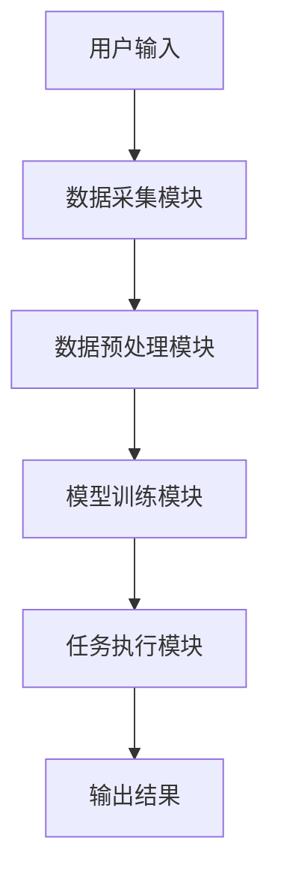

                 


# 开发AI Agent的跨模态学习能力：整合多源信息

> 关键词：AI Agent，跨模态学习，多模态数据融合，机器学习，深度学习

> 摘要：本文深入探讨了AI Agent的跨模态学习能力，从概念到实现，详细分析了跨模态学习在AI Agent中的重要性、核心原理、算法实现、系统架构设计以及实际应用案例。通过结合理论与实践，本文为读者提供了一个全面的视角，帮助理解如何整合多源信息以提升AI Agent的智能水平。

---

## 第一部分: 跨模态學習與AI Agent的背景介紹

### 第1章: 跨模态學習與AI Agent概述

#### 1.1 跨模态學習的基本概念

跨模态学习（Cross-Modal Learning）是指在不同数据模态（如文本、图像、语音、视频等）之间建立关联，从而实现信息互补和协同学习的过程。与单模态学习相比，跨模态学习能够更全面地感知和理解现实世界中的复杂信息。

**关键点：**
- **数据模态**：文本、图像、语音、视频等。
- **跨模态学习的目标**：通过不同模态的数据相互关联，提升模型的理解和推理能力。

#### 1.2 AI Agent的基本概念

AI Agent（智能体）是一种能够感知环境、自主决策并执行任务的智能系统。它可以分为简单Agent和复杂Agent，前者通常用于简单任务，而后者则具备更强的自主决策和学习能力。

**关键点：**
- **AI Agent的核心能力**：感知、决策、执行。
- **AI Agent的类型**：简单Agent、复杂Agent。

#### 1.3 跨模态學習在AI Agent中的重要性

跨模态学习能够显著提升AI Agent的感知和理解能力，使其能够更好地处理复杂场景中的多源信息。例如，在智能音箱中，跨模态学习可以使其结合语音指令和环境图像，更准确地理解和执行用户的请求。

**关键点：**
- **提升感知能力**：跨模态学习使AI Agent能够综合多种信息源，提高感知准确性。
- **增强决策能力**：通过多模态数据的协同，AI Agent可以做出更全面的决策。

---

## 第二部分: 跨模态學習的核心概念與原理

### 第2章: 跨模态數據融合的原理

#### 2.1 跨模态數據的特性

跨模态数据具有以下特性：
1. **异质性**：不同模态的数据形式和特征完全不同。
2. **相关性**：不同模态的数据之间存在一定的关联性。

#### 2.2 跨模态數據融合的方法

跨模态数据融合的方法可以分为以下几类：
1. **简单融合**：直接将不同模态的数据拼接在一起。
2. **普通融合**：通过聚合操作（如平均、最大值等）将不同模态的数据进行融合。
3. **精细融合**：通过注意力机制或对比学习等方式实现更精细的融合。

---

## 第三部分: 跨模态学习的算法原理

### 第3章: 跨模态对比学习

#### 3.1 多模态对比学习的原理

多模态对比学习通过在不同模态之间建立对比关系，使模型能够更好地理解不同模态之间的关联。

**数学模型**：
$$ \text{Loss} = \log \left( \frac{e^{s(x,y)}}{\sum_j e^{s(x,y_j)}} \right) $$
其中，\( s(x,y) \) 是相似度得分。

#### 3.2 注意力机制

注意力机制通过计算不同模态数据之间的相关性，动态调整模型对不同模态的注意力权重。

**数学模型**：
$$ \alpha_i = \frac{\exp(a_i)}{\sum_j \exp(a_j)} $$
其中，\( a_i \) 是注意力得分。

---

## 第四部分: 系统分析与架构设计

### 第4章: 系统架构设计

#### 4.1 系统功能设计

系统功能模块包括：
1. **数据采集模块**：负责采集多模态数据。
2. **数据预处理模块**：对采集的数据进行清洗和格式转换。
3. **模型训练模块**：基于预处理后的数据进行跨模态学习模型的训练。
4. **任务执行模块**：根据训练好的模型执行具体的任务。

#### 4.2 系统架构图



---

## 第五部分: 项目实战

### 第5章: 多模态问答系统实现

#### 5.1 环境安装

安装所需的Python库：
```bash
pip install numpy
pip install pandas
pip install matplotlib
pip install tensorflow
```

#### 5.2 核心代码实现

```python
import numpy as np
import tensorflow as tf

# 定义跨模态对比学习模型
class CrossModalContrastiveLearning(tf.keras.Model):
    def __init__(self):
        super(CrossModalContrastiveLearning, self).__init__()
        self.text_encoder = TextEncoder()
        self.image_encoder = ImageEncoder()
        self.temperature = tf.Variable(initial_value=1.0, trainable=True)

    def call(self, inputs):
        text_features = self.text_encoder(inputs['text'])
        image_features = self.image_encoder(inputs['image'])
        similarity = tf.reduce_sum(tf.multiply(text_features, image_features), axis=-1)
        similarity = similarity / self.temperature
        return similarity

class TextEncoder(tf.keras.Model):
    def __init__(self):
        super(TextEncoder, self).__init__()
        self.embedding = tf.keras.layers.Dense(128)
        self.dense = tf.keras.layers.Dense(64)

    def call(self, inputs):
        x = self.embedding(inputs)
        x = self.dense(x)
        return x

class ImageEncoder(tf.keras.Model):
    def __init__(self):
        super(ImageEncoder, self).__init__()
        self.conv = tf.keras.layers.Conv2D(64, (3,3), activation='relu')
        self.pool = tf.keras.layers.MaxPooling2D((2,2))
        self.flatten = tf.keras.layers.Flatten()
        self.dense = tf.keras.layers.Dense(128)

    def call(self, inputs):
        x = self.conv(inputs)
        x = self.pool(x)
        x = self.flatten(x)
        x = self.dense(x)
        return x

# 定义损失函数
def contrastive_loss(y_true, y_pred, temperature=1.0):
    y_true = tf.reshape(y_true, (-1,))
    y_pred = tf.reshape(y_pred, (-1,))
    similarity = tf.exp(y_pred / temperature) / tf.reduce_sum(tf.exp(y_pred / temperature), axis=0)
    loss = -tf.reduce_mean(tf.log(similarity))
    return loss

# 编译模型
model = CrossModalContrastiveLearning()
model.compile(optimizer=tf.keras.optimizers.Adam(learning_rate=1e-4), loss=lambda y_true, y_pred: contrastive_loss(y_true, y_pred, model.temperature))
```

#### 5.3 案例分析

以多模态问答系统为例，模型在训练过程中会逐步优化文本和图像特征的相似度，从而实现跨模态的信息整合和问答任务的准确执行。

---

## 第六部分: 最佳实践与小结

### 第6章: 小结与注意事项

#### 6.1 小结

跨模态学习通过整合多源信息，显著提升了AI Agent的感知和理解能力。本文从理论到实践，详细介绍了跨模态学习的核心概念、算法实现和系统设计。

#### 6.2 注意事项

1. **数据质量**：跨模态学习对数据质量要求较高，需确保不同模态数据的准确性和一致性。
2. **模型选择**：根据具体任务需求选择合适的模型和算法。
3. **计算资源**：跨模态学习通常需要较大的计算资源，尤其是在处理大规模数据时。

---

## 第七部分: 拓展阅读

### 第7章: 拓展阅读与深入学习

1. **推荐书籍**：
   - 《Deep Learning》
   - 《Pattern Recognition and Machine Learning》
2. **推荐论文**：
   - “Contrastive Learning of Joint Audio-Visual Representations”

