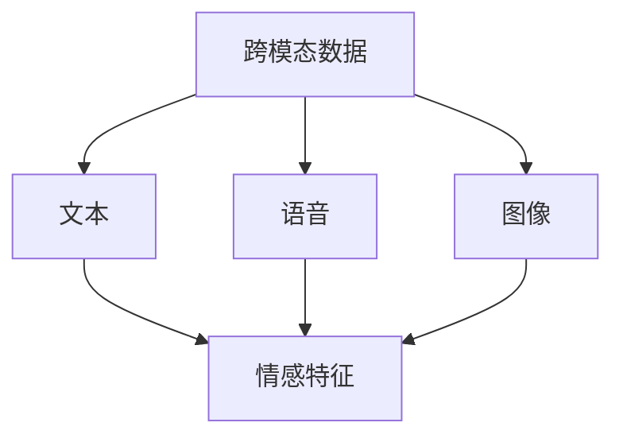
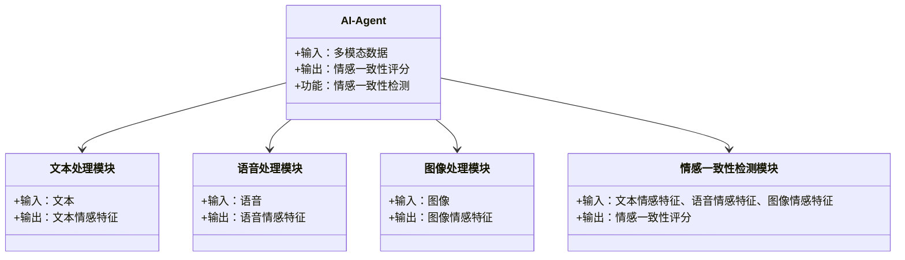
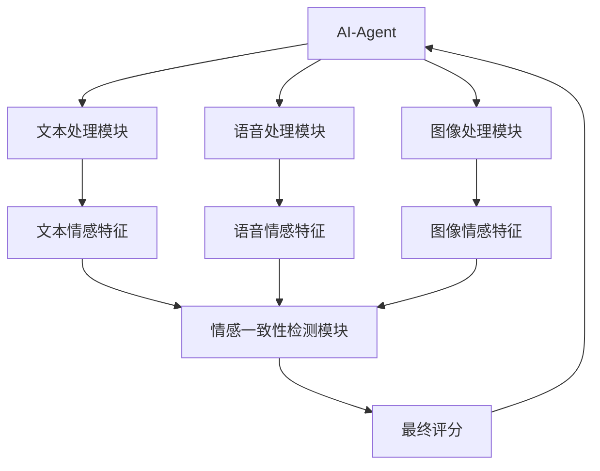
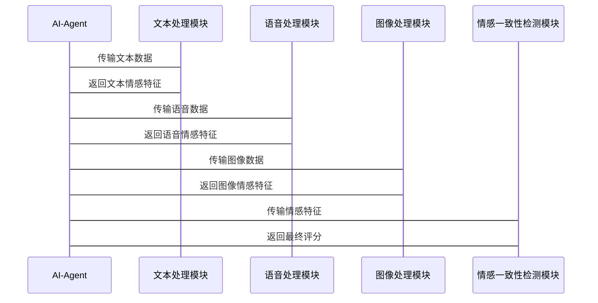

                 


# 开发AI Agent的跨模态情感一致性检测

> 关键词：跨模态情感一致性检测，AI Agent，多模态数据，情感分析，一致性检测

> 摘要：本文详细探讨了开发AI Agent的跨模态情感一致性检测的技术挑战与解决方案。通过分析跨模态数据的特点，提出了情感一致性检测的核心概念与算法原理，并结合实际案例，展示了如何通过系统架构设计和项目实战实现跨模态情感一致性检测。本文还总结了最佳实践，为AI Agent的开发提供了重要的理论和技术支持。

---

## 第1章 背景介绍

### 1.1 问题背景

随着人工智能技术的快速发展，AI Agent（智能体）在多个领域得到了广泛应用。AI Agent需要能够处理和理解多模态数据（如文本、语音、图像等），并根据这些数据做出智能决策。然而，跨模态数据中的情感一致性问题却常常被忽视。例如，在客服场景中，用户的情感可能通过文本和语音同时表达，但这两者之间的情感表达可能存在不一致的情况，导致AI Agent无法准确理解用户的情感状态。

### 1.2 问题描述

跨模态情感一致性检测的目标是通过分析多模态数据中的情感信息，检测这些信息之间是否存在一致性。具体来说，我们需要解决以下问题：
1. 如何提取多模态数据中的情感特征？
2. 如何度量不同模态之间的情感一致性？
3. 如何将检测结果应用于实际场景？

### 1.3 问题解决

为了实现跨模态情感一致性检测，我们需要：
1. 对多模态数据进行预处理，提取其情感特征。
2. 使用合适的算法度量不同模态之间的情感一致性。
3. 根据检测结果调整AI Agent的行为，以提高其智能性和用户体验。

### 1.4 核心概念

1. **跨模态数据**：指来自不同模态（如文本、语音、图像）的数据。
2. **情感一致性**：指不同模态数据中的情感表达是否一致。
3. **情感特征提取**：从数据中提取能够表征情感特征的向量。
4. **情感一致性检测**：通过算法检测不同模态数据之间情感表达的一致性。

---

## 第2章 核心概念与联系

### 2.1 跨模态情感一致性检测的原理

跨模态情感一致性检测的原理可以分为以下三个步骤：
1. **特征提取**：从多模态数据中提取情感特征。
2. **一致性度量**：计算不同模态之间情感特征的相似性。
3. **结果融合**：根据一致性度量结果，调整AI Agent的行为。

### 2.2 核心概念对比表

#### 表2.1 跨模态数据与单模态数据的对比

| 属性         | 跨模态数据                  | 单模态数据                  |
|--------------|---------------------------|---------------------------|
| 数据来源     | 文本、语音、图像等          | 文本、语音或图像等          |
| 数据特点     | 数据类型多样               | 数据类型单一               |
| 处理难度     | 处理复杂，需要跨模态融合    | 处理相对简单                |

#### 表2.2 情感一致性检测与情感分类的对比

| 属性         | 情感一致性检测             | 情感分类                 |
|--------------|--------------------------|--------------------------|
| 目标         | 检测不同模态数据之间情感一致性 | 分类单个模态数据中的情感 |
| 输入         | 多模态数据                | 单模态数据               |
| 输出         | 情感一致性评分            | 情感类别（如正面、负面）  |

### 2.3 ER实体关系图



---

## 第3章 算法原理讲解

### 3.1 跨模态特征提取

#### 3.1.1 文本特征提取（如BERT）

文本特征提取可以使用预训练的语言模型（如BERT）进行。BERT可以将文本映射为一个向量，该向量包含了文本的情感特征。

#### 3.1.2 语音特征提取（如MFCC）

语音特征提取可以使用梅尔频率倒谱系数（MFCC）。MFCC可以将语音信号转换为频域特征，提取语音的情感特征。

#### 3.1.3 图像特征提取（如CNN）

图像特征提取可以使用卷积神经网络（CNN）进行。CNN可以将图像映射为一个向量，该向量包含了图像的情感特征。

### 3.2 情感一致性度量

#### 3.2.1 基于余弦相似度的度量

余弦相似度可以用于度量两个向量之间的相似性。公式如下：

$$ \text{相似度} = \frac{\mathbf{u} \cdot \mathbf{v}}{\|\mathbf{u}\| \|\mathbf{v}\|} $$

其中，$\mathbf{u}$ 和 $\mathbf{v}$ 分别是两种模态的情感特征向量。

#### 3.2.2 基于概率模型的度量

概率模型可以通过计算两种模态数据情感一致的概率来度量一致性。公式如下：

$$ P(\text{一致}) = P(\mathbf{u}|\mathbf{v}) \times P(\mathbf{v}|\mathbf{u}) $$

其中，$P(\mathbf{u}|\mathbf{v})$ 和 $P(\mathbf{v}|\mathbf{u})$ 分别是给定$\mathbf{v}$时$\mathbf{u}$的条件概率，和给定$\mathbf{u}$时$\mathbf{v}$的条件概率。

#### 3.2.3 基于注意力机制的度量

注意力机制可以通过自注意力机制计算两种模态数据之间的注意力权重，从而度量一致性。公式如下：

$$ \alpha_{ij} = \frac{\exp(s_{ij})}{\sum_{k} \exp(s_{ik})} $$

其中，$s_{ij}$ 是第$i$个模态和第$j$个模态之间的相似性评分。

### 3.3 跨模态结果融合

跨模态结果融合可以通过加权平均的方式将不同模态的情感一致性评分融合为最终的评分。公式如下：

$$ \text{最终评分} = \sum_{i} w_i \times \text{评分}_i $$

其中，$w_i$ 是第$i$个模态的权重。

---

## 第4章 系统分析与架构设计

### 4.1 问题场景介绍

在实际应用中，AI Agent需要处理多模态数据，并根据情感一致性检测结果调整其行为。例如，在客服场景中，AI Agent可以根据用户的情感一致性检测结果，调整其回复语气。

### 4.2 项目介绍

我们开发了一个AI Agent系统，该系统能够处理文本、语音和图像数据，并通过跨模态情感一致性检测调整其行为。

### 4.3 系统功能设计

#### 4.3.1 领域模型



### 4.4 系统架构设计

#### 4.4.1 系统架构图



#### 4.4.2 接口设计

- **输入接口**：接收多模态数据。
- **输出接口**：输出情感一致性评分。

#### 4.4.3 交互流程图



---

## 第5章 项目实战

### 5.1 环境安装

为了运行本项目，需要安装以下环境：
1. Python 3.8+
2. PyTorch
3. BERT模型
4. libros库
5. OpenCV库

### 5.2 核心实现代码

#### 5.2.1 文本特征提取代码

```python
import torch
from transformers import BertTokenizer, BertModel

tokenizer = BertTokenizer.from_pretrained('bert-base-uncased')
model = BertModel.from_pretrained('bert-base-uncased')

def get_text_features(text):
    inputs = tokenizer(text, return_tensors='pt')
    outputs = model(**inputs)
    return outputs.last_hidden_state.squeeze()
```

#### 5.2.2 语音特征提取代码

```python
import libros

def get_speech_features(audio_file):
    audio_data, sample_rate = libros.load(audio_file, sr=None)
    mfccs = libros.feature.mfcc(y=audio_data, sr=sample_rate, n_mfcc=13)
    return mfccs.mean(axis=0)
```

#### 5.2.3 图像特征提取代码

```python
import cv2

def get_image_features(image_file):
    img = cv2.imread(image_file)
    img Resize为224x224
    model = torch.hub.load('pytorch/faster_rcnn_resnet50_finetuned_coco')
    with torch.no_grad():
        outputs = model(img)
    return outputs['pooler_output'].numpy()
```

#### 5.2.4 情感一致性检测代码

```python
import numpy as np

def cosine_similarity(u, v):
    return np.dot(u, v) / (np.linalg.norm(u) * np.linalg.norm(v))

def emotional_consistency_score(text_feats, speech_feats, image_feats):
    score_text_speech = cosine_similarity(text_feats, speech_feats)
    score_text_image = cosine_similarity(text_feats, image_feats)
    score_speech_image = cosine_similarity(speech_feats, image_feats)
    return (score_text_speech + score_text_image + score_speech_image) / 3
```

### 5.3 代码解读与分析

1. **文本特征提取**：使用BERT模型提取文本的情感特征。
2. **语音特征提取**：使用MFCC提取语音的情感特征。
3. **图像特征提取**：使用预训练的CNN模型提取图像的情感特征。
4. **情感一致性检测**：通过余弦相似度计算不同模态之间的情感一致性评分。

### 5.4 实际案例分析

假设我们有一个客服场景，用户发送了一条文本消息、一段语音和一张表情图片。我们需要检测这三种数据之间的情感一致性。

1. **文本特征提取**：使用BERT模型提取文本情感特征。
2. **语音特征提取**：使用MFCC提取语音情感特征。
3. **图像特征提取**：使用CNN模型提取图像情感特征。
4. **情感一致性检测**：计算三种数据之间的情感一致性评分。

### 5.5 项目小结

通过以上代码实现，我们可以完成跨模态情感一致性检测的任务。这为我们开发AI Agent提供了重要的技术支持。

---

## 第6章 最佳实践

### 6.1 小结

本文详细探讨了开发AI Agent的跨模态情感一致性检测的技术挑战与解决方案。通过分析跨模态数据的特点，提出了情感一致性检测的核心概念与算法原理，并结合实际案例，展示了如何通过系统架构设计和项目实战实现跨模态情感一致性检测。

### 6.2 注意事项

1. 在实际应用中，需要注意不同模态数据的特征提取方法可能不同，需要根据具体场景进行调整。
2. 情感一致性检测的结果可能受到数据质量和模型性能的影响，需要进行充分的实验验证。
3. 在实际部署中，需要注意系统的实时性和可扩展性，确保能够处理大规模数据。

### 6.3 拓展阅读

1. 《多模态数据处理的理论与方法》
2. 《情感计算在AI Agent中的应用》
3. 《跨模态学习的最新研究进展》

---

## 结论

跨模态情感一致性检测是开发AI Agent的重要技术之一。通过本文的探讨，我们掌握了跨模态数据的特点、情感一致性检测的核心概念与算法原理，并通过实际案例展示了如何将理论应用于实践。未来，随着AI技术的不断发展，跨模态情感一致性检测将更加智能化和精准化，为AI Agent的发展提供更多可能性。

