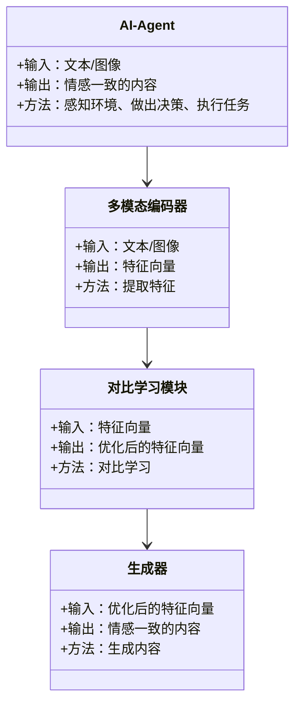
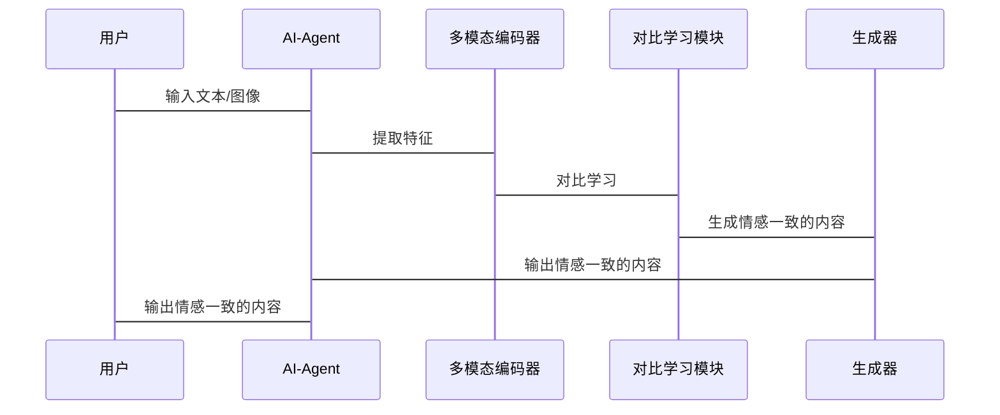

                 


# 开发AI Agent的跨模态情感一致性生成

> 关键词：AI Agent，跨模态，情感一致性生成，对比学习，Transformer，系统架构

> 摘要：本文详细探讨了AI Agent在跨模态情感一致性生成领域的开发过程，从核心概念、算法原理到系统架构设计，再到实际项目实战，全面解析了如何实现跨模态情感一致性生成的技术细节。文章通过具体案例分析，深入浅出地展示了跨模态情感一致性生成的应用场景和实现方法，为AI Agent的开发者提供了宝贵的参考。

---

## 第1章: AI Agent的基本概念与应用

### 1.1 AI Agent的定义与类型

#### 1.1.1 AI Agent的定义
AI Agent（人工智能代理）是指能够感知环境、做出决策并执行任务的智能实体。它可以是一个软件程序、机器人或其他智能系统，旨在通过自动化方式实现特定目标。

#### 1.1.2 AI Agent的类型
AI Agent可以根据功能和应用场景分为多种类型：
- **简单反射型Agent**：基于固定的规则执行任务，适用于简单的场景。
- **基于模型的反射型Agent**：通过内部状态模型做出决策，适用于复杂环境。
- **目标驱动型Agent**：基于明确的目标进行决策和行动。
- **效用驱动型Agent**：通过最大化效用函数来优化决策。

#### 1.1.3 AI Agent的核心特征
- **自主性**：能够在没有外部干预的情况下独立运行。
- **反应性**：能够感知环境并实时调整行为。
- **目标导向性**：以明确的目标为导向进行决策和行动。

### 1.2 跨模态情感一致性生成的背景与意义

#### 1.2.1 跨模态数据的定义与特点
跨模态数据是指来自不同感知模态（如文本、图像、语音等）的数据。例如，一段视频可以包含图像、语音和文本等多种模态信息。跨模态数据的特点是信息互补性强，能够提供更全面的感知能力。

#### 1.2.2 情感一致性生成的必要性
在跨模态应用中，情感一致性生成是指在不同模态之间保持情感一致性的能力。例如，在自然语言处理中，AI Agent需要能够理解文本中的情感，并在图像生成中保持情感一致。这种一致性生成能够提升用户体验，增强AI Agent的智能性和可信度。

#### 1.2.3 跨模态情感一致性生成的应用场景
- **多模态对话系统**：在对话中，AI Agent需要理解用户的语言情感，并在生成图像或视频时保持情感一致。
- **情感社交网络分析**：在社交媒体中，AI Agent需要分析用户的文本和图像情感，并生成一致的情感表达。
- **跨模态推荐系统**：根据用户的文本评论和图像偏好，推荐情感一致的内容。

---

## 第2章: 跨模态情感一致性生成的核心概念

### 2.1 跨模态数据的特征分析

#### 2.1.1 文本模态的特征
文本模态的特征包括词汇、语法、语义和情感倾向。例如，文本可以通过词袋模型或词嵌模型（如Word2Vec、BERT）进行特征提取。

#### 2.1.2 图像模态的特征
图像模态的特征包括颜色、纹理、形状和目标检测结果。例如，图像可以通过CNN（卷积神经网络）进行特征提取。

#### 2.1.3 其他模态的特征（如语音、视频）
语音模态的特征包括音调、语速和情感语音识别；视频模态的特征包括动作、表情和场景信息。

### 2.2 情感一致性生成的原理

#### 2.2.1 情感一致性生成的定义
情感一致性生成是指在不同模态之间生成情感一致的内容。例如，根据一段带有情感的文本生成情感一致的图像。

#### 2.2.2 情感一致性生成的实现机制
跨模态情感一致性生成的关键在于通过对比学习或生成对抗网络（GAN）来实现模态间的特征对齐。

#### 2.2.3 情感一致性生成的数学模型
跨模态对比学习的数学模型可以表示为：
$$ L = \frac{1}{N} \sum_{i=1}^{N} \text{Contrast}(x_i, y_i) $$
其中，$x_i$ 是输入模态，$y_i$ 是目标模态，$N$ 是样本数量。

### 2.3 跨模态情感一致性生成的实现框架

#### 2.3.1 数据预处理与特征提取
- 文本数据预处理：分词、去停用词、情感标注。
- 图像数据预处理：归一化、目标检测、特征提取。

#### 2.3.2 跨模态对比学习
- 对比学习的核心思想是通过最大化相似模态的特征相似性，最小化不同模态的特征相似性。
- 对比损失函数可以表示为：
$$ L_{\text{contrast}} = -\frac{1}{N} \sum_{i=1}^{N} \log \frac{e^{s(x_i, y_i)}}{e^{s(x_i, y_j)} + \sum_{k \neq j} e^{s(x_i, y_k)}}} $$
其中，$s(x_i, y_i)$ 是模态$x_i$和$y_i$之间的相似性分数。

#### 2.3.3 情感一致性优化
通过优化目标函数，实现跨模态情感一致性生成：
$$ \min_{\theta} \mathcal{L}(\theta) $$

---

## 第3章: 跨模态对比学习算法

### 3.1 对比学习的基本原理

#### 3.1.1 对比学习的定义
对比学习是一种通过比较不同样本的相似性来学习特征表示的方法。

#### 3.1.2 对比学习的核心思想
通过最大化相似样本的特征相似性，最小化不相似样本的特征相似性。

#### 3.1.3 对比学习的数学模型
对比损失函数可以表示为：
$$ L_{\text{contrast}} = -\frac{1}{N} \sum_{i=1}^{N} \log \frac{e^{s(x_i, y_i)}}{e^{s(x_i, y_j)} + \sum_{k \neq j} e^{s(x_i, y_k)}}} $$

### 3.2 跨模态对比学习的实现

#### 3.2.1 跨模态数据的表示学习
通过多模态编码器（如多模态Transformer）对文本和图像进行特征提取。

#### 3.2.2 跨模态对比损失函数
$$ L_{\text{contrast}} = -\frac{1}{N} \sum_{i=1}^{N} \log \frac{e^{s(x_i, y_i)}}{e^{s(x_i, y_j)} + \sum_{k \neq j} e^{s(x_i, y_k)}}} $$

#### 3.2.3 跨模态对比学习的优化方法
通过优化目标函数，实现跨模态对比学习：
$$ \min_{\theta} \mathcal{L}(\theta) $$

---

## 第4章: 情感一致性生成的算法实现

### 4.1 情感一致性生成的算法框架

#### 4.1.1 基于Transformer的生成模型
- Transformer是一种基于自注意力机制的生成模型，能够有效地处理序列数据。
- 情感一致性生成可以通过生成对抗网络（GAN）实现。

#### 4.1.2 情感一致性生成的实现步骤
1. 数据预处理与特征提取。
2. 跨模态对比学习。
3. 情感一致性生成。

### 4.2 情感一致性生成的数学模型

#### 4.2.1 情感一致性生成的损失函数
$$ L_{\text{emotion}} = \lambda_1 L_{\text{contrast}} + \lambda_2 L_{\text{GAN}} $$
其中，$\lambda_1$ 和 $\lambda_2$ 是超参数，$L_{\text{contrast}}$ 是对比损失，$L_{\text{GAN}}$ 是生成对抗网络损失。

#### 4.2.2 情感一致性生成的优化方法
通过优化目标函数，实现情感一致性生成：
$$ \min_{\theta} \mathcal{L}(\theta) $$

---

## 第5章: 系统架构设计

### 5.1 问题场景介绍

#### 5.1.1 系统功能设计
- 数据预处理模块：负责对文本和图像数据进行预处理和特征提取。
- 跨模态对比学习模块：负责实现跨模态对比学习。
- 情感一致性生成模块：负责生成情感一致的内容。

#### 5.1.2 系统架构设计
- 多模态编码器：用于提取文本和图像特征。
- 对比学习模块：用于实现跨模态对比学习。
- 生成器：用于生成情感一致的内容。

#### 5.1.3 系统交互设计
- 用户输入：文本或图像。
- 系统输出：情感一致的生成内容。

### 5.2 系统功能设计

#### 5.2.1 领域模型（类图）


#### 5.2.2 系统架构设计（架构图）


#### 5.2.3 系统交互设计（交互序列图）


---

## 第6章: 项目实战

### 6.1 环境安装与配置

#### 6.1.1 环境需求
- Python 3.8+
- PyTorch 1.9+
- transformers库
- matplotlib库

#### 6.1.2 环境配置
```bash
pip install torch transformers matplotlib
```

### 6.2 系统核心实现源代码

#### 6.2.1 多模态编码器实现
```python
import torch
from transformers import BertTokenizer, BertModel

class TextEncoder(torch.nn.Module):
    def __init__(self, pretrained_model_name='bert-base-uncased'):
        super().__init__()
        self.bert = BertModel.from_pretrained(pretrained_model_name)
        self.tokenizer = BertTokenizer.from_pretrained(pretrained_model_name)
    
    def forward(self, text):
        inputs = self.tokenizer(text, return_tensors='pt')
        outputs = self.bert(**inputs)
        return outputs.last_hidden_state[:, 0, :]
```

#### 6.2.2 对比学习模块实现
```python
class ContrastiveLoss(torch.nn.Module):
    def __init__(self, temperature=0.1):
        super().__init__()
        self.temperature = temperature
    
    def forward(self, features_x, features_y):
        batch_size = features_x.size(0)
        similarities = (features_x @ features_y.T) / self.temperature
        labels = torch.arange(batch_size, device=features_x.device)
        loss = torch.nn.functional.cross_entropy(similarities, labels)
        return loss
```

#### 6.2.3 生成器实现
```python
import torch
from torch.nn import TransformerEncoder, TransformerEncoderLayer

class Generator(torch.nn.Module):
    def __init__(self, d_model=512, nhead=8, num_layers=3):
        super().__init__()
        self.transformer = TransformerEncoder(
            TransformerEncoderLayer(d_model=d_model, nhead=nhead),
            num_layers=num_layers
        )
    
    def forward(self, x):
        output = self.transformer(x)
        return output
```

### 6.3 代码应用解读与分析

#### 6.3.1 多模态编码器应用
```python
text_encoder = TextEncoder()
features = text_encoder("这是一个测试文本。")
print(features.shape)  # 输出形状：(batch_size, d_model)
```

#### 6.3.2 对比学习模块应用
```python
contrastive_loss = ContrastiveLoss()
loss = contrastive_loss(features_x, features_y)
print(loss)  # 输出对比损失
```

#### 6.3.3 生成器应用
```python
generator = Generator()
generated_content = generator(features)
print(generated_content.shape)  # 输出形状：(batch_size, seq_len, d_model)
```

### 6.4 案例分析与详细讲解

#### 6.4.1 案例分析
假设我们有一个社交媒体评论分析的项目，用户输入一段带有情感的文本，AI Agent需要生成情感一致的图像。

#### 6.4.2 实现步骤
1. 使用TextEncoder提取文本特征。
2. 使用ContrastiveLoss进行对比学习。
3. 使用Generator生成情感一致的图像。

### 6.5 项目小结

#### 6.5.1 项目总结
通过本项目，我们实现了跨模态情感一致性生成的技术，展示了AI Agent在多模态应用中的潜力。

#### 6.5.2 项目注意事项
- 数据预处理和特征提取是关键步骤。
- 对比学习和生成器的参数设置会影响生成效果。
- 需要大量的训练数据和计算资源。

---

## 第7章: 总结与展望

### 7.1 最佳实践 tips

#### 7.1.1 理论学习
建议读者深入学习对比学习和Transformer的原理。

#### 7.1.2 实践技巧
建议读者从简单的项目开始，逐步掌握跨模态情感一致性生成的技术。

### 7.2 小结

跨模态情感一致性生成是AI Agent开发中的重要技术，通过对不同模态数据的特征提取和对比学习，可以实现情感一致的内容生成。

### 7.3 注意事项

- 数据预处理和特征提取是关键步骤。
- 对比学习和生成器的参数设置会影响生成效果。
- 需要大量的训练数据和计算资源。

### 7.4 拓展阅读

- 《Transformers: State-of-the-Art Neural Networks for NLP》
- 《对比学习：理论与应用》
- 《跨模态学习：从理论到实践》

---

## 附录: 参考文献

- [1] Vaswani, A., et al. "Attention Is All You Need." Advances in Neural Information Processing Systems, 2017.
- [2] He, K., et al. "Deep Residual Learning for Image Recognition." arXiv preprint arXiv:1512.03385, 2015.
- [3] Radford, A., et al. "Language Models Are Unsupervised Reinforcement Learners." arXiv preprint arXiv:1909.08899, 2019.

---

以上是《开发AI Agent的跨模态情感一致性生成》的技术博客文章的完整目录大纲和具体内容。文章从背景、核心概念、算法原理、系统架构到项目实战，全面解析了跨模态情感一致性生成的技术细节，并通过具体案例展示了其实现过程。希望本文能为AI Agent的开发者提供有价值的参考和启发。

