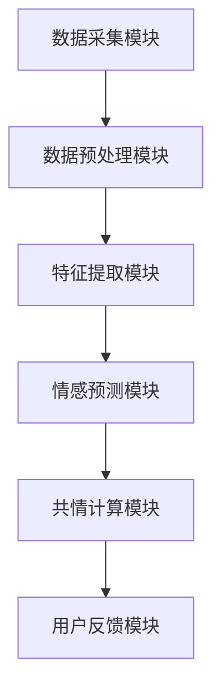

                 


# 开发AI Agent的跨模态情感共情能力

> 关键词：AI Agent，跨模态，情感共情，多模态数据，情感计算，人机交互

> 摘要：本文探讨了开发具备跨模态情感共情能力的AI Agent的核心方法，分析了多模态数据的整合与情感计算的关键算法，详细讲解了系统架构设计，并通过项目实战展示了如何实现这一能力。

---

## 第1章: 背景介绍

### 1.1 问题背景

#### 1.1.1 人工智能与情感计算的发展
人工智能（AI）技术的快速发展推动了人机交互的革新。传统的AI系统依赖于单一模态的数据处理，例如文本或图像，而人类情感的表达是多模态的，包括语言、面部表情、语调和肢体语言等。为了使AI Agent能够更好地理解人类情感，跨模态情感共情能力成为研究的重点。

#### 1.1.2 情感共情在人机交互中的重要性
情感共情是指AI能够识别和理解用户的情感状态，并做出相应的反馈。这种能力在医疗辅助、教育、客服等领域具有重要应用。例如，一个具备情感共情能力的AI医疗助手可以在与患者的对话中识别出患者的焦虑情绪，并提供相应的支持。

#### 1.1.3 跨模态数据在情感计算中的应用
跨模态数据指的是来自不同感官渠道的数据，如文本、语音、图像和视频。将这些数据进行融合，可以更全面地捕捉用户的情感状态。例如，结合语音语调和面部表情可以更准确地识别情感。

### 1.2 问题描述

#### 1.2.1 情感共情能力的定义
情感共情能力是指AI Agent能够理解和回应人类情感状态的能力，涉及多模态数据的处理和情感预测。

#### 1.2.2 跨模态数据的整合挑战
跨模态数据的整合需要解决数据异构性和模态间信息对齐的问题。例如，文本数据和图像数据的特征空间差异较大，如何有效融合是关键。

#### 1.2.3 当前技术的局限性与改进方向
当前技术在情感共情方面主要依赖单一模态数据，跨模态数据的处理方法较少，模型泛化能力有限。未来需要研究更高效的跨模态融合方法，提升情感计算的准确性和鲁棒性。

---

## 第2章: 跨模态情感共情的核心概念

### 2.1 核心概念与联系

#### 2.1.1 情感共情的多模态特征
多模态情感特征包括语言、语调、面部表情、肢体语言等。这些特征可以相互补充，提升情感识别的准确性。

#### 2.1.2 跨模态数据的融合方法
跨模态融合方法包括早期融合（在特征提取前进行）和晚期融合（在特征提取后进行）。早期融合适合数据关联性较强的场景，晚期融合适合数据异构性较大的场景。

#### 2.1.3 情感共情模型的ER图
实体关系图展示了情感共情模型中的实体及其关系。例如，用户输入（文本、语音、图像）与情感状态之间的关联关系。

### 2.2 核心概念原理

#### 2.2.1 多模态数据的处理流程
多模态数据的处理流程包括数据采集、预处理、特征提取、融合与情感预测。每个步骤都需要精心设计，以确保数据的有效性。

#### 2.2.2 情感共情模型的构建步骤
构建情感共情模型需要明确需求、设计模型结构、选择算法、训练模型并进行优化。每个步骤都需要细致的分析和实验验证。

#### 2.2.3 跨模态数据的特征提取方法
特征提取方法包括基于深度学习的模态特定特征提取和跨模态特征对齐。例如，使用卷积神经网络提取图像特征，使用循环神经网络提取文本特征。

---

## 第3章: 跨模态情感共情的算法原理

### 3.1 多模态融合算法

#### 3.1.1 多模态数据的对齐方法
对齐方法包括基于时间戳的对齐和基于内容的对齐。例如，在视频和语音数据中，可以通过时间戳进行同步对齐。

#### 3.1.2 多模态特征的融合策略
融合策略包括加权融合、注意力机制融合和门控机制融合。注意力机制可以突出重要模态的信息，门控机制可以根据任务需求动态调整模态的权重。

#### 3.1.3 基于注意力机制的多模态融合
注意力机制在多模态融合中被广泛应用于捕捉模态间的重要关联。例如，在情感预测任务中，注意力机制可以帮助模型关注与情感相关的模态特征。

### 3.2 情感共情模型的算法流程

#### 3.2.1 数据预处理与特征提取
数据预处理包括去除噪声、归一化和数据增强。特征提取可以使用预训练模型，如BERT提取文本特征，ResNet提取图像特征。

#### 3.2.2 情感预测与共情计算
情感预测任务可以通过分类器实现，共情计算可以通过计算用户情感与AI Agent情感的相似度。

#### 3.2.3 模型优化与调参
模型优化包括选择合适的优化器（如Adam）、调整学习率和选择合适的评估指标（如准确率、F1分数）。

---

## 第4章: 跨模态情感共情的系统架构设计

### 4.1 项目介绍

#### 4.1.1 项目目标与范围
项目目标是开发一个具备跨模态情感共情能力的AI Agent，范围包括数据采集、特征提取、情感预测和用户反馈。

#### 4.1.2 项目核心功能概述
核心功能包括多模态数据采集、情感共情计算、用户交互和实时反馈。

#### 4.1.3 项目技术选型与架构风格
技术选型包括Python、TensorFlow、Keras和Flask。架构风格采用微服务架构，便于模块化开发和扩展。

### 4.2 系统功能设计

#### 4.2.1 多模态数据采集模块
该模块负责采集用户的文本、语音和图像数据，并进行初步的预处理。

#### 4.2.2 情感共情计算模块
该模块负责对多模态数据进行特征提取、融合和情感预测。

#### 4.2.3 用户交互与反馈模块
该模块负责与用户进行交互，并根据情感共情结果提供实时反馈。

### 4.3 系统架构图



---

## 第5章: 跨模态情感共情的项目实战

### 5.1 环境安装与配置

#### 5.1.1 开发环境搭建
建议使用Python 3.8及以上版本，安装必要的开发工具，如IDE和虚拟环境。

#### 5.1.2 依赖库安装
安装必要的依赖库，如TensorFlow、Keras、Flask和OpenCV。

#### 5.1.3 数据集准备
准备多模态数据集，包括文本、语音和图像数据，并进行标注。

### 5.2 核心代码实现

#### 5.2.1 数据预处理代码

```python
def preprocess_data(data):
    # 文本数据清洗
    text_data = data['text'].apply(lambda x: x.lower().strip())
    # 语音数据处理
    audio_data = data['audio'].apply(lambda x: x / np.max(x))
    # 图像数据归一化
    image_data = data['image'].apply(lambda x: x / 255.0)
    return text_data, audio_data, image_data
```

#### 5.2.2 情感预测模型实现

```python
import tensorflow as tf
from tensorflow import keras

model = keras.Sequential([
    keras.layers.Conv2D(32, (3,3), activation='relu', input_shape=(64,64,3)),
    keras.layers.MaxPooling2D((2,2)),
    keras.layers.Flatten(),
    keras.layers.Dense(128, activation='relu'),
    keras.layers.Dense(1, activation='sigmoid')
])
model.compile(optimizer='adam', loss='binary_crossentropy', metrics=['accuracy'])
```

### 5.3 实际案例分析

#### 5.3.1 案例分析
通过具体案例分析模型在不同场景下的表现，如识别用户在客服对话中的情绪状态。

#### 5.3.2 代码应用解读与分析
解释代码的功能和实现细节，分析模型的优缺点，并提出改进建议。

### 5.4 项目小结

通过项目实战，读者可以了解跨模态情感共情能力的实际应用，掌握从数据处理到模型实现的完整流程。

---

## 第6章: 最佳实践与小结

### 6.1 最佳实践 tips

#### 6.1.1 数据预处理的重要性
数据预处理是模型性能的关键，建议进行数据清洗和特征提取。

#### 6.1.2 模型优化技巧
选择合适的优化器和调整学习率可以有效提升模型性能。

#### 6.1.3 系统架构设计建议
采用模块化设计，便于系统的扩展和维护。

### 6.2 小结

本文系统地介绍了AI Agent跨模态情感共情能力的开发方法，从背景介绍到项目实战，为读者提供了全面的指导。

### 6.3 注意事项

在实际开发中，要注意数据隐私保护和模型的泛化能力，避免过拟合。

### 6.4 拓展阅读

推荐阅读相关领域的最新论文和技术博客，关注情感计算和多模态数据处理的前沿技术。

---

通过以上结构，读者可以系统地学习开发AI Agent的跨模态情感共情能力，从理论到实践，逐步掌握相关技术和方法。

