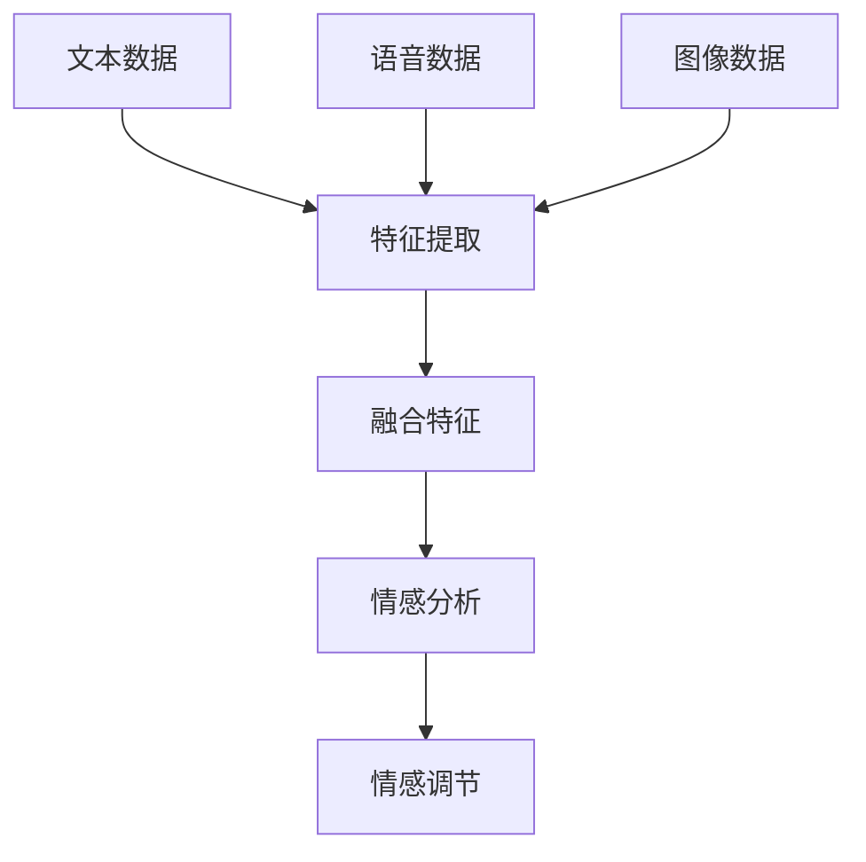
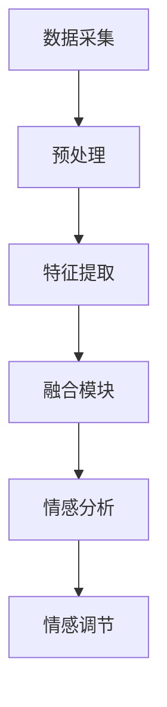

                 

# 第二章：跨模态数据处理原理

## 1.2 跨模态情感调节系统的背景与意义

### 1.2.1 跨模态数据的定义与分类

跨模态数据是指来自不同感官渠道的数据类型，如文本、语音、图像和视频。这些数据类型在结构和内容上存在显著差异：

- **文本数据**：结构化，包含词汇和语法信息。
- **语音数据**：非结构化，包含音调、语速和语调信息。
- **图像数据**：非结构化，包含颜色、形状和纹理信息。
- **视频数据**：综合了图像和动态信息，具有时空特性。

跨模态数据的分类主要依据数据类型和来源，分为文本、语音、图像和视频四类，每类都有其独特的特征和应用场景。

### 1.2.2 情感计算与分析的基本概念

情感计算（Affective Computing）研究如何通过计算机技术识别、理解和模拟人类情感。核心任务包括情感分类、情感强度计算和情感预测。常见方法有：

- **基于词典的方法**：利用预定义的情感词汇进行情感分析。
- **基于机器学习的方法**：使用训练数据进行特征提取和分类。
- **基于深度学习的方法**：通过神经网络学习情感特征。

### 1.2.3 跨模态情感调节系统的实现原理

跨模态情感调节系统通过采集多模态数据，经过预处理、特征提取和融合，最终进行情感分析和调节。实现步骤如下：

1. **数据采集**：获取文本、语音和图像数据。
2. **数据预处理**：清洗和标准化数据，提取有用特征。
3. **特征提取**：将数据转换为可计算的特征向量。
4. **数据融合**：结合多模态特征，利用注意力机制进行加权融合。
5. **情感分析**：基于融合后的特征，进行情感分类。
6. **情感调节**：根据分析结果，生成调节信号，调整系统行为。

## 2.1 跨模态数据的融合方法

跨模态数据融合是将不同模态的数据结合，以提高信息处理能力。常用方法包括特征提取、注意力机制和深度学习中的多模态融合模型。

### 2.1.1 基于特征提取的融合方式

特征提取方法将不同模态的数据转换为共同特征空间，然后进行融合。例如，将文本向量化为词向量，图像提取纹理特征，然后将向量拼接或进行加权求和。

### 2.1.2 基于注意力机制的融合策略

注意力机制动态调整各模态的重要性。例如，在多模态Transformer中，各模态特征通过自注意力机制计算权重，加权后进行融合。

### 2.1.3 深度学习中的多模态融合模型

多模态Transformer模型在高层次上融合信息，通过交叉注意力机制捕获不同模态之间的关系，增强特征表达能力。

## 2.2 情感计算与分析

### 2.2.1 情感分析的基本概念

情感分析旨在识别文本中情感倾向，分为正面、负面和中性。常用算法包括词袋模型、TF-IDF和情感词典。

### 2.2.2 基于文本的情感计算方法

文本情感计算使用词袋模型提取关键词，结合情感词典进行情感分类。例如，使用VADER算法分析社交媒体文本情感。

### 2.2.3 跨模态情感计算的优势

跨模态情感计算结合多模态数据，提高情感识别准确性。例如，结合文本和语音数据，利用语音语调信息修正文本情感分析结果。

## 2.3 情感调节系统的理论基础

情感调节系统基于情感计算和跨模态数据融合，实现情感分析和调节。其实现原理包括数据采集、预处理、特征提取、融合和情感调节。

## 图2.1：跨模态数据融合架构图

## 图2.2：情感调节系统架构图

### 2.3.1 注意力机制公式

注意力权重计算公式：
$$
\alpha_i = \frac{e^{score(x_i)}}{\sum_{j}e^{score(x_j)}}
$$

### 2.3.2 情感调节模型公式

情感调节损失函数：
$$
L = -\sum_{i} y_i \log(p_i) + (1 - y_i) \log(1 - p_i)
$$

通过以上内容，第二章详细讲解了跨模态数据处理和情感计算的理论基础，为后续的算法实现和系统设计奠定了基础。

