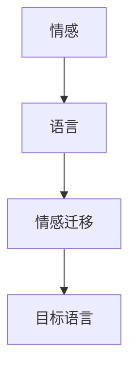
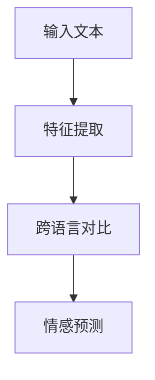
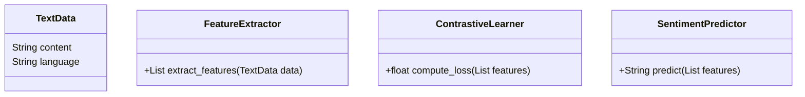
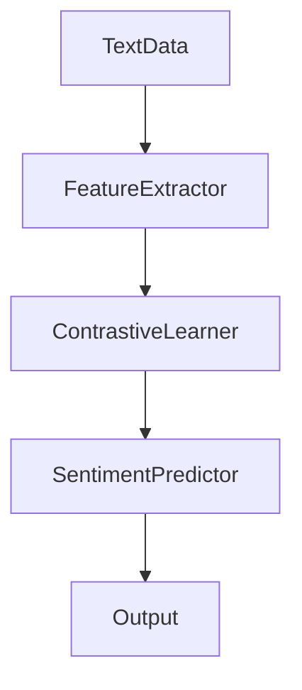
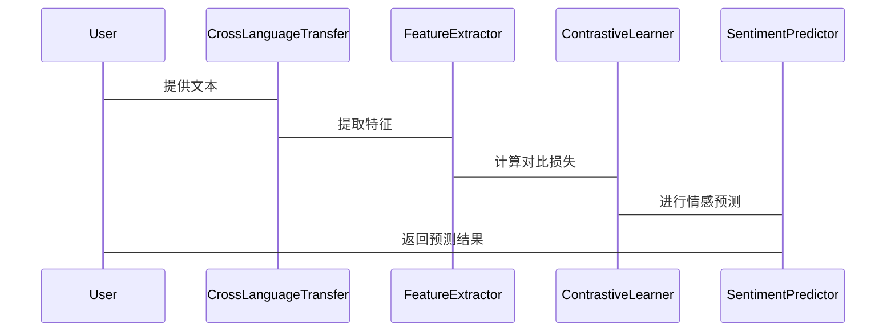

                 


# 开发AI Agent的跨语言情感迁移技术

**关键词：** 跨语言情感迁移，AI Agent，情感分析，迁移学习，跨语言技术

**摘要：**  
跨语言情感迁移技术是自然语言处理领域的重要研究方向，旨在通过技术手段实现情感信息在不同语言之间的迁移与分析。本文从技术背景、核心概念、算法原理、系统架构、项目实战等多维度进行详细阐述，探讨跨语言情感迁移技术的核心要素与实际应用，为AI Agent的开发提供理论与实践指导。

---

# 第一部分: 跨语言情感迁移技术的背景与核心概念

## 第1章: 跨语言情感迁移技术的背景与问题描述

### 1.1 跨语言情感迁移技术的背景
#### 1.1.1 情感分析技术的发展历程
- 从传统基于规则的情感分析到机器学习驱动的深度学习方法，情感分析技术经历了从简单到复杂的演变。
- 跨语言情感分析的需求随着全球化进程的加速而日益增加。

#### 1.1.2 跨语言情感迁移技术的提出背景
- 在多语言环境下，如何高效地利用一种语言的情感分析结果来辅助另一种语言的情感分析，成为一个亟待解决的问题。
- 跨语言情感迁移技术的提出，旨在降低跨语言情感分析的成本与复杂性。

#### 1.1.3 跨语言情感迁移技术的现实意义
- 提升AI Agent在多语言环境下的情感分析能力。
- 降低跨语言情感分析的计算资源消耗。
- 为全球化应用场景提供技术支持。

### 1.2 跨语言情感迁移技术的核心问题
#### 1.2.1 情感分析的跨语言挑战
- 不同语言之间的语义差异。
- 文化差异对情感表达的影响。

#### 1.2.2 跨语言情感迁移的核心问题
- 如何提取跨语言的情感特征。
- 如何建立情感迁移的映射关系。

#### 1.2.3 跨语言情感迁移的边界与外延
- 跨语言情感迁移的适用范围。
- 跨语言情感迁移与其他技术的界限。

### 1.3 跨语言情感迁移技术的核心要素
#### 1.3.1 情感分析的基本概念
- 情感极性（正面、负面、中性）。
- 情感强度（强烈或轻微）。

#### 1.3.2 跨语言情感迁移的核心要素
- 情感特征提取。
- 跨语言映射模型。
- 情感迁移效果评估。

#### 1.3.3 跨语言情感迁移的技术架构
- 数据预处理模块。
- 特征提取模块。
- 跨语言映射模块。
- 情感预测模块。

## 第2章: 跨语言情感迁移技术的核心概念与理论基础

### 2.1 跨语言情感迁移的核心概念
#### 2.1.1 情感分析的基本定义
- 情感分析：对文本的情感倾向进行分类的技术。
- 跨语言情感分析：在多语言环境下进行情感分析的技术。

#### 2.1.2 跨语言情感迁移的定义
- 跨语言情感迁移：将一种语言的情感分析结果迁移到另一种语言的技术。

#### 2.1.3 跨语言情感迁移的核心属性
- 跨语言性：涉及多种语言。
- 情感迁移性：情感信息的转移与适应。

### 2.2 跨语言情感迁移与相关技术的对比
#### 2.2.1 跨语言情感迁移与传统情感分析的对比
- 传统情感分析：专注于单一语言。
- 跨语言情感迁移：跨语言的情感信息迁移。

#### 2.2.2 跨语言情感迁移与机器翻译的对比
- 机器翻译：语言之间的转换。
- 跨语言情感迁移：情感信息的迁移。

#### 2.2.3 跨语言情感迁移与跨语言检索的对比
- 跨语言检索：基于内容的检索。
- 跨语言情感迁移：基于情感的迁移。

### 2.3 跨语言情感迁移的ER实体关系图


## 2.4 本章小结

---

# 第二部分: 跨语言情感迁移技术的算法原理

## 第3章: 跨语言情感迁移技术的算法原理

### 3.1 跨语言情感迁移的核心算法
#### 3.1.1 迁移学习的基本原理
- 迁移学习：利用已有的知识来辅助新任务的学习。
- 跨语言情感迁移：将一种语言的情感分析知识迁移到另一种语言。

#### 3.1.2 对比学习的基本原理
- 对比学习：通过对比不同数据的特征，提升模型的区分能力。
- 跨语言情感迁移：通过对比不同语言的特征，实现情感迁移。

#### 3.1.3 预训练模型的微调原理
- 预训练模型：如BERT、GPT等。
- 微调：在特定任务上对预训练模型进行进一步训练。

### 3.2 跨语言情感迁移算法的流程


### 3.3 跨语言情感迁移算法的Python实现
#### 3.3.1 环境搭建
```python
import torch
import torch.nn as nn
import torch.optim as optim
from torch.utils.data import DataLoader
```

#### 3.3.2 核心代码实现
```python
def cross_language_transfer(source_lang, target_lang):
    # 特征提取
    features = extract_features(source_lang)
    # 跨语言对比
    contrastive_loss = compute_contrastive_loss(features, target_lang)
    # 情感预测
    predicted_sentiment = predict_sentiment(contrastive_loss)
    return predicted_sentiment
```

### 3.4 跨语言情感迁移的数学模型与公式
#### 3.4.1 对比学习的损失函数
$$ L = \frac{1}{|B|} \sum_{i=1}^{B} (1 - s_i) \cdot d(x_i, y_i) + s_i \cdot d(x_i, y_i) $$

#### 3.4.2 情感预测的优化目标
$$ \min_{\theta} \sum_{i=1}^{N} \sum_{j=1}^{M} L_{ij} $$

---

# 第三部分: 跨语言情感迁移技术的系统分析与架构设计

## 第4章: 跨语言情感迁移技术的系统分析与架构设计

### 4.1 跨语言情感迁移技术的项目场景
#### 4.1.1 多语言情感分析的需求
- 全球化市场中的情感分析需求。
- 跨境电商中的客户反馈分析。

#### 4.1.2 AI Agent的应用场景
- 跨语言客服系统。
- 多语言情感监控系统。

### 4.2 跨语言情感迁移技术的系统功能设计
#### 4.2.1 领域模型类图


#### 4.2.2 系统架构设计


### 4.3 跨语言情感迁移技术的系统接口设计
#### 4.3.1 API接口定义
```python
class CrossLanguageTransfer:
    def __init__(self, source_lang, target_lang):
        self.source_lang = source_lang
        self.target_lang = target_lang
        # 初始化特征提取器和预测器
```

#### 4.3.2 系统交互流程


---

# 第四部分: 跨语言情感迁移技术的项目实战

## 第5章: 跨语言情感迁移技术的项目实战

### 5.1 项目实战环境搭建
#### 5.1.1 环境要求
- Python 3.8及以上。
- PyTorch 1.9及以上。

#### 5.1.2 数据集准备
- 训练数据：多语言情感标注数据集。
- 测试数据：目标语言的情感标注数据。

### 5.2 项目核心代码实现
#### 5.2.1 特征提取模块
```python
class FeatureExtractor(nn.Module):
    def __init__(self, vocab_size, embed_dim):
        super().__init__()
        self.embedding = nn.Embedding(vocab_size, embed_dim)
    def forward(self, input):
        return self.embedding(input)
```

#### 5.2.2 对比学习模块
```python
class ContrastiveLearner(nn.Module):
    def __init__(self, feature_dim):
        super().__init__()
        self.similarity = nn.Linear(feature_dim, 1)
    def forward(self, feature1, feature2):
        similarity = self.similarity(torch.cat([feature1, feature2], dim=1))
        return similarity
```

#### 5.2.3 情感预测模块
```python
class SentimentPredictor(nn.Module):
    def __init__(self, feature_dim, num_classes):
        super().__init__()
        self.classifier = nn.Linear(feature_dim, num_classes)
    def forward(self, features):
        return self.classifier(features)
```

### 5.3 项目实际案例分析
#### 5.3.1 数据预处理
- 文本清洗。
- 分词与标注。

#### 5.3.2 模型训练
- 使用预训练 embeddings 进行初始化。
- 进行对比学习和情感预测的联合优化。

#### 5.3.3 模型评估
- 准确率、召回率、F1值的计算。
- 对比不同语言之间的情感迁移效果。

### 5.4 项目总结
- 项目实现的关键步骤。
- 模型性能的优化方向。
- 实际应用中的注意事项。

---

# 第五部分: 跨语言情感迁移技术的最佳实践与未来展望

## 第6章: 跨语言情感迁移技术的最佳实践与未来展望

### 6.1 跨语言情感迁移技术的最佳实践
#### 6.1.1 数据 preprocessing tips
- 确保数据的平衡性。
- 处理语言之间的不平衡数据。

#### 6.1.2 模型优化 tips
- 使用预训练模型进行微调。
- 采用多任务学习框架。

#### 6.1.3 评估指标 tips
- 结合业务需求选择合适的评估指标。
- 多维度评估模型性能。

### 6.2 跨语言情感迁移技术的未来展望
#### 6.2.1 技术发展方向
- 更高效的跨语言对比学习方法。
- 多模态情感分析的结合。

#### 6.2.2 应用场景拓展
- 跨语言情感分析在跨境电商中的应用。
- 跨语言情感分析在社交媒体监控中的应用。

### 6.3 本章小结

---

## 第7章: 附录

### 7.1 跨语言情感迁移技术相关数据集
- 示例数据集的描述。
- 数据集的获取方式。

### 7.2 跨语言情感迁移技术相关工具库
- Python库的安装与使用。
- 开发工具的配置指南。

### 7.3 跨语言情感迁移技术相关参考文献
- 核心论文的引用。
- 进一步阅读的推荐书目。

---

# 作者总结

跨语言情感迁移技术是一项具有重要应用价值的技术，本文从理论到实践，系统地探讨了其核心概念、算法原理、系统架构和项目实现。通过本文的学习，读者可以全面掌握跨语言情感迁移技术的核心要素，并能够在实际项目中灵活应用这些技术，提升AI Agent在多语言环境下的情感分析能力。

