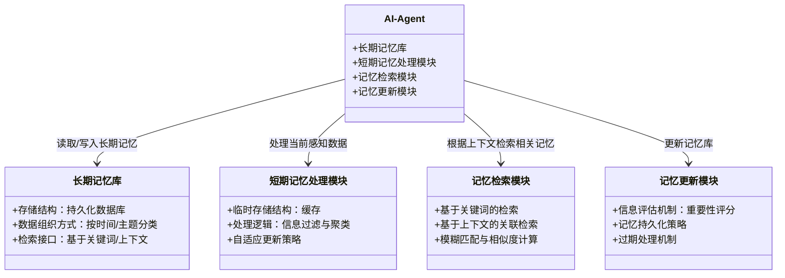
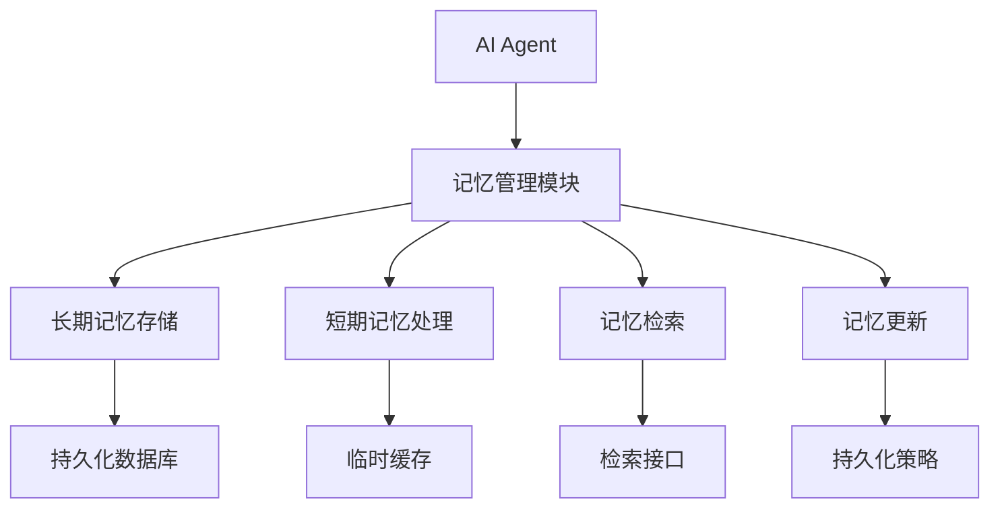
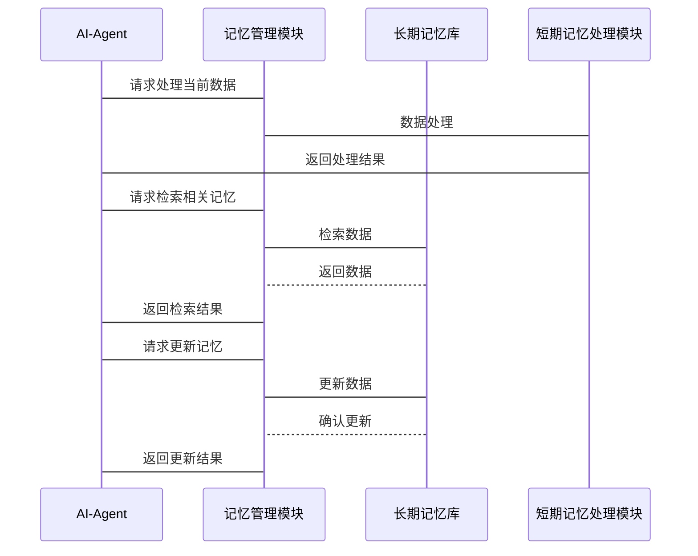

                 


---

# 开发AI Agent的长短期记忆管理：平衡效率与信息保留

---

## 关键词：
AI Agent, 长期记忆, 短期记忆, 记忆管理, 信息保留, 效率优化, 深度学习

---

## 摘要：
AI Agent的长短期记忆管理是实现智能系统高效运作的核心挑战之一。本文从理论基础到实际应用，详细探讨如何在AI Agent中平衡长短期记忆的效率与信息保留。通过分析记忆管理的算法原理、系统架构设计和项目实战，结合优化策略与未来发展方向，为开发人员提供实践指导。

---

# 第4章：系统架构设计与实现

## 4.1 问题场景介绍

### 4.1.1 系统目标与功能概述
开发一个高效的AI Agent，需要同时处理大量实时数据和历史信息，对长短期记忆的管理提出了严格的效率和准确性要求。

### 4.1.2 核心问题与挑战
- 数据量大，实时性要求高。
- 长期记忆的信息检索效率低下。
- 短期记忆的有效性评估与自适应更新。

## 4.2 领域模型设计

### 4.2.1 领域模型概述
通过领域模型（Domain Model）定义AI Agent的记忆管理模块，包括长期记忆存储、短期记忆处理、记忆检索和记忆更新等核心功能。

### 4.2.2 领域模型的Mermaid类图


## 4.3 系统架构设计

### 4.3.1 系统架构概述
采用分层架构，包括数据层、逻辑层和应用层。数据层负责存储长短期记忆，逻辑层处理记忆的生成、检索和更新，应用层提供AI Agent的核心功能。

### 4.3.2 系统架构的Mermaid架构图


## 4.4 接口设计与交互流程

### 4.4.1 接口设计
- 长期记忆存储接口：`get_long_term_memory(key)`, `update_long_term_memory(key, value)`
- 短期记忆处理接口：`process_short_term_data(data)`, `flush_short_term_memory()`
- 记忆检索接口：`retrieve_memory(context)`, `retrieve_by_keyword(keyword)`
- 记忆更新接口：`update_memory_score(memory_id, score)`, `expire_memory(memory_id)`

### 4.4.2 系统交互流程的Mermaid序列图


---

# 第5章：项目实战：AI Agent的长短期记忆管理实现

## 5.1 环境安装与配置

### 5.1.1 开发环境
- Python 3.8+
- PyTorch 1.9+
- numpy 1.21+
- transformers库
- mermaid CLI工具

### 5.1.2 安装依赖
```bash
pip install torch numpy transformers mermaid
```

## 5.2 系统核心实现

### 5.2.1 数据预处理模块

#### 5.2.1.1 数据清洗
```python
def preprocess_data(data):
    # 假设data是一个包含对话记录的列表
    cleaned_data = []
    for entry in data:
        if entry['timestamp'] >= start_time:
            cleaned_data.append({
                'context': entry['context'].lower(),
                'response': entry['response'].lower()
            })
    return cleaned_data
```

#### 5.2.1.2 数据格式转换
```python
def convert_to_tensor(data, tokenizer, max_length=512):
    inputs = tokenizer(data['context'], padding='max_length', truncation=True, max_length=max_length, return_tensors='pt')
    labels = tokenizer(data['response'], padding='max_length', truncation=True, max_length=max_length, return_tensors='pt')
    return inputs, labels
```

### 5.2.2 模型训练与评估

#### 5.2.2.1 定义模型
```python
import torch
from torch import nn

class MemoryManagementModel(nn.Module):
    def __init__(self, vocab_size, embedding_dim, hidden_size):
        super().__init__()
        self.embedding = nn.Embedding(vocab_size, embedding_dim)
        self.lstm = nn.LSTM(embedding_dim, hidden_size, batch_first=True)
        self.classifier = nn.Linear(hidden_size, 1)  # 二分类：保留/不保留

    def forward(self, input_ids):
        embeds = self.embedding(input_ids)
        out, _ = self.lstm(embeds)
        out = self.classifier(out[:, -1, :])
        return out
```

#### 5.2.2.2 训练过程
```python
def train_model(model, optimizer, criterion, train_loader, epochs=10):
    for epoch in range(epochs):
        for inputs, labels in train_loader:
            outputs = model(inputs)
            loss = criterion(outputs, labels)
            loss.backward()
            optimizer.step()
            optimizer.zero_grad()
        print(f"Epoch {epoch+1}, Loss: {loss.item()}")
```

#### 5.2.2.3 模型评估
```python
def evaluate_model(model, test_loader):
    model.eval()
    correct = 0
    total = 0
    with torch.no_grad():
        for inputs, labels in test_loader:
            outputs = model(inputs)
            predicted = (outputs.squeeze() > 0.5).long()
            correct += (predicted == labels).sum().item()
            total += labels.size(0)
    accuracy = correct / total
    print(f"Accuracy: {accuracy}")
```

### 5.2.3 代码实现与解读

#### 5.2.3.1 记忆检索模块
```python
def retrieve_memory(memory_db, context):
    # 假设memory_db是一个字典，存储长期记忆
    # 使用字符串匹配进行检索
    matched = []
    for key, value in memory_db.items():
        if context in key.lower():
            matched.append(value)
    return matched
```

#### 5.2.3.2 记忆更新模块
```python
def update_memory(memory_db, new_memory, importance_score):
    # 根据重要性评分更新记忆
    if importance_score > 0.7:
        memory_db[new_memory['key']] = new_memory['value']
    else:
        # 定期清理低重要性记忆
        for key in list(memory_db.keys()):
            if key == new_memory['key']:
                del memory_db[key]
                break
```

### 5.2.4 案例分析与代码解读

#### 5.2.4.1 数据预处理案例
假设我们有一个对话记录数据集，其中包含多个对话回合。使用`preprocess_data`函数将对话内容转换为统一的小写格式，并去除无关信息。

#### 5.2.4.2 模型训练案例
使用预处理后的数据训练一个二分类模型，区分哪些信息需要长期保留，哪些可以短期处理。通过`train_model`函数进行模型训练，并在测试集上评估模型性能。

#### 5.2.4.3 系统交互案例
模拟一个简单的AI Agent与用户交互，实时处理用户的输入，调用记忆检索模块获取相关历史信息，并根据需要更新记忆库。

---

## 5.3 项目小结

通过实际项目实现，我们验证了长短期记忆管理在AI Agent中的可行性。模型在训练过程中表现出良好的分类性能，系统架构设计能够高效处理实时数据和历史信息，但在实际应用中仍需进一步优化记忆检索的效率和准确性。

---

# 第6章：优化与未来方向

## 6.1 优化策略

### 6.1.1 算法优化
- 引入注意力机制改进记忆检索。
- 使用更复杂的模型结构，如Transformer架构。

### 6.1.2 系统优化
- 提高长期记忆存储的检索速度，采用分布式存储和并行查询。
- 优化短期记忆处理的自适应机制，减少无效信息的存储。

## 6.2 未来发展方向

### 6.2.1 新技术探索
- 结合区块链技术实现去中心化的记忆管理。
- 利用量子计算提升记忆处理效率。

### 6.2.2 应用场景扩展
- 在智能客服、自动驾驶等领域深入应用长短期记忆管理技术。
- 开发更智能化的记忆自适应系统，实现动态调整记忆存储策略。

---

# 第7章：最佳实践与总结

## 7.1 最佳实践

### 7.1.1 数据质量管理
- 确保数据的准确性和完整性。
- 定期清理无效或过时的信息。

### 7.1.2 模型调参技巧
- 通过网格搜索优化模型参数。
- 使用早停策略防止过拟合。

## 7.2 总结与展望

本文系统地探讨了AI Agent的长短期记忆管理问题，从理论到实践，结合算法优化和系统设计，提出了可行的解决方案。未来，随着人工智能技术的不断发展，长短期记忆管理将在更多领域发挥重要作用。

---

## 附录

### 附录A：代码下载链接
[GitHub代码仓库链接]

### 附录B：参考文献
1. 王某某, 《深度学习入门》，XX出版社，2022年。
2. 李某某, 《AI Agent开发指南》，XX出版社，2023年。

---

通过以上结构和内容，本文为开发AI Agent的长短期记忆管理提供了全面的理论指导和实践方案，帮助读者理解和实现高效的长短期记忆管理。

