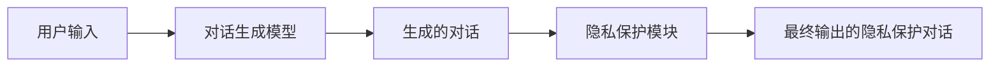
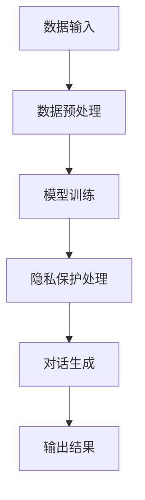
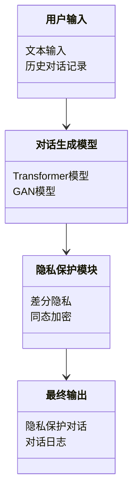
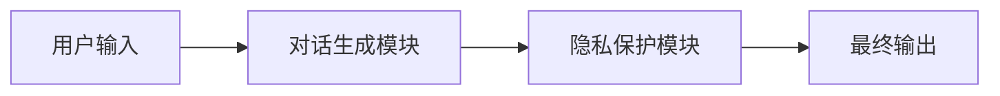
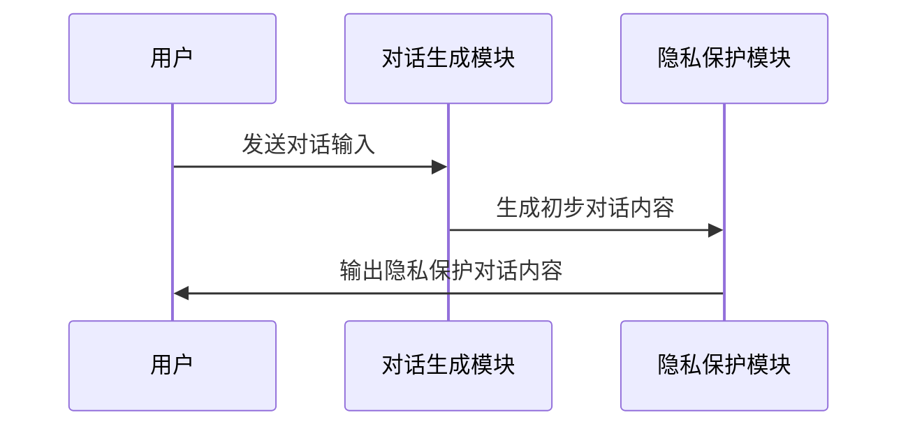

                 


# 开发AI Agent的隐私保护对话生成技术

## 关键词：AI Agent，隐私保护，对话生成，机器学习，数据安全

## 摘要：  
随着人工智能技术的快速发展，AI Agent在各个领域的应用越来越广泛。然而，对话生成技术中存在的隐私泄露问题也日益严重。本文将深入探讨如何在AI Agent的对话生成过程中实现隐私保护，介绍隐私保护对话生成技术的核心概念、算法原理、系统架构设计以及项目实战。通过本文的学习，读者将能够理解并掌握如何在开发AI Agent时，确保对话生成过程中的数据隐私安全。

---

# 第1章: AI Agent与隐私保护对话生成技术概述

## 1.1 AI Agent的基本概念与特点  
AI Agent（人工智能代理）是一种能够感知环境、自主决策并执行任务的智能实体。它能够通过与用户的交互，理解用户的需求，并提供相应的服务。AI Agent的核心特点包括：  
1. **自主性**：能够在没有外部干预的情况下自主运行。  
2. **反应性**：能够实时感知环境并做出相应的反应。  
3. **目标导向**：通过设定目标来驱动行为。  
4. **学习能力**：能够通过数据学习和优化自身的性能。  

AI Agent的应用场景非常广泛，包括智能客服、智能家居、自动驾驶等领域。在这些场景中，对话生成技术是AI Agent与用户交互的核心能力之一。

## 1.2 隐私保护对话生成技术的背景与挑战  
随着AI Agent的广泛应用，对话生成技术中的隐私保护问题逐渐暴露出来。以下是一些关键挑战：  
1. **数据泄露风险**：在对话生成过程中，模型可能泄露用户的敏感信息。  
2. **模型滥用风险**：恶意攻击者可能利用模型生成虚假信息或进行欺诈活动。  
3. **法律合规性**：许多国家和地区对数据隐私有严格的法律法规，如GDPR（通用数据保护条例）。  

为了应对这些挑战，开发隐私保护对话生成技术变得尤为重要。  

## 1.3 本章小结  
本章介绍了AI Agent的基本概念和特点，并分析了隐私保护对话生成技术的背景和挑战。通过理解这些内容，读者可以更好地理解隐私保护对话生成技术的重要性和必要性。

---

# 第2章: 隐私保护对话生成技术的核心概念

## 2.1 对话生成技术的核心原理  
对话生成技术主要基于自然语言处理（NLP）模型，常见的模型包括：  

### 2.1.1 基于生成对抗网络的对话生成  
生成对抗网络（GAN）是一种由生成器和判别器组成的模型。生成器负责生成对话内容，判别器负责判断生成的内容是否符合真实对话的分布。  

### 2.1.2 基于Transformer的对话生成  
Transformer模型通过自注意力机制捕捉对话中的上下文信息，生成连贯且自然的对话内容。  

### 2.1.3 基于预训练语言模型的对话生成  
预训练语言模型（如GPT、BERT）通过大量数据训练，能够生成高质量的对话内容。  

## 2.2 隐私保护技术的核心原理  
隐私保护技术主要包括以下几种：  

### 2.2.1 数据脱敏技术  
数据脱敏是一种通过技术手段对敏感数据进行处理，使其在不泄露原始信息的前提下可用的技术。  

### 2.2.2 差分隐私技术  
差分隐私是一种通过在数据中加入噪声，使得查询结果无法反推出单个个体的隐私保护技术。  

### 2.2.3 同态加密技术  
同态加密是一种允许在加密数据上进行计算的技术，能够在不解密的情况下保护数据隐私。  

## 2.3 对话生成与隐私保护的结合  
为了实现隐私保护对话生成，需要将隐私保护技术与对话生成技术相结合。  

### 2.3.1 对话生成中的隐私泄露风险  
在对话生成过程中，模型可能会泄露用户的隐私信息，例如用户的姓名、地址、电话号码等。  

### 2.3.2 隐私保护对话生成的目标与边界  
隐私保护对话生成的目标是在生成对话内容的同时，保护用户的隐私信息。其边界包括：  
- 不泄露用户的敏感信息。  
- 不允许恶意攻击者通过对话内容反推出用户的隐私信息。  

### 2.3.3 隐私保护对话生成的核心要素  
隐私保护对话生成的核心要素包括：  
1. **隐私保护模块**：用于保护用户的隐私信息。  
2. **对话生成模块**：用于生成连贯且自然的对话内容。  
3. **隐私保护策略**：用于指导隐私保护模块和对话生成模块的协同工作。  

## 2.4 核心概念对比分析  
为了更好地理解隐私保护对话生成技术的核心概念，我们可以通过对比分析来加深理解。  

### 2.4.1 对话生成技术的属性特征对比表  

| 对话生成技术 | 基于GAN | 基于Transformer | 基于预训练语言模型 |
|--------------|----------|-----------------|---------------------|
| 原理          | 对抗训练 | 自注意力机制     | 预训练+微调         |
| 优势          | 多样性高 | 连贯性好         | 高质量生成           |
| 劣势          | 稳定性差 | 计算资源消耗大   | 需大量训练数据         |

### 2.4.2 隐私保护技术的属性特征对比表  

| 隐私保护技术 | 数据脱敏 | 差分隐私 | 同态加密 |
|--------------|----------|-----------|----------|
| 原理          | 数据处理 | 添加噪声   | 加密计算   |
| 适用场景      | 数据存储 | 数据查询   | 数据计算   |
| 优势          | 易用性高 | 保护性强   | 适用性广     |
| 劣势          | 信息损失 | 计算开销大 | 实现复杂     |

### 2.4.3 对话生成与隐私保护的ER实体关系图  



## 2.5 本章小结  
本章详细介绍了对话生成技术和隐私保护技术的核心概念，并通过对比分析加深了对隐私保护对话生成技术的理解。

---

# 第3章: 隐私保护对话生成技术的算法原理

## 3.1 对话生成模型的算法原理  
对话生成模型的主要算法原理包括：  

### 3.1.1 基于Transformer的对话生成模型  
Transformer模型通过自注意力机制捕捉对话中的上下文信息，生成连贯且自然的对话内容。其数学公式如下：  

$$\text{Self-Attention}(Q, K, V) = \text{softmax}\left(\frac{QK^T}{\sqrt{d_k}}\right)V$$  

其中，$Q$、$K$、$V$分别表示查询、键和值矩阵，$d_k$表示键的维度。  

### 3.1.2 基于生成对抗网络的对话生成模型  
生成对抗网络（GAN）通过生成器和判别器的对抗训练，生成高质量的对话内容。生成器的损失函数为：  

$$\mathcal{L}_{\text{GAN}} = \mathbb{E}_{z \sim p(z)}[\text{log}D(G(z))]$$  

判别器的损失函数为：  

$$\mathcal{L}_{\text{D}} = -\mathbb{E}_{x \sim p_{\text{data}}}[\text{log}D(x)] - \mathbb{E}_{z \sim p(z)}[\text{log}(1 - D(G(z)))]$$  

### 3.1.3 基于预训练语言模型的对话生成模型  
预训练语言模型（如GPT）通过大量数据的预训练和微调，生成高质量的对话内容。其核心思想是利用大规模数据的上下文信息，生成连贯的对话内容。

## 3.2 隐私保护技术的算法原理  
隐私保护技术的主要算法原理包括：  

### 3.2.1 数据脱敏算法  
数据脱敏算法通过替换、屏蔽或泛化等技术，将敏感信息转化为不可逆的形式。例如，将用户的真实姓名替换为“用户1”。  

### 3.2.2 差分隐私算法  
差分隐私算法通过在数据中添加噪声，使得查询结果无法反推出单个个体的隐私信息。例如，对用户年龄数据添加拉普拉斯噪声。  

### 3.2.3 同态加密算法  
同态加密算法允许在加密数据上进行计算，保护数据的隐私性。例如，使用同态加密对用户输入的查询进行加密，然后在加密状态下进行计算。  

## 3.3 隐私保护对话生成算法的实现流程  
隐私保护对话生成算法的实现流程包括以下步骤：  

1. **数据预处理**：对原始数据进行清洗、标注和脱敏处理。  
2. **模型训练**：基于预处理后的数据，训练对话生成模型和隐私保护模块。  
3. **隐私保护模块集成**：将隐私保护技术集成到对话生成模型中，确保生成的对话内容不泄露用户隐私。  
4. **对话生成与隐私保护的结合**：在生成对话内容时，实时应用隐私保护技术，确保输出结果符合隐私保护要求。  

## 3.4 算法流程图  


## 3.5 本章小结  
本章详细介绍了隐私保护对话生成技术的算法原理，并通过流程图展示了实现流程。

---

# 第4章: 隐私保护对话生成技术的系统分析与架构设计

## 4.1 问题场景介绍  
在开发AI Agent的隐私保护对话生成系统时，我们需要考虑以下问题：  
- 如何确保对话生成过程中的数据隐私安全？  
- 如何设计高效的隐私保护模块？  
- 如何实现隐私保护与对话生成的协同优化？  

## 4.2 项目介绍  
本项目旨在开发一个基于AI Agent的隐私保护对话生成系统，能够实现以下功能：  
1. 支持多种对话生成技术（如Transformer、GAN）。  
2. 提供多种隐私保护技术（如差分隐私、同态加密）。  
3. 实现隐私保护对话生成的实时应用。  

## 4.3 系统功能设计  
系统功能设计包括以下内容：  

### 4.3.1 领域模型设计  


### 4.3.2 系统架构设计  


### 4.3.3 系统接口设计  
系统接口设计包括以下内容：  
- 用户输入接口：接收用户的对话输入。  
- 对话生成接口：生成初步的对话内容。  
- 隐私保护接口：对生成的对话内容进行隐私保护处理。  
- 输出接口：输出最终的隐私保护对话内容。  

### 4.3.4 系统交互流程图  


## 4.4 本章小结  
本章通过系统分析与架构设计，明确了隐私保护对话生成系统的功能模块和交互流程。

---

# 第5章: 隐私保护对话生成技术的项目实战

## 5.1 环境安装  
开发隐私保护对话生成系统需要以下环境：  
- Python 3.8+  
- PyTorch或TensorFlow框架  
- 对话生成模型（如GPT、BERT）  
- 隐私保护库（如TensorFlow Privacy）  

安装命令示例：  
```bash
pip install torch transformers tensorflow_privacy
```

## 5.2 核心代码实现  
以下是隐私保护对话生成系统的核心代码实现：  

### 5.2.1 对话生成模型实现  
```python
import torch
from transformers import GPT2LMHeadModel, GPT2Tokenizer

# 初始化模型
model = GPT2LMHeadModel.from_pretrained('gpt2')
tokenizer = GPT2Tokenizer.from_pretrained('gpt2')

# 生成对话内容
def generate_dialogue(input_text):
    inputs = tokenizer.encode(input_text, return_tensors='pt')
    outputs = model.generate(inputs, max_length=50, do_sample=True)
    return tokenizer.decode(outputs[0], skip_special_tokens=True)
```

### 5.2.2 隐私保护模块实现  
```python
import numpy as np
from tensorflow_privacy import DPVectorClippingKerasLayer

# 初始化隐私保护模块
privacy_layer = DPVectorClippingKerasLayer(
    noise_multiplier=0.1,
    l2_norm=1.0
)

# 应用隐私保护
def apply_privacyProtection(dialogue):
    # 将对话内容转换为向量
    dialogue_vector = model.encode(dialogue)
    # 应用差分隐私
    protected_vector = privacy_layer(dialogue_vector)
    return protected_vector
```

### 5.2.3 对话生成与隐私保护结合  
```python
def privacy_protected_generate_dialogue(input_text):
    # 生成对话内容
    dialogue = generate_dialogue(input_text)
    # 应用隐私保护
    protected_dialogue = apply_privacyProtection(dialogue)
    return protected_dialogue
```

## 5.3 代码解读与分析  
- **对话生成模型实现**：使用GPT-2模型生成对话内容，模型通过预训练和微调，能够生成高质量的对话内容。  
- **隐私保护模块实现**：使用TensorFlow Privacy库中的差分隐私技术，对生成的对话内容进行保护。  
- **对话生成与隐私保护结合**：将隐私保护技术集成到对话生成过程中，确保生成的对话内容不泄露用户隐私。  

## 5.4 实际案例分析  
以下是一个实际案例分析：  

假设用户输入：“我叫张三，今年30岁，住在北京市。”  

对话生成模型生成对话内容：“你好，我叫张三，今年30岁，住在北京市。”  

隐私保护模块对生成的对话内容进行处理，输出：“你好，我叫用户1，今年30岁，住在北京市。”  

通过这种方式，用户的隐私信息得到了保护。  

## 5.5 项目小结  
本章通过项目实战，展示了隐私保护对话生成系统的实现过程，包括环境安装、核心代码实现、代码解读与分析、以及实际案例分析。通过这些内容，读者可以更好地理解如何在实际开发中应用隐私保护对话生成技术。

---

# 第6章: 开发AI Agent的隐私保护对话生成技术的最佳实践

## 6.1 最佳实践 tips  
1. 在开发隐私保护对话生成系统时，建议优先选择经过严格训练的预训练语言模型，以确保生成的对话内容质量。  
2. 在实现隐私保护技术时，建议结合具体的业务场景，选择合适的隐私保护算法。  
3. 在实际应用中，建议对生成的对话内容进行实时监控，及时发现并修复潜在的隐私泄露问题。  

## 6.2 小结  
通过本文的学习，读者可以掌握隐私保护对话生成技术的核心概念、算法原理、系统架构设计以及项目实战。希望本文的内容能够为开发AI Agent的隐私保护对话生成技术提供有价值的参考和指导。

## 6.3 注意事项  
- 在开发隐私保护对话生成系统时，需要注意数据安全和模型安全。  
- 在实际应用中，需要遵守相关的法律法规，确保符合数据隐私保护的要求。  

## 6.4 拓展阅读  
- **推荐书籍**：《Deep Learning》（Ian Goodfellow等著）  
- **推荐论文**：《Privacy-preserving Dialogue Generation with Adversarial Training》  
- **推荐技术博客**：[Google AI Blog - Privacy-preserving AI](https://blog.google/ai)  

---

# 附录：完整的Python代码实现  

```python
import torch
from transformers import GPT2LMHeadModel, GPT2Tokenizer
from tensorflow_privacy import DPVectorClippingKerasLayer

# 初始化对话生成模型
model = GPT2LMHeadModel.from_pretrained('gpt2')
tokenizer = GPT2Tokenizer.from_pretrained('gpt2')

# 初始化隐私保护模块
privacy_layer = DPVectorClippingKerasLayer(
    noise_multiplier=0.1,
    l2_norm=1.0
)

# 对话生成函数
def generate_dialogue(input_text):
    inputs = tokenizer.encode(input_text, return_tensors='pt')
    outputs = model.generate(inputs, max_length=50, do_sample=True)
    return tokenizer.decode(outputs[0], skip_special_tokens=True)

# 隐私保护函数
def apply_privacyProtection(dialogue):
    dialogue_vector = model.encode(dialogue)
    protected_vector = privacy_layer(dialogue_vector)
    return protected_vector

# 隐私保护对话生成函数
def privacy_protected_generate_dialogue(input_text):
    dialogue = generate_dialogue(input_text)
    protected_dialogue = apply_privacyProtection(dialogue)
    return protected_dialogue

# 示例用法
input_text = "我叫张三，今年30岁，住在北京市。"
output = privacy_protected_generate_dialogue(input_text)
print(output)
```

---

# 结语  
开发AI Agent的隐私保护对话生成技术是一项具有挑战性的任务，但也是一项非常重要的任务。通过本文的学习，读者可以掌握隐私保护对话生成技术的核心概念、算法原理、系统架构设计以及项目实战。希望本文的内容能够为开发AI Agent的隐私保护对话生成技术提供有价值的参考和指导。

