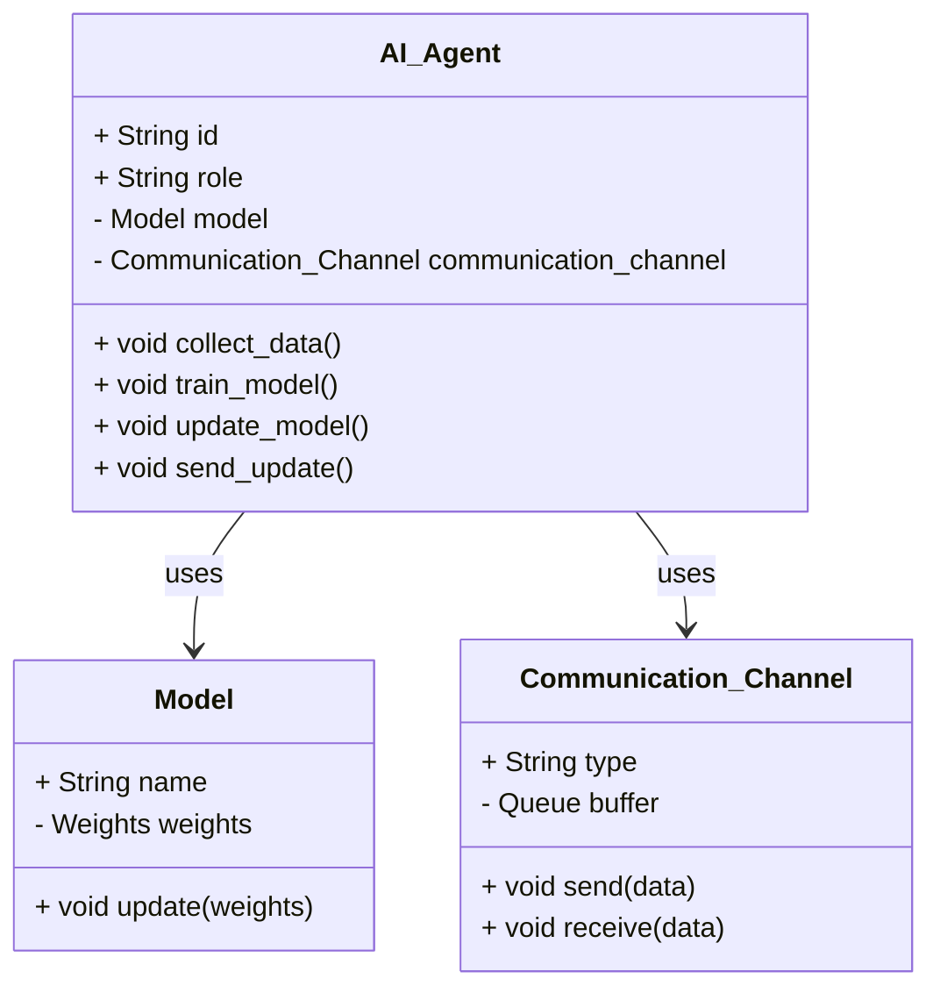
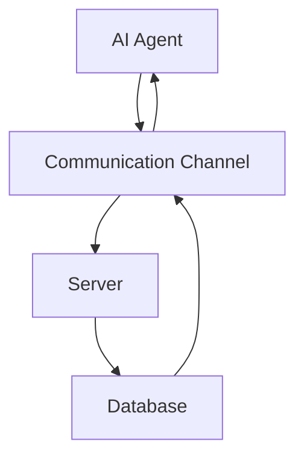
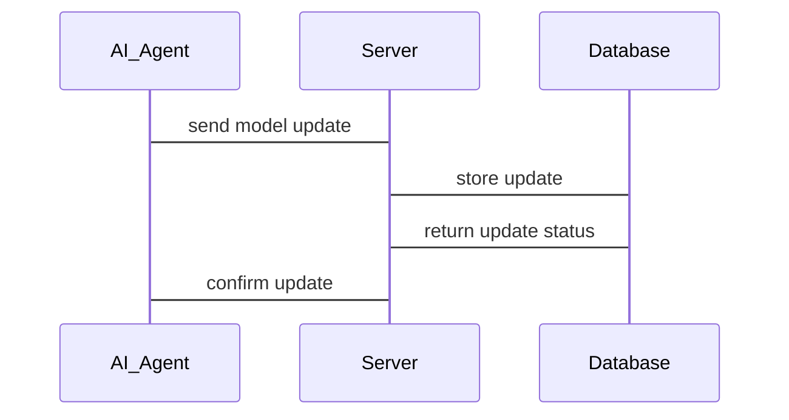

                 


# 开发AI Agent的隐私保护联邦学习框架

## 关键词：AI Agent，联邦学习，隐私保护，数据安全，分布式计算

## 摘要：  
在人工智能快速发展的今天，AI Agent（智能体）的应用越来越广泛，而如何在AI Agent的开发中保护隐私成为一个关键问题。联邦学习作为一种分布式机器学习技术，能够在不共享原始数据的情况下进行模型训练，为隐私保护提供了新的解决方案。本文将详细探讨如何开发具有隐私保护功能的AI Agent，并构建相应的联邦学习框架，涵盖核心概念、算法原理、系统设计、项目实现等多个方面，为读者提供全面的技术指导。

---

# 第1章 背景与概述

## 1.1 AI Agent的基本概念

### 1.1.1 AI Agent的定义与特点  
AI Agent（智能体）是指能够感知环境并采取行动以实现目标的实体。与传统AI不同，AI Agent强调自主性、反应性和主动性，能够在动态环境中做出决策。

**特点：**  
- **自主性：** AI Agent能够独立运作，无需人工干预。  
- **反应性：** 能够实时感知环境变化并调整行为。  
- **主动性：** 主动采取行动以实现目标。  

### 1.1.2 AI Agent的应用场景  
AI Agent广泛应用于自动驾驶、智能助手、推荐系统等领域。例如，自动驾驶汽车中的AI Agent能够实时感知路况并做出驾驶决策。

### 1.1.3 AI Agent与传统AI的区别  
传统AI注重数据处理和模式识别，而AI Agent更注重与环境的交互和自主决策能力。

---

## 1.2 联邦学习框架的基本概念

### 1.2.1 联邦学习的定义与特点  
联邦学习（Federated Learning）是一种分布式机器学习技术，允许多个参与方在不共享数据的情况下共同训练模型。

**特点：**  
- **数据隐私：** 参与方无需共享原始数据，仅共享模型参数。  
- **分布式计算：** 计算在各个参与方的设备上分布式完成。  
- **通信效率：** 通过优化通信协议降低数据传输量。  

### 1.2.2 联邦学习的背景与现状  
随着数据隐私保护的日益严格，联邦学习成为一种重要的分布式学习方式，尤其是在医疗、金融等领域有广泛应用。

### 1.2.3 联邦学习的核心思想  
通过在各个设备或机构之间共享模型更新，而非数据本身，实现模型的联合训练。

---

## 1.3 隐私保护的重要性

### 1.3.1 数据隐私的基本概念  
数据隐私是指对数据的访问和使用进行限制，确保未经授权的第三方无法获取敏感信息。

### 1.3.2 隐私泄露的风险与挑战  
隐私泄露可能导致身份盗窃、金融诈骗等问题，尤其是在AI Agent的应用中，数据涉及用户行为、位置等敏感信息。

### 1.3.3 隐私保护的法律与伦理要求  
随着《数据保护通用条例》（GDPR）等法规的出台，数据隐私保护成为企业必须遵守的法律义务。

---

## 1.4 AI Agent与联邦学习的结合

### 1.4.1 AI Agent在联邦学习中的角色  
AI Agent可以作为联邦学习框架中的参与者，负责数据的收集、模型的更新和结果的反馈。

### 1.4.2 隐私保护联邦学习框架的意义  
通过结合AI Agent和联邦学习，可以在保护隐私的前提下，实现高效、安全的分布式模型训练。

### 1.4.3 本章小结  
本章介绍了AI Agent和联邦学习的基本概念，以及隐私保护的重要性，为后续章节奠定了基础。

---

# 第2章 核心概念与联系

## 2.1 AI Agent的核心原理

### 2.1.1 AI Agent的感知与决策机制  
AI Agent通过传感器或API获取环境信息，利用算法进行分析并做出决策。

### 2.1.2 AI Agent的行为模型  
行为模型描述了AI Agent在不同环境下的行为方式，通常包括状态、动作和奖励机制。

### 2.1.3 AI Agent的交互方式  
AI Agent可以通过API、消息队列等方式与其他系统或用户进行交互。

---

## 2.2 联邦学习框架的核心原理

### 2.2.1 联邦学习的基本原理  
联邦学习通过在各个设备上局部训练模型，然后将模型参数上传到中心服务器进行聚合，最终得到全局模型。

### 2.2.2 联邦学习的通信机制  
通信机制包括设备间的参数同步、模型更新等，通常采用加密通信技术确保数据安全。

### 2.2.3 联邦学习的同步策略  
同步策略包括同步更新和异步更新，同步更新适合低延迟场景，异步更新适合高延迟场景。

---

## 2.3 隐私保护的核心原理

### 2.3.1 数据加密的基本原理  
通过加密技术对数据进行加密，确保数据在传输过程中不被窃取。

### 2.3.2 数据匿名化的实现方法  
数据匿名化包括数据脱敏、数据混淆等技术，确保数据无法被溯源。

### 2.3.3 差分隐私与同态加密的对比  
- **差分隐私：** 在数据中添加噪声，确保单个数据点无法被识别。  
- **同态加密：** 允许在加密数据上进行计算，结果仍保持加密状态。  

---

## 2.4 核心概念的联系与对比

### 2.4.1 AI Agent与联邦学习的关系  
AI Agent可以作为联邦学习的参与者，负责数据的收集和模型的更新。

### 2.4.2 隐私保护与联邦学习的结合  
通过在联邦学习中引入隐私保护技术，可以在不共享数据的情况下完成模型训练。

### 2.4.3 核心概念的对比分析  
- AI Agent强调自主性和交互性，联邦学习强调分布式计算和模型共享，隐私保护强调数据安全。  

---

## 2.5 本章小结  
本章详细讲解了AI Agent、联邦学习和隐私保护的核心概念，并分析了它们之间的联系与区别，为后续章节的实现奠定了理论基础。

---

# 第3章 算法原理讲解

## 3.1 联邦学习的基本算法

### 3.1.1 横向联邦学习算法  
横向联邦学习适用于数据维度相同但样本不共享的场景，通过水平分割数据进行训练。

### 3.1.2 纵向联邦学习算法  
纵向联邦学习适用于数据样本相同但特征不共享的场景，通过垂直分割数据进行训练。

### 3.1.3 联邦学习的通信机制  
通信机制包括设备间的参数同步、模型更新等，通常采用加密通信技术确保数据安全。

---

## 3.2 横向联邦学习算法的详细讲解

### 3.2.1 算法流程  
1. 每个设备本地训练模型，更新参数。  
2. 设备将参数更新上传到中心服务器。  
3. 服务器聚合所有设备的参数更新，得到全局模型。  
4. 服务器将全局模型分发给所有设备。  

### 3.2.2 算法的数学模型  
$$ \text{全局模型} = \sum_{i=1}^{n} \text{设备i的模型更新} $$  

### 3.2.3 算法实现的代码示例  
```python
import numpy as np

# 初始化模型参数
global_weights = np.zeros((input_dim, output_dim))

# 模型更新过程
for i in range(num_rounds):
    # 设备上传参数更新
    updates = get_updates_from_devices(global_weights)
    # 聚合更新
    global_weights = global_weights + np.mean(updates, axis=0)
```

---

## 3.3 纵向联邦学习算法的详细讲解

### 3.3.1 算法流程  
1. 每个设备本地训练模型，更新参数。  
2. 设备将参数更新上传到中心服务器。  
3. 服务器聚合所有设备的参数更新，得到全局模型。  
4. 服务器将全局模型分发给所有设备。  

### 3.3.2 算法的数学模型  
$$ \text{全局模型} = \sum_{i=1}^{n} \text{设备i的模型更新} $$  

### 3.3.3 算法实现的代码示例  
```python
import numpy as np

# 初始化模型参数
global_weights = np.zeros((input_dim, output_dim))

# 模型更新过程
for i in range(num_rounds):
    # 设备上传参数更新
    updates = get_updates_from_devices(global_weights)
    # 聚合更新
    global_weights = global_weights + np.mean(updates, axis=0)
```

---

## 3.4 隐私保护算法的实现

### 3.4.1 差分隐私的实现  
通过在模型更新中添加噪声，确保单个设备的数据无法被识别。

### 3.4.2 同态加密的实现  
在加密数据上进行计算，结果仍保持加密状态。

---

## 3.5 本章小结  
本章详细讲解了联邦学习的基本算法，包括横向联邦学习和纵向联邦学习的实现，以及隐私保护算法的实现。

---

# 第4章 系统分析与架构设计

## 4.1 系统应用场景

### 4.1.1 场景描述  
AI Agent在医疗、金融、推荐系统等领域有广泛应用，需要在保护隐私的前提下进行模型训练。

### 4.1.2 场景挑战  
数据隐私保护是系统设计的核心挑战。

---

## 4.2 系统功能设计

### 4.2.1 功能需求  
- 数据采集与处理  
- 模型训练与更新  
- 模型分发与应用  

### 4.2.2 功能设计的类图  


---

## 4.3 系统架构设计

### 4.3.1 系统架构图  


### 4.3.2 系统组件说明  
- **AI Agent：** 负责数据采集和模型训练。  
- **Communication Channel：** 负责数据传输。  
- **Server：** 负责模型聚合和分发。  
- **Database：** 负责存储模型参数。  

---

## 4.4 系统接口设计

### 4.4.1 接口描述  
- 数据采集接口：用于AI Agent采集环境数据。  
- 模型更新接口：用于AI Agent上传模型更新。  
- 模型分发接口：用于Server分发全局模型。  

---

## 4.5 系统交互流程图  



---

## 4.6 本章小结  
本章通过系统分析与架构设计，明确了AI Agent隐私保护联邦学习框架的各个组件及其交互方式，为后续实现奠定了基础。

---

# 第5章 项目实战

## 5.1 环境搭建

### 5.1.1 系统环境  
- 操作系统：Linux/Windows/MacOS  
- Python版本：3.6+  
- 额外工具：pip，Jupyter Notebook  

### 5.1.2 安装依赖  
```bash
pip install numpy pandas scikit-learn
```

---

## 5.2 系统核心实现源代码

### 5.2.1 AI Agent实现  
```python
class AI_Agent:
    def __init__(self, id):
        self.id = id
        self.model = Model()
        self.communication = Communication_Channel()

    def collect_data(self):
        # 数据采集逻辑
        pass

    def train_model(self):
        # 模型训练逻辑
        pass

    def update_model(self):
        # 模型更新逻辑
        pass

    def send_update(self):
        # 上传更新逻辑
        pass
```

### 5.2.2 模型实现  
```python
class Model:
    def __init__(self):
        self.weights = np.random.randn(2, 2)

    def update(self, new_weights):
        self.weights = new_weights
```

### 5.2.3 通信通道实现  
```python
class Communication_Channel:
    def __init__(self):
        self.buffer = []

    def send(self, data):
        self.buffer.append(data)

    def receive(self):
        if len(self.buffer) > 0:
            return self.buffer.pop(0)
        else:
            return None
```

---

## 5.3 代码应用解读与分析

### 5.3.1 AI Agent的行为分析  
AI Agent通过collect_data方法采集数据，train_model方法训练模型，update_model方法更新模型，并通过send_update方法上传模型更新。

### 5.3.2 模型更新流程分析  
模型更新通过通信通道传输到服务器，服务器聚合所有更新后分发给所有AI Agent。

---

## 5.4 实际案例分析

### 5.4.1 案例描述  
假设我们开发一个智能推荐系统，AI Agent负责收集用户的交互数据，通过联邦学习框架在保护隐私的前提下训练推荐模型。

### 5.4.2 案例实现  
```python
# 初始化模型参数
global_weights = np.zeros((2, 2))

# 模型更新过程
for i in range(5):
    # 设备上传参数更新
    updates = [agent.send_update() for agent in agents]
    # 聚合更新
    global_weights = global_weights + np.mean(updates, axis=0)
```

---

## 5.5 本章小结  
本章通过项目实战，详细讲解了AI Agent隐私保护联邦学习框架的实现过程，包括环境搭建、代码实现和案例分析。

---

# 第6章 最佳实践与小结

## 6.1 最佳实践 tips

### 6.1.1 数据隐私保护的注意事项  
- 使用差分隐私或同态加密技术。  
- 定期进行安全审计。  

### 6.1.2 系统性能优化建议  
- 优化通信协议，减少数据传输量。  
- 使用边缘计算技术，降低延迟。  

---

## 6.2 小结

### 6.2.1 核心概念总结  
- AI Agent：自主性、反应性、主动性。  
- 联邦学习：分布式计算、模型共享、数据隐私。  
- 隐私保护：差分隐私、同态加密、数据匿名化。  

### 6.2.2 项目实现总结  
通过AI Agent和联邦学习的结合，可以在保护隐私的前提下实现高效的分布式模型训练。

---

## 6.3 注意事项

### 6.3.1 开发中的常见问题  
- 数据同步延迟。  
- 模型收敛速度慢。  

### 6.3.2 解决方案  
- 采用异步更新策略。  
- 使用优化的通信协议。  

---

## 6.4 拓展阅读

### 6.4.1 推荐书籍  
- 《联邦学习：隐私保护下的分布式机器学习》  
- 《AI Agent与智能系统》  

### 6.4.2 推荐博客与技术文章  
- [联邦学习技术博客](https://example.com)  
- [AI Agent开发指南](https://example.com)  

---

# 附录：工具与资源

## 附录A 术语表  
- AI Agent：智能体。  
- 联邦学习：分布式机器学习。  
- 差分隐私：数据隐私保护技术。  

## 附录B 工具安装指南  
- 安装Python：[Python官网](https://www.python.org)  
- 安装依赖：`pip install numpy pandas scikit-learn`  

---

# 结语  
开发AI Agent的隐私保护联邦学习框架是一个复杂但极具挑战性的任务。通过本文的详细讲解，读者可以掌握核心概念、算法原理和系统设计方法，并通过项目实战掌握实际开发技能。希望本文能为读者提供有价值的参考，推动AI Agent与联邦学习技术的发展。

--- 

感谢您的阅读！如果本文对您有所帮助，请点赞、收藏、转发，您的支持是我持续创作的动力！

