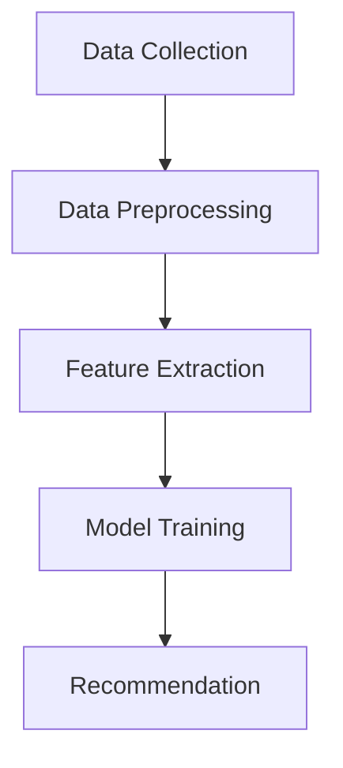

                 


# 开发AI Agent驱动的个性化推荐系统

## 关键词
- AI Agent
- 推荐系统
- 个性化推荐
- 矩阵分解
- 协同过滤
- 强化学习

## 摘要
AI Agent驱动的个性化推荐系统通过结合人工智能代理和推荐技术，能够实时理解和预测用户的偏好，提供更加精准和个性化的推荐。本文从背景、算法、架构到实现，详细探讨了开发AI Agent驱动推荐系统的核心步骤，包括协同过滤、深度学习模型的应用，以及系统的整体设计。通过案例分析和代码示例，展示了如何构建一个高效、动态的推荐系统。

---

# 第一部分: AI Agent驱动的个性化推荐系统背景与基础

## 第1章: 问题背景与需求分析

### 1.1 个性化推荐系统的现状与挑战
个性化推荐系统在电商、社交媒体和娱乐等领域广泛应用，但传统推荐系统存在以下问题：
- 数据稀疏性：用户评分少，导致推荐精度低。
- 单一性：无法实时适应用户需求变化。
- 计算资源消耗大：传统方法难以处理海量数据。

AI Agent的引入解决了这些问题，通过动态交互和实时反馈优化推荐结果。

### 1.2 问题描述与目标设定
推荐系统的核心问题是基于用户行为和偏好，预测用户的兴趣。AI Agent通过理解用户意图，动态调整推荐策略。目标包括：
- 提高推荐准确性。
- 实现实时反馈机制。
- 优化用户体验。

---

## 第2章: AI Agent与推荐系统的技术基础

### 2.1 AI Agent的基本概念
AI Agent是具有感知、推理和行动能力的智能体，能够理解并执行任务。在推荐系统中，AI Agent负责数据收集、分析和决策。

### 2.2 推荐系统的原理与分类
推荐系统分为基于协同过滤、内容和混合模型。协同过滤通过用户相似性推荐，内容过滤基于物品属性推荐。

### 2.3 AI Agent驱动推荐的核心概念
AI Agent通过理解用户需求，优化推荐策略。核心概念包括用户建模、动态交互和多目标优化。

---

# 第二部分: 推荐系统的核心算法与实现

## 第4章: 协同过滤算法原理与实现

### 4.1 协同过滤的基本原理
协同过滤通过用户或物品相似性推荐。基于用户的CF计算用户相似度，基于物品的CF分析物品属性。

### 4.2 协同过滤的数学模型
基于用户的CF公式：
$$ sim(i,j) = \frac{\sum_{k} (r_{ik} - \mu_i)(r_{jk} - \mu_j)}{\sqrt{\sum (r_{ik} - \mu_i)^2} \sqrt{\sum (r_{jk} - \mu_j)^2}} $$

基于物品的CF公式：
$$ sim(i,j) = \frac{\sum_{k} (r_{ki} - \mu_i)(r_{kj} - \mu_j)}{\sqrt{\sum (r_{ki} - \mu_i)^2} \sqrt{\sum (r_{kj} - \mu_j)^2}} $$

---

## 第5章: 深度学习模型在推荐系统中的应用

### 5.1 神经网络基础
神经网络通过多层感知器处理数据。推荐系统中，神经网络用于特征提取和预测。

### 5.2 矩阵分解
矩阵分解将用户和物品表示为低维向量。交替最小二乘法用于优化向量，公式：
$$ P^* = (Q^T Q)^{-1} Q^T Y $$

### 5.3 强化学习的应用
强化学习通过策略优化推荐。Q-learning算法用于状态和动作的优化：
$$ Q(s,a) = Q(s,a) + \alpha (r + \gamma \max Q(s',a') - Q(s,a)) $$

---

# 第三部分: 系统架构与实现

## 第6章: 系统架构设计

### 6.1 系统功能设计
推荐系统功能包括数据采集、特征提取和模型训练。

### 6.2 系统架构图
系统架构包括数据预处理、特征提取和模型训练模块。



---

## 第7章: 项目实战

### 7.1 环境安装
安装Python和相关库：
```bash
pip install numpy pandas scikit-learn
```

### 7.2 核心代码实现
矩阵分解代码示例：
```python
import numpy as np

def als(Y, lambda_val=0.1):
    # 分解Y为P和Q
    # 省略具体实现
    return P, Q
```

### 7.3 系统功能实现
实现数据预处理、模型训练和结果评估。

### 7.4 案例分析
以电影推荐为例，展示如何通过协同过滤和深度学习模型实现推荐。

---

## 第8章: 最佳实践与小结

### 8.1 最佳实践
- 数据预处理：处理缺失值和异常值。
- 模型选择：根据数据特性选择合适模型。
- 优化调优：使用交叉验证和超参数优化。

### 8.2 小结
本文详细探讨了AI Agent驱动推荐系统的开发过程，从背景到实现，提供全面的技术指导。未来，推荐系统将进一步融入实时反馈和多模态数据，提升推荐精度。

---

通过以上步骤，您可以系统地开发一个AI Agent驱动的个性化推荐系统，涵盖从理论到实践的各个方面。

