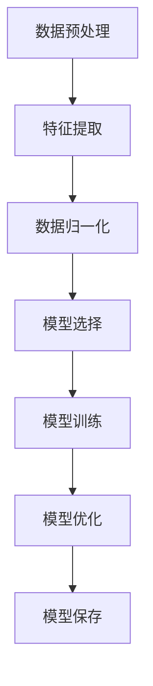

                 


# 开发AI辅助的企业财务弹性评估工具

## 关键词：AI辅助、财务弹性、评估工具、企业财务、弹性模型

## 摘要：本文详细探讨了开发AI辅助的企业财务弹性评估工具的各个方面。从背景介绍、核心概念到算法原理，再到系统设计和项目实战，最后总结了最佳实践。通过本篇文章，读者可以全面了解如何利用AI技术提升企业财务弹性评估的效率和准确性。

---

# 第一部分：企业财务弹性评估工具的背景与需求

## 第1章：企业财务弹性评估工具的背景与问题背景

### 1.1 企业财务弹性的概念与重要性

#### 1.1.1 企业财务弹性的定义
企业财务弹性是指企业在面对市场波动、经济变化或其他外部冲击时，能够调整其财务结构、维持稳健运营并实现可持续发展的能力。它反映了企业在不同环境下的财务灵活性和适应性。

#### 1.1.2 财务弹性在企业经营中的作用
财务弹性是企业风险管理的重要组成部分。它不仅帮助企业应对突发事件，还能在经济繁荣时期抓住机会，实现更快的增长。财务弹性强的企业通常能够更好地应对市场波动，维护股东利益，并在竞争中占据优势。

#### 1.1.3 财务弹性评估的挑战与难点
传统的财务弹性评估方法通常依赖于人工分析，耗时且容易受到主观因素的影响。此外，随着市场的快速变化，财务数据的复杂性和多样性也在不断增加，传统的评估工具难以满足现代企业的需求。

---

### 1.2 传统财务评估工具的局限性

#### 1.2.1 传统财务评估方法的不足
传统财务评估方法通常基于静态数据和简单的财务指标（如流动比率、速动比率等）。这些方法难以捕捉企业动态变化中的财务弹性，也无法提供实时的评估结果。

#### 1.2.2 人工评估的效率与准确性问题
人工评估不仅效率低下，而且容易受到评估人员的经验和主观判断的影响。此外，人工评估难以处理海量的财务数据，导致结果可能存在偏差。

#### 1.2.3 传统工具在动态环境中的适应性不足
现代企业面临的环境复杂多变，传统的财务评估工具难以适应这种动态变化。它们无法实时更新数据，也无法根据市场变化自动调整评估模型。

---

### 1.3 AI技术在财务评估中的应用潜力

#### 1.3.1 AI技术的基本概念与优势
人工智能（AI）是一种模拟人类智能的技术，能够通过机器学习、自然语言处理等方式，从大量数据中提取有价值的信息。AI技术的优势在于其高效性、自动化和自我优化能力。

#### 1.3.2 AI在财务数据分析中的应用
AI技术可以通过深度学习模型分析复杂的财务数据，发现数据中的潜在模式和关联性。例如，AI可以通过自然语言处理技术分析财务报告，提取关键信息。

#### 1.3.3 AI辅助财务评估的创新点
AI辅助财务评估工具可以通过实时数据更新、自动化分析和智能化决策支持，显著提升财务评估的效率和准确性。它不仅能够处理海量数据，还能根据市场变化动态调整评估模型。

---

### 1.4 本章小结

#### 1.4.1 财务弹性评估工具的必要性
随着经济环境的复杂化，企业需要一种高效、准确的财务评估工具来应对变化。

#### 1.4.2 AI技术在其中的核心作用
AI技术能够通过自动化分析和动态调整，显著提升财务弹性评估的效率和准确性。

#### 1.4.3 本书的研究目标与意义
本文旨在探讨如何利用AI技术开发企业财务弹性评估工具，为企业提供一种高效、智能的解决方案。

---

## 第2章：企业财务弹性评估工具的核心概念与联系

### 2.1 弹性评估模型的原理

#### 2.1.1 弹性评估模型的基本原理
弹性评估模型通过分析企业的财务数据，评估其在不同环境下的弹性能力。模型通常包括数据预处理、特征提取、模型训练和结果输出等步骤。

#### 2.1.2 模型的输入与输出
模型的输入包括企业的财务数据（如收入、利润、资产、负债等），输出是企业的弹性系数和评估等级。

#### 2.1.3 模型的评估指标
评估指标包括准确率、召回率、F1值等，用于衡量模型的性能。

---

### 2.2 核心概念的属性对比

#### 2.2.1 财务数据的特征分析
财务数据通常具有多样性、时序性和关联性等特点。不同类型的数据可能影响模型的性能。

#### 2.2.2 弹性指标的计算方法
弹性指标可以通过多种方法计算，如线性回归、随机森林等。每种方法都有其优缺点。

#### 2.2.3 不同模型的性能对比
通过对比不同模型的性能，可以找到最适合企业需求的评估工具。

---

### 2.3 ER实体关系图架构

```mermaid
er
    entity 财务数据 {
        key: ID
        attribute: 收入, 利润, 资产, 负债
    }
    entity 弹性指标 {
        key: ID
        attribute: 弹性系数, 评估等级
    }
    entity 模型参数 {
        key: ID
        attribute: 学习率, 隐层节点数
    }
    relation 训练数据关系 {
        财务数据 --> 弹性指标
        弹性指标 --> 模型参数
    }
```

---

## 第3章：弹性评估模型的算法原理

### 3.1 模型训练流程

#### 3.1.1 数据预处理
数据预处理包括数据清洗、特征提取和数据归一化等步骤。例如，可以通过PCA（主成分分析）提取关键特征。

#### 3.1.2 模型选择
根据数据特点选择合适的模型，如随机森林、支持向量机（SVM）或深度学习模型。

#### 3.1.3 模型训练与优化
通过交叉验证和超参数调优，优化模型的性能。

---

### 3.2 算法原理的详细讲解

#### 3.2.1 神经网络结构
神经网络通常包括输入层、隐藏层和输出层。隐藏层通过激活函数（如ReLU）进行非线性变换。

#### 3.2.2 损失函数
常用损失函数包括均方误差（MSE）和交叉熵损失。损失函数用于衡量模型预测值与真实值的差距。

#### 3.2.3 优化算法
常用优化算法包括梯度下降（SGD）和Adam优化器。优化算法通过调整模型参数，最小化损失函数。

---

### 3.3 模型训练流程图



---

## 第4章：系统分析与架构设计

### 4.1 项目介绍

#### 4.1.1 项目背景
本项目旨在开发一个基于AI的财务弹性评估工具，帮助企业实时监控财务状况。

#### 4.1.2 项目目标
通过AI技术实现对企业财务弹性的自动化评估，提供实时、准确的评估结果。

---

### 4.2 系统功能设计

#### 4.2.1 领域模型类图


#### 4.2.2 系统架构设计


#### 4.2.3 系统接口设计
系统接口包括数据输入接口、模型调用接口和结果输出接口。

---

## 第5章：项目实战

### 5.1 环境安装

#### 5.1.1 安装Python
```bash
python --version
pip install --upgrade pip
```

#### 5.1.2 安装深度学习框架
```bash
pip install tensorflow
```

---

### 5.2 核心代码实现

#### 5.2.1 数据预处理
```python
import pandas as pd
import numpy as np

# 加载数据
data = pd.read_csv('financial_data.csv')

# 特征提取
features = data[['收入', '利润', '资产', '负债']]
labels = data['弹性系数']

# 数据归一化
from sklearn.preprocessing import StandardScaler
scaler = StandardScaler()
features_scaled = scaler.fit_transform(features)
```

#### 5.2.2 模型训练
```python
from tensorflow.keras import layers
from tensorflow.keras import Model

# 构建模型
input_layer = layers.Input(shape=(features_scaled.shape[1],))
dense_layer = layers.Dense(64, activation='relu')(input_layer)
output_layer = layers.Dense(1, activation='sigmoid')(dense_layer)

model = Model(inputs=input_layer, outputs=output_layer)

# 编译模型
model.compile(optimizer='adam', loss='binary_crossentropy', metrics=['accuracy'])

# 训练模型
model.fit(features_scaled, labels, epochs=100, batch_size=32)
```

---

### 5.3 案例分析

#### 5.3.1 数据准备
假设我们有一个企业的财务数据，包括收入、利润、资产和负债。

#### 5.3.2 模型评估
使用测试数据评估模型的准确率和召回率。

---

## 第6章：总结与展望

### 6.1 最佳实践

#### 6.1.1 数据预处理的重要性
确保数据的准确性和完整性是模型性能的基础。

#### 6.1.2 模型选择的策略
根据数据特点选择合适的模型，并通过交叉验证优化模型性能。

---

### 6.2 小结

通过本文的介绍，读者可以了解如何利用AI技术开发企业财务弹性评估工具。本文详细讲解了模型的算法原理、系统设计和项目实现，为企业提供了一种高效、智能的解决方案。

---

### 6.3 注意事项

在实际应用中，需要注意数据隐私和模型的可解释性问题。此外，模型需要定期更新以适应市场变化。

---

### 6.4 拓展阅读

对于感兴趣的技术，读者可以进一步阅读相关论文和文献，深入了解深度学习在财务分析中的应用。

---

通过以上步骤，我们可以开发出一个高效、准确的AI辅助企业财务弹性评估工具，为企业提供有力的支持。

