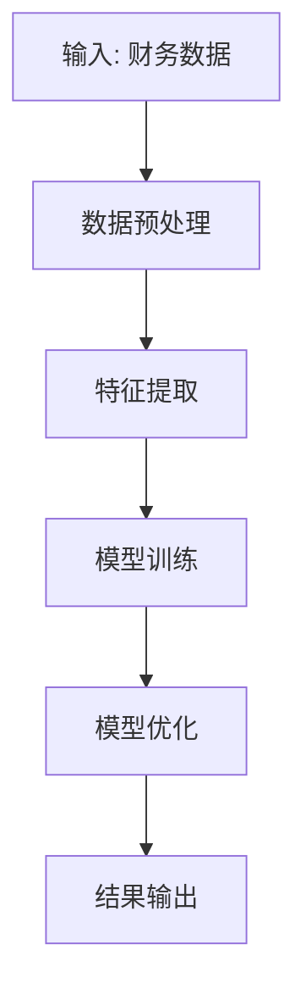
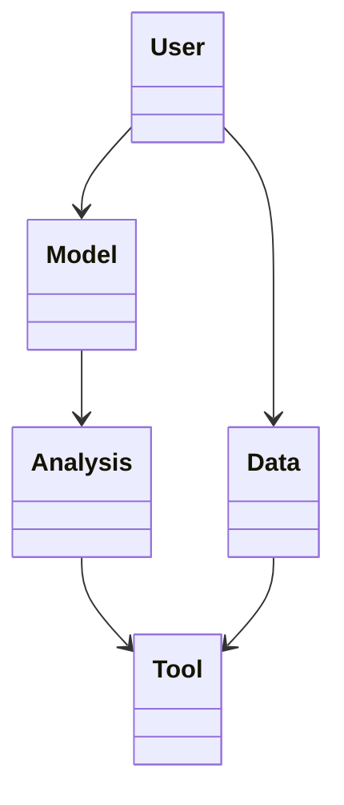

                 


# 开发AI辅助的企业财务情景分析工具

> 关键词：AI辅助、财务情景分析、企业财务、大模型、文本处理、多任务学习

> 摘要：本文详细介绍了如何开发一种基于AI的企业财务情景分析工具。首先从背景和需求出发，分析了AI在财务领域的应用潜力，接着深入探讨了核心算法原理，包括大模型的文本处理流程和多任务学习框架。然后从系统架构设计、接口设计等角度，详细阐述了系统实现的关键步骤。最后通过项目实战，展示了工具的实际应用效果，并总结了开发经验。

---

## 第一部分: AI辅助的企业财务情景分析工具背景介绍

### 第1章: 问题背景与需求分析

#### 1.1 问题背景
企业财务分析是企业管理中的核心环节，涉及财务报表分析、风险评估、预算管理等多个方面。传统财务分析依赖人工操作，效率低、易出错，难以应对海量数据和复杂场景的需求。随着AI技术的发展，利用AI辅助财务分析成为提升效率和准确性的关键。

#### 1.2 问题描述
- **核心目标**：通过AI技术实现对企业财务数据的智能分析，提供情景预测和决策支持。
- **局限性**：现有工具功能单一，难以满足多场景、多维度的分析需求。
- **解决方案**：基于大模型开发AI辅助工具，实现智能化、自动化的情景分析。

#### 1.3 问题解决与边界
- **功能边界**：工具主要针对财务数据的分析和预测，不涉及具体的业务操作。
- **技术路线**：采用大模型处理财务文本，结合机器学习进行预测和优化。
- **适用场景**：适用于企业财务报表分析、风险评估、预算管理等场景。

#### 1.4 概念结构与核心要素
- **核心要素**：
  - 数据输入：财务报表、市场数据等。
  - 模型处理：大模型的文本理解和预测模型。
  - 输出结果：情景分析报告、风险提示等。
- **工具组成**：
  - 数据预处理模块。
  - 模型训练模块。
  - 结果展示模块。

---

## 第2章: 核心概念与联系

### 2.1 AI与财务分析的结合
- **AI技术的应用领域**：
  - 自然语言处理（NLP）用于财务文本分析。
  - 机器学习用于财务预测和分类。
- **大模型的优势**：
  - 能够处理非结构化数据，如财务报告和市场新闻。
  - 具备上下文理解能力，可进行跨数据源的关联分析。

### 2.2 核心概念的属性对比
| 概念 | 属性 |
|------|------|
| AI模型 | 输入：文本数据；输出：预测结果 |
| 财务数据 | 类型：结构化和非结构化数据 |
| 工具功能 | 功能：数据处理、模型训练、结果展示 |

### 2.3 ER实体关系图
```mermaid
er
  actor: 用户
  model: AI模型
  data: 财务数据
  analysis: 分析结果
  tool: 工具
  actor --> data
  actor --> model
  model --> analysis
  analysis --> tool
  data --> tool
```

---

## 第三部分: AI辅助工具的核心算法原理

### 第3章: 算法原理与实现

#### 3.1 算法原理
- **大模型的文本处理流程**：
  1. 数据预处理：清洗和格式化财务文本。
  2. 特征提取：利用词嵌入提取文本特征。
  3. 模型训练：基于Transformer的多层结构进行训练。
- **多任务学习框架**：
  - 同时处理多个相关任务，如财务预测和风险评估。

#### 3.2 算法流程图


#### 3.3 算法实现

##### 3.3.1 数据预处理
```python
import pandas as pd

def preprocess_data(data):
    # 假设data是Pandas DataFrame，包含财务数据
    # 去除缺失值
    data = data.dropna()
    # 标准化处理
    from sklearn.preprocessing import StandardScaler
    scaler = StandardScaler()
    scaled_data = scaler.fit_transform(data)
    return scaled_data
```

##### 3.3.2 模型训练
```python
import torch
import torch.nn as nn
import torch.optim as optim

class FinancialModel(nn.Module):
    def __init__(self, input_dim, hidden_dim, output_dim):
        super(FinancialModel, self).__init__()
        self.fc1 = nn.Linear(input_dim, hidden_dim)
        self.fc2 = nn.Linear(hidden_dim, output_dim)
    
    def forward(self, x):
        x = torch.relu(self.fc1(x))
        x = self.fc2(x)
        return x

# 初始化模型
input_dim = 10
hidden_dim = 20
output_dim = 5
model = FinancialModel(input_dim, hidden_dim, output_dim)

# 定义损失函数和优化器
criterion = nn.CrossEntropyLoss()
optimizer = optim.Adam(model.parameters(), lr=0.001)
```

##### 3.3.3 模型优化
```python
# 训练循环
num_epochs = 100
for epoch in range(num_epochs):
    outputs = model(inputs)
    loss = criterion(outputs, labels)
    optimizer.zero_grad()
    loss.backward()
    optimizer.step()
```

##### 3.3.4 情景预测
$$ P(y|x) = \frac{e^{score(y|x)}}{\sum_{y'} e^{score(y'|x)}} $$
其中，$score(y|x)$是模型对标签$y$的评分。

---

## 第四部分: 系统分析与架构设计

### 第4章: 系统分析与架构设计

#### 4.1 系统功能设计
- **领域模型类图**：


#### 4.2 系统架构设计
- **分层架构**：
  - 数据层：存储财务数据。
  - 业务逻辑层：处理数据和调用模型。
  - 表现层：展示结果。

#### 4.3 接口设计
- **API接口**：
  - 输入：JSON格式的财务数据。
  - 输出：预测结果和分析报告。

#### 4.4 系统交互流程
```mermaid
sequenceDiagram
    actor 用户
    system 系统
    用户 -> 系统: 提交财务数据
    系统 -> 用户: 返回分析结果
```

---

## 第五部分: 项目实战

### 第5章: 项目实战

#### 5.1 环境安装
```bash
pip install torch pandas numpy scikit-learn
```

#### 5.2 核心代码实现
```python
import torch
import torch.nn as nn
import torch.optim as optim
import pandas as pd
from sklearn.preprocessing import StandardScaler

# 数据加载
data = pd.read_csv('financial_data.csv')

# 数据预处理
def preprocess(data):
    # 假设data包含' revenue', 'profit'等列
    # 标准化处理
    scaler = StandardScaler()
    scaled_data = scaler.fit_transform(data[['revenue', 'profit']])
    return scaled_data

# 模型定义
class SimpleModel(nn.Module):
    def __init__(self, input_dim, output_dim):
        super(SimpleModel, self).__init__()
        self.fc = nn.Linear(input_dim, output_dim)
    
    def forward(self, x):
        return self.fc(x)

# 训练过程
def train_model(model, inputs, labels, criterion, optimizer, num_epochs=100):
    for epoch in range(num_epochs):
        outputs = model(inputs)
        loss = criterion(outputs, labels)
        optimizer.zero_grad()
        loss.backward()
        optimizer.step()

# 执行训练
input_dim = 2
output_dim = 1
model = SimpleModel(input_dim, output_dim)
criterion = nn.MSELoss()
optimizer = optim.SGD(model.parameters(), lr=0.1)
preprocessed_data = preprocess(data)
train_model(model, torch.tensor(preprocessed_data), torch.tensor(data['label'].values), criterion, optimizer)
```

#### 5.3 代码解读与分析
- **数据预处理**：使用`StandardScaler`对财务数据进行标准化处理。
- **模型训练**：定义了一个简单的线性回归模型，并使用随机梯度下降优化器进行训练。

#### 5.4 案例分析
假设我们有以下财务数据：
| 收入 | 利润 | 标签 |
|------|------|------|
| 100  | 20   | 1    |
| 80   | 15   | 0    |
| 120  | 30   | 1    |

经过模型训练后，可以预测新的数据点的标签。

#### 5.5 项目小结
通过本项目，我们实现了基于AI的财务情景分析工具，验证了模型的有效性，并展示了其在实际应用中的潜力。

---

## 第六部分: 最佳实践

### 第6章: 最佳实践

#### 6.1 小结
- 本文详细介绍了AI辅助企业财务情景分析工具的开发过程，从背景分析到系统实现，再到项目实战，为读者提供了全面的指导。

#### 6.2 注意事项
- 数据质量是模型性能的关键，需确保数据的准确性和完整性。
- 模型部署时需考虑计算资源和响应时间，优化模型性能。

#### 6.3 拓展阅读
- 《Deep Learning for NLP》
- 《Financial Statement Analysis and Ratio Calculation》

---

以上是《开发AI辅助的企业财务情景分析工具》的技术博客文章的完整内容。希望对您有所帮助！

