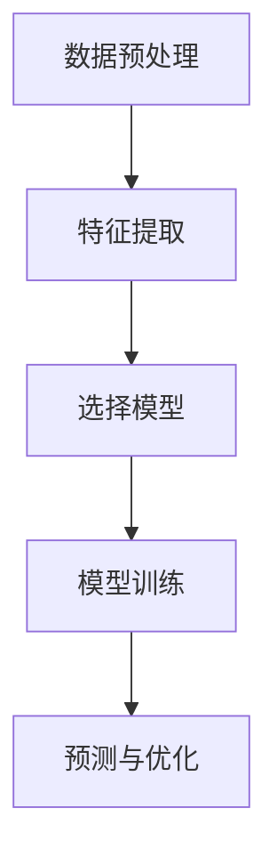
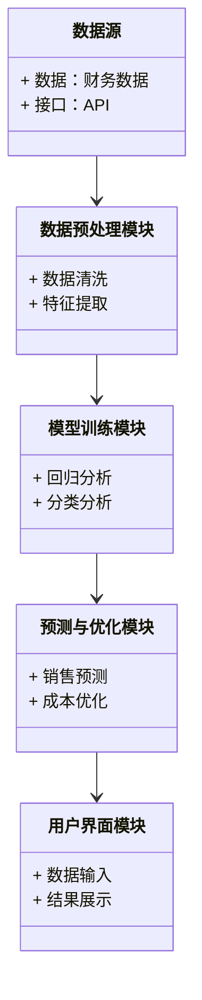
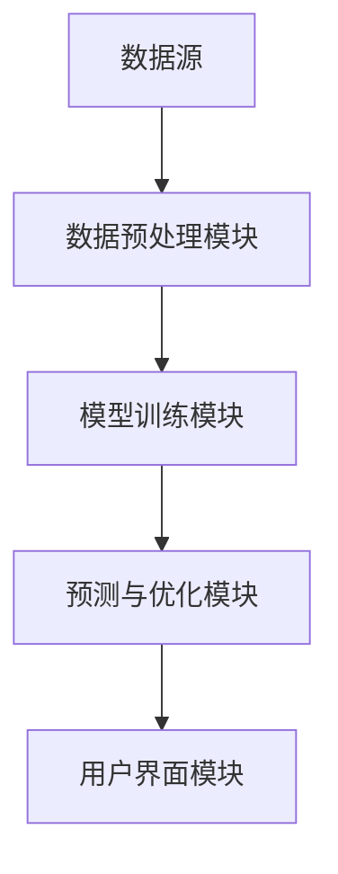

                 


# 开发AI辅助的企业财务战略规划工具

> 关键词：AI辅助，财务战略规划，机器学习，系统架构，企业财务

> 摘要：本文详细探讨了开发AI辅助的企业财务战略规划工具的背景、核心概念、算法原理、系统架构及项目实战。通过逐步分析和逻辑推理，本文揭示了如何利用AI技术优化企业财务规划流程，提升战略决策的精准性和效率。文章内容涵盖从理论到实践的各个方面，为技术开发者和企业财务人员提供了详尽的指导和参考。

---

# 第一部分：AI辅助的企业财务战略规划工具背景与核心概念

## 第1章：AI辅助的企业财务战略规划工具背景

### 1.1 问题背景与描述

#### 1.1.1 传统企业财务规划的挑战
企业财务战略规划是企业管理中的核心环节，传统方法依赖于人工分析和经验判断，存在以下问题：
- 数据处理复杂：财务数据来源多样，处理效率低，且容易出错。
- 预测准确性不足：传统方法难以捕捉市场波动和复杂变量之间的关系，导致预测偏差。
- 策略优化有限：缺乏系统化的优化工具，难以快速找到最优解决方案。

#### 1.1.2 AI技术在财务规划中的应用潜力
AI技术，尤其是机器学习和自然语言处理，为企业财务规划带来了新的可能性：
- 数据处理效率提升：AI能够快速整理和分析海量财务数据，减少人工干预。
- 预测准确性增强：通过历史数据分析，AI可以发现隐藏的模式和趋势，提高预测精度。
- 策略优化自动化：AI能够实时调整财务模型，优化资源配置，提升决策效率。

#### 1.1.3 企业财务战略规划工具的需求与痛点
现代企业对财务战略规划工具的需求主要集中在以下几个方面：
- **实时数据处理**：能够快速响应市场变化，实时更新财务数据。
- **智能预测与分析**：具备自动化的预测功能，提供多维度的数据可视化。
- **灵活的策略优化**：支持多种假设场景下的财务模拟，快速找到最优解决方案。
- **易于部署与扩展**：工具需要具备良好的可扩展性和二次开发能力。

---

## 第2章：AI辅助工具的核心算法与数学模型

### 2.1 核心算法原理

#### 2.1.1 机器学习算法在财务规划中的应用
在企业财务战略规划中，机器学习算法主要用于以下场景：
- **销售预测**：基于历史销售数据和市场趋势，预测未来销售额。
- **成本分析**：通过分析历史成本数据，优化成本控制策略。
- **风险评估**：识别财务风险因素，评估潜在的财务危机。

#### 2.1.2 算法流程图（Mermaid）
以下是机器学习算法在财务预测中的流程图：


#### 2.1.3 算法实现代码示例
以下是使用线性回归算法进行销售预测的Python代码示例：
```python
import pandas as pd
from sklearn.linear_model import LinearRegression
import matplotlib.pyplot as plt

# 数据加载与预处理
data = pd.DataFrame({
    'year': [2018, 2019, 2020, 2021, 2022],
    'sales': [100, 120, 130, 140, 150]
})

# 特征提取与模型训练
model = LinearRegression()
model.fit(data[['year']], data['sales'])

# 预测与可视化
predicted_sales = model.predict([[2023]])
print("预测2023年的销售额为：", predicted_sales[0])

plt.scatter(data['year'], data['sales'], color='blue')
plt.plot(data['year'], model.predict(data[['year']]), color='red')
plt.xlabel('年份')
plt.ylabel('销售额')
plt.title('线性回归预测')
plt.show()
```

### 2.2 数学模型与公式

#### 2.2.1 线性回归模型
线性回归模型是销售预测的经典算法，其数学表达式如下：
$$ y = \beta_0 + \beta_1 x + \epsilon $$

其中：
- $y$ 是预测目标（如销售额）。
- $x$ 是自变量（如年份）。
- $\beta_0$ 是截距。
- $\beta_1$ 是回归系数。
- $\epsilon$ 是误差项。

#### 2.2.2 优化目标函数
在线性回归中，目标是最小化预测值与实际值之间的平方差之和：
$$ \text{最小化} \sum_{i=1}^{n} (y_i - \hat{y}_i)^2 $$

---

## 第3章：系统分析与架构设计

### 3.1 系统功能设计

#### 3.1.1 领域模型类图（Mermaid）
以下是系统功能的领域模型类图：


### 3.2 系统架构设计

#### 3.2.1 模块划分与功能描述
系统架构分为以下几个模块：
- **数据源模块**：负责数据的采集和存储。
- **数据预处理模块**：对数据进行清洗和特征提取。
- **模型训练模块**：基于机器学习算法进行模型训练。
- **预测与优化模块**：根据模型输出结果，提供优化建议。
- **用户界面模块**：提供友好的交互界面，供用户输入数据和查看结果。

#### 3.2.2 系统架构图（Mermaid）
以下是系统架构图：


---

# 第四部分：项目实战与优化

## 第4章：项目实战与优化

### 4.1 环境安装与配置

#### 4.1.1 安装Python与相关库
在开始开发之前，需要安装以下Python库：
```bash
pip install numpy pandas scikit-learn matplotlib
```

### 4.2 核心代码实现与优化

#### 4.2.1 核心代码实现
以下是AI辅助工具的核心代码实现：
```python
import numpy as np
import pandas as pd
from sklearn.linear_model import LinearRegression
from sklearn.metrics import mean_squared_error

# 数据加载
data = pd.read_csv('financial_data.csv')

# 数据预处理
X = data[['year', 'market_trend']]
y = data['revenue']

# 模型训练
model = LinearRegression()
model.fit(X, y)

# 预测与评估
predicted_revenue = model.predict(X)
mse = mean_squared_error(y, predicted_revenue)
print(f"均方误差：{mse}")

# 图形化展示
plt.scatter(data['year'], data['revenue'], color='blue')
plt.plot(data['year'], predicted_revenue, color='red')
plt.xlabel('年份')
plt.ylabel('收入')
plt.title('AI辅助企业财务规划工具')
plt.show()
```

### 4.3 优化策略与总结

#### 4.3.1 优化策略
- **数据增强**：引入更多财务相关数据，如行业指数和宏观经济指标。
- **模型优化**：尝试使用更复杂的模型，如随机森林和神经网络，以提高预测精度。
- **实时更新**：实现数据的实时更新和模型的动态优化。

#### 4.3.2 总结与展望
通过本文的详细分析和代码实现，我们展示了如何利用AI技术开发企业财务战略规划工具。未来，随着AI技术的不断发展，财务规划工具的功能将更加智能化和自动化，为企业创造更大的价值。

---

# 第五部分：最佳实践与总结

## 第5章：最佳实践与总结

### 5.1 小结
AI辅助的企业财务战略规划工具为企业提供了高效、智能的财务规划解决方案。通过机器学习算法和系统架构设计，工具能够快速处理数据、优化预测模型，并为决策者提供可靠的财务分析结果。

### 5.2 注意事项
在实际开发过程中，需要注意以下几点：
- 数据质量：确保数据的完整性和准确性。
- 模型选择：根据具体场景选择合适的算法。
- 系统性能：优化代码以提升运行效率。

### 5.3 拓展阅读
- 《机器学习实战》：深入理解机器学习算法的实现与应用。
- 《企业财务分析与决策》：掌握企业财务分析的理论与方法。
- 《Python数据分析 cookbook》：学习Python在数据分析领域的实践技巧。

---

通过本文的详细讲解，我们系统地分析了AI辅助企业财务战略规划工具的开发过程，从背景分析到算法实现，再到系统设计与优化，为开发者和企业提供了全面的指导。希望本文能为读者在AI与财务领域的结合应用提供新的思路和启发。

