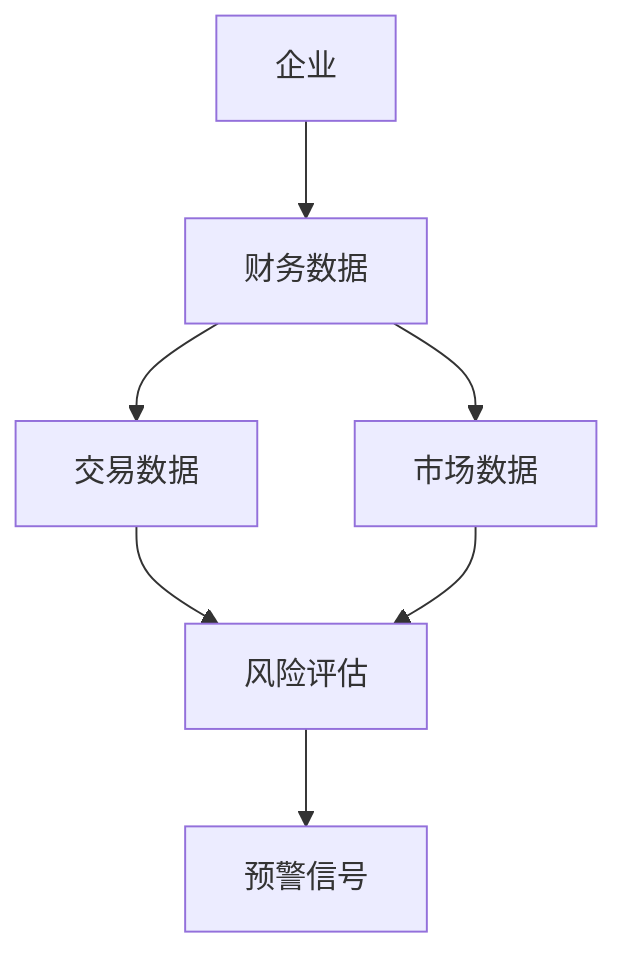
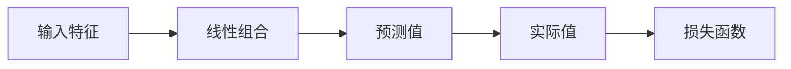
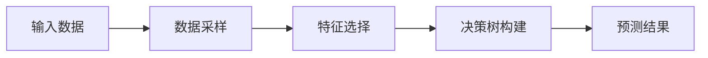
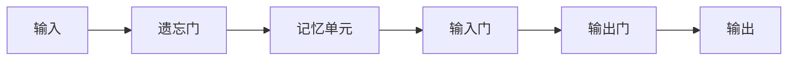
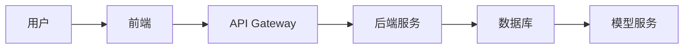
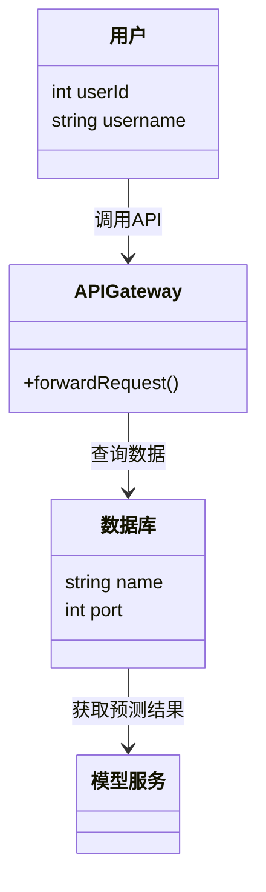
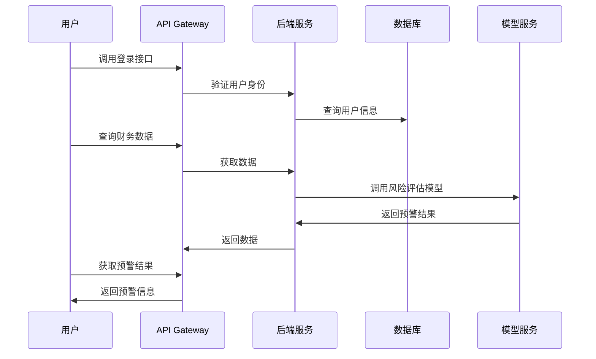

                 


# 开发AI辅助的企业财务风险预警仪表盘

> 关键词：AI技术，财务风险管理，风险预警系统，机器学习，仪表盘开发

> 摘要：本文详细介绍了如何开发一个基于AI技术的企业财务风险预警仪表盘。从背景介绍到核心概念，从算法原理到系统架构设计，再到项目实战和最佳实践，文章全面探讨了开发此类系统的各个方面，帮助读者理解并掌握相关技术。

---

# 第一部分: 背景与核心概念

## 第1章: 企业财务风险预警仪表盘概述

### 1.1 企业财务风险预警的重要性

#### 1.1.1 财务风险对企业的影响
企业财务风险是指企业在经营过程中由于内外部因素导致的财务状况恶化，可能影响企业偿债能力和持续经营的风险。这些风险可能来源于市场波动、供应链问题、管理失误或外部经济环境的变化。及时识别和预警财务风险，可以帮助企业采取有效措施，避免或减少损失。

#### 1.1.2 预警机制在企业风险管理中的作用
财务风险预警机制是通过收集和分析财务数据，识别潜在风险并发出预警信号，帮助企业在风险发生前采取应对措施。这种机制可以显著提高企业的风险控制能力，降低财务危机的可能性。

#### 1.1.3 仪表盘在财务风险预警中的价值
仪表盘是一种直观的数据可视化工具，能够将复杂的财务数据转化为易于理解的图表和指标。通过仪表盘，企业可以实时监控财务状况，快速识别潜在风险，做出及时决策。AI辅助的仪表盘通过自动化分析和预测，进一步提升了预警的准确性和及时性。

### 1.2 AI技术在财务风险管理中的应用

#### 1.2.1 AI技术的基本概念
人工智能（AI）是指计算机系统模拟人类智能的技术，包括学习、推理、问题解决和自然语言处理等功能。AI技术通过处理大量数据，识别模式和趋势，提供决策支持。

#### 1.2.2 AI在财务数据分析中的优势
AI技术在财务数据分析中具有显著优势。首先，AI可以快速处理海量数据，发现人类难以察觉的模式和趋势。其次，AI可以通过机器学习算法，建立预测模型，帮助识别潜在风险。此外，自然语言处理（NLP）技术可以分析财务报告和新闻，提取关键信息，辅助风险评估。

#### 1.2.3 AI辅助仪表盘的核心功能
AI辅助的财务风险预警仪表盘具有以下核心功能：
- 数据采集与预处理：从企业内部系统和外部数据源获取财务数据，并进行清洗和转换。
- 风险评估与预测：利用机器学习算法，对财务数据进行分析，识别潜在风险并预测风险发生的概率。
- 可视化展示：通过图表、仪表盘等形式，直观展示财务状况和风险预警信息。
- 用户交互：提供友好的用户界面，方便用户查询、分析和决策。

### 1.3 财务风险预警仪表盘的核心要素

#### 1.3.1 数据来源与处理
数据是仪表盘的核心，来源包括企业内部的财务报表、交易数据，以及外部的市场数据、新闻报道等。数据处理包括清洗、转换和特征提取，确保数据的准确性和可用性。

#### 1.3.2 风险评估模型
风险评估模型是仪表盘的关键部分，负责对财务数据进行分析和预测。常用的模型包括线性回归、随机森林和LSTM等。这些模型可以根据历史数据，预测未来的财务状况，识别潜在风险。

#### 1.3.3 可视化展示与用户交互
可视化展示是仪表盘的重要组成部分，通过图表、颜色和指标等方式，直观展示财务状况和风险信息。用户交互功能包括数据查询、模型调整和预警设置，帮助用户更好地理解和利用仪表盘。

---

## 第2章: AI辅助的财务风险预警模型

### 2.1 机器学习在风险评估中的应用

#### 2.1.1 监督学习与非监督学习的对比
| 对比维度       | 监督学习               | 非监督学习             |
|----------------|-----------------------|------------------------|
| 数据类型       | 标签数据               | 未标签数据             |
| 任务           | 预测或分类             | 聚类或降维             |
| 适用场景       | 风险预测               | 数据分组或异常检测     |

#### 2.1.2 常见的机器学习算法及其特点（对比表格）
| 算法名称       | 特点                   | 适用场景               |
|----------------|-----------------------|------------------------|
| 线性回归       | 简单，适合线性关系       | 预测数值型数据           |
| 随机森林       | 高精度，抗过拟合         | 分类和回归问题           |
| 支持向量机     | 高维数据表现优异         | 分类和回归问题           |
| 神经网络       | 高复杂度，适合非线性数据 | 复杂模式识别             |

#### 2.1.3 ER实体关系图架构（Mermaid流程图）


---

## 第3章: 机器学习算法原理

### 3.1 线性回归模型

#### 3.1.1 线性回归的基本原理（Mermaid流程图）


#### 3.1.2 线性回归的数学模型（公式）
$$ y = \beta_0 + \beta_1x + \epsilon $$

#### 3.1.3 线性回归的实现（Python代码示例）
```python
import numpy as np
from sklearn.linear_model import LinearRegression

# 示例数据
X = np.array([[1], [2], [3], [4], [5]])
y = np.array([2, 4, 5, 4, 6])

# 创建模型
model = LinearRegression()
model.fit(X, y)

# 预测
print(model.predict(X))
```

### 3.2 随机森林算法

#### 3.2.1 随机森林的基本原理（Mermaid流程图）


#### 3.2.2 随机森林的数学模型（公式）
$$ \text{预测值} = \sum_{i=1}^{n} w_i y_i $$

#### 3.2.3 随机森林的实现（Python代码示例）
```python
import numpy as np
from sklearn.ensemble import RandomForestRegressor

# 示例数据
X = np.array([[1, 2], [3, 4], [5, 6], [7, 8], [9, 10]])
y = np.array([2, 4, 5, 4, 6])

# 创建模型
model = RandomForestRegressor(n_estimators=100)
model.fit(X, y)

# 预测
print(model.predict(X))
```

### 3.3 深度学习模型（如LSTM）

#### 3.3.1 LSTM的基本原理（Mermaid流程图）


#### 3.3.2 LSTM的数学模型（公式）
$$ f_t = \sigma(W_f \cdot [h_{t-1}, x_t] + b_f) $$

#### 3.3.3 LSTM的实现（Python代码示例）
```python
import numpy as np
from tensorflow.keras.layers import LSTM, Dense
from tensorflow.keras.models import Sequential

# 示例数据
X = np.random.rand(10, 1, 10)
y = np.random.rand(10, 1)

# 创建模型
model = Sequential()
model.add(LSTM(64, input_shape=(1, 10)))
model.add(Dense(1))
model.compile(optimizer='adam', loss='mean_squared_error')

# 训练
model.fit(X, y, epochs=10)
```

---

## 第4章: 系统架构设计

### 4.1 系统整体架构（Mermaid架构图）


### 4.2 系统功能设计（领域模型Mermaid类图）


### 4.3 系统接口设计
- 用户登录接口：`POST /api/login`
- 数据查询接口：`GET /api/data`
- 风险预警接口：`POST /api/risk预警`

### 4.4 系统交互（Mermaid序列图）


---

## 第5章: 项目实战

### 5.1 环境搭建
- 安装Python和必要的库：`pip install numpy pandas scikit-learn tensorflow`
- 安装Jupyter Notebook：`pip install jupyter`

### 5.2 核心实现（代码示例）
```python
import pandas as pd
from sklearn.ensemble import RandomForestRegressor

# 示例数据
data = pd.DataFrame({
    'feature1': [1, 2, 3, 4, 5],
    'feature2': [2, 3, 4, 5, 6],
    'target': [2, 4, 5, 4, 6]
})

# 划分训练集和测试集
X = data[['feature1', 'feature2']]
y = data['target']

# 创建模型
model = RandomForestRegressor()
model.fit(X, y)

# 预测
print(model.predict(X))
```

### 5.3 案例分析
假设我们有一个企业，其财务数据如下：
| 项目     | 金额（万元） |
|----------|--------------|
| 营业收入  | 1000         |
| 净利润    | 100          |
| 应收账款  | 200          |
| 存货      | 150          |
| 短期借款  | 50           |

通过仪表盘分析，发现应收账款占比较高，可能存在回收风险。模型预测未来三个月的净利润可能下降，发出预警信号。企业可以根据这些信息，调整应收账款管理策略，优化资金流动。

---

## 第6章: 最佳实践

### 6.1 小结
本文详细介绍了开发AI辅助的企业财务风险预警仪表盘的各个方面，包括背景、核心概念、算法原理、系统架构设计和项目实战。通过结合机器学习和数据可视化技术，企业可以有效识别和管理财务风险，提升决策效率。

### 6.2 注意事项
- 数据质量是关键，确保数据的准确性和完整性。
- 选择合适的算法，根据具体场景调整模型参数。
- 定期更新模型，适应市场变化和企业需求。

### 6.3 拓展阅读
- 《机器学习实战》
- 《深度学习入门：基于Python和Keras》
- 《数据可视化：用Python创建动态仪表盘》

---

通过以上步骤，您可以全面了解和掌握开发AI辅助的企业财务风险预警仪表盘的相关技术。希望本文对您有所帮助！

